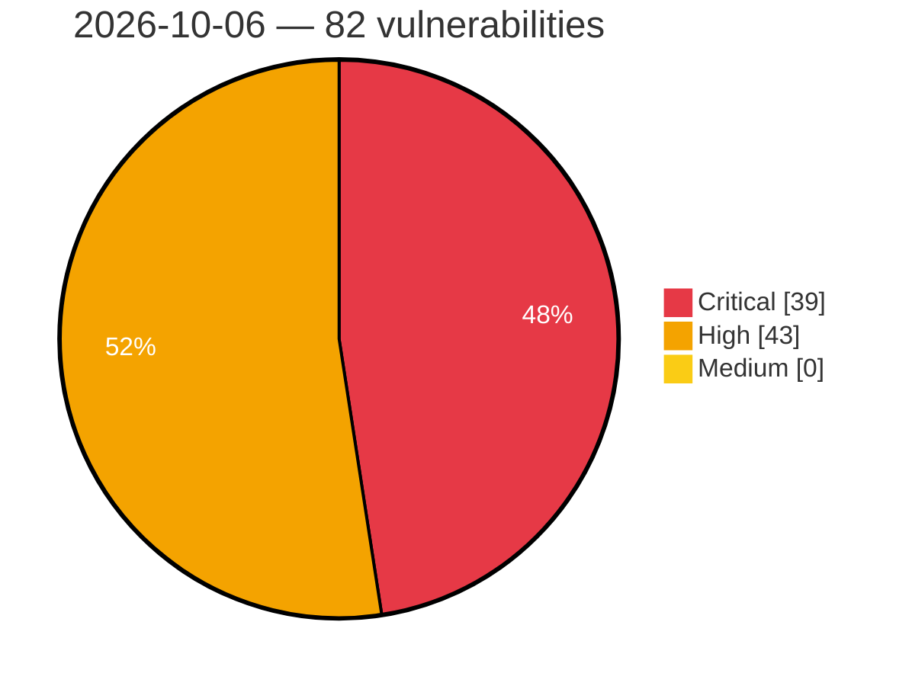

# Critical, High & Medium Severity Vulnerabilities — 2026-10-06

**Source status for this day:**

| Source | Critical | High | Medium | Total |
|--------|---------:|-----:|-------:|------:|
| cvefeed.io (High/Critical) | 39 | 43 | 0 | 82 |

**KEV (actively exploited):** 0  **Watchlist matches:** 68

## Critical (39)

| CVSS | Flags | Source | CVE / Title | Reported |
|------|-------|--------|-------------|----------|
| 10.0 | ⭐ | cvefeed.io (High/Critical) | [CVE-2026-105484 - TOTOLINK X6000R UploadFirmwareFile cstecgi.cgi firmware_check os command injection](https://cvefeed.io/vuln/detail/CVE-2026-105484) | 5 hours, 5 minutes ago |
| 10.0 | ⭐ | cvefeed.io (High/Critical) | [CVE-2026-39773 - WordPress Doctreat Core plugin <= 1.7.0 - Privilege Escalation vulnerability](https://cvefeed.io/vuln/detail/CVE-2026-39773) | 3 hours, 18 minutes ago |
| 10.0 | ⭐ | cvefeed.io (High/Critical) | [CVE-2026-39770 - WordPress Doctreat theme <= 1.7.0 - Arbitrary File Upload vulnerability](https://cvefeed.io/vuln/detail/CVE-2026-39770) | 3 hours, 19 minutes ago |
| 10.0 | ⭐ | cvefeed.io (High/Critical) | [CVE-2026-106102 - Quasar Framework: Stored/Reflected XSS via unescaped SSR meta tag rendering in getHead()](https://cvefeed.io/vuln/detail/CVE-2026-106102) | 1 hour, 19 minutes ago |
| 10.0 | ⭐ | cvefeed.io (High/Critical) | [CVE-2026-105857 - Payload: RCE in Payload Form Builder](https://cvefeed.io/vuln/detail/CVE-2026-105857) | 1 hour, 19 minutes ago |
| 9.9 | ⭐ | cvefeed.io (High/Critical) | [CVE-2026-39759 - WordPress Workreap Core plugin <= 3.4.5 - Arbitrary File Upload vulnerability](https://cvefeed.io/vuln/detail/CVE-2026-39759) | 3 hours, 19 minutes ago |
| 9.9 | ⭐ | cvefeed.io (High/Critical) | [CVE-2026-39757 - WordPress Taskbot plugin <= 6.6 - Arbitrary File Upload vulnerability](https://cvefeed.io/vuln/detail/CVE-2026-39757) | 3 hours, 19 minutes ago |
| 9.9 | ⭐ | cvefeed.io (High/Critical) | [CVE-2026-39755 - WordPress WP Duplicate plugin <= 1.1.11 - Arbitrary File Upload vulnerability](https://cvefeed.io/vuln/detail/CVE-2026-39755) | 3 hours, 19 minutes ago |
| 9.9 | ⭐ | cvefeed.io (High/Critical) | [CVE-2026-67269 - Dell Container Storage Modules Operator Improper Privilege Management Vulnerability](https://cvefeed.io/vuln/detail/CVE-2026-67269) | 3 hours, 19 minutes ago |
| 9.9 | ⭐ | cvefeed.io (High/Critical) | [CVE-2026-79798 - Authenticated SQL Injection Vulnerabilities in ClearPass Policy Manager Web-Based Management Interface](https://cvefeed.io/vuln/detail/CVE-2026-79798) | 2 hours, 57 minutes ago |
| 9.8 | ⭐ | cvefeed.io (High/Critical) | [CVE-2026-94293 - Missing authentication for critical function in the aas-edge-client REST API](https://cvefeed.io/vuln/detail/CVE-2026-94293) | 44 minutes ago |
| 9.8 | — | cvefeed.io (High/Critical) | [CVE-2026-39797 - WordPress GDPR Framework By Data443 plugin <= 2.5.0 - PHP Object Injection vulnerability](https://cvefeed.io/vuln/detail/CVE-2026-39797) | 3 hours, 18 minutes ago |
| 9.8 | ⭐ | cvefeed.io (High/Critical) | [CVE-2026-39761 - WordPress Meta Box AIO plugin <= 3.7.1 - Privilege Escalation vulnerability](https://cvefeed.io/vuln/detail/CVE-2026-39761) | 3 hours, 19 minutes ago |
| 9.8 | ⭐ | cvefeed.io (High/Critical) | [CVE-2026-105859 - Payload: Unauthorized update to collection documents](https://cvefeed.io/vuln/detail/CVE-2026-105859) | 1 hour, 19 minutes ago |
| 9.8 | ⭐ | cvefeed.io (High/Critical) | [CVE-2026-104070 - SPIP Crayons Plugin < 3.5.0 Authorization Bypass RCE](https://cvefeed.io/vuln/detail/CVE-2026-104070) | 1 hour, 19 minutes ago |
| 9.8 | ⭐ | cvefeed.io (High/Critical) | [CVE-2026-105845 - Payload: SQL Injection in SQLite and Postgres](https://cvefeed.io/vuln/detail/CVE-2026-105845) | 2 hours, 19 minutes ago |
| 9.8 | ⭐ | cvefeed.io (High/Critical) | [CVE-2026-79805 - Authenticated Path Traversal Vulnerability Leads to Unauthorized File Access and Modification in ClearPass Policy Manager](https://cvefeed.io/vuln/detail/CVE-2026-79805) | 2 hours, 57 minutes ago |
| 9.8 | ⭐ | cvefeed.io (High/Critical) | [CVE-2026-79801 - Unauthenticated Missing Integrity Verification allows Remote Code Execution in ClearPass Policy Manager Client Agent](https://cvefeed.io/vuln/detail/CVE-2026-79801) | 2 hours, 57 minutes ago |
| 9.8 | ⭐ | cvefeed.io (High/Critical) | [CVE-2026-79796 - Authentication Bypass Vulnerabilities in ClearPass Policy Manager](https://cvefeed.io/vuln/detail/CVE-2026-79796) | 2 hours, 57 minutes ago |
| 9.8 | ⭐ | cvefeed.io (High/Critical) | [CVE-2026-76754 - Unauthenticated SQL Injection Vulnerability leads to Remote Code Execution in ClearPass Policy Manager](https://cvefeed.io/vuln/detail/CVE-2026-76754) | 2 hours, 57 minutes ago |
| 9.8 | — | cvefeed.io (High/Critical) | [CVE-2026-76753 - Unauthenticated Format String Vulnerability in HPE Networking ClearPass Policy Manager](https://cvefeed.io/vuln/detail/CVE-2026-76753) | 2 hours, 57 minutes ago |
| 9.8 | ⭐ | cvefeed.io (High/Critical) | [CVE-2026-76752 - Authentication Bypass Vulnerabilities in HPE Networking ClearPass Policy Manager Allow Unauthorized Administrative Access](https://cvefeed.io/vuln/detail/CVE-2026-76752) | 2 hours, 57 minutes ago |
| 9.8 | ⭐ | cvefeed.io (High/Critical) | [CVE-2026-76751 - Missing Integrity Verification in the OnGuard Agent of ClearPass Policy Manager Allows Unauthenticated Remote Code Execution](https://cvefeed.io/vuln/detail/CVE-2026-76751) | 2 hours, 57 minutes ago |
| 9.8 | ⭐ | cvefeed.io (High/Critical) | [CVE-2026-76750 - Unauthenticated Deserialization of Untrusted Data allows Remote Code Execution in the Web Interface of HPE Networking ClearPass Policy Manager](https://cvefeed.io/vuln/detail/CVE-2026-76750) | 2 hours, 57 minutes ago |
| 9.6 | ⭐ | cvefeed.io (High/Critical) | [CVE-2026-105763 - Twenty: Plaintext IMAP/SMTP/CalDAV password disclosure to any workspace member via /metadata GraphQL](https://cvefeed.io/vuln/detail/CVE-2026-105763) | 7 hours, 5 minutes ago |
| 9.6 | ⭐ | cvefeed.io (High/Critical) | [CVE-2026-86360 - Dell System Update Path Traversal Vulnerability](https://cvefeed.io/vuln/detail/CVE-2026-86360) | 23 minutes ago |
| 9.6 | — | cvefeed.io (High/Critical) | [CVE-2026-67273 - Dell Container Storage Modules Improper Neutralization of Special Elements Used in a Template Engine Vulnerability](https://cvefeed.io/vuln/detail/CVE-2026-67273) | 2 hours, 19 minutes ago |
| 9.6 | — | cvefeed.io (High/Critical) | [CVE-2026-106501 - Backstage: Sensitive information exposure in Scaffolder](https://cvefeed.io/vuln/detail/CVE-2026-106501) | 58 minutes ago |
| 9.3 | ⭐ | cvefeed.io (High/Critical) | [CVE-2026-42417 - WordPress ARMember Premium plugin <= 7.8 - SQL Injection vulnerability](https://cvefeed.io/vuln/detail/CVE-2026-42417) | 3 hours, 18 minutes ago |
| 9.3 | ⭐ | cvefeed.io (High/Critical) | [CVE-2026-42415 - WordPress Porto Theme - Functionality plugin <= 3.9.3 - SQL Injection vulnerability](https://cvefeed.io/vuln/detail/CVE-2026-42415) | 3 hours, 18 minutes ago |
| 9.3 | ⭐ | cvefeed.io (High/Critical) | [CVE-2026-41555 - WordPress Newsletter Subscription Form – User Subscriptions Form, Capture Email plugin <= 1.5.9 - SQL Injection vulnerability](https://cvefeed.io/vuln/detail/CVE-2026-41555) | 3 hours, 18 minutes ago |
| 9.3 | ⭐ | cvefeed.io (High/Critical) | [CVE-2026-39795 - WordPress SendPress Newsletters plugin <= 1.26.1.20 - SQL Injection vulnerability](https://cvefeed.io/vuln/detail/CVE-2026-39795) | 3 hours, 18 minutes ago |
| 9.3 | ⭐ | cvefeed.io (High/Critical) | [CVE-2026-39785 - WordPress Gmedia Photo Gallery plugin <= 1.25.1 - SQL Injection vulnerability](https://cvefeed.io/vuln/detail/CVE-2026-39785) | 3 hours, 18 minutes ago |
| 9.3 | ⭐ | cvefeed.io (High/Critical) | [CVE-2026-39764 - WordPress Radius Booking — Booking Calendar for Appointments & Services plugin <= 1.0.19 - SQL Injection vulnerability](https://cvefeed.io/vuln/detail/CVE-2026-39764) | 3 hours, 19 minutes ago |
| 9.3 | ⭐ | cvefeed.io (High/Critical) | [CVE-2026-105851 - Payload: Field access control bypass on auth collections](https://cvefeed.io/vuln/detail/CVE-2026-105851) | 1 hour, 19 minutes ago |
| 9.3 | ⭐ | cvefeed.io (High/Critical) | [CVE-2026-105844 - Payload: Prototype pollution in Payload Import Export plugin](https://cvefeed.io/vuln/detail/CVE-2026-105844) | 2 hours, 19 minutes ago |
| 9.2 | ⭐ | cvefeed.io (High/Critical) | [CVE-2026-105863 - Payload authentication token field handling issue](https://cvefeed.io/vuln/detail/CVE-2026-105863) | 1 hour, 19 minutes ago |
| 9.1 | ⭐ | cvefeed.io (High/Critical) | [CVE-2026-79794 - Authenticated SQL Injection Vulnerability in ClearPass Policy Manager Web-based Management Interface](https://cvefeed.io/vuln/detail/CVE-2026-79794) | 2 hours, 57 minutes ago |
| 9.0 | ⭐ | cvefeed.io (High/Critical) | [CVE-2026-105812 - Code injection via unencoded configuration values during Python code generation in Bedrock AgentCore Starter Toolkit agent import](https://cvefeed.io/vuln/detail/CVE-2026-105812) | 1 hour, 58 minutes ago |

## High (43)

| CVSS | Flags | Source | CVE / Title | Reported |
|------|-------|--------|-------------|----------|
| 8.8 | ⭐ | cvefeed.io (High/Critical) | [CVE-2026-105701 - ACPT (Premium) <= 2.0.66 - Authenticated (Subscriber+) Remote Code Execution via REST API Email Template](https://cvefeed.io/vuln/detail/CVE-2026-105701) | 40 minutes ago |
| 8.8 | ⭐ | cvefeed.io (High/Critical) | [CVE-2026-105985 - Authenticated RCE via render-components Entry Type overrides](https://cvefeed.io/vuln/detail/CVE-2026-105985) | 1 hour, 19 minutes ago |
| 8.8 | ⭐ | cvefeed.io (High/Critical) | [CVE-2026-62072 - WordPress Progress Planner plugin <= 1.10.0 - Broken Access Control vulnerability](https://cvefeed.io/vuln/detail/CVE-2026-62072) | 3 hours, 18 minutes ago |
| 8.8 | ⭐ | cvefeed.io (High/Critical) | [CVE-2026-39793 - WordPress Simple JWT Login plugin 4.0.0 - Broken Authentication vulnerability](https://cvefeed.io/vuln/detail/CVE-2026-39793) | 3 hours, 18 minutes ago |
| 8.8 | ⭐ | cvefeed.io (High/Critical) | [CVE-2026-39775 - WordPress JobZilla - Job Board WordPress Theme theme <= 2.2 - Privilege Escalation vulnerability](https://cvefeed.io/vuln/detail/CVE-2026-39775) | 3 hours, 18 minutes ago |
| 8.8 | ⭐ | cvefeed.io (High/Critical) | [CVE-2026-39774 - WordPress Tourfic Pro plugin <= 1.17.3 - Privilege Escalation vulnerability](https://cvefeed.io/vuln/detail/CVE-2026-39774) | 3 hours, 18 minutes ago |
| 8.8 | ⭐ | cvefeed.io (High/Critical) | [CVE-2026-101207 - Dell OpenManage Integration with Microsoft Windows Admin Center OS Command Injection Vulnerability](https://cvefeed.io/vuln/detail/CVE-2026-101207) | 20 minutes ago |
| 8.8 | ⭐ | cvefeed.io (High/Critical) | [CVE-2026-106218 - JetBrains TeamCity Kotlin DSL Sandbox Escape Remote Code Execution](https://cvefeed.io/vuln/detail/CVE-2026-106218) | 1 hour, 19 minutes ago |
| 8.8 | ⭐ | cvefeed.io (High/Critical) | [CVE-2026-105850 - Payload: Order confirmation validation issue in Payload Ecommerce](https://cvefeed.io/vuln/detail/CVE-2026-105850) | 1 hour, 19 minutes ago |
| 8.8 | ⭐ | cvefeed.io (High/Critical) | [CVE-2026-79803 - Authenticated Command Injection Leading to Privilege Escalation in ClearPass Policy Manager API](https://cvefeed.io/vuln/detail/CVE-2026-79803) | 2 hours, 57 minutes ago |
| 8.8 | ⭐ | cvefeed.io (High/Critical) | [CVE-2026-79802 - Command Injection Vulnerability in the ClearPass Policy Manager Client Software](https://cvefeed.io/vuln/detail/CVE-2026-79802) | 2 hours, 57 minutes ago |
| 8.8 | ⭐ | cvefeed.io (High/Critical) | [CVE-2026-79800 - Authenticated Path Traversal Vulnerability Leads to Remote Code Execution in ClearPass Policy Manager](https://cvefeed.io/vuln/detail/CVE-2026-79800) | 2 hours, 57 minutes ago |
| 8.8 | ⭐ | cvefeed.io (High/Critical) | [CVE-2026-79799 - Unauthenticated Stored Cross-Site Scripting (XSS) Vulnerability in ClearPass Policy Manager Web-Based Management Interface](https://cvefeed.io/vuln/detail/CVE-2026-79799) | 2 hours, 57 minutes ago |
| 8.8 | ⭐ | cvefeed.io (High/Critical) | [CVE-2026-79797 - Improper Access Control in HPE Networking ClearPass Android Client Application](https://cvefeed.io/vuln/detail/CVE-2026-79797) | 2 hours, 57 minutes ago |
| 8.8 | ⭐ | cvefeed.io (High/Critical) | [CVE-2026-76748 - Authenticated Privilege Escalation Vulnerability in the API of AOS-S](https://cvefeed.io/vuln/detail/CVE-2026-76748) | 2 hours, 57 minutes ago |
| 8.7 | — | cvefeed.io (High/Critical) | [CVE-2026-106104 - Quasar Framework: Super-linear regex backtracking on User-Agent lets one request stall a Quasar SSR server](https://cvefeed.io/vuln/detail/CVE-2026-106104) | 20 minutes ago |
| 8.7 | ⭐ | cvefeed.io (High/Critical) | [CVE-2026-105862 - Payload: Bypassed sanitization of user uploaded SVGs](https://cvefeed.io/vuln/detail/CVE-2026-105862) | 1 hour, 19 minutes ago |
| 8.7 | ⭐ | cvefeed.io (High/Critical) | [CVE-2026-105854 - Payload: ReDoS in Multipart Content-Type Validation](https://cvefeed.io/vuln/detail/CVE-2026-105854) | 1 hour, 19 minutes ago |
| 8.6 | — | cvefeed.io (High/Critical) | [CVE-2026-39792 - WordPress Simple File List plugin <= 6.3.11 - Arbitrary File Deletion vulnerability](https://cvefeed.io/vuln/detail/CVE-2026-39792) | 3 hours, 18 minutes ago |
| 8.6 | ⭐ | cvefeed.io (High/Critical) | [CVE-2026-105868 - Payload: Uploaded XML files could execute same-origin JavaScript](https://cvefeed.io/vuln/detail/CVE-2026-105868) | 1 hour, 19 minutes ago |
| 8.6 | ⭐ | cvefeed.io (High/Critical) | [CVE-2026-105856 - Payload: SQL injection in SQLite/Postgres](https://cvefeed.io/vuln/detail/CVE-2026-105856) | 1 hour, 19 minutes ago |
| 8.6 | ⭐ | cvefeed.io (High/Critical) | [CVE-2026-105806 - Payload: Improper access control for MCP API keys](https://cvefeed.io/vuln/detail/CVE-2026-105806) | 2 hours, 19 minutes ago |
| 8.5 | ⭐ | cvefeed.io (High/Critical) | [CVE-2026-105786 - Joplin: Unauthenticated account takeover via an attacker-chosen application-authorisation identifier](https://cvefeed.io/vuln/detail/CVE-2026-105786) | 7 hours, 5 minutes ago |
| 8.5 | ⭐ | cvefeed.io (High/Critical) | [CVE-2026-42416 - WordPress UDesign Core plugin <= 4.15.0 - SQL Injection vulnerability](https://cvefeed.io/vuln/detail/CVE-2026-42416) | 3 hours, 18 minutes ago |
| 8.5 | ⭐ | cvefeed.io (High/Critical) | [CVE-2026-42414 - WordPress ListingPro plugin <= 2.9.12 - SQL Injection vulnerability](https://cvefeed.io/vuln/detail/CVE-2026-42414) | 3 hours, 18 minutes ago |
| 8.5 | ⭐ | cvefeed.io (High/Critical) | [CVE-2026-39771 - WordPress Buddyboss Platform plugin <= 3.1.0 - SQL Injection vulnerability](https://cvefeed.io/vuln/detail/CVE-2026-39771) | 3 hours, 19 minutes ago |
| 8.5 | — | cvefeed.io (High/Critical) | [CVE-2026-106500 - Backstage: Improper task state validation in Scaffolder backend](https://cvefeed.io/vuln/detail/CVE-2026-106500) | 58 minutes ago |
| 8.5 | — | cvefeed.io (High/Critical) | [CVE-2026-106547 - HDF5 heap buffer overflow in H5VM_array_fill via crafted fill-value metadata](https://cvefeed.io/vuln/detail/CVE-2026-106547) | 1 hour, 57 minutes ago |
| 8.5 | ⭐ | cvefeed.io (High/Critical) | [CVE-2026-106486 - Backstage: Improper filesystem validation in Bitbucket pull-request scaffolder actions](https://cvefeed.io/vuln/detail/CVE-2026-106486) | 1 hour, 57 minutes ago |
| 8.5 | — | cvefeed.io (High/Critical) | [CVE-2026-106459 - Backstage: Improper input validation in Sentry scaffolder actions](https://cvefeed.io/vuln/detail/CVE-2026-106459) | 1 hour, 57 minutes ago |
| 8.4 | — | cvefeed.io (High/Critical) | [CVE-2026-106105 - Quasar Framework: Development TLS private keys are cached with overly permissive filesystem permissions](https://cvefeed.io/vuln/detail/CVE-2026-106105) | 20 minutes ago |
| 8.3 | ⭐ | cvefeed.io (High/Critical) | [CVE-2026-105762 - Dify: Unauthenticated Server-Side Request Forgery in /console/api/remote-files/upload endpoint](https://cvefeed.io/vuln/detail/CVE-2026-105762) | 7 hours, 5 minutes ago |
| 8.3 | — | cvefeed.io (High/Critical) | [CVE-2026-106107 - Quasar Framework: App Vite SSR and SSG nonce attributes are not safely constrained](https://cvefeed.io/vuln/detail/CVE-2026-106107) | 20 minutes ago |
| 8.2 | ⭐ | cvefeed.io (High/Critical) | [CVE-2026-95105 - Cloak AES-CTR cipher lacks ciphertext authentication, allowing chosen-plaintext forgery by bit flipping](https://cvefeed.io/vuln/detail/CVE-2026-95105) | 3 hours, 18 minutes ago |
| 8.2 | — | cvefeed.io (High/Critical) | [CVE-2026-67270 - Dell Container Storage Modules Improper Certificate Validation Vulnerability](https://cvefeed.io/vuln/detail/CVE-2026-67270) | 2 hours, 19 minutes ago |
| 8.2 | — | cvefeed.io (High/Critical) | [CVE-2026-94114 - Apache Commons BCEL: Nested Code/Record attributes drive unbounded parse-time recursion in ClassParser](https://cvefeed.io/vuln/detail/CVE-2026-94114) | 2 hours, 57 minutes ago |
| 8.1 | ⭐ | cvefeed.io (High/Critical) | [CVE-2026-95594 - WordPress SMS Alert Order Notifications plugin <= 4.0.0 - Privilege Escalation vulnerability](https://cvefeed.io/vuln/detail/CVE-2026-95594) | 3 hours, 18 minutes ago |
| 8.1 | ⭐ | cvefeed.io (High/Critical) | [CVE-2026-105865 - Payload: Incomplete validation during the upload file lifecycle](https://cvefeed.io/vuln/detail/CVE-2026-105865) | 1 hour, 19 minutes ago |
| 8.1 | ⭐ | cvefeed.io (High/Critical) | [CVE-2026-105858 - Payload: Remote Code Execution through first-register](https://cvefeed.io/vuln/detail/CVE-2026-105858) | 1 hour, 19 minutes ago |
| 8.1 | ⭐ | cvefeed.io (High/Critical) | [CVE-2026-106503 - Backstage: Scaffolder action input authorization bypass](https://cvefeed.io/vuln/detail/CVE-2026-106503) | 58 minutes ago |
| 8.1 | — | cvefeed.io (High/Critical) | [CVE-2026-106488 - Backstage: Improper authentication in the OIDC provider](https://cvefeed.io/vuln/detail/CVE-2026-106488) | 1 hour, 57 minutes ago |
| 8.0 | ⭐ | cvefeed.io (High/Critical) | [CVE-2026-105783 - Joplin Web Clipper pairing allows cross-origin theft of a permanent API token](https://cvefeed.io/vuln/detail/CVE-2026-105783) | 7 hours, 5 minutes ago |
| 8.0 | ⭐ | cvefeed.io (High/Critical) | [CVE-2026-39776 - WordPress Tabs plugin <= 2.5 - Remote Code Execution (RCE) vulnerability](https://cvefeed.io/vuln/detail/CVE-2026-39776) | 3 hours, 18 minutes ago |
