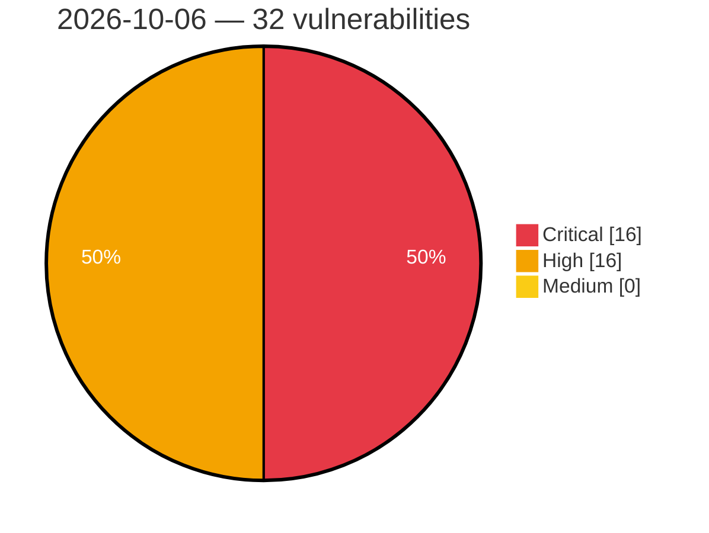

# Critical, High & Medium Severity Vulnerabilities — 2026-10-06

**Source status for this day:**

| Source | Critical | High | Medium | Total |
|--------|---------:|-----:|-------:|------:|
| cvefeed.io (High/Critical) | 16 | 16 | 0 | 32 |

**KEV (actively exploited):** 0  **Watchlist matches:** 30

## Critical (16)

| CVSS | Flags | Source | CVE / Title | Reported |
|------|-------|--------|-------------|----------|
| 10.0 | ⭐ | cvefeed.io (High/Critical) | [CVE-2026-105484 - TOTOLINK X6000R UploadFirmwareFile cstecgi.cgi firmware_check os command injection](https://cvefeed.io/vuln/detail/CVE-2026-105484) | 5 hours, 5 minutes ago |
| 10.0 | ⭐ | cvefeed.io (High/Critical) | [CVE-2026-39773 - WordPress Doctreat Core plugin <= 1.7.0 - Privilege Escalation vulnerability](https://cvefeed.io/vuln/detail/CVE-2026-39773) | 3 hours, 18 minutes ago |
| 10.0 | ⭐ | cvefeed.io (High/Critical) | [CVE-2026-39770 - WordPress Doctreat theme <= 1.7.0 - Arbitrary File Upload vulnerability](https://cvefeed.io/vuln/detail/CVE-2026-39770) | 3 hours, 19 minutes ago |
| 9.9 | ⭐ | cvefeed.io (High/Critical) | [CVE-2026-39759 - WordPress Workreap Core plugin <= 3.4.5 - Arbitrary File Upload vulnerability](https://cvefeed.io/vuln/detail/CVE-2026-39759) | 3 hours, 19 minutes ago |
| 9.9 | ⭐ | cvefeed.io (High/Critical) | [CVE-2026-39757 - WordPress Taskbot plugin <= 6.6 - Arbitrary File Upload vulnerability](https://cvefeed.io/vuln/detail/CVE-2026-39757) | 3 hours, 19 minutes ago |
| 9.9 | ⭐ | cvefeed.io (High/Critical) | [CVE-2026-39755 - WordPress WP Duplicate plugin <= 1.1.11 - Arbitrary File Upload vulnerability](https://cvefeed.io/vuln/detail/CVE-2026-39755) | 3 hours, 19 minutes ago |
| 9.8 | ⭐ | cvefeed.io (High/Critical) | [CVE-2026-94293 - Missing authentication for critical function in the aas-edge-client REST API](https://cvefeed.io/vuln/detail/CVE-2026-94293) | 44 minutes ago |
| 9.8 | — | cvefeed.io (High/Critical) | [CVE-2026-39797 - WordPress GDPR Framework By Data443 plugin <= 2.5.0 - PHP Object Injection vulnerability](https://cvefeed.io/vuln/detail/CVE-2026-39797) | 3 hours, 18 minutes ago |
| 9.8 | ⭐ | cvefeed.io (High/Critical) | [CVE-2026-39761 - WordPress Meta Box AIO plugin <= 3.7.1 - Privilege Escalation vulnerability](https://cvefeed.io/vuln/detail/CVE-2026-39761) | 3 hours, 19 minutes ago |
| 9.6 | ⭐ | cvefeed.io (High/Critical) | [CVE-2026-105763 - Twenty: Plaintext IMAP/SMTP/CalDAV password disclosure to any workspace member via /metadata GraphQL](https://cvefeed.io/vuln/detail/CVE-2026-105763) | 7 hours, 5 minutes ago |
| 9.3 | ⭐ | cvefeed.io (High/Critical) | [CVE-2026-42417 - WordPress ARMember Premium plugin <= 7.8 - SQL Injection vulnerability](https://cvefeed.io/vuln/detail/CVE-2026-42417) | 3 hours, 18 minutes ago |
| 9.3 | ⭐ | cvefeed.io (High/Critical) | [CVE-2026-42415 - WordPress Porto Theme - Functionality plugin <= 3.9.3 - SQL Injection vulnerability](https://cvefeed.io/vuln/detail/CVE-2026-42415) | 3 hours, 18 minutes ago |
| 9.3 | ⭐ | cvefeed.io (High/Critical) | [CVE-2026-41555 - WordPress Newsletter Subscription Form – User Subscriptions Form, Capture Email plugin <= 1.5.9 - SQL Injection vulnerability](https://cvefeed.io/vuln/detail/CVE-2026-41555) | 3 hours, 18 minutes ago |
| 9.3 | ⭐ | cvefeed.io (High/Critical) | [CVE-2026-39795 - WordPress SendPress Newsletters plugin <= 1.26.1.20 - SQL Injection vulnerability](https://cvefeed.io/vuln/detail/CVE-2026-39795) | 3 hours, 18 minutes ago |
| 9.3 | ⭐ | cvefeed.io (High/Critical) | [CVE-2026-39785 - WordPress Gmedia Photo Gallery plugin <= 1.25.1 - SQL Injection vulnerability](https://cvefeed.io/vuln/detail/CVE-2026-39785) | 3 hours, 18 minutes ago |
| 9.3 | ⭐ | cvefeed.io (High/Critical) | [CVE-2026-39764 - WordPress Radius Booking — Booking Calendar for Appointments & Services plugin <= 1.0.19 - SQL Injection vulnerability](https://cvefeed.io/vuln/detail/CVE-2026-39764) | 3 hours, 19 minutes ago |

## High (16)

| CVSS | Flags | Source | CVE / Title | Reported |
|------|-------|--------|-------------|----------|
| 8.8 | ⭐ | cvefeed.io (High/Critical) | [CVE-2026-105701 - ACPT (Premium) <= 2.0.66 - Authenticated (Subscriber+) Remote Code Execution via REST API Email Template](https://cvefeed.io/vuln/detail/CVE-2026-105701) | 40 minutes ago |
| 8.8 | ⭐ | cvefeed.io (High/Critical) | [CVE-2026-105985 - Authenticated RCE via render-components Entry Type overrides](https://cvefeed.io/vuln/detail/CVE-2026-105985) | 1 hour, 19 minutes ago |
| 8.8 | ⭐ | cvefeed.io (High/Critical) | [CVE-2026-62072 - WordPress Progress Planner plugin <= 1.10.0 - Broken Access Control vulnerability](https://cvefeed.io/vuln/detail/CVE-2026-62072) | 3 hours, 18 minutes ago |
| 8.8 | ⭐ | cvefeed.io (High/Critical) | [CVE-2026-39793 - WordPress Simple JWT Login plugin 4.0.0 - Broken Authentication vulnerability](https://cvefeed.io/vuln/detail/CVE-2026-39793) | 3 hours, 18 minutes ago |
| 8.8 | ⭐ | cvefeed.io (High/Critical) | [CVE-2026-39775 - WordPress JobZilla - Job Board WordPress Theme theme <= 2.2 - Privilege Escalation vulnerability](https://cvefeed.io/vuln/detail/CVE-2026-39775) | 3 hours, 18 minutes ago |
| 8.8 | ⭐ | cvefeed.io (High/Critical) | [CVE-2026-39774 - WordPress Tourfic Pro plugin <= 1.17.3 - Privilege Escalation vulnerability](https://cvefeed.io/vuln/detail/CVE-2026-39774) | 3 hours, 18 minutes ago |
| 8.6 | — | cvefeed.io (High/Critical) | [CVE-2026-39792 - WordPress Simple File List plugin <= 6.3.11 - Arbitrary File Deletion vulnerability](https://cvefeed.io/vuln/detail/CVE-2026-39792) | 3 hours, 18 minutes ago |
| 8.5 | ⭐ | cvefeed.io (High/Critical) | [CVE-2026-105786 - Joplin: Unauthenticated account takeover via an attacker-chosen application-authorisation identifier](https://cvefeed.io/vuln/detail/CVE-2026-105786) | 7 hours, 5 minutes ago |
| 8.5 | ⭐ | cvefeed.io (High/Critical) | [CVE-2026-42416 - WordPress UDesign Core plugin <= 4.15.0 - SQL Injection vulnerability](https://cvefeed.io/vuln/detail/CVE-2026-42416) | 3 hours, 18 minutes ago |
| 8.5 | ⭐ | cvefeed.io (High/Critical) | [CVE-2026-42414 - WordPress ListingPro plugin <= 2.9.12 - SQL Injection vulnerability](https://cvefeed.io/vuln/detail/CVE-2026-42414) | 3 hours, 18 minutes ago |
| 8.5 | ⭐ | cvefeed.io (High/Critical) | [CVE-2026-39771 - WordPress Buddyboss Platform plugin <= 3.1.0 - SQL Injection vulnerability](https://cvefeed.io/vuln/detail/CVE-2026-39771) | 3 hours, 19 minutes ago |
| 8.3 | ⭐ | cvefeed.io (High/Critical) | [CVE-2026-105762 - Dify: Unauthenticated Server-Side Request Forgery in /console/api/remote-files/upload endpoint](https://cvefeed.io/vuln/detail/CVE-2026-105762) | 7 hours, 5 minutes ago |
| 8.2 | ⭐ | cvefeed.io (High/Critical) | [CVE-2026-95105 - Cloak AES-CTR cipher lacks ciphertext authentication, allowing chosen-plaintext forgery by bit flipping](https://cvefeed.io/vuln/detail/CVE-2026-95105) | 3 hours, 18 minutes ago |
| 8.1 | ⭐ | cvefeed.io (High/Critical) | [CVE-2026-95594 - WordPress SMS Alert Order Notifications plugin <= 4.0.0 - Privilege Escalation vulnerability](https://cvefeed.io/vuln/detail/CVE-2026-95594) | 3 hours, 18 minutes ago |
| 8.0 | ⭐ | cvefeed.io (High/Critical) | [CVE-2026-105783 - Joplin Web Clipper pairing allows cross-origin theft of a permanent API token](https://cvefeed.io/vuln/detail/CVE-2026-105783) | 7 hours, 5 minutes ago |
| 8.0 | ⭐ | cvefeed.io (High/Critical) | [CVE-2026-39776 - WordPress Tabs plugin <= 2.5 - Remote Code Execution (RCE) vulnerability](https://cvefeed.io/vuln/detail/CVE-2026-39776) | 3 hours, 18 minutes ago |
