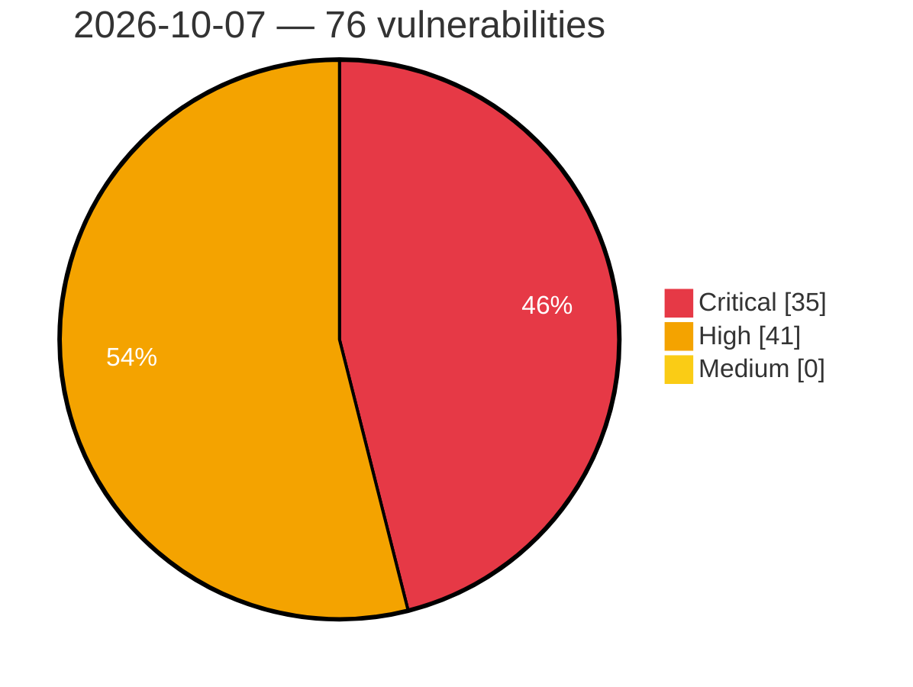

# Critical, High & Medium Severity Vulnerabilities — 2026-10-07

**Source status for this day:**

| Source | Critical | High | Medium | Total |
|--------|---------:|-----:|-------:|------:|
| cvefeed.io (High/Critical) | 35 | 41 | 0 | 76 |

**KEV (actively exploited):** 0  **Watchlist matches:** 38

## Critical (35)

| CVSS | Flags | Source | CVE / Title | Reported |
|------|-------|--------|-------------|----------|
| 10.0 | — | cvefeed.io (High/Critical) | [CVE-2026-76482 - Cisco License On-Prem Security Hardening Release](https://cvefeed.io/vuln/detail/CVE-2026-76482) | 2 hours, 33 minutes ago |
| 9.8 | — | cvefeed.io (High/Critical) | [CVE-2026-93674 - Langflow OSS is affected by multiple vulnerabilities](https://cvefeed.io/vuln/detail/CVE-2026-93674) | 1 hour, 2 minutes ago |
| 9.8 | — | cvefeed.io (High/Critical) | [CVE-2026-104334 - Langflow OSS is affected by multiple vulnerabilities](https://cvefeed.io/vuln/detail/CVE-2026-104334) | 1 hour, 2 minutes ago |
| 9.8 | ⭐ | cvefeed.io (High/Critical) | [CVE-2026-107204 - LMCache through 0.5.5 Unauthenticated RCE via /run_script Endpoint](https://cvefeed.io/vuln/detail/CVE-2026-107204) | 58 minutes ago |
| 9.8 | ⭐ | cvefeed.io (High/Critical) | [CVE-2026-105192 - LMCache Unauthenticated RCE in multiprocess mode via pickle deserialization](https://cvefeed.io/vuln/detail/CVE-2026-105192) | 6 hours, 5 minutes ago |
| 9.8 | ⭐ | cvefeed.io (High/Critical) | [CVE-2026-95606 - WordPress The Events Calendar plugin <= 6.17.4 - PHP Object Injection vulnerability](https://cvefeed.io/vuln/detail/CVE-2026-95606) | 2 hours, 33 minutes ago |
| 9.8 | ⭐ | cvefeed.io (High/Critical) | [CVE-2026-76501 - Cisco Nexus 9000 Series Switches SRv6 OAM (NGOAM) Remote Code Execution Vulnerability](https://cvefeed.io/vuln/detail/CVE-2026-76501) | 2 hours, 33 minutes ago |
| 9.8 | ⭐ | cvefeed.io (High/Critical) | [CVE-2026-76500 - Cisco Application Policy Infrastructure Controller Hardening Release: October 2026 - Improper Control of a Resource Through its Lifetime Vulnerabilities](https://cvefeed.io/vuln/detail/CVE-2026-76500) | 2 hours, 33 minutes ago |
| 9.8 | ⭐ | cvefeed.io (High/Critical) | [CVE-2026-76499 - Cisco Application Policy Infrastructure Controller Hardening Release: October 2026 - Improper Neutralization Vulnerabilities](https://cvefeed.io/vuln/detail/CVE-2026-76499) | 2 hours, 33 minutes ago |
| 9.8 | ⭐ | cvefeed.io (High/Critical) | [CVE-2026-76498 - Cisco Application Policy Infrastructure Controller Hardening Release: October 2026 - Improper Access Control Vulnerabilities](https://cvefeed.io/vuln/detail/CVE-2026-76498) | 2 hours, 33 minutes ago |
| 9.8 | ⭐ | cvefeed.io (High/Critical) | [CVE-2026-76486 - Cisco Nexus 3000 and 9000 Series Switches VXLAN OAM (NGOAM) Remote Code Execution Vulnerability](https://cvefeed.io/vuln/detail/CVE-2026-76486) | 2 hours, 33 minutes ago |
| 9.8 | ⭐ | cvefeed.io (High/Critical) | [CVE-2026-76485 - Cisco Nexus 3000 and 9000 Series Switches VXLAN OAM (NGOAM) Remote Code Execution Vulnerability](https://cvefeed.io/vuln/detail/CVE-2026-76485) | 2 hours, 33 minutes ago |
| 9.8 | — | cvefeed.io (High/Critical) | [CVE-2026-76480 - Cisco License On-Prem Security Hardening Release](https://cvefeed.io/vuln/detail/CVE-2026-76480) | 2 hours, 33 minutes ago |
| 9.8 | ⭐ | cvefeed.io (High/Critical) | [CVE-2026-76471 - Cisco NX-OS Software NX-API Remote Code Execution Vulnerability](https://cvefeed.io/vuln/detail/CVE-2026-76471) | 2 hours, 33 minutes ago |
| 9.8 | ⭐ | cvefeed.io (High/Critical) | [CVE-2026-76465 - Cisco Nexus 3000 and 9000 Series Switches MPLS OAM Remote Code Execution Vulnerability](https://cvefeed.io/vuln/detail/CVE-2026-76465) | 2 hours, 33 minutes ago |
| 9.6 | — | cvefeed.io (High/Critical) | [CVE-2026-76464 - Cisco Meraki Hardening Release October 2026 - Buffer Management Vulnerabilities](https://cvefeed.io/vuln/detail/CVE-2026-76464) | 2 hours, 33 minutes ago |
| 9.4 | ⭐ | cvefeed.io (High/Critical) | [CVE-2026-107206 - LMCache through 0.5.5 Missing Authentication in MP HTTP Server Management API](https://cvefeed.io/vuln/detail/CVE-2026-107206) | 58 minutes ago |
| 9.4 | — | cvefeed.io (High/Critical) | [CVE-2026-96408 - Movable Type Code Injection Vulnerability](https://cvefeed.io/vuln/detail/CVE-2026-96408) | 5 hours, 5 minutes ago |
| 9.4 | ⭐ | cvefeed.io (High/Critical) | [CVE-2025-64393 - Veeam Backup & Replication Remote Code Execution Vulnerability](https://cvefeed.io/vuln/detail/CVE-2025-64393) | 7 hours, 5 minutes ago |
| 9.3 | ⭐ | cvefeed.io (High/Critical) | [CVE-2026-19386 - ASUS Router Stack-Based Buffer Overflow](https://cvefeed.io/vuln/detail/CVE-2026-19386) | 13 minutes ago |
| 9.3 | — | cvefeed.io (High/Critical) | [CVE-2026-103416 - Eclipse ThreadX NetX Duo TLS 1.3 Handshake Out-of-Bounds Write](https://cvefeed.io/vuln/detail/CVE-2026-103416) | 22 minutes ago |
| 9.3 | ⭐ | cvefeed.io (High/Critical) | [CVE-2026-107104 - Unsafe Deserialization Vulnerability in Manacle Technologies ERP System](https://cvefeed.io/vuln/detail/CVE-2026-107104) | 52 minutes ago |
| 9.3 | ⭐ | cvefeed.io (High/Critical) | [CVE-2026-107103 - SQL Injection Vulnerability in Manacle Technologies ERP System](https://cvefeed.io/vuln/detail/CVE-2026-107103) | 56 minutes ago |
| 9.3 | ⭐ | cvefeed.io (High/Critical) | [CVE-2026-107102 - Account Takeover Vulnerability in Manacle Technologies ERP System](https://cvefeed.io/vuln/detail/CVE-2026-107102) | 1 hour, 1 minute ago |
| 9.3 | ⭐ | cvefeed.io (High/Critical) | [CVE-2026-102782 - Joomla Extension - ordasoft.com - Unauthenticated SQL injection in OrdaSoft Simple Membership < 7.4.0](https://cvefeed.io/vuln/detail/CVE-2026-102782) | 1 hour, 11 minutes ago |
| 9.3 | — | cvefeed.io (High/Critical) | [CVE-2026-59346 - VMware Workstation and Fusion VMXNET3 integer-overflow vulnerability](https://cvefeed.io/vuln/detail/CVE-2026-59346) | 3 hours ago |
| 9.3 | ⭐ | cvefeed.io (High/Critical) | [CVE-2026-19572 - FlexNet Publisher lmadmin SOAP Authentication Bypass Vulnerability](https://cvefeed.io/vuln/detail/CVE-2026-19572) | 4 hours, 59 minutes ago |
| 9.3 | ⭐ | cvefeed.io (High/Critical) | [CVE-2026-14911 - ASUS Router Cross-Site Scripting Vulnerability](https://cvefeed.io/vuln/detail/CVE-2026-14911) | 6 hours ago |
| 9.3 | — | cvefeed.io (High/Critical) | [CVE-2026-92414 - Apache Jackrabbit: Pre-auth hijack of cached sessions via derivable WebDAV lock tokens](https://cvefeed.io/vuln/detail/CVE-2026-92414) | 36 minutes ago |
| 9.3 | ⭐ | cvefeed.io (High/Critical) | [CVE-2026-95605 - WordPress WP Data Access plugin <= 5.5.82 - SQL Injection vulnerability](https://cvefeed.io/vuln/detail/CVE-2026-95605) | 2 hours, 33 minutes ago |
| 9.2 | — | cvefeed.io (High/Critical) | [CVE-2026-105324 - An HTTP header injection vulnerability was found in the ADM](https://cvefeed.io/vuln/detail/CVE-2026-105324) | 1 hour, 6 minutes ago |
| 9.2 | ⭐ | cvefeed.io (High/Critical) | [CVE-2026-107194 - Sungrow iSolarCloud Authentication Bypass and Account Takeover](https://cvefeed.io/vuln/detail/CVE-2026-107194) | 2 hours, 5 minutes ago |
| 9.2 | — | cvefeed.io (High/Critical) | [CVE-2026-107183 - llama.cpp before b11393 Use-After-Free via common_chat_peg_mapper chat_parser](https://cvefeed.io/vuln/detail/CVE-2026-107183) | 2 hours, 5 minutes ago |
| 9.1 | — | cvefeed.io (High/Critical) | [CVE-2026-76483 - Cisco License On-Prem Security Hardening Release](https://cvefeed.io/vuln/detail/CVE-2026-76483) | 2 hours, 33 minutes ago |
| 9.0 | — | cvefeed.io (High/Critical) | [CVE-2026-16516 - wolfSSH ECDSA host key curve not validated against negotiated algorithm](https://cvefeed.io/vuln/detail/CVE-2026-16516) | 6 hours ago |

## High (41)

| CVSS | Flags | Source | CVE / Title | Reported |
|------|-------|--------|-------------|----------|
| 8.8 | — | cvefeed.io (High/Critical) | [CVE-2026-97679 - Langflow OSS is affected by multiple vulnerabilities](https://cvefeed.io/vuln/detail/CVE-2026-97679) | 1 hour, 2 minutes ago |
| 8.8 | — | cvefeed.io (High/Critical) | [CVE-2026-97678 - Langflow OSS is affected by multiple vulnerabilities](https://cvefeed.io/vuln/detail/CVE-2026-97678) | 1 hour, 2 minutes ago |
| 8.8 | — | cvefeed.io (High/Critical) | [CVE-2026-97676 - Langflow OSS is affected by multiple vulnerabilities](https://cvefeed.io/vuln/detail/CVE-2026-97676) | 1 hour, 2 minutes ago |
| 8.8 | — | cvefeed.io (High/Critical) | [CVE-2026-97673 - Langflow OSS is affected by multiple vulnerabilities](https://cvefeed.io/vuln/detail/CVE-2026-97673) | 1 hour, 2 minutes ago |
| 8.8 | — | cvefeed.io (High/Critical) | [CVE-2026-97655 - Langflow OSS is affected by multiple vulnerabilities](https://cvefeed.io/vuln/detail/CVE-2026-97655) | 1 hour, 2 minutes ago |
| 8.8 | — | cvefeed.io (High/Critical) | [CVE-2026-93675 - Langflow OSS is affected by multiple vulnerabilities](https://cvefeed.io/vuln/detail/CVE-2026-93675) | 1 hour, 2 minutes ago |
| 8.8 | — | cvefeed.io (High/Critical) | [CVE-2026-88962 - Langflow OSS is affected by multiple vulnerabilities](https://cvefeed.io/vuln/detail/CVE-2026-88962) | 1 hour, 2 minutes ago |
| 8.8 | ⭐ | cvefeed.io (High/Critical) | [CVE-2026-104335 - Langflow OSS is affected by multiple vulnerabilities](https://cvefeed.io/vuln/detail/CVE-2026-104335) | 2 hours, 1 minute ago |
| 8.8 | ⭐ | cvefeed.io (High/Critical) | [CVE-2026-15894 - Bluetooth Mesh solicitation PDU stack buffer overflow via oversized advertisement](https://cvefeed.io/vuln/detail/CVE-2026-15894) | 22 minutes ago |
| 8.8 | ⭐ | cvefeed.io (High/Critical) | [CVE-2026-106558 - Backstage: Improper validation of TechDocs MkDocs configuration](https://cvefeed.io/vuln/detail/CVE-2026-106558) | 1 hour, 5 minutes ago |
| 8.8 | ⭐ | cvefeed.io (High/Critical) | [CVE-2026-106059 - GitAhead through 2.7.1 on macOS Command Injection via Show in Finder AppleScript](https://cvefeed.io/vuln/detail/CVE-2026-106059) | 4 hours, 5 minutes ago |
| 8.8 | ⭐ | cvefeed.io (High/Critical) | [CVE-2026-103668 - Movable Type SQL Injection Vulnerability](https://cvefeed.io/vuln/detail/CVE-2026-103668) | 5 hours, 5 minutes ago |
| 8.8 | ⭐ | cvefeed.io (High/Critical) | [CVE-2026-97188 - String Locator < 2.6.8 - Unauthenticated PHP Object Injection via Database Editor](https://cvefeed.io/vuln/detail/CVE-2026-97188) | 9 hours, 6 minutes ago |
| 8.8 | ⭐ | cvefeed.io (High/Critical) | [CVE-2026-87782 - Koinonia Link 1.1.2 - 1.1.4 - Subscriber+ Privilege Escalation to Administrator](https://cvefeed.io/vuln/detail/CVE-2026-87782) | 9 hours, 6 minutes ago |
| 8.8 | ⭐ | cvefeed.io (High/Critical) | [CVE-2026-95534 - WordPress Unlimited Elements For Elementor (Free Widgets, Addons, Templates) plugin <= 2.0.19 - PHP Object Injection vulnerability](https://cvefeed.io/vuln/detail/CVE-2026-95534) | 2 hours, 33 minutes ago |
| 8.8 | — | cvefeed.io (High/Critical) | [CVE-2026-76484 - Cisco License On-Prem Security Hardening Release](https://cvefeed.io/vuln/detail/CVE-2026-76484) | 2 hours, 33 minutes ago |
| 8.8 | — | cvefeed.io (High/Critical) | [CVE-2026-76472 - Cisco Meraki Security Hardening Release October 2026 - Improper Neutralization of Special Elements Vulnerabilities](https://cvefeed.io/vuln/detail/CVE-2026-76472) | 2 hours, 33 minutes ago |
| 8.8 | — | cvefeed.io (High/Critical) | [CVE-2026-76470 - Cisco Meraki Hardening Release - Incorrect Calculation Vulnerabilities](https://cvefeed.io/vuln/detail/CVE-2026-76470) | 2 hours, 33 minutes ago |
| 8.8 | ⭐ | cvefeed.io (High/Critical) | [CVE-2026-76463 - Cisco Meraki Security Hardening Release: October 2026 - Improper Access Control Vulnerabilities](https://cvefeed.io/vuln/detail/CVE-2026-76463) | 2 hours, 33 minutes ago |
| 8.8 | — | cvefeed.io (High/Critical) | [CVE-2026-76459 - Cisco NX-OS Software Security Hardening Release: October 2026 - Out-of-bounds Write Vulnerabilities](https://cvefeed.io/vuln/detail/CVE-2026-76459) | 2 hours, 33 minutes ago |
| 8.7 | ⭐ | cvefeed.io (High/Critical) | [CVE-2026-102478 - Octopus Server Privilege Escalation Vulnerability](https://cvefeed.io/vuln/detail/CVE-2026-102478) | 1 hour, 1 minute ago |
| 8.7 | — | cvefeed.io (High/Critical) | [CVE-2026-107213 - Excelize: Nil-pointer dereference in GetSlicers when a worksheet has extLst present but no drawing element](https://cvefeed.io/vuln/detail/CVE-2026-107213) | 1 hour, 32 minutes ago |
| 8.7 | — | cvefeed.io (High/Critical) | [CVE-2026-107211 - Excelize: Unchecked pivot-cache field index in extractPivotTableFields causes unrecoverable panic](https://cvefeed.io/vuln/detail/CVE-2026-107211) | 1 hour, 32 minutes ago |
| 8.6 | ⭐ | cvefeed.io (High/Critical) | [CVE-2026-107205 - LMCache through 0.5.5 Missing Authentication in MP Coordinator Fleet Control API](https://cvefeed.io/vuln/detail/CVE-2026-107205) | 58 minutes ago |
| 8.6 | — | cvefeed.io (High/Critical) | [CVE-2026-107181 - Telegram Desktop before 7.2.9 IPC Record Injection File Exfiltration via interpret: Scheme](https://cvefeed.io/vuln/detail/CVE-2026-107181) | 2 hours, 5 minutes ago |
| 8.5 | — | cvefeed.io (High/Critical) | [CVE-2026-93449 - Langflow OSS is affected by multiple vulnerabilities](https://cvefeed.io/vuln/detail/CVE-2026-93449) | 1 hour, 2 minutes ago |
| 8.5 | ⭐ | cvefeed.io (High/Critical) | [CVE-2026-106057 - patool before 4.0.6 OS Command Injection on Windows via shell_quote_nt](https://cvefeed.io/vuln/detail/CVE-2026-106057) | 4 hours, 5 minutes ago |
| 8.5 | — | cvefeed.io (High/Critical) | [CVE-2026-34499 - Johnson Controls ADVMS Hard-Coded Cryptographic Key Vulnerability](https://cvefeed.io/vuln/detail/CVE-2026-34499) | 13 minutes ago |
| 8.4 | — | cvefeed.io (High/Critical) | [CVE-2026-16528 - ASUS Router Sensitive Information Disclosure in Log File](https://cvefeed.io/vuln/detail/CVE-2026-16528) | 16 minutes ago |
| 8.3 | ⭐ | cvefeed.io (High/Critical) | [CVE-2026-97680 - Langflow OSS is affected by multiple vulnerabilities](https://cvefeed.io/vuln/detail/CVE-2026-97680) | 1 hour, 2 minutes ago |
| 8.3 | — | cvefeed.io (High/Critical) | [CVE-2026-77214 - libexpat Heap Buffer Over-read in xmlparse.c via XML_ParseBuffer](https://cvefeed.io/vuln/detail/CVE-2026-77214) | 1 hour, 5 minutes ago |
| 8.3 | ⭐ | cvefeed.io (High/Critical) | [CVE-2026-58069 - Veeam Backup & Replication Arbitrary File Read Vulnerability](https://cvefeed.io/vuln/detail/CVE-2026-58069) | 7 hours, 5 minutes ago |
| 8.2 | — | cvefeed.io (High/Critical) | [CVE-2026-82211 - Nexi XPay Build <= 7.6.2 - Unauthenticated Payment Completion and Order Key Disclosure](https://cvefeed.io/vuln/detail/CVE-2026-82211) | 2 hours ago |
| 8.2 | — | cvefeed.io (High/Critical) | [CVE-2026-97714 - Denial of service vulnerability in Secure Access](https://cvefeed.io/vuln/detail/CVE-2026-97714) | 30 minutes ago |
| 8.2 | — | cvefeed.io (High/Critical) | [CVE-2026-76468 - Cisco Meraki Hardening Release - Input Validation Vulnerabilities](https://cvefeed.io/vuln/detail/CVE-2026-76468) | 2 hours, 33 minutes ago |
| 8.1 | ⭐ | cvefeed.io (High/Critical) | [CVE-2026-106471 - Candlepin: candlepin: broken object-level authorization via verifyauthorizationfilter multi-@verify hasaccess latching](https://cvefeed.io/vuln/detail/CVE-2026-106471) | 30 minutes ago |
| 8.1 | — | cvefeed.io (High/Critical) | [CVE-2026-97674 - Langflow OSS is affected by multiple vulnerabilities](https://cvefeed.io/vuln/detail/CVE-2026-97674) | 1 hour, 2 minutes ago |
| 8.1 | — | cvefeed.io (High/Critical) | [CVE-2026-93445 - Langflow OSS is affected by multiple vulnerabilities](https://cvefeed.io/vuln/detail/CVE-2026-93445) | 1 hour, 2 minutes ago |
| 8.1 | — | cvefeed.io (High/Critical) | [CVE-2026-103360 - Langflow OSS is affected by multiple vulnerabilities](https://cvefeed.io/vuln/detail/CVE-2026-103360) | 1 hour, 2 minutes ago |
| 8.1 | ⭐ | cvefeed.io (High/Critical) | [CVE-2026-19186 - Integer underflow in IEEE 802.15.4 frame decryption leads to out-of-bounds read and write](https://cvefeed.io/vuln/detail/CVE-2026-19186) | 22 minutes ago |
| 8.1 | — | cvefeed.io (High/Critical) | [CVE-2026-59347 - VMware Workstation and Fusion HGFS stack-based buffer-overflow vulnerability](https://cvefeed.io/vuln/detail/CVE-2026-59347) | 3 hours ago |
