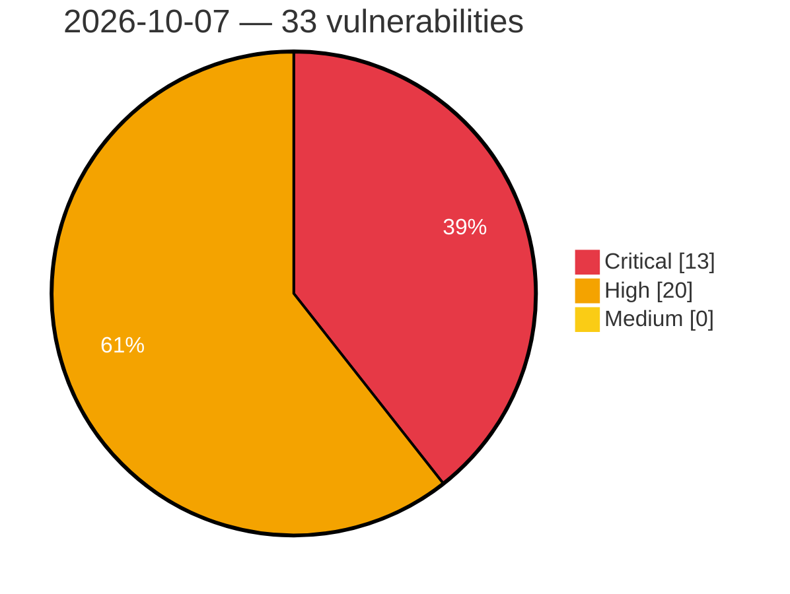

# Critical, High & Medium Severity Vulnerabilities — 2026-10-07

**Source status for this day:**

| Source | Critical | High | Medium | Total |
|--------|---------:|-----:|-------:|------:|
| cvefeed.io (High/Critical) | 13 | 20 | 0 | 33 |

**KEV (actively exploited):** 0  **Watchlist matches:** 13

## Critical (13)

| CVSS | Flags | Source | CVE / Title | Reported |
|------|-------|--------|-------------|----------|
| 9.8 | — | cvefeed.io (High/Critical) | [CVE-2026-93674 - Langflow OSS is affected by multiple vulnerabilities](https://cvefeed.io/vuln/detail/CVE-2026-93674) | 1 hour, 2 minutes ago |
| 9.8 | — | cvefeed.io (High/Critical) | [CVE-2026-104334 - Langflow OSS is affected by multiple vulnerabilities](https://cvefeed.io/vuln/detail/CVE-2026-104334) | 1 hour, 2 minutes ago |
| 9.3 | ⭐ | cvefeed.io (High/Critical) | [CVE-2026-19386 - ASUS Router Stack-Based Buffer Overflow](https://cvefeed.io/vuln/detail/CVE-2026-19386) | 13 minutes ago |
| 9.3 | — | cvefeed.io (High/Critical) | [CVE-2026-103416 - Eclipse ThreadX NetX Duo TLS 1.3 Handshake Out-of-Bounds Write](https://cvefeed.io/vuln/detail/CVE-2026-103416) | 22 minutes ago |
| 9.3 | ⭐ | cvefeed.io (High/Critical) | [CVE-2026-107104 - Unsafe Deserialization Vulnerability in Manacle Technologies ERP System](https://cvefeed.io/vuln/detail/CVE-2026-107104) | 52 minutes ago |
| 9.3 | ⭐ | cvefeed.io (High/Critical) | [CVE-2026-107103 - SQL Injection Vulnerability in Manacle Technologies ERP System](https://cvefeed.io/vuln/detail/CVE-2026-107103) | 56 minutes ago |
| 9.3 | ⭐ | cvefeed.io (High/Critical) | [CVE-2026-107102 - Account Takeover Vulnerability in Manacle Technologies ERP System](https://cvefeed.io/vuln/detail/CVE-2026-107102) | 1 hour, 1 minute ago |
| 9.3 | ⭐ | cvefeed.io (High/Critical) | [CVE-2026-102782 - Joomla Extension - ordasoft.com - Unauthenticated SQL injection in OrdaSoft Simple Membership < 7.4.0](https://cvefeed.io/vuln/detail/CVE-2026-102782) | 1 hour, 11 minutes ago |
| 9.3 | — | cvefeed.io (High/Critical) | [CVE-2026-59346 - VMware Workstation and Fusion VMXNET3 integer-overflow vulnerability](https://cvefeed.io/vuln/detail/CVE-2026-59346) | 3 hours ago |
| 9.3 | ⭐ | cvefeed.io (High/Critical) | [CVE-2026-19572 - FlexNet Publisher lmadmin SOAP Authentication Bypass Vulnerability](https://cvefeed.io/vuln/detail/CVE-2026-19572) | 4 hours, 59 minutes ago |
| 9.3 | ⭐ | cvefeed.io (High/Critical) | [CVE-2026-14911 - ASUS Router Cross-Site Scripting Vulnerability](https://cvefeed.io/vuln/detail/CVE-2026-14911) | 6 hours ago |
| 9.2 | — | cvefeed.io (High/Critical) | [CVE-2026-105324 - An HTTP header injection vulnerability was found in the ADM](https://cvefeed.io/vuln/detail/CVE-2026-105324) | 1 hour, 6 minutes ago |
| 9.0 | — | cvefeed.io (High/Critical) | [CVE-2026-16516 - wolfSSH ECDSA host key curve not validated against negotiated algorithm](https://cvefeed.io/vuln/detail/CVE-2026-16516) | 6 hours ago |

## High (20)

| CVSS | Flags | Source | CVE / Title | Reported |
|------|-------|--------|-------------|----------|
| 8.8 | — | cvefeed.io (High/Critical) | [CVE-2026-97679 - Langflow OSS is affected by multiple vulnerabilities](https://cvefeed.io/vuln/detail/CVE-2026-97679) | 1 hour, 2 minutes ago |
| 8.8 | — | cvefeed.io (High/Critical) | [CVE-2026-97678 - Langflow OSS is affected by multiple vulnerabilities](https://cvefeed.io/vuln/detail/CVE-2026-97678) | 1 hour, 2 minutes ago |
| 8.8 | — | cvefeed.io (High/Critical) | [CVE-2026-97676 - Langflow OSS is affected by multiple vulnerabilities](https://cvefeed.io/vuln/detail/CVE-2026-97676) | 1 hour, 2 minutes ago |
| 8.8 | — | cvefeed.io (High/Critical) | [CVE-2026-97673 - Langflow OSS is affected by multiple vulnerabilities](https://cvefeed.io/vuln/detail/CVE-2026-97673) | 1 hour, 2 minutes ago |
| 8.8 | — | cvefeed.io (High/Critical) | [CVE-2026-97655 - Langflow OSS is affected by multiple vulnerabilities](https://cvefeed.io/vuln/detail/CVE-2026-97655) | 1 hour, 2 minutes ago |
| 8.8 | — | cvefeed.io (High/Critical) | [CVE-2026-93675 - Langflow OSS is affected by multiple vulnerabilities](https://cvefeed.io/vuln/detail/CVE-2026-93675) | 1 hour, 2 minutes ago |
| 8.8 | — | cvefeed.io (High/Critical) | [CVE-2026-88962 - Langflow OSS is affected by multiple vulnerabilities](https://cvefeed.io/vuln/detail/CVE-2026-88962) | 1 hour, 2 minutes ago |
| 8.8 | ⭐ | cvefeed.io (High/Critical) | [CVE-2026-104335 - Langflow OSS is affected by multiple vulnerabilities](https://cvefeed.io/vuln/detail/CVE-2026-104335) | 2 hours, 1 minute ago |
| 8.8 | ⭐ | cvefeed.io (High/Critical) | [CVE-2026-15894 - Bluetooth Mesh solicitation PDU stack buffer overflow via oversized advertisement](https://cvefeed.io/vuln/detail/CVE-2026-15894) | 22 minutes ago |
| 8.7 | ⭐ | cvefeed.io (High/Critical) | [CVE-2026-102478 - Octopus Server Privilege Escalation Vulnerability](https://cvefeed.io/vuln/detail/CVE-2026-102478) | 1 hour, 1 minute ago |
| 8.5 | — | cvefeed.io (High/Critical) | [CVE-2026-93449 - Langflow OSS is affected by multiple vulnerabilities](https://cvefeed.io/vuln/detail/CVE-2026-93449) | 1 hour, 2 minutes ago |
| 8.4 | — | cvefeed.io (High/Critical) | [CVE-2026-16528 - ASUS Router Sensitive Information Disclosure in Log File](https://cvefeed.io/vuln/detail/CVE-2026-16528) | 16 minutes ago |
| 8.3 | ⭐ | cvefeed.io (High/Critical) | [CVE-2026-97680 - Langflow OSS is affected by multiple vulnerabilities](https://cvefeed.io/vuln/detail/CVE-2026-97680) | 1 hour, 2 minutes ago |
| 8.2 | — | cvefeed.io (High/Critical) | [CVE-2026-82211 - Nexi XPay Build <= 7.6.2 - Unauthenticated Payment Completion and Order Key Disclosure](https://cvefeed.io/vuln/detail/CVE-2026-82211) | 2 hours ago |
| 8.1 | ⭐ | cvefeed.io (High/Critical) | [CVE-2026-106471 - Candlepin: candlepin: broken object-level authorization via verifyauthorizationfilter multi-@verify hasaccess latching](https://cvefeed.io/vuln/detail/CVE-2026-106471) | 30 minutes ago |
| 8.1 | — | cvefeed.io (High/Critical) | [CVE-2026-97674 - Langflow OSS is affected by multiple vulnerabilities](https://cvefeed.io/vuln/detail/CVE-2026-97674) | 1 hour, 2 minutes ago |
| 8.1 | — | cvefeed.io (High/Critical) | [CVE-2026-93445 - Langflow OSS is affected by multiple vulnerabilities](https://cvefeed.io/vuln/detail/CVE-2026-93445) | 1 hour, 2 minutes ago |
| 8.1 | — | cvefeed.io (High/Critical) | [CVE-2026-103360 - Langflow OSS is affected by multiple vulnerabilities](https://cvefeed.io/vuln/detail/CVE-2026-103360) | 1 hour, 2 minutes ago |
| 8.1 | ⭐ | cvefeed.io (High/Critical) | [CVE-2026-19186 - Integer underflow in IEEE 802.15.4 frame decryption leads to out-of-bounds read and write](https://cvefeed.io/vuln/detail/CVE-2026-19186) | 22 minutes ago |
| 8.1 | — | cvefeed.io (High/Critical) | [CVE-2026-59347 - VMware Workstation and Fusion HGFS stack-based buffer-overflow vulnerability](https://cvefeed.io/vuln/detail/CVE-2026-59347) | 3 hours ago |
