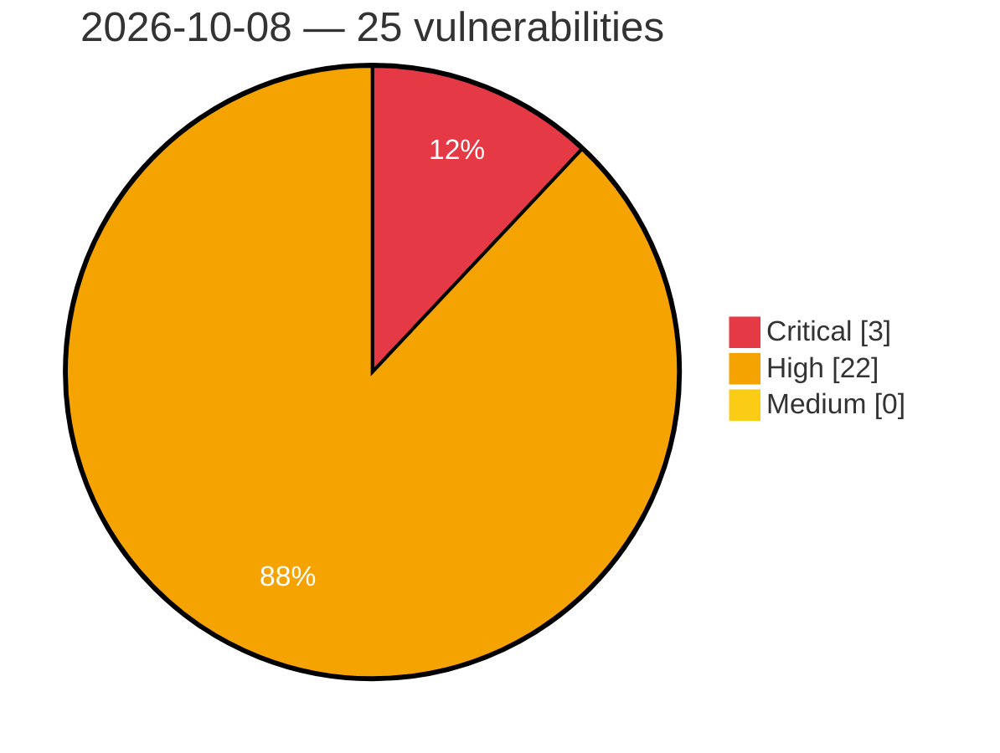

# Critical, High & Medium Severity Vulnerabilities — 2026-10-08

**Source status for this day:**

| Source | Critical | High | Medium | Total |
|--------|---------:|-----:|-------:|------:|
| cvefeed.io (High/Critical) | 3 | 22 | 0 | 25 |

**KEV (actively exploited):** 0  **Watchlist matches:** 16

## Critical (3)

| CVSS | Flags | Source | CVE / Title | Reported |
|------|-------|--------|-------------|----------|
| 9.8 | ⭐ | cvefeed.io (High/Critical) | [CVE-2026-85097 - Bricksforge <= 3.1.8.9 - Unauthenticated Arbitrary File Upload via 'temporaryFileUploads' Parameter](https://cvefeed.io/vuln/detail/CVE-2026-85097) | 42 minutes ago |
| 9.8 | ⭐ | cvefeed.io (High/Critical) | [CVE-2026-107459 - Openfind｜SecuShare Pro - OS Command Injection](https://cvefeed.io/vuln/detail/CVE-2026-107459) | 1 hour, 42 minutes ago |
| 9.1 | — | cvefeed.io (High/Critical) | [CVE-2026-17609 - Super Forms <= 6.3.316 - Unauthenticated Arbitrary Directory Deletion via 'data[...][files][][subdir]' Parameter](https://cvefeed.io/vuln/detail/CVE-2026-17609) | 2 hours, 42 minutes ago |

## High (22)

| CVSS | Flags | Source | CVE / Title | Reported |
|------|-------|--------|-------------|----------|
| 8.8 | ⭐ | cvefeed.io (High/Critical) | [CVE-2026-17196 - Super Forms <= 6.3.316 - Authenticated (Subscriber+) Arbitrary File Upload via 'extensions' Form Element Attribute](https://cvefeed.io/vuln/detail/CVE-2026-17196) | 2 hours, 42 minutes ago |
| 8.7 | ⭐ | cvefeed.io (High/Critical) | [CVE-2026-85489 - Brocade ASCG Authentication Bypass Vulnerability](https://cvefeed.io/vuln/detail/CVE-2026-85489) | 42 minutes ago |
| 8.7 | ⭐ | cvefeed.io (High/Critical) | [CVE-2026-85421 - Brocade ASCG Authentication Bypass Vulnerability](https://cvefeed.io/vuln/detail/CVE-2026-85421) | 42 minutes ago |
| 8.7 | — | cvefeed.io (High/Critical) | [CVE-2026-87684 - Brocade Fabric SNMP Daemon Stack-Based Buffer Overflow](https://cvefeed.io/vuln/detail/CVE-2026-87684) | 4 hours, 42 minutes ago |
| 8.6 | ⭐ | cvefeed.io (High/Critical) | [CVE-2026-87424 - Brocade ASCG Authentication Bypass Vulnerability](https://cvefeed.io/vuln/detail/CVE-2026-87424) | 42 minutes ago |
| 8.6 | ⭐ | cvefeed.io (High/Critical) | [CVE-2026-85487 - Brocade ASCG Path Traversal Vulnerability](https://cvefeed.io/vuln/detail/CVE-2026-85487) | 42 minutes ago |
| 8.6 | ⭐ | cvefeed.io (High/Critical) | [CVE-2026-85486 - Brocade ASCG Remote Code Execution](https://cvefeed.io/vuln/detail/CVE-2026-85486) | 42 minutes ago |
| 8.6 | ⭐ | cvefeed.io (High/Critical) | [CVE-2026-85423 - Brocade ASCG Authentication Bypass and Remote Code Execution Vulnerability](https://cvefeed.io/vuln/detail/CVE-2026-85423) | 42 minutes ago |
| 8.6 | ⭐ | cvefeed.io (High/Critical) | [CVE-2026-87666 - Brocade Fabric OS OS Command Injection Vulnerability](https://cvefeed.io/vuln/detail/CVE-2026-87666) | 3 hours, 41 minutes ago |
| 8.6 | ⭐ | cvefeed.io (High/Critical) | [CVE-2026-87683 - Brocade Fabric OS REST API Stack-Based Buffer Overflow](https://cvefeed.io/vuln/detail/CVE-2026-87683) | 5 hours, 42 minutes ago |
| 8.5 | ⭐ | cvefeed.io (High/Critical) | [CVE-2026-94586 - Brocade Fabric OS Command Injection Vulnerability](https://cvefeed.io/vuln/detail/CVE-2026-94586) | 2 hours, 42 minutes ago |
| 8.5 | ⭐ | cvefeed.io (High/Critical) | [CVE-2026-94581 - Brocade Fabric OS OS Command Injection Vulnerability](https://cvefeed.io/vuln/detail/CVE-2026-94581) | 2 hours, 42 minutes ago |
| 8.5 | — | cvefeed.io (High/Critical) | [CVE-2026-87664 - Brocade Fabric OS Session Context Forgery Vulnerability](https://cvefeed.io/vuln/detail/CVE-2026-87664) | 2 hours, 42 minutes ago |
| 8.5 | ⭐ | cvefeed.io (High/Critical) | [CVE-2026-87688 - Brocade Fabric OS Command Injection Vulnerability](https://cvefeed.io/vuln/detail/CVE-2026-87688) | 3 hours, 41 minutes ago |
| 8.5 | — | cvefeed.io (High/Critical) | [CVE-2026-87687 - Brocade Fabric OS Improper Authorization Vulnerability](https://cvefeed.io/vuln/detail/CVE-2026-87687) | 3 hours, 41 minutes ago |
| 8.5 | ⭐ | cvefeed.io (High/Critical) | [CVE-2026-87674 - Brocade Fabric OS Local Privilege Escalation Vulnerability](https://cvefeed.io/vuln/detail/CVE-2026-87674) | 3 hours, 41 minutes ago |
| 8.4 | — | cvefeed.io (High/Critical) | [CVE-2026-87428 - Brocade ASCG Credential Disclosure Vulnerability](https://cvefeed.io/vuln/detail/CVE-2026-87428) | 42 minutes ago |
| 8.4 | — | cvefeed.io (High/Critical) | [CVE-2026-85422 - Brocade ASCG Hardcoded Cryptographic Key Vulnerability](https://cvefeed.io/vuln/detail/CVE-2026-85422) | 42 minutes ago |
| 8.4 | — | cvefeed.io (High/Critical) | [CVE-2026-87685 - Brocade Fabric OS WebTools Arbitrary File Manipulation Vulnerability](https://cvefeed.io/vuln/detail/CVE-2026-87685) | 3 hours, 41 minutes ago |
| 8.4 | — | cvefeed.io (High/Critical) | [CVE-2026-87667 - Brocade Fabric OS Argument Injection Vulnerability](https://cvefeed.io/vuln/detail/CVE-2026-87667) | 3 hours, 41 minutes ago |
| 8.2 | — | cvefeed.io (High/Critical) | [CVE-2026-5047 - Brocade SANnav Sensitive Information Disclosure](https://cvefeed.io/vuln/detail/CVE-2026-5047) | 1 hour, 42 minutes ago |
| 8.1 | ⭐ | cvefeed.io (High/Critical) | [CVE-2026-107450 - Stump Smart List Unauthorized Access Vulnerability](https://cvefeed.io/vuln/detail/CVE-2026-107450) | 2 hours, 42 minutes ago |
