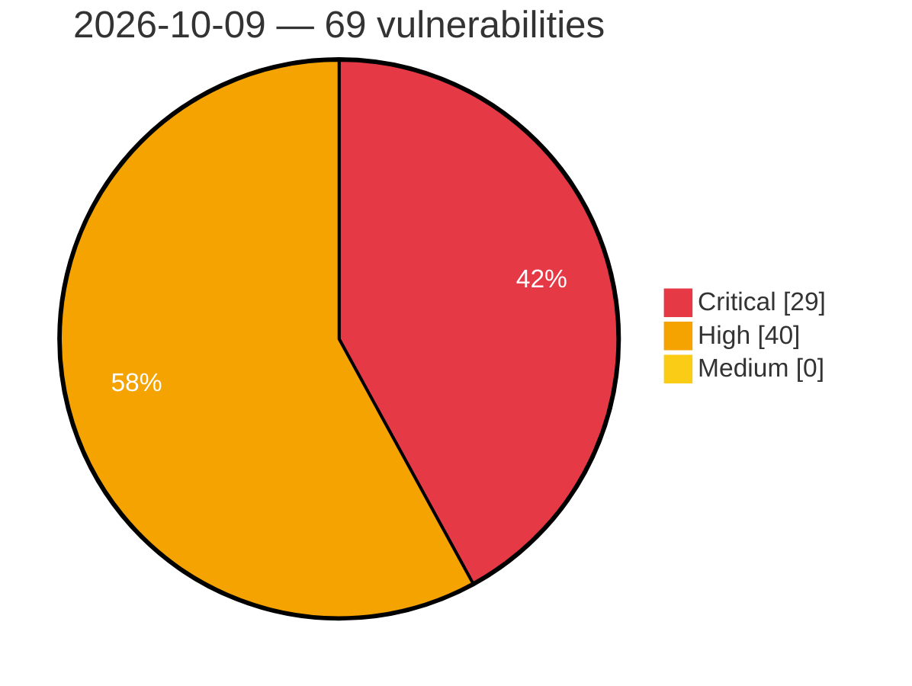

# Critical, High & Medium Severity Vulnerabilities — 2026-10-09

**Source status for this day:**

| Source | Critical | High | Medium | Total |
|--------|---------:|-----:|-------:|------:|
| cvefeed.io (High/Critical) | 29 | 40 | 0 | 69 |

**KEV (actively exploited):** 0  **Watchlist matches:** 44

## Critical (29)

| CVSS | Flags | Source | CVE / Title | Reported |
|------|-------|--------|-------------|----------|
| 10.0 | ⭐ | cvefeed.io (High/Critical) | [CVE-2026-94503 - WordPress Zombify plugin <= 1.7.7 - Arbitrary File Upload vulnerability](https://cvefeed.io/vuln/detail/CVE-2026-94503) | 3 hours, 6 minutes ago |
| 9.9 | ⭐ | cvefeed.io (High/Critical) | [CVE-2026-108263 - Astron Agent: Unsandboxed code-node leads to cross-tenant RCE](https://cvefeed.io/vuln/detail/CVE-2026-108263) | 2 hours, 6 minutes ago |
| 9.8 | ⭐ | cvefeed.io (High/Critical) | [CVE-2026-5759 - Double free and use-after-free in FalkorDB RdbLoadDeletedNodes allows remote code execution via crafted RDB](https://cvefeed.io/vuln/detail/CVE-2026-5759) | 59 minutes ago |
| 9.8 | ⭐ | cvefeed.io (High/Critical) | [CVE-2026-107908 - Pre-authentication heap out-of-bounds write in FalkorDB Bolt BoltReadHandler via RESET message](https://cvefeed.io/vuln/detail/CVE-2026-107908) | 1 hour, 8 minutes ago |
| 9.8 | — | cvefeed.io (High/Critical) | [CVE-2026-86405 - Payment Validation Bypass in Sipay Electronic Money's SanalPos PrestaShop](https://cvefeed.io/vuln/detail/CVE-2026-86405) | 30 minutes ago |
| 9.8 | — | cvefeed.io (High/Critical) | [CVE-2026-85531 - Payment Validation Bypass in Sipay Electronic Money's OpenCart 3.x](https://cvefeed.io/vuln/detail/CVE-2026-85531) | 54 minutes ago |
| 9.3 | ⭐ | cvefeed.io (High/Critical) | [CVE-2026-96809 - WordPress EduAdmin Booking plugin < 6.0.0 - SQL Injection vulnerability](https://cvefeed.io/vuln/detail/CVE-2026-96809) | 3 hours, 6 minutes ago |
| 9.3 | ⭐ | cvefeed.io (High/Critical) | [CVE-2026-96331 - WordPress Ajax Search Pro plugin <= 4.29.1 - SQL Injection vulnerability](https://cvefeed.io/vuln/detail/CVE-2026-96331) | 3 hours, 6 minutes ago |
| 9.3 | ⭐ | cvefeed.io (High/Critical) | [CVE-2026-96330 - WordPress tagDiv Opt-In Builder plugin <= 1.7.6 - SQL Injection vulnerability](https://cvefeed.io/vuln/detail/CVE-2026-96330) | 3 hours, 6 minutes ago |
| 9.3 | ⭐ | cvefeed.io (High/Critical) | [CVE-2026-96328 - WordPress JNews - Pay Writer plugin <= 12.0.1 - SQL Injection vulnerability](https://cvefeed.io/vuln/detail/CVE-2026-96328) | 3 hours, 6 minutes ago |
| 9.3 | ⭐ | cvefeed.io (High/Critical) | [CVE-2026-96327 - WordPress WPLMS plugin < 1.9.9.8.2 - SQL Injection vulnerability](https://cvefeed.io/vuln/detail/CVE-2026-96327) | 3 hours, 6 minutes ago |
| 9.3 | ⭐ | cvefeed.io (High/Critical) | [CVE-2026-93947 - WordPress Traveler theme <= 3.2.9 - SQL Injection vulnerability](https://cvefeed.io/vuln/detail/CVE-2026-93947) | 3 hours, 6 minutes ago |
| 9.3 | ⭐ | cvefeed.io (High/Critical) | [CVE-2026-107935 - Gvisor-tap-vsock: gvisor-tap-vsock: unathenticated arbitrary file deletion on the host via /expose](https://cvefeed.io/vuln/detail/CVE-2026-107935) | 3 hours, 6 minutes ago |
| 9.3 | — | cvefeed.io (High/Critical) | [CVE-2026-107824 - x64dbg-MCP Server exposes debugger operations to unauthenticated network clients](https://cvefeed.io/vuln/detail/CVE-2026-107824) | 44 minutes ago |
| 9.3 | — | cvefeed.io (High/Critical) | [CVE-2026-39460 - Red Lion Controls N-Tron 700 Series Insufficiently Protected Credentials](https://cvefeed.io/vuln/detail/CVE-2026-39460) | 3 hours, 44 minutes ago |
| 9.3 | — | cvefeed.io (High/Critical) | [CVE-2026-33367 - Red Lion Controls N-Tron 700 Series Missing Authentication for Critical Function](https://cvefeed.io/vuln/detail/CVE-2026-33367) | 3 hours, 44 minutes ago |
| 9.3 | ⭐ | cvefeed.io (High/Critical) | [CVE-2026-108261 - TinaCMS admin preview iframe loads an attacker-controlled origin from the URL fragment](https://cvefeed.io/vuln/detail/CVE-2026-108261) | 2 hours, 6 minutes ago |
| 9.3 | ⭐ | cvefeed.io (High/Critical) | [CVE-2026-107845 - Contao: Cross-site scripting in the comments bundle](https://cvefeed.io/vuln/detail/CVE-2026-107845) | 3 hours, 6 minutes ago |
| 9.2 | — | cvefeed.io (High/Critical) | [CVE-2026-7827 - Stack-based buffer overflow in FalkorDB _RdbLoadEntity via unbounded property count in crafted RDB](https://cvefeed.io/vuln/detail/CVE-2026-7827) | 59 minutes ago |
| 9.2 | ⭐ | cvefeed.io (High/Critical) | [CVE-2026-108157 - Pingvin Share X 0.19.0 before 1.22.0 Account Takeover via OAuth Email Linking](https://cvefeed.io/vuln/detail/CVE-2026-108157) | 1 hour, 45 minutes ago |
| 9.2 | — | cvefeed.io (High/Critical) | [CVE-2026-32645 - Red Lion Controls N-Tron 700 Series Use of Hard-Coded Credentials](https://cvefeed.io/vuln/detail/CVE-2026-32645) | 3 hours, 44 minutes ago |
| 9.1 | — | cvefeed.io (High/Critical) | [CVE-2026-7826 - Heap out-of-bounds read in FalkorDB BufferSerializerIOv2_ReadBuffer via crafted RDB](https://cvefeed.io/vuln/detail/CVE-2026-7826) | 59 minutes ago |
| 9.1 | — | cvefeed.io (High/Critical) | [CVE-2026-107909 - Pre-authentication heap out-of-bounds write in FalkorDB Bolt WebSocket frame handling via unbounded payload length](https://cvefeed.io/vuln/detail/CVE-2026-107909) | 1 hour, 8 minutes ago |
| 9.1 | — | cvefeed.io (High/Critical) | [CVE-2026-108269 - ra-tls-clients: RA-TLS challenge verifier accepted quotes not bound to the TLS session](https://cvefeed.io/vuln/detail/CVE-2026-108269) | 1 hour, 6 minutes ago |
| 9.1 | — | cvefeed.io (High/Critical) | [CVE-2026-108268 - enclave-os-virtual: RA-TLS challenge certificates were not bound to the TLS session](https://cvefeed.io/vuln/detail/CVE-2026-108268) | 1 hour, 6 minutes ago |
| 9.1 | — | cvefeed.io (High/Critical) | [CVE-2026-108267 - Privasys Go fork: RA-TLS challenge mode did not bind attestation evidence to the TLS session](https://cvefeed.io/vuln/detail/CVE-2026-108267) | 1 hour, 6 minutes ago |
| 9.1 | — | cvefeed.io (High/Critical) | [CVE-2026-108266 - Privasys rustls fork: RA-TLS challenge mode did not bind attestation evidence to the TLS session](https://cvefeed.io/vuln/detail/CVE-2026-108266) | 2 hours, 6 minutes ago |
| 9.1 | — | cvefeed.io (High/Critical) | [CVE-2026-108265 - enclave-os-mini: RA-TLS challenge certificates were not bound to the TLS session](https://cvefeed.io/vuln/detail/CVE-2026-108265) | 2 hours, 6 minutes ago |
| 9.1 | ⭐ | cvefeed.io (High/Critical) | [CVE-2026-108264 - Wizarr: Authenticated Server-Side Template Injection (SSTI) in wizard step rendering leads to Remote Code Execution (RCE)](https://cvefeed.io/vuln/detail/CVE-2026-108264) | 2 hours, 6 minutes ago |

## High (40)

| CVSS | Flags | Source | CVE / Title | Reported |
|------|-------|--------|-------------|----------|
| 8.8 | ⭐ | cvefeed.io (High/Critical) | [CVE-2026-103413 - Apache Camel Karavan: unvalidated Kubernetes resources applied from a project's kubernetes.yaml](https://cvefeed.io/vuln/detail/CVE-2026-103413) | 29 minutes ago |
| 8.8 | ⭐ | cvefeed.io (High/Critical) | [CVE-2026-103412 - Apache Camel Karavan: project file name path traversal when committing a project to Git](https://cvefeed.io/vuln/detail/CVE-2026-103412) | 29 minutes ago |
| 8.8 | ⭐ | cvefeed.io (High/Critical) | [CVE-2026-104392 - WordPress Quiz And Survey Master plugin <= 11.2.7 - PHP Object Injection vulnerability](https://cvefeed.io/vuln/detail/CVE-2026-104392) | 1 hour, 14 minutes ago |
| 8.8 | ⭐ | cvefeed.io (High/Critical) | [CVE-2026-96671 - WordPress Featured Image from URL plugin <= 6.0.7 - Cross Site Request Forgery (CSRF) vulnerability](https://cvefeed.io/vuln/detail/CVE-2026-96671) | 3 hours, 6 minutes ago |
| 8.8 | ⭐ | cvefeed.io (High/Critical) | [CVE-2026-19570 - Out-of-bounds write in LE Audio Broadcast Sink when copying BASE subgroup metadata into the BASS receive state](https://cvefeed.io/vuln/detail/CVE-2026-19570) | 5 hours, 6 minutes ago |
| 8.8 | ⭐ | cvefeed.io (High/Critical) | [CVE-2026-19569 - Integer overflow in dynamic kernel object allocation allows user-mode threads to corrupt the kernel heap](https://cvefeed.io/vuln/detail/CVE-2026-19569) | 5 hours, 6 minutes ago |
| 8.8 | ⭐ | cvefeed.io (High/Critical) | [CVE-2026-55797 - Argo CD repo-server command injection via crafted SSH repository SOCKS5 proxy URL](https://cvefeed.io/vuln/detail/CVE-2026-55797) | 1 hour, 45 minutes ago |
| 8.8 | ⭐ | cvefeed.io (High/Critical) | [CVE-2026-108113 - ILIAS before 9.24, 10.12, and 11.5 Unrestricted File Upload via QTI Import](https://cvefeed.io/vuln/detail/CVE-2026-108113) | 2 hours, 44 minutes ago |
| 8.8 | ⭐ | cvefeed.io (High/Critical) | [CVE-2026-107813 - Nginx UI: Incomplete fix of CVE-2026-84315 - the api/cluster router was not -  wrapped in RequireSecureSession, so those sensitive mutations run without OTP step-up](https://cvefeed.io/vuln/detail/CVE-2026-107813) | 2 hours, 44 minutes ago |
| 8.8 | ⭐ | cvefeed.io (High/Critical) | [CVE-2026-107811 - 0xJacky/nginx-ui /api/nodes Leaks Cluster Node Tokens and Allows Cross-Node Impersonation as initUser](https://cvefeed.io/vuln/detail/CVE-2026-107811) | 2 hours, 44 minutes ago |
| 8.8 | ⭐ | cvefeed.io (High/Critical) | [CVE-2026-107809 - Nginx-UI AuthRequired token cookie fallback enables CSRF against management APIs](https://cvefeed.io/vuln/detail/CVE-2026-107809) | 2 hours, 44 minutes ago |
| 8.8 | ⭐ | cvefeed.io (High/Critical) | [CVE-2026-107807 - Nginx UI: Node Secret Credential Exposure via URL Query Parameter](https://cvefeed.io/vuln/detail/CVE-2026-107807) | 2 hours, 44 minutes ago |
| 8.8 | ⭐ | cvefeed.io (High/Critical) | [CVE-2026-104084 - SmarterMail < Build 9777 Stale JWT Role Claim Privilege Escalation via Refresh Token](https://cvefeed.io/vuln/detail/CVE-2026-104084) | 2 hours, 44 minutes ago |
| 8.6 | ⭐ | cvefeed.io (High/Critical) | [CVE-2026-104082 - SmarterMail < Build 9777 SysAdmin Remote Code Execution via Volume Mount](https://cvefeed.io/vuln/detail/CVE-2026-104082) | 2 hours, 44 minutes ago |
| 8.5 | ⭐ | cvefeed.io (High/Critical) | [CVE-2026-8374 - Misuse and Misconfiguration of Cryptographic Algorithm in Bluetooth Communication](https://cvefeed.io/vuln/detail/CVE-2026-8374) | 1 hour, 13 minutes ago |
| 8.5 | ⭐ | cvefeed.io (High/Critical) | [CVE-2026-96329 - WordPress tagDiv Opt-In Builder plugin <= 1.7.6 - SQL Injection vulnerability](https://cvefeed.io/vuln/detail/CVE-2026-96329) | 3 hours, 6 minutes ago |
| 8.5 | ⭐ | cvefeed.io (High/Critical) | [CVE-2026-95610 - WordPress UpSolution Core plugin <= 9.3 - SQL Injection vulnerability](https://cvefeed.io/vuln/detail/CVE-2026-95610) | 3 hours, 6 minutes ago |
| 8.5 | ⭐ | cvefeed.io (High/Critical) | [CVE-2026-95607 - WordPress WPLMS  theme <= 4.973 - SQL Injection vulnerability](https://cvefeed.io/vuln/detail/CVE-2026-95607) | 3 hours, 6 minutes ago |
| 8.5 | ⭐ | cvefeed.io (High/Critical) | [CVE-2026-95599 - WordPress Taskbuilder plugin <= 6.0.5 - SQL Injection vulnerability](https://cvefeed.io/vuln/detail/CVE-2026-95599) | 3 hours, 6 minutes ago |
| 8.5 | ⭐ | cvefeed.io (High/Critical) | [CVE-2026-94663 - WordPress ProfileGrid plugin <= 6.0.0.2 - SQL Injection vulnerability](https://cvefeed.io/vuln/detail/CVE-2026-94663) | 3 hours, 6 minutes ago |
| 8.5 | ⭐ | cvefeed.io (High/Critical) | [CVE-2026-107815 - MariaDB: one byte OOB write in DOS tables of the CONNECT engine](https://cvefeed.io/vuln/detail/CVE-2026-107815) | 1 hour, 45 minutes ago |
| 8.5 | — | cvefeed.io (High/Critical) | [CVE-2026-95702 - Code Execution in Host Sentry Process via Double Free in gVisor VFS MemoryFile](https://cvefeed.io/vuln/detail/CVE-2026-95702) | 3 hours, 44 minutes ago |
| 8.5 | — | cvefeed.io (High/Critical) | [CVE-2026-39453 - Red Lion Controls N-Tron 700 Series Reachable Assertion](https://cvefeed.io/vuln/detail/CVE-2026-39453) | 3 hours, 44 minutes ago |
| 8.4 | — | cvefeed.io (High/Critical) | [CVE-2026-107818 - MariaDB: environment injection via wsrep bootstrap in the mariadb.service file](https://cvefeed.io/vuln/detail/CVE-2026-107818) | 45 minutes ago |
| 8.4 | — | cvefeed.io (High/Critical) | [CVE-2026-107814 - MariaDB: Insecure $HOME in MariaDB rpm packages](https://cvefeed.io/vuln/detail/CVE-2026-107814) | 2 hours, 44 minutes ago |
| 8.4 | — | cvefeed.io (High/Critical) | [CVE-2026-29797 - Red Lion Controls N-Tron 700 Series Download of Code Without Integrity Check](https://cvefeed.io/vuln/detail/CVE-2026-29797) | 3 hours, 44 minutes ago |
| 8.2 | — | cvefeed.io (High/Critical) | [CVE-2026-71884 - Packet CTR reports a full success length after the counter is exhausted](https://cvefeed.io/vuln/detail/CVE-2026-71884) | 3 hours, 6 minutes ago |
| 8.2 | — | cvefeed.io (High/Critical) | [CVE-2026-104635 - Uncontrolled recursion in elixir-protobuf/protobuf JSON decoding of self-referential messages](https://cvefeed.io/vuln/detail/CVE-2026-104635) | 4 hours, 5 minutes ago |
| 8.2 | ⭐ | cvefeed.io (High/Critical) | [CVE-2026-107837 - RIOT: Out-of-Bounds Read in RIOT OS 6LoWPAN SFF Fragment Handling](https://cvefeed.io/vuln/detail/CVE-2026-107837) | 44 minutes ago |
| 8.2 | ⭐ | cvefeed.io (High/Critical) | [CVE-2026-90983 - OTP Code Exposure in Hayat Hospital's Hayat Mobile](https://cvefeed.io/vuln/detail/CVE-2026-90983) | 2 hours, 44 minutes ago |
| 8.2 | ⭐ | cvefeed.io (High/Critical) | [CVE-2026-102554 - Denial of Service via Eager Array Allocation During Deserialization in Guava](https://cvefeed.io/vuln/detail/CVE-2026-102554) | 2 hours, 44 minutes ago |
| 8.2 | — | cvefeed.io (High/Critical) | [CVE-2026-22061 - CVE-2026-22061 Debug Log Information Disclosure Vulnerability in Trident](https://cvefeed.io/vuln/detail/CVE-2026-22061) | 1 hour, 20 minutes ago |
| 8.2 | ⭐ | cvefeed.io (High/Critical) | [CVE-2026-108259 - Tina: Code injection via unescaped Git branch name in generated client source](https://cvefeed.io/vuln/detail/CVE-2026-108259) | 2 hours, 6 minutes ago |
| 8.1 | ⭐ | cvefeed.io (High/Critical) | [CVE-2026-107910 - Authentication bypass in FalkorDB Bolt endpoint via fail-open AUTH probe error handling](https://cvefeed.io/vuln/detail/CVE-2026-107910) | 1 hour, 8 minutes ago |
| 8.1 | — | cvefeed.io (High/Critical) | [CVE-2026-94062 - WordPress Werkstatt theme <= 4.8.3 - Local File Inclusion vulnerability](https://cvefeed.io/vuln/detail/CVE-2026-94062) | 22 minutes ago |
| 8.1 | — | cvefeed.io (High/Critical) | [CVE-2026-107810 - Nginx UI: Backup restore follows crafted symlinks into the live Nginx configuration path before restore flags are applied](https://cvefeed.io/vuln/detail/CVE-2026-107810) | 2 hours, 44 minutes ago |
| 8.1 | ⭐ | cvefeed.io (High/Critical) | [CVE-2026-107808 - Nginx UI: Authentication bypass: password login does not enforce a passkey-only second factor (2FA bypass)](https://cvefeed.io/vuln/detail/CVE-2026-107808) | 2 hours, 44 minutes ago |
| 8.1 | ⭐ | cvefeed.io (High/Critical) | [CVE-2026-62376 - Vikunja: Plaintext storage of password-reset/email-confirm tokens in database enables account takeover on DB read access](https://cvefeed.io/vuln/detail/CVE-2026-62376) | 2 hours, 6 minutes ago |
| 8.1 | ⭐ | cvefeed.io (High/Critical) | [CVE-2026-57458 - Vikunja: Scoped API token can mint unrestricted OAuth session credentials](https://cvefeed.io/vuln/detail/CVE-2026-57458) | 2 hours, 6 minutes ago |
| 8.0 | — | cvefeed.io (High/Critical) | [CVE-2026-107821 - MariaDB: insufficient validation of binary frm data when opening a table](https://cvefeed.io/vuln/detail/CVE-2026-107821) | 45 minutes ago |
