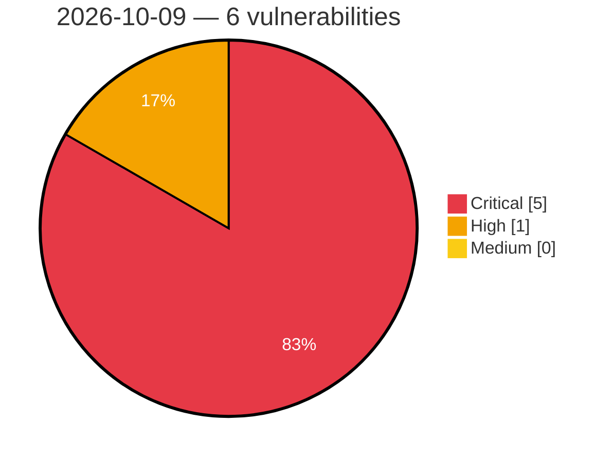

# Critical, High & Medium Severity Vulnerabilities — 2026-10-09

**Source status for this day:**

| Source | Critical | High | Medium | Total |
|--------|---------:|-----:|-------:|------:|
| cvefeed.io (High/Critical) | 5 | 1 | 0 | 6 |

**KEV (actively exploited):** 0  **Watchlist matches:** 3

## Critical (5)

| CVSS | Flags | Source | CVE / Title | Reported |
|------|-------|--------|-------------|----------|
| 9.8 | ⭐ | cvefeed.io (High/Critical) | [CVE-2026-5759 - Double free and use-after-free in FalkorDB RdbLoadDeletedNodes allows remote code execution via crafted RDB](https://cvefeed.io/vuln/detail/CVE-2026-5759) | 59 minutes ago |
| 9.8 | ⭐ | cvefeed.io (High/Critical) | [CVE-2026-107908 - Pre-authentication heap out-of-bounds write in FalkorDB Bolt BoltReadHandler via RESET message](https://cvefeed.io/vuln/detail/CVE-2026-107908) | 1 hour, 8 minutes ago |
| 9.2 | — | cvefeed.io (High/Critical) | [CVE-2026-7827 - Stack-based buffer overflow in FalkorDB _RdbLoadEntity via unbounded property count in crafted RDB](https://cvefeed.io/vuln/detail/CVE-2026-7827) | 59 minutes ago |
| 9.1 | — | cvefeed.io (High/Critical) | [CVE-2026-7826 - Heap out-of-bounds read in FalkorDB BufferSerializerIOv2_ReadBuffer via crafted RDB](https://cvefeed.io/vuln/detail/CVE-2026-7826) | 59 minutes ago |
| 9.1 | — | cvefeed.io (High/Critical) | [CVE-2026-107909 - Pre-authentication heap out-of-bounds write in FalkorDB Bolt WebSocket frame handling via unbounded payload length](https://cvefeed.io/vuln/detail/CVE-2026-107909) | 1 hour, 8 minutes ago |

## High (1)

| CVSS | Flags | Source | CVE / Title | Reported |
|------|-------|--------|-------------|----------|
| 8.1 | ⭐ | cvefeed.io (High/Critical) | [CVE-2026-107910 - Authentication bypass in FalkorDB Bolt endpoint via fail-open AUTH probe error handling](https://cvefeed.io/vuln/detail/CVE-2026-107910) | 1 hour, 8 minutes ago |
