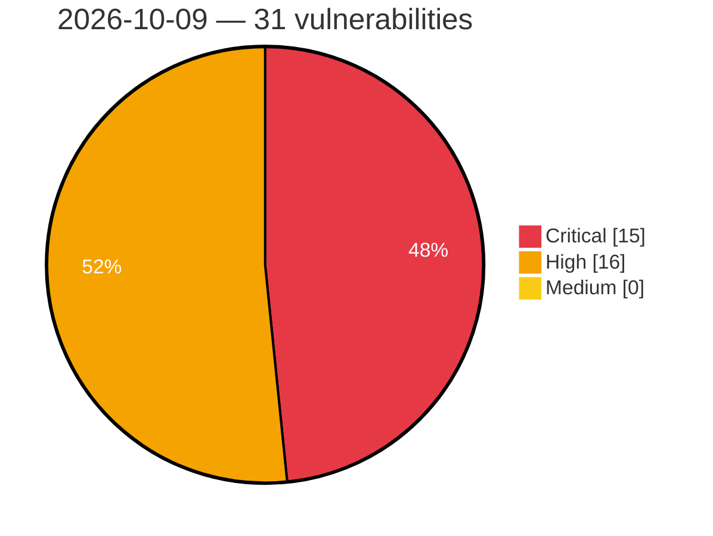

# Critical, High & Medium Severity Vulnerabilities — 2026-10-09

**Source status for this day:**

| Source | Critical | High | Medium | Total |
|--------|---------:|-----:|-------:|------:|
| cvefeed.io (High/Critical) | 15 | 16 | 0 | 31 |

**KEV (actively exploited):** 0  **Watchlist matches:** 23

## Critical (15)

| CVSS | Flags | Source | CVE / Title | Reported |
|------|-------|--------|-------------|----------|
| 10.0 | ⭐ | cvefeed.io (High/Critical) | [CVE-2026-94503 - WordPress Zombify plugin <= 1.7.7 - Arbitrary File Upload vulnerability](https://cvefeed.io/vuln/detail/CVE-2026-94503) | 3 hours, 6 minutes ago |
| 9.8 | ⭐ | cvefeed.io (High/Critical) | [CVE-2026-5759 - Double free and use-after-free in FalkorDB RdbLoadDeletedNodes allows remote code execution via crafted RDB](https://cvefeed.io/vuln/detail/CVE-2026-5759) | 59 minutes ago |
| 9.8 | ⭐ | cvefeed.io (High/Critical) | [CVE-2026-107908 - Pre-authentication heap out-of-bounds write in FalkorDB Bolt BoltReadHandler via RESET message](https://cvefeed.io/vuln/detail/CVE-2026-107908) | 1 hour, 8 minutes ago |
| 9.8 | — | cvefeed.io (High/Critical) | [CVE-2026-86405 - Payment Validation Bypass in Sipay Electronic Money's SanalPos PrestaShop](https://cvefeed.io/vuln/detail/CVE-2026-86405) | 30 minutes ago |
| 9.8 | — | cvefeed.io (High/Critical) | [CVE-2026-85531 - Payment Validation Bypass in Sipay Electronic Money's OpenCart 3.x](https://cvefeed.io/vuln/detail/CVE-2026-85531) | 54 minutes ago |
| 9.3 | ⭐ | cvefeed.io (High/Critical) | [CVE-2026-96809 - WordPress EduAdmin Booking plugin < 6.0.0 - SQL Injection vulnerability](https://cvefeed.io/vuln/detail/CVE-2026-96809) | 3 hours, 6 minutes ago |
| 9.3 | ⭐ | cvefeed.io (High/Critical) | [CVE-2026-96331 - WordPress Ajax Search Pro plugin <= 4.29.1 - SQL Injection vulnerability](https://cvefeed.io/vuln/detail/CVE-2026-96331) | 3 hours, 6 minutes ago |
| 9.3 | ⭐ | cvefeed.io (High/Critical) | [CVE-2026-96330 - WordPress tagDiv Opt-In Builder plugin <= 1.7.6 - SQL Injection vulnerability](https://cvefeed.io/vuln/detail/CVE-2026-96330) | 3 hours, 6 minutes ago |
| 9.3 | ⭐ | cvefeed.io (High/Critical) | [CVE-2026-96328 - WordPress JNews - Pay Writer plugin <= 12.0.1 - SQL Injection vulnerability](https://cvefeed.io/vuln/detail/CVE-2026-96328) | 3 hours, 6 minutes ago |
| 9.3 | ⭐ | cvefeed.io (High/Critical) | [CVE-2026-96327 - WordPress WPLMS plugin < 1.9.9.8.2 - SQL Injection vulnerability](https://cvefeed.io/vuln/detail/CVE-2026-96327) | 3 hours, 6 minutes ago |
| 9.3 | ⭐ | cvefeed.io (High/Critical) | [CVE-2026-93947 - WordPress Traveler theme <= 3.2.9 - SQL Injection vulnerability](https://cvefeed.io/vuln/detail/CVE-2026-93947) | 3 hours, 6 minutes ago |
| 9.3 | ⭐ | cvefeed.io (High/Critical) | [CVE-2026-107935 - Gvisor-tap-vsock: gvisor-tap-vsock: unathenticated arbitrary file deletion on the host via /expose](https://cvefeed.io/vuln/detail/CVE-2026-107935) | 3 hours, 6 minutes ago |
| 9.2 | — | cvefeed.io (High/Critical) | [CVE-2026-7827 - Stack-based buffer overflow in FalkorDB _RdbLoadEntity via unbounded property count in crafted RDB](https://cvefeed.io/vuln/detail/CVE-2026-7827) | 59 minutes ago |
| 9.1 | — | cvefeed.io (High/Critical) | [CVE-2026-7826 - Heap out-of-bounds read in FalkorDB BufferSerializerIOv2_ReadBuffer via crafted RDB](https://cvefeed.io/vuln/detail/CVE-2026-7826) | 59 minutes ago |
| 9.1 | — | cvefeed.io (High/Critical) | [CVE-2026-107909 - Pre-authentication heap out-of-bounds write in FalkorDB Bolt WebSocket frame handling via unbounded payload length](https://cvefeed.io/vuln/detail/CVE-2026-107909) | 1 hour, 8 minutes ago |

## High (16)

| CVSS | Flags | Source | CVE / Title | Reported |
|------|-------|--------|-------------|----------|
| 8.8 | ⭐ | cvefeed.io (High/Critical) | [CVE-2026-103413 - Apache Camel Karavan: unvalidated Kubernetes resources applied from a project's kubernetes.yaml](https://cvefeed.io/vuln/detail/CVE-2026-103413) | 29 minutes ago |
| 8.8 | ⭐ | cvefeed.io (High/Critical) | [CVE-2026-103412 - Apache Camel Karavan: project file name path traversal when committing a project to Git](https://cvefeed.io/vuln/detail/CVE-2026-103412) | 29 minutes ago |
| 8.8 | ⭐ | cvefeed.io (High/Critical) | [CVE-2026-104392 - WordPress Quiz And Survey Master plugin <= 11.2.7 - PHP Object Injection vulnerability](https://cvefeed.io/vuln/detail/CVE-2026-104392) | 1 hour, 14 minutes ago |
| 8.8 | ⭐ | cvefeed.io (High/Critical) | [CVE-2026-96671 - WordPress Featured Image from URL plugin <= 6.0.7 - Cross Site Request Forgery (CSRF) vulnerability](https://cvefeed.io/vuln/detail/CVE-2026-96671) | 3 hours, 6 minutes ago |
| 8.8 | ⭐ | cvefeed.io (High/Critical) | [CVE-2026-19570 - Out-of-bounds write in LE Audio Broadcast Sink when copying BASE subgroup metadata into the BASS receive state](https://cvefeed.io/vuln/detail/CVE-2026-19570) | 5 hours, 6 minutes ago |
| 8.8 | ⭐ | cvefeed.io (High/Critical) | [CVE-2026-19569 - Integer overflow in dynamic kernel object allocation allows user-mode threads to corrupt the kernel heap](https://cvefeed.io/vuln/detail/CVE-2026-19569) | 5 hours, 6 minutes ago |
| 8.5 | ⭐ | cvefeed.io (High/Critical) | [CVE-2026-8374 - Misuse and Misconfiguration of Cryptographic Algorithm in Bluetooth Communication](https://cvefeed.io/vuln/detail/CVE-2026-8374) | 1 hour, 13 minutes ago |
| 8.5 | ⭐ | cvefeed.io (High/Critical) | [CVE-2026-96329 - WordPress tagDiv Opt-In Builder plugin <= 1.7.6 - SQL Injection vulnerability](https://cvefeed.io/vuln/detail/CVE-2026-96329) | 3 hours, 6 minutes ago |
| 8.5 | ⭐ | cvefeed.io (High/Critical) | [CVE-2026-95610 - WordPress UpSolution Core plugin <= 9.3 - SQL Injection vulnerability](https://cvefeed.io/vuln/detail/CVE-2026-95610) | 3 hours, 6 minutes ago |
| 8.5 | ⭐ | cvefeed.io (High/Critical) | [CVE-2026-95607 - WordPress WPLMS  theme <= 4.973 - SQL Injection vulnerability](https://cvefeed.io/vuln/detail/CVE-2026-95607) | 3 hours, 6 minutes ago |
| 8.5 | ⭐ | cvefeed.io (High/Critical) | [CVE-2026-95599 - WordPress Taskbuilder plugin <= 6.0.5 - SQL Injection vulnerability](https://cvefeed.io/vuln/detail/CVE-2026-95599) | 3 hours, 6 minutes ago |
| 8.5 | ⭐ | cvefeed.io (High/Critical) | [CVE-2026-94663 - WordPress ProfileGrid plugin <= 6.0.0.2 - SQL Injection vulnerability](https://cvefeed.io/vuln/detail/CVE-2026-94663) | 3 hours, 6 minutes ago |
| 8.2 | — | cvefeed.io (High/Critical) | [CVE-2026-71884 - Packet CTR reports a full success length after the counter is exhausted](https://cvefeed.io/vuln/detail/CVE-2026-71884) | 3 hours, 6 minutes ago |
| 8.2 | — | cvefeed.io (High/Critical) | [CVE-2026-104635 - Uncontrolled recursion in elixir-protobuf/protobuf JSON decoding of self-referential messages](https://cvefeed.io/vuln/detail/CVE-2026-104635) | 4 hours, 5 minutes ago |
| 8.1 | ⭐ | cvefeed.io (High/Critical) | [CVE-2026-107910 - Authentication bypass in FalkorDB Bolt endpoint via fail-open AUTH probe error handling](https://cvefeed.io/vuln/detail/CVE-2026-107910) | 1 hour, 8 minutes ago |
| 8.1 | — | cvefeed.io (High/Critical) | [CVE-2026-94062 - WordPress Werkstatt theme <= 4.8.3 - Local File Inclusion vulnerability](https://cvefeed.io/vuln/detail/CVE-2026-94062) | 22 minutes ago |
