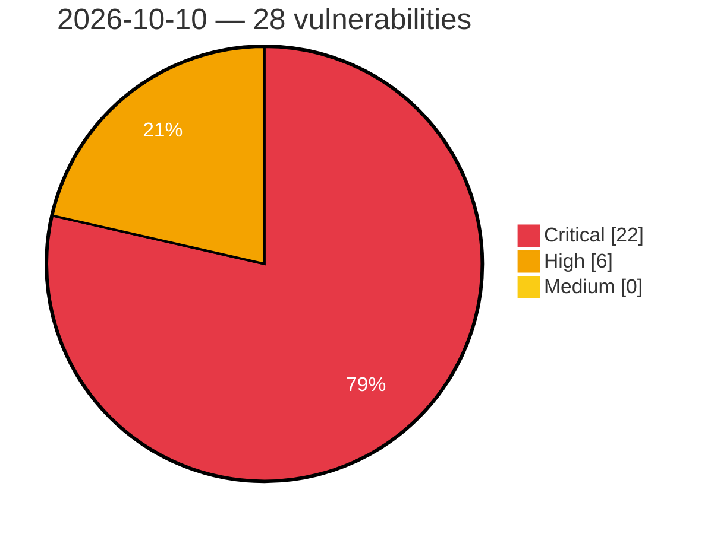

# Critical, High & Medium Severity Vulnerabilities — 2026-10-10

**Source status for this day:**

| Source | Critical | High | Medium | Total |
|--------|---------:|-----:|-------:|------:|
| cvefeed.io (High/Critical) | 22 | 6 | 0 | 28 |

**KEV (actively exploited):** 0  **Watchlist matches:** 27

## Critical (22)

| CVSS | Flags | Source | CVE / Title | Reported |
|------|-------|--------|-------------|----------|
| 9.8 | ⭐ | cvefeed.io (High/Critical) | [CVE-2026-108474 - JetBrains Exposed SQL Injection](https://cvefeed.io/vuln/detail/CVE-2026-108474) | 1 hour, 33 minutes ago |
| 9.8 | ⭐ | cvefeed.io (High/Critical) | [CVE-2026-93945 - WordPress Balance theme <= 1.12.0 - PHP Object Injection vulnerability](https://cvefeed.io/vuln/detail/CVE-2026-93945) | 1 hour, 6 minutes ago |
| 9.8 | ⭐ | cvefeed.io (High/Critical) | [CVE-2026-93944 - WordPress Camelia theme <= 1.2.15 - PHP Object Injection vulnerability](https://cvefeed.io/vuln/detail/CVE-2026-93944) | 1 hour, 6 minutes ago |
| 9.8 | ⭐ | cvefeed.io (High/Critical) | [CVE-2026-93943 - WordPress Convex theme <= 1.16.0 - PHP Object Injection vulnerability](https://cvefeed.io/vuln/detail/CVE-2026-93943) | 1 hour, 6 minutes ago |
| 9.8 | ⭐ | cvefeed.io (High/Critical) | [CVE-2026-93942 - WordPress Dwell theme <= 1.16.0 - PHP Object Injection vulnerability](https://cvefeed.io/vuln/detail/CVE-2026-93942) | 1 hour, 6 minutes ago |
| 9.8 | ⭐ | cvefeed.io (High/Critical) | [CVE-2026-93941 - WordPress Edema theme <= 1.2.2.2 - PHP Object Injection vulnerability](https://cvefeed.io/vuln/detail/CVE-2026-93941) | 1 hour, 6 minutes ago |
| 9.8 | ⭐ | cvefeed.io (High/Critical) | [CVE-2026-93940 - WordPress Greeny theme <= 2.10.0 - PHP Object Injection vulnerability](https://cvefeed.io/vuln/detail/CVE-2026-93940) | 1 hour, 6 minutes ago |
| 9.8 | ⭐ | cvefeed.io (High/Critical) | [CVE-2026-93938 - WordPress Hogwords theme <= 1.2.7 - PHP Object Injection vulnerability](https://cvefeed.io/vuln/detail/CVE-2026-93938) | 1 hour, 6 minutes ago |
| 9.8 | ⭐ | cvefeed.io (High/Critical) | [CVE-2026-93937 - WordPress Hygia theme <= 1.21.0 - PHP Object Injection vulnerability](https://cvefeed.io/vuln/detail/CVE-2026-93937) | 1 hour, 6 minutes ago |
| 9.8 | ⭐ | cvefeed.io (High/Critical) | [CVE-2026-93936 - WordPress IPharm theme <= 1.2.4 - PHP Object Injection vulnerability](https://cvefeed.io/vuln/detail/CVE-2026-93936) | 1 hour, 6 minutes ago |
| 9.8 | ⭐ | cvefeed.io (High/Critical) | [CVE-2026-93935 - WordPress Let's Play theme <= 1.1.15 - PHP Object Injection vulnerability](https://cvefeed.io/vuln/detail/CVE-2026-93935) | 1 hour, 6 minutes ago |
| 9.8 | ⭐ | cvefeed.io (High/Critical) | [CVE-2026-93934 - WordPress Partiso theme <= 1.1.13 - PHP Object Injection vulnerability](https://cvefeed.io/vuln/detail/CVE-2026-93934) | 1 hour, 6 minutes ago |
| 9.8 | ⭐ | cvefeed.io (High/Critical) | [CVE-2026-93933 - WordPress Rosalinda theme <= 1.2.4 - PHP Object Injection vulnerability](https://cvefeed.io/vuln/detail/CVE-2026-93933) | 1 hour, 6 minutes ago |
| 9.8 | ⭐ | cvefeed.io (High/Critical) | [CVE-2026-93932 - WordPress Smart Casa theme <= 1.0.12 - PHP Object Injection vulnerability](https://cvefeed.io/vuln/detail/CVE-2026-93932) | 1 hour, 6 minutes ago |
| 9.8 | ⭐ | cvefeed.io (High/Critical) | [CVE-2026-93931 - WordPress Smash theme <= 1.12.0 - PHP Object Injection vulnerability](https://cvefeed.io/vuln/detail/CVE-2026-93931) | 1 hour, 6 minutes ago |
| 9.8 | ⭐ | cvefeed.io (High/Critical) | [CVE-2026-93930 - WordPress Tantra theme <= 2.9.0 - PHP Object Injection vulnerability](https://cvefeed.io/vuln/detail/CVE-2026-93930) | 1 hour, 6 minutes ago |
| 9.8 | ⭐ | cvefeed.io (High/Critical) | [CVE-2026-93929 - WordPress Travesia theme <= 1.1.16 - PHP Object Injection vulnerability](https://cvefeed.io/vuln/detail/CVE-2026-93929) | 1 hour, 6 minutes ago |
| 9.8 | ⭐ | cvefeed.io (High/Critical) | [CVE-2026-93927 - WordPress Veto theme <= 1.6.0 - PHP Object Injection vulnerability](https://cvefeed.io/vuln/detail/CVE-2026-93927) | 1 hour, 6 minutes ago |
| 9.8 | ⭐ | cvefeed.io (High/Critical) | [CVE-2026-62046 - WordPress Gutentype theme <= 2.1.12 - PHP Object Injection vulnerability](https://cvefeed.io/vuln/detail/CVE-2026-62046) | 1 hour, 6 minutes ago |
| 9.8 | ⭐ | cvefeed.io (High/Critical) | [CVE-2026-62045 - WordPress Booklovers theme <= 2.13.0 - PHP Object Injection vulnerability](https://cvefeed.io/vuln/detail/CVE-2026-62045) | 1 hour, 6 minutes ago |
| 9.8 | ⭐ | cvefeed.io (High/Critical) | [CVE-2026-104803 - WPCOM Member <= 1.7.27 - Unauthenticated Authentication Bypass via 'uuid' and 'code' Parameters on Social-Login Callback](https://cvefeed.io/vuln/detail/CVE-2026-104803) | 1 hour, 6 minutes ago |
| 9.1 | ⭐ | cvefeed.io (High/Critical) | [CVE-2026-104801 - PPOM <= 34.0.10 - Unauthenticated Arbitrary File Deletion via 'ppom[fields][<data_name>][n][org]' Parameter](https://cvefeed.io/vuln/detail/CVE-2026-104801) | 2 hours, 6 minutes ago |

## High (6)

| CVSS | Flags | Source | CVE / Title | Reported |
|------|-------|--------|-------------|----------|
| 8.8 | ⭐ | cvefeed.io (High/Critical) | [CVE-2026-83526 - FV Player 8 <= 8.1.7 - Authenticated (Subscriber+) Arbitrary File Upload via videos[].fv_wp_flowplayer_field_src Parameter](https://cvefeed.io/vuln/detail/CVE-2026-83526) | 3 hours, 6 minutes ago |
| 8.1 | ⭐ | cvefeed.io (High/Critical) | [CVE-2026-104759 - WPO365 \| SEAMLESS WORDPRESS + MICROSOFT INTEGRATION (WPO365 \| LOGIN) <= 44.1 - Unauthenticated Authentication Bypass via OIDC Nonce Replay via id_token Nonce Verification](https://cvefeed.io/vuln/detail/CVE-2026-104759) | 1 hour, 6 minutes ago |
| 8.1 | — | cvefeed.io (High/Critical) | [CVE-2026-94538 - WP File Download <= 6.3.9 - Missing Authorization to Authenticated (Subscriber+) Arbitrary File Deletion/Modification via 'task' Parameter to Multiple Functions](https://cvefeed.io/vuln/detail/CVE-2026-94538) | 2 hours, 6 minutes ago |
| 8.1 | ⭐ | cvefeed.io (High/Critical) | [CVE-2026-92975 - Groundhogg <= 4.8.3 - Unauthenticated Privilege Escalation to Support User Identity Confusion](https://cvefeed.io/vuln/detail/CVE-2026-92975) | 3 hours, 6 minutes ago |
| 8.1 | ⭐ | cvefeed.io (High/Critical) | [CVE-2026-94257 - SMS Alert 3.9.6 - 4.0.0 - Unauthenticated Privilege Escalation via Arbitrary Password Reset](https://cvefeed.io/vuln/detail/CVE-2026-94257) | 7 hours, 14 minutes ago |
| 8.1 | ⭐ | cvefeed.io (High/Critical) | [CVE-2026-94256 - SMS Alert 4.0.0 - Unauthenticated Authentication Bypass via Login with OTP](https://cvefeed.io/vuln/detail/CVE-2026-94256) | 7 hours, 14 minutes ago |
