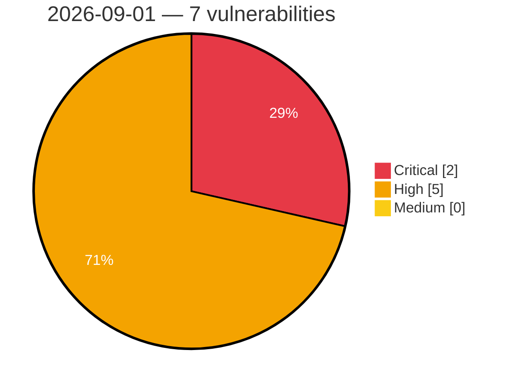

# Critical, High & Medium Severity Vulnerabilities — 2026-09-01

**Source status for this day:**

| Source | Critical | High | Medium | Total |
|--------|---------:|-----:|-------:|------:|
| cvefeed.io (High/Critical) | 2 | 5 | 0 | 7 |

**KEV (actively exploited):** 0  **Watchlist matches:** 7

## Critical (2)

| CVSS | Flags | Source | CVE / Title | Reported |
|------|-------|--------|-------------|----------|
| 9.8 | ⭐ | cvefeed.io (High/Critical) | [CVE-2026-75865 - WPLP Cookie Consent <= 4.4.1 - Unauthenticated Arbitrary File Upload via 'upload-logo' REST Endpoint](https://cvefeed.io/vuln/detail/CVE-2026-75865) | 2 hours, 53 minutes ago |
| 9.0 | ⭐ | cvefeed.io (High/Critical) | [CVE-2026-67394 - Plesk for Linux OS Command Injection Privilege Escalation](https://cvefeed.io/vuln/detail/CVE-2026-67394) | 2 hours, 53 minutes ago |

## High (5)

| CVSS | Flags | Source | CVE / Title | Reported |
|------|-------|--------|-------------|----------|
| 8.8 | ⭐ | cvefeed.io (High/Critical) | [CVE-2026-19806 - Support Genix <= 1.4.52 - Authenticated (Subscriber+) Authentication Bypass to Administrator Account Takeover via 'p' Parameter Forged Guest Token](https://cvefeed.io/vuln/detail/CVE-2026-19806) | 53 minutes ago |
| 8.7 | ⭐ | cvefeed.io (High/Critical) | [CVE-2026-74837 - Unbounded atom creation from client-supplied RPC field names in AshTypescript field formatter](https://cvefeed.io/vuln/detail/CVE-2026-74837) | 2 hours, 53 minutes ago |
| 8.7 | ⭐ | cvefeed.io (High/Critical) | [CVE-2026-65643 - cPanel Eval Injection Remote Code Execution](https://cvefeed.io/vuln/detail/CVE-2026-65643) | 2 hours, 53 minutes ago |
| 8.2 | ⭐ | cvefeed.io (High/Critical) | [CVE-2026-82730 - Authorization-redacted field values disclosed through AshTypescript result normalization](https://cvefeed.io/vuln/detail/CVE-2026-82730) | 2 hours, 53 minutes ago |
| 8.2 | ⭐ | cvefeed.io (High/Critical) | [CVE-2026-77856 - Unbounded atom creation from typed struct field names in AshTypescript field selector](https://cvefeed.io/vuln/detail/CVE-2026-77856) | 2 hours, 53 minutes ago |
