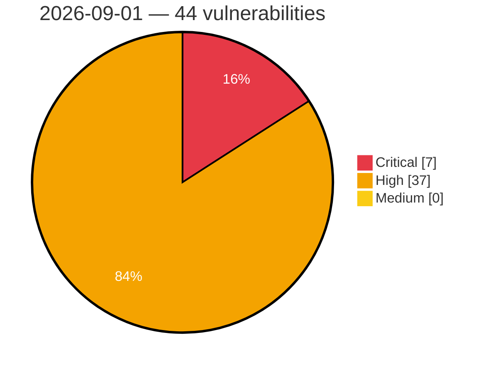

# Critical, High & Medium Severity Vulnerabilities — 2026-09-01

**Source status for this day:**

| Source | Critical | High | Medium | Total |
|--------|---------:|-----:|-------:|------:|
| cvefeed.io (High/Critical) | 7 | 37 | 0 | 44 |

**KEV (actively exploited):** 0  **Watchlist matches:** 25

## Critical (7)

| CVSS | Flags | Source | CVE / Title | Reported |
|------|-------|--------|-------------|----------|
| 9.9 | ⭐ | cvefeed.io (High/Critical) | [CVE-2026-83772 - Cobham SATCOM VSAT7090 Maritime Satellite Router JSON Parsing mail-report.sh c_set_reports_decode command injection](https://cvefeed.io/vuln/detail/CVE-2026-83772) | 4 hours, 9 minutes ago |
| 9.8 | ⭐ | cvefeed.io (High/Critical) | [CVE-2026-75865 - WPLP Cookie Consent <= 4.4.1 - Unauthenticated Arbitrary File Upload via 'upload-logo' REST Endpoint](https://cvefeed.io/vuln/detail/CVE-2026-75865) | 2 hours, 53 minutes ago |
| 9.8 | — | cvefeed.io (High/Critical) | [CVE-2026-78012 - Stack-based Buffer Overflow in Pyramid Solutions NetStaX EtherNet/IP Stack](https://cvefeed.io/vuln/detail/CVE-2026-78012) | 1 hour, 8 minutes ago |
| 9.3 | — | cvefeed.io (High/Critical) | [CVE-2026-78319 - TOCTOU Vulnerability in file exchange](https://cvefeed.io/vuln/detail/CVE-2026-78319) | 3 hours, 9 minutes ago |
| 9.1 | — | cvefeed.io (High/Critical) | [CVE-2026-18931 - Hardcoded Credentials in TMT Machine's Talassoft Industrial Management Software](https://cvefeed.io/vuln/detail/CVE-2026-18931) | 3 hours ago |
| 9.0 | ⭐ | cvefeed.io (High/Critical) | [CVE-2026-67394 - Plesk for Linux OS Command Injection Privilege Escalation](https://cvefeed.io/vuln/detail/CVE-2026-67394) | 2 hours, 53 minutes ago |
| 9.0 | — | cvefeed.io (High/Critical) | [CVE-2026-79687 - Dell PowerStore Missing Authentication for Critical Function Vulnerability](https://cvefeed.io/vuln/detail/CVE-2026-79687) | 27 minutes ago |

## High (37)

| CVSS | Flags | Source | CVE / Title | Reported |
|------|-------|--------|-------------|----------|
| 8.8 | ⭐ | cvefeed.io (High/Critical) | [CVE-2026-19806 - Support Genix <= 1.4.52 - Authenticated (Subscriber+) Authentication Bypass to Administrator Account Takeover via 'p' Parameter Forged Guest Token](https://cvefeed.io/vuln/detail/CVE-2026-19806) | 53 minutes ago |
| 8.8 | ⭐ | cvefeed.io (High/Critical) | [CVE-2026-59681 - yast2-auth-client: OS command injection via unsanitized Organizational Unit / dnsHostName in AD join](https://cvefeed.io/vuln/detail/CVE-2026-59681) | 47 minutes ago |
| 8.8 | ⭐ | cvefeed.io (High/Critical) | [CVE-2026-58567 - Dell PowerStore OS Command Injection Vulnerability](https://cvefeed.io/vuln/detail/CVE-2026-58567) | 43 minutes ago |
| 8.8 | ⭐ | cvefeed.io (High/Critical) | [CVE-2026-79682 - Dell PowerStore Command Injection Vulnerability](https://cvefeed.io/vuln/detail/CVE-2026-79682) | 55 minutes ago |
| 8.8 | ⭐ | cvefeed.io (High/Critical) | [CVE-2026-84202 - ModelScope through 1.40.0 Unsafe YAML Deserialization in Model Config Loading](https://cvefeed.io/vuln/detail/CVE-2026-84202) | 1 hour, 7 minutes ago |
| 8.8 | ⭐ | cvefeed.io (High/Critical) | [CVE-2026-79686 - Dell PowerStore Privilege Escalation Vulnerability](https://cvefeed.io/vuln/detail/CVE-2026-79686) | 1 hour, 8 minutes ago |
| 8.8 | — | cvefeed.io (High/Critical) | [CVE-2026-58566 - Dell PowerStore Incorrect Authorization Vulnerability](https://cvefeed.io/vuln/detail/CVE-2026-58566) | 1 hour, 59 minutes ago |
| 8.8 | — | cvefeed.io (High/Critical) | [CVE-2026-84268 - Gvfs: sftp: heap-based buffer overflow in read_reply()](https://cvefeed.io/vuln/detail/CVE-2026-84268) | 2 hours, 59 minutes ago |
| 8.8 | ⭐ | cvefeed.io (High/Critical) | [CVE-2026-10195 - FS Poster <= 8.0.1 - Authenticated (Subscriber+) Remote Code Execution via FFmpeg Path Setting](https://cvefeed.io/vuln/detail/CVE-2026-10195) | 3 hours ago |
| 8.7 | ⭐ | cvefeed.io (High/Critical) | [CVE-2026-74837 - Unbounded atom creation from client-supplied RPC field names in AshTypescript field formatter](https://cvefeed.io/vuln/detail/CVE-2026-74837) | 2 hours, 53 minutes ago |
| 8.7 | ⭐ | cvefeed.io (High/Critical) | [CVE-2026-65643 - cPanel Eval Injection Remote Code Execution](https://cvefeed.io/vuln/detail/CVE-2026-65643) | 2 hours, 53 minutes ago |
| 8.7 | — | cvefeed.io (High/Critical) | [CVE-2026-83619 - xmldom: End-tag Whitespace-Trim Regex ReDoS — quadratic backtracking in the 0.8.x end-tag parser](https://cvefeed.io/vuln/detail/CVE-2026-83619) | 1 hour, 8 minutes ago |
| 8.7 | — | cvefeed.io (High/Critical) | [CVE-2026-83618 - xmldom: requireWellFormed DocType publicId/systemId validation is bypassable via an embedded line terminator](https://cvefeed.io/vuln/detail/CVE-2026-83618) | 1 hour, 8 minutes ago |
| 8.7 | — | cvefeed.io (High/Critical) | [CVE-2026-83617 - xmldom: requireWellFormed element/attribute name validation is bypassable via an embedded line terminator](https://cvefeed.io/vuln/detail/CVE-2026-83617) | 1 hour, 8 minutes ago |
| 8.7 | — | cvefeed.io (High/Critical) | [CVE-2026-83616 - xmldom: Processing Instruction Target Injection Bypasses requireWellFormed](https://cvefeed.io/vuln/detail/CVE-2026-83616) | 1 hour, 8 minutes ago |
| 8.7 | — | cvefeed.io (High/Critical) | [CVE-2026-83615 - xmldom: Quadratic-memory consumption](https://cvefeed.io/vuln/detail/CVE-2026-83615) | 1 hour, 8 minutes ago |
| 8.7 | — | cvefeed.io (High/Critical) | [CVE-2026-83614 - xmldom: Quadratic-time parsing via the malformed-input recovery path — `parseElementStartPart` re-scan and `normalize()` adjacent-text merge](https://cvefeed.io/vuln/detail/CVE-2026-83614) | 1 hour, 8 minutes ago |
| 8.7 | — | cvefeed.io (High/Critical) | [CVE-2026-83613 - xmldom: Quadratic-time attribute deduplication](https://cvefeed.io/vuln/detail/CVE-2026-83613) | 1 hour, 8 minutes ago |
| 8.7 | — | cvefeed.io (High/Critical) | [CVE-2026-83612 - xmldom: HTML raw-text closing-tag case mismatch causes output amplification](https://cvefeed.io/vuln/detail/CVE-2026-83612) | 1 hour, 8 minutes ago |
| 8.7 | — | cvefeed.io (High/Critical) | [CVE-2026-83609 - xmldom: Creation-time XML Name/QName validation is bypassable via an embedded line terminator, allowing injection on the default serialization path](https://cvefeed.io/vuln/detail/CVE-2026-83609) | 1 hour, 8 minutes ago |
| 8.7 | ⭐ | cvefeed.io (High/Critical) | [CVE-2026-83608 - xmldom: DocType `name` Injection Bypasses requireWellFormed](https://cvefeed.io/vuln/detail/CVE-2026-83608) | 1 hour, 8 minutes ago |
| 8.7 | ⭐ | cvefeed.io (High/Critical) | [CVE-2026-83607 - xmldom: Element name injection via createElement() bypasses requireWellFormed](https://cvefeed.io/vuln/detail/CVE-2026-83607) | 1 hour, 8 minutes ago |
| 8.7 | ⭐ | cvefeed.io (High/Critical) | [CVE-2026-83606 - xmldom PI grammar regex ReDoS: quadratic backtracking on unterminated processing instructions](https://cvefeed.io/vuln/detail/CVE-2026-83606) | 1 hour, 8 minutes ago |
| 8.7 | — | cvefeed.io (High/Critical) | [CVE-2026-83605 - xmldom: Attribute name injection via setAttribute() bypasses requireWellFormed](https://cvefeed.io/vuln/detail/CVE-2026-83605) | 1 hour, 8 minutes ago |
| 8.7 | ⭐ | cvefeed.io (High/Critical) | [CVE-2026-74835 - inets,httpd: Memory Exhaustion via Unenforced max_body_size During Chunked Body Reception](https://cvefeed.io/vuln/detail/CVE-2026-74835) | 1 hour, 8 minutes ago |
| 8.7 | ⭐ | cvefeed.io (High/Critical) | [CVE-2024-7953 - DataEdgePlatform DataMosaix™ Private Cloud](https://cvefeed.io/vuln/detail/CVE-2024-7953) | 59 minutes ago |
| 8.7 | ⭐ | cvefeed.io (High/Critical) | [CVE-2024-7952 - DataEdgePlatform DataMosaix™ Private Cloud](https://cvefeed.io/vuln/detail/CVE-2024-7952) | 59 minutes ago |
| 8.6 | ⭐ | cvefeed.io (High/Critical) | [CVE-2026-59680 - yast2-users: OS command injection via LDAP-supplied shadowLastChange/shadowExpire attribute](https://cvefeed.io/vuln/detail/CVE-2026-59680) | 1 hour, 5 minutes ago |
| 8.6 | — | cvefeed.io (High/Critical) | [CVE-2026-84203 - Memos 0.26.0 through 0.30.0 Insufficient Session Expiration on Password Change](https://cvefeed.io/vuln/detail/CVE-2026-84203) | 1 hour, 7 minutes ago |
| 8.5 | ⭐ | cvefeed.io (High/Critical) | [CVE-2026-83551 - Cleartext storage of HMAC signing key in Amazon SageMaker Python SDK @step/@remote pipeline path](https://cvefeed.io/vuln/detail/CVE-2026-83551) | 1 hour, 6 minutes ago |
| 8.3 | ⭐ | cvefeed.io (High/Critical) | [CVE-2026-84115 - Cleo Harmony JWT Refresh Token connections privileges management](https://cvefeed.io/vuln/detail/CVE-2026-84115) | 1 hour, 8 minutes ago |
| 8.3 | — | cvefeed.io (High/Critical) | [CVE-2026-73812 - inets, httpd: HTTP Request Smuggling via Transfer-Encoding and Content-Length](https://cvefeed.io/vuln/detail/CVE-2026-73812) | 1 hour, 8 minutes ago |
| 8.3 | — | cvefeed.io (High/Critical) | [CVE-2026-73276 - inets, httpd: HTTP Request Smuggling via Whitespace-Before-Colon Header Dropping i](https://cvefeed.io/vuln/detail/CVE-2026-73276) | 1 hour, 8 minutes ago |
| 8.3 | ⭐ | cvefeed.io (High/Critical) | [CVE-2026-8712 - Wyoming < 1.10.2 SSRF via uri Query Parameter](https://cvefeed.io/vuln/detail/CVE-2026-8712) | 1 hour, 8 minutes ago |
| 8.2 | ⭐ | cvefeed.io (High/Critical) | [CVE-2026-82730 - Authorization-redacted field values disclosed through AshTypescript result normalization](https://cvefeed.io/vuln/detail/CVE-2026-82730) | 2 hours, 53 minutes ago |
| 8.2 | ⭐ | cvefeed.io (High/Critical) | [CVE-2026-77856 - Unbounded atom creation from typed struct field names in AshTypescript field selector](https://cvefeed.io/vuln/detail/CVE-2026-77856) | 2 hours, 53 minutes ago |
| 8.2 | ⭐ | cvefeed.io (High/Critical) | [CVE-2026-75538 - A Signed Length Overflow in Erlang/OTP's inet TCP Driver Overflows the Receive Buffer Into BEAM VM Memory From an Unauthenticated Peer](https://cvefeed.io/vuln/detail/CVE-2026-75538) | 1 hour, 8 minutes ago |
