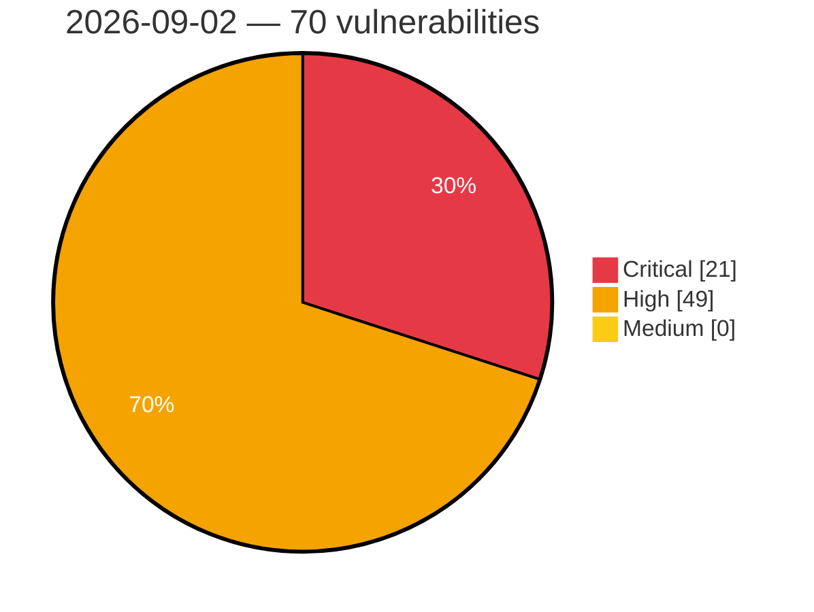

# Critical, High & Medium Severity Vulnerabilities — 2026-09-02

**Source status for this day:**

| Source | Critical | High | Medium | Total |
|--------|---------:|-----:|-------:|------:|
| cvefeed.io (High/Critical) | 21 | 49 | 0 | 70 |

**KEV (actively exploited):** 0  **Watchlist matches:** 53

## Critical (21)

| CVSS | Flags | Source | CVE / Title | Reported |
|------|-------|--------|-------------|----------|
| 10.0 | ⭐ | cvefeed.io (High/Critical) | [CVE-2026-4357 - Embed HTML5 Game <= 1.3 - Unauthenticated Arbitrary File Upload](https://cvefeed.io/vuln/detail/CVE-2026-4357) | 18 minutes ago |
| 9.9 | ⭐ | cvefeed.io (High/Critical) | [CVE-2026-77009 - WatchMan-Site7 3.1.1 - 4.2.0 - Subscriber+ RCE via Debug Console](https://cvefeed.io/vuln/detail/CVE-2026-77009) | 18 minutes ago |
| 9.8 | ⭐ | cvefeed.io (High/Critical) | [CVE-2026-78657 - SigmaForms Pro <= 1.4.11 - Unauthenticated Arbitrary File Deletion via Path Traversal in File Upload Field](https://cvefeed.io/vuln/detail/CVE-2026-78657) | 2 hours, 24 minutes ago |
| 9.8 | ⭐ | cvefeed.io (High/Critical) | [CVE-2026-9055 - Booking for Appointments and Events Calendar – Amelia (Premium) 8.0 - 9.6.2 - Unauthenticated Privilege Escalation to Administrator via 'externalId'](https://cvefeed.io/vuln/detail/CVE-2026-9055) | 3 hours, 24 minutes ago |
| 9.8 | ⭐ | cvefeed.io (High/Critical) | [CVE-2026-84795 - Craft CMS before 5.10.11 Authentication Bypass via Admin Flag Inheritance](https://cvefeed.io/vuln/detail/CVE-2026-84795) | 24 minutes ago |
| 9.8 | ⭐ | cvefeed.io (High/Critical) | [CVE-2026-81294 - WordPress Authorizer plugin <= 3.15.1 - Privilege Escalation vulnerability](https://cvefeed.io/vuln/detail/CVE-2026-81294) | 24 minutes ago |
| 9.8 | ⭐ | cvefeed.io (High/Critical) | [CVE-2025-9314 - Developer Tools <= 1.1.3 – Unauthenticated Arbitrary File Upload](https://cvefeed.io/vuln/detail/CVE-2025-9314) | 18 minutes ago |
| 9.8 | ⭐ | cvefeed.io (High/Critical) | [CVE-2026-20279 - Cisco IOS XR Software Improper Access Control Vulnerability](https://cvefeed.io/vuln/detail/CVE-2026-20279) | 1 hour, 42 minutes ago |
| 9.8 | ⭐ | cvefeed.io (High/Critical) | [CVE-2026-20274 - Cisco IOS XR Software Improper Resource Control Vulnerability](https://cvefeed.io/vuln/detail/CVE-2026-20274) | 1 hour, 42 minutes ago |
| 9.8 | ⭐ | cvefeed.io (High/Critical) | [CVE-2026-20212 - Cisco Nexus 9000 Series Switches Silicon One Remote Code Execution Vulnerability](https://cvefeed.io/vuln/detail/CVE-2026-20212) | 1 hour, 42 minutes ago |
| 9.8 | ⭐ | cvefeed.io (High/Critical) | [CVE-2026-19117 - FIDO2 Authentication Bypass Vulnerability](https://cvefeed.io/vuln/detail/CVE-2026-19117) | 1 hour, 29 minutes ago |
| 9.6 | ⭐ | cvefeed.io (High/Critical) | [CVE-2026-53649 - Joro Cross-Origin Remote Code Execution Vulnerability](https://cvefeed.io/vuln/detail/CVE-2026-53649) | 39 minutes ago |
| 9.3 | ⭐ | cvefeed.io (High/Critical) | [CVE-2026-84699 - Team Password Manager before 14.184.308 Authentication Bypass in Password Reset](https://cvefeed.io/vuln/detail/CVE-2026-84699) | 2 hours, 53 minutes ago |
| 9.3 | — | cvefeed.io (High/Critical) | [CVE-2026-84696 - Phison PS3111-S11 Controller Firmware Missing Authentication on Vendor Unique Commands](https://cvefeed.io/vuln/detail/CVE-2026-84696) | 2 hours, 53 minutes ago |
| 9.3 | ⭐ | cvefeed.io (High/Critical) | [CVE-2026-84695 - BookStack before 26.05.4 Stored XSS via Drawing Upload](https://cvefeed.io/vuln/detail/CVE-2026-84695) | 2 hours, 53 minutes ago |
| 9.3 | ⭐ | cvefeed.io (High/Critical) | [CVE-2026-81286 - WordPress WCFM Marketplace plugin <= 3.8.1 - SQL Injection vulnerability](https://cvefeed.io/vuln/detail/CVE-2026-81286) | 24 minutes ago |
| 9.3 | — | cvefeed.io (High/Critical) | [CVE-2026-53671 - PREVAIL eBPF Verifier Context Pointer Write Out-of-Bounds Access](https://cvefeed.io/vuln/detail/CVE-2026-53671) | 39 minutes ago |
| 9.3 | — | cvefeed.io (High/Critical) | [CVE-2026-53670 - Prevail eBPF Verifier Out-of-Bounds Memory Access Vulnerability](https://cvefeed.io/vuln/detail/CVE-2026-53670) | 39 minutes ago |
| 9.1 | ⭐ | cvefeed.io (High/Critical) | [CVE-2026-66786 - Submariner Configuration Injection Remote Code Execution](https://cvefeed.io/vuln/detail/CVE-2026-66786) | 38 minutes ago |
| 9.0 | ⭐ | cvefeed.io (High/Critical) | [CVE-2026-84803 - SiYuan before v3.8.2 Stored XSS via incomplete asset blocklist](https://cvefeed.io/vuln/detail/CVE-2026-84803) | 24 minutes ago |
| 9.0 | ⭐ | cvefeed.io (High/Critical) | [CVE-2026-82955 - Eclipse aeriOS KrakenD JWT Validation Security Bypass](https://cvefeed.io/vuln/detail/CVE-2026-82955) | 18 minutes ago |

## High (49)

| CVSS | Flags | Source | CVE / Title | Reported |
|------|-------|--------|-------------|----------|
| 8.8 | ⭐ | cvefeed.io (High/Critical) | [CVE-2026-84715 - FeatherPanel before 1.3.7.10 Privilege Escalation via Subuser Permission Update](https://cvefeed.io/vuln/detail/CVE-2026-84715) | 1 hour, 53 minutes ago |
| 8.8 | — | cvefeed.io (High/Critical) | [CVE-2026-84700 - Pika Unauthenticated Replication Access via Internal Protobuf Port](https://cvefeed.io/vuln/detail/CVE-2026-84700) | 2 hours, 53 minutes ago |
| 8.8 | ⭐ | cvefeed.io (High/Critical) | [CVE-2026-84694 - Coolify before 4.2.0 Remote Code Execution via Environment Variable Key](https://cvefeed.io/vuln/detail/CVE-2026-84694) | 2 hours, 53 minutes ago |
| 8.8 | ⭐ | cvefeed.io (High/Critical) | [CVE-2026-14828 - ManageEngine Password Manager Pro, PAM360, and Access Manager Plus SQL Injection Vulnerability](https://cvefeed.io/vuln/detail/CVE-2026-14828) | 24 minutes ago |
| 8.8 | ⭐ | cvefeed.io (High/Critical) | [CVE-2026-14357 - DevKit Pro <= 2.3.0 - Missing Authorization to Authenticated (Subscriber+) Arbitrary Theme Installation / Remote Code Execution via 'qqfile' Parameter](https://cvefeed.io/vuln/detail/CVE-2026-14357) | 2 hours, 24 minutes ago |
| 8.8 | ⭐ | cvefeed.io (High/Critical) | [CVE-2026-84801 - Craft CMS 5.0.0-RC1 before 5.10.11 Authentication Bypass via administrateUsers](https://cvefeed.io/vuln/detail/CVE-2026-84801) | 24 minutes ago |
| 8.8 | ⭐ | cvefeed.io (High/Critical) | [CVE-2026-84796 - Craft CMS 5.0.0-RC1 before 5.10.11 GraphQL Entry Mutation Site Scope Bypass](https://cvefeed.io/vuln/detail/CVE-2026-84796) | 24 minutes ago |
| 8.8 | ⭐ | cvefeed.io (High/Critical) | [CVE-2026-84770 - WordPress Mang Board WP plugin <= 2.3.8 - Cross Site Request Forgery (CSRF) vulnerability](https://cvefeed.io/vuln/detail/CVE-2026-84770) | 24 minutes ago |
| 8.8 | ⭐ | cvefeed.io (High/Critical) | [CVE-2026-84764 - WordPress Simply Schedule Appointments plugin <= 1.6.12.23 - Cross Site Request Forgery (CSRF) vulnerability](https://cvefeed.io/vuln/detail/CVE-2026-84764) | 24 minutes ago |
| 8.8 | — | cvefeed.io (High/Critical) | [CVE-2026-81772 - WordPress Ninja Forms - Layout & Styles plugin <= 3.0.31 - PHP Object Injection vulnerability](https://cvefeed.io/vuln/detail/CVE-2026-81772) | 24 minutes ago |
| 8.8 | ⭐ | cvefeed.io (High/Critical) | [CVE-2026-81769 - WordPress Booking Hub plugin <= 1.3.1 - Privilege Escalation vulnerability](https://cvefeed.io/vuln/detail/CVE-2026-81769) | 24 minutes ago |
| 8.8 | — | cvefeed.io (High/Critical) | [CVE-2026-81283 - WordPress WP User Frontend plugin <= 4.3.10 - PHP Object Injection vulnerability](https://cvefeed.io/vuln/detail/CVE-2026-81283) | 24 minutes ago |
| 8.8 | ⭐ | cvefeed.io (High/Critical) | [CVE-2026-81807 - Simple Ajax Chat < 20260827 - Unauthenticated Stored XSS via Chat Message Linkification](https://cvefeed.io/vuln/detail/CVE-2026-81807) | 6 hours, 24 minutes ago |
| 8.8 | ⭐ | cvefeed.io (High/Critical) | [CVE-2026-81737 - FAQ Builder AYS 1.6.3 - 1.8.4 - Unauthenticated Stored XSS via ays_get_user_information](https://cvefeed.io/vuln/detail/CVE-2026-81737) | 6 hours, 24 minutes ago |
| 8.8 | ⭐ | cvefeed.io (High/Critical) | [CVE-2026-19116 - WP User Frontend < 4.3.11 - Subscriber+ PHP Object Injection via Frontend Post Edit Form](https://cvefeed.io/vuln/detail/CVE-2026-19116) | 6 hours, 24 minutes ago |
| 8.8 | — | cvefeed.io (High/Critical) | [CVE-2026-53706 - PREVAIL eBPF Verifier Improper Pointer Arithmetic Validation Vulnerability](https://cvefeed.io/vuln/detail/CVE-2026-53706) | 39 minutes ago |
| 8.8 | — | cvefeed.io (High/Critical) | [CVE-2026-20280 - Cisco IOS XR Software Improper Check for Exceptional Conditions Vulnerability](https://cvefeed.io/vuln/detail/CVE-2026-20280) | 1 hour, 42 minutes ago |
| 8.8 | — | cvefeed.io (High/Critical) | [CVE-2026-20278 - Cisco IOS XR Software Improper Neutralization Vulnerability](https://cvefeed.io/vuln/detail/CVE-2026-20278) | 1 hour, 42 minutes ago |
| 8.8 | — | cvefeed.io (High/Critical) | [CVE-2026-20275 - Cisco IOS XR Software Incorrect Calculation Vulnerability](https://cvefeed.io/vuln/detail/CVE-2026-20275) | 1 hour, 42 minutes ago |
| 8.8 | ⭐ | cvefeed.io (High/Critical) | [CVE-2026-84673 - Jenkins Customizable Header Plugin Stored Cross-Site Scripting Vulnerability](https://cvefeed.io/vuln/detail/CVE-2026-84673) | 2 hours, 42 minutes ago |
| 8.8 | — | cvefeed.io (High/Critical) | [CVE-2026-84672 - Jenkins Microsoft Entra ID Plugin Improper Authorization Vulnerability](https://cvefeed.io/vuln/detail/CVE-2026-84672) | 2 hours, 42 minutes ago |
| 8.8 | ⭐ | cvefeed.io (High/Critical) | [CVE-2026-84671 - Jenkins File Parameter Plugin Arbitrary File Write Vulnerability](https://cvefeed.io/vuln/detail/CVE-2026-84671) | 2 hours, 42 minutes ago |
| 8.8 | ⭐ | cvefeed.io (High/Critical) | [CVE-2026-84670 - Jenkins Performance Plugin Insecure Deserialization of Cached Reports](https://cvefeed.io/vuln/detail/CVE-2026-84670) | 2 hours, 42 minutes ago |
| 8.8 | ⭐ | cvefeed.io (High/Critical) | [CVE-2026-84669 - Jenkins Allure Plugin Path Traversal Vulnerability](https://cvefeed.io/vuln/detail/CVE-2026-84669) | 2 hours, 42 minutes ago |
| 8.7 | ⭐ | cvefeed.io (High/Critical) | [CVE-2026-84485 - APITable through 1.13.0-beta.1 Missing Authentication on the Internal Organization Load or Search Endpoint](https://cvefeed.io/vuln/detail/CVE-2026-84485) | 1 hour, 53 minutes ago |
| 8.7 | — | cvefeed.io (High/Critical) | [CVE-2026-84484 - ION-DTN before 4.2.0 Out-of-Bounds Read via decodeSdnv](https://cvefeed.io/vuln/detail/CVE-2026-84484) | 1 hour, 53 minutes ago |
| 8.7 | ⭐ | cvefeed.io (High/Critical) | [CVE-2026-84702 - facefusion before 3.7.0 Path Traversal via Job Identifier](https://cvefeed.io/vuln/detail/CVE-2026-84702) | 2 hours, 53 minutes ago |
| 8.7 | ⭐ | cvefeed.io (High/Critical) | [CVE-2026-79990 - GQL entry mutation `siteId` bypasses schema site scope, enabling cross-site content read/write/delete](https://cvefeed.io/vuln/detail/CVE-2026-79990) | 18 minutes ago |
| 8.7 | — | cvefeed.io (High/Critical) | [CVE-2026-79989 - Arbitrary user password reset leading to administrator account takeover](https://cvefeed.io/vuln/detail/CVE-2026-79989) | 18 minutes ago |
| 8.7 | ⭐ | cvefeed.io (High/Critical) | [CVE-2026-79756 - Nuclio Dashboard OS Command Injection](https://cvefeed.io/vuln/detail/CVE-2026-79756) | 1 hour, 41 minutes ago |
| 8.6 | ⭐ | cvefeed.io (High/Critical) | [CVE-2026-19754 - Baserow 2.3.3 - SQL injection in formula index() JSONB array extraction](https://cvefeed.io/vuln/detail/CVE-2026-19754) | 41 minutes ago |
| 8.6 | ⭐ | cvefeed.io (High/Critical) | [CVE-2024-35585 - Oxford Nanopore MinKNOW Authentication Bypass](https://cvefeed.io/vuln/detail/CVE-2024-35585) | 3 hours, 24 minutes ago |
| 8.6 | — | cvefeed.io (High/Critical) | [CVE-2026-20276 - Cisco IOS XR Software Insufficient Control Flow Management Vulnerability](https://cvefeed.io/vuln/detail/CVE-2026-20276) | 1 hour, 42 minutes ago |
| 8.6 | ⭐ | cvefeed.io (High/Critical) | [CVE-2026-84452 - Windows ML CLI Remote Code Execution Vulnerability](https://cvefeed.io/vuln/detail/CVE-2026-84452) | 28 minutes ago |
| 8.6 | ⭐ | cvefeed.io (High/Critical) | [CVE-2026-82524 - UnoPim Arbitrary File Upload Vulnerability](https://cvefeed.io/vuln/detail/CVE-2026-82524) | 28 minutes ago |
| 8.3 | ⭐ | cvefeed.io (High/Critical) | [CVE-2026-82404 - TOON Prototype Pollution Vulnerability](https://cvefeed.io/vuln/detail/CVE-2026-82404) | 1 hour, 41 minutes ago |
| 8.3 | ⭐ | cvefeed.io (High/Critical) | [CVE-2026-45730 - Nuclio Dashboard Improper Authorization Vulnerability](https://cvefeed.io/vuln/detail/CVE-2026-45730) | 1 hour, 41 minutes ago |
| 8.2 | ⭐ | cvefeed.io (High/Critical) | [CVE-2025-15485 - Auto x LINE <= 1.0.0 – Unauthenticated REST API Endpoints Call](https://cvefeed.io/vuln/detail/CVE-2025-15485) | 18 minutes ago |
| 8.2 | — | cvefeed.io (High/Critical) | [CVE-2026-20277 - Cisco IOS XR Software Protection Mechanism Failure Vulnerability](https://cvefeed.io/vuln/detail/CVE-2026-20277) | 1 hour, 42 minutes ago |
| 8.1 | ⭐ | cvefeed.io (High/Critical) | [CVE-2026-14982 - WP File Download <= 6.3.4 - Authenticated (Subscriber+) Arbitrary File Deletion via 'remoteurl' Parameter](https://cvefeed.io/vuln/detail/CVE-2026-14982) | 53 minutes ago |
| 8.1 | ⭐ | cvefeed.io (High/Critical) | [CVE-2026-19219 - DialogHandler UploadPaths Tampering Vulnerability in Telerik UI for ASP.NET AJAX](https://cvefeed.io/vuln/detail/CVE-2026-19219) | 1 hour, 24 minutes ago |
| 8.1 | ⭐ | cvefeed.io (High/Critical) | [CVE-2026-82183 - OAuth Single Sign On 6.25.0 - 7.0.0 - Unauthenticated Account Takeover via Unverified Steam OpenID Assertion](https://cvefeed.io/vuln/detail/CVE-2026-82183) | 6 hours, 24 minutes ago |
| 8.1 | ⭐ | cvefeed.io (High/Critical) | [CVE-2026-80467 - Advanced Custom Fields: Extended 0.9.2.2 - 0.9.2.6 - Unauthenticated Privilege Escalation via Front-End User Insert Action](https://cvefeed.io/vuln/detail/CVE-2026-80467) | 6 hours, 24 minutes ago |
| 8.1 | — | cvefeed.io (High/Critical) | [CVE-2026-12526 - Advanced Custom Fields: Extended < 0.9.2.7 - Unauthenticated Administrator Account Takeover via Front-End User Update Action](https://cvefeed.io/vuln/detail/CVE-2026-12526) | 6 hours, 24 minutes ago |
| 8.1 | — | cvefeed.io (High/Critical) | [CVE-2026-84381 - HTTPX2 SOCKS5 Proxy TLS Upgrade Failure Vulnerability](https://cvefeed.io/vuln/detail/CVE-2026-84381) | 1 hour, 28 minutes ago |
| 8.0 | ⭐ | cvefeed.io (High/Critical) | [CVE-2026-49832 - DSpace Remote Code Execution Vulnerability](https://cvefeed.io/vuln/detail/CVE-2026-49832) | 40 minutes ago |
| 8.0 | ⭐ | cvefeed.io (High/Critical) | [CVE-2026-79755 - Nuclio Dashboard OS Command Injection Vulnerability](https://cvefeed.io/vuln/detail/CVE-2026-79755) | 1 hour, 41 minutes ago |
| 8.0 | ⭐ | cvefeed.io (High/Critical) | [CVE-2026-52833 - Nuclio Java Runtime Template Injection Vulnerability](https://cvefeed.io/vuln/detail/CVE-2026-52833) | 1 hour, 41 minutes ago |
| 8.0 | ⭐ | cvefeed.io (High/Critical) | [CVE-2026-52831 - Nuclio Controller Command Injection Vulnerability](https://cvefeed.io/vuln/detail/CVE-2026-52831) | 1 hour, 41 minutes ago |
