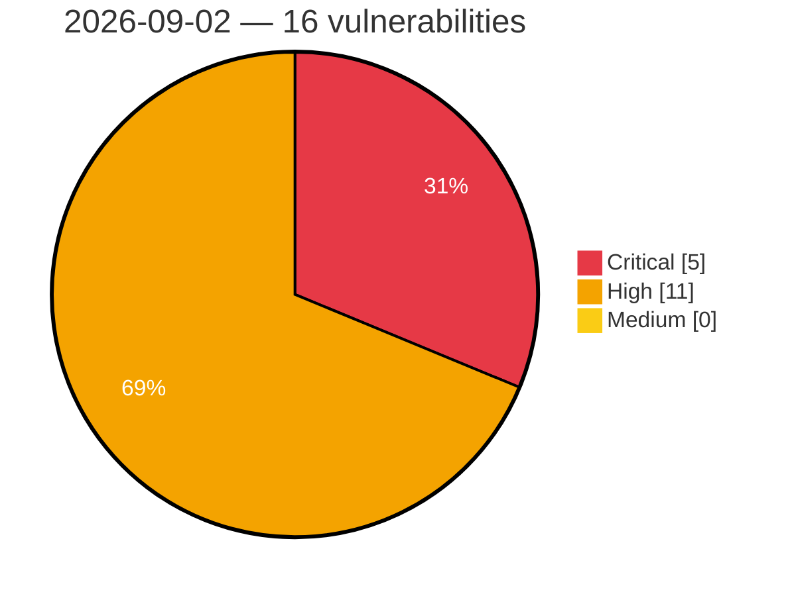

# Critical, High & Medium Severity Vulnerabilities — 2026-09-02

**Source status for this day:**

| Source | Critical | High | Medium | Total |
|--------|---------:|-----:|-------:|------:|
| cvefeed.io (High/Critical) | 5 | 11 | 0 | 16 |

**KEV (actively exploited):** 0  **Watchlist matches:** 13

## Critical (5)

| CVSS | Flags | Source | CVE / Title | Reported |
|------|-------|--------|-------------|----------|
| 9.8 | ⭐ | cvefeed.io (High/Critical) | [CVE-2026-78657 - SigmaForms Pro <= 1.4.11 - Unauthenticated Arbitrary File Deletion via Path Traversal in File Upload Field](https://cvefeed.io/vuln/detail/CVE-2026-78657) | 2 hours, 24 minutes ago |
| 9.8 | ⭐ | cvefeed.io (High/Critical) | [CVE-2026-9055 - Booking for Appointments and Events Calendar – Amelia (Premium) 8.0 - 9.6.2 - Unauthenticated Privilege Escalation to Administrator via 'externalId'](https://cvefeed.io/vuln/detail/CVE-2026-9055) | 3 hours, 24 minutes ago |
| 9.3 | ⭐ | cvefeed.io (High/Critical) | [CVE-2026-84699 - Team Password Manager before 14.184.308 Authentication Bypass in Password Reset](https://cvefeed.io/vuln/detail/CVE-2026-84699) | 2 hours, 53 minutes ago |
| 9.3 | — | cvefeed.io (High/Critical) | [CVE-2026-84696 - Phison PS3111-S11 Controller Firmware Missing Authentication on Vendor Unique Commands](https://cvefeed.io/vuln/detail/CVE-2026-84696) | 2 hours, 53 minutes ago |
| 9.3 | ⭐ | cvefeed.io (High/Critical) | [CVE-2026-84695 - BookStack before 26.05.4 Stored XSS via Drawing Upload](https://cvefeed.io/vuln/detail/CVE-2026-84695) | 2 hours, 53 minutes ago |

## High (11)

| CVSS | Flags | Source | CVE / Title | Reported |
|------|-------|--------|-------------|----------|
| 8.8 | ⭐ | cvefeed.io (High/Critical) | [CVE-2026-84715 - FeatherPanel before 1.3.7.10 Privilege Escalation via Subuser Permission Update](https://cvefeed.io/vuln/detail/CVE-2026-84715) | 1 hour, 53 minutes ago |
| 8.8 | — | cvefeed.io (High/Critical) | [CVE-2026-84700 - Pika Unauthenticated Replication Access via Internal Protobuf Port](https://cvefeed.io/vuln/detail/CVE-2026-84700) | 2 hours, 53 minutes ago |
| 8.8 | ⭐ | cvefeed.io (High/Critical) | [CVE-2026-84694 - Coolify before 4.2.0 Remote Code Execution via Environment Variable Key](https://cvefeed.io/vuln/detail/CVE-2026-84694) | 2 hours, 53 minutes ago |
| 8.8 | ⭐ | cvefeed.io (High/Critical) | [CVE-2026-14828 - ManageEngine Password Manager Pro, PAM360, and Access Manager Plus SQL Injection Vulnerability](https://cvefeed.io/vuln/detail/CVE-2026-14828) | 24 minutes ago |
| 8.8 | ⭐ | cvefeed.io (High/Critical) | [CVE-2026-14357 - DevKit Pro <= 2.3.0 - Missing Authorization to Authenticated (Subscriber+) Arbitrary Theme Installation / Remote Code Execution via 'qqfile' Parameter](https://cvefeed.io/vuln/detail/CVE-2026-14357) | 2 hours, 24 minutes ago |
| 8.7 | ⭐ | cvefeed.io (High/Critical) | [CVE-2026-84485 - APITable through 1.13.0-beta.1 Missing Authentication on the Internal Organization Load or Search Endpoint](https://cvefeed.io/vuln/detail/CVE-2026-84485) | 1 hour, 53 minutes ago |
| 8.7 | — | cvefeed.io (High/Critical) | [CVE-2026-84484 - ION-DTN before 4.2.0 Out-of-Bounds Read via decodeSdnv](https://cvefeed.io/vuln/detail/CVE-2026-84484) | 1 hour, 53 minutes ago |
| 8.7 | ⭐ | cvefeed.io (High/Critical) | [CVE-2026-84702 - facefusion before 3.7.0 Path Traversal via Job Identifier](https://cvefeed.io/vuln/detail/CVE-2026-84702) | 2 hours, 53 minutes ago |
| 8.6 | ⭐ | cvefeed.io (High/Critical) | [CVE-2026-19754 - Baserow 2.3.3 - SQL injection in formula index() JSONB array extraction](https://cvefeed.io/vuln/detail/CVE-2026-19754) | 41 minutes ago |
| 8.6 | ⭐ | cvefeed.io (High/Critical) | [CVE-2024-35585 - Oxford Nanopore MinKNOW Authentication Bypass](https://cvefeed.io/vuln/detail/CVE-2024-35585) | 3 hours, 24 minutes ago |
| 8.1 | ⭐ | cvefeed.io (High/Critical) | [CVE-2026-14982 - WP File Download <= 6.3.4 - Authenticated (Subscriber+) Arbitrary File Deletion via 'remoteurl' Parameter](https://cvefeed.io/vuln/detail/CVE-2026-14982) | 53 minutes ago |
