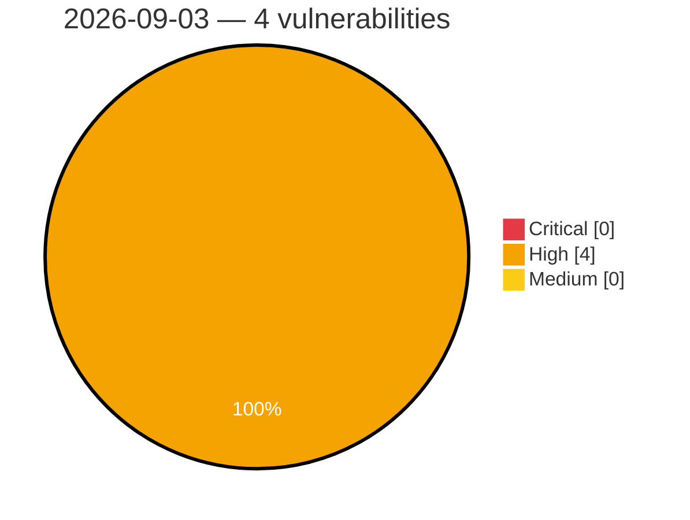

# Critical, High & Medium Severity Vulnerabilities — 2026-09-03

**Source status for this day:**

| Source | Critical | High | Medium | Total |
|--------|---------:|-----:|-------:|------:|
| cvefeed.io (High/Critical) | 0 | 4 | 0 | 4 |

**KEV (actively exploited):** 0  **Watchlist matches:** 2

## High (4)

| CVSS | Flags | Source | CVE / Title | Reported |
|------|-------|--------|-------------|----------|
| 8.7 | — | cvefeed.io (High/Critical) | [CVE-2026-84851 - Uncontrolled recursion in the Ion reader in Amazon Ion-C before 1.1.6](https://cvefeed.io/vuln/detail/CVE-2026-84851) | 3 hours, 26 minutes ago |
| 8.5 | ⭐ | cvefeed.io (High/Critical) | [CVE-2026-9854 - SYS600 Privilege Escalation Vulnerability](https://cvefeed.io/vuln/detail/CVE-2026-9854) | 48 minutes ago |
| 8.5 | ⭐ | cvefeed.io (High/Critical) | [CVE-2026-9853 - SYS600 Improper Access Control](https://cvefeed.io/vuln/detail/CVE-2026-9853) | 50 minutes ago |
| 8.2 | — | cvefeed.io (High/Critical) | [CVE-2021-38489 - UEFI Firmware HDD Password Plaintext Exposure](https://cvefeed.io/vuln/detail/CVE-2021-38489) | 1 hour, 7 minutes ago |
