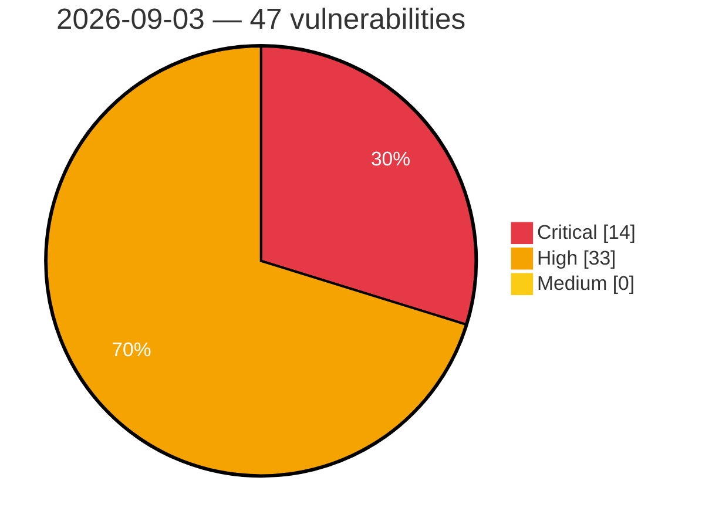

# Critical, High & Medium Severity Vulnerabilities — 2026-09-03

**Source status for this day:**

| Source | Critical | High | Medium | Total |
|--------|---------:|-----:|-------:|------:|
| cvefeed.io (High/Critical) | 14 | 33 | 0 | 47 |

**KEV (actively exploited):** 0  **Watchlist matches:** 35

## Critical (14)

| CVSS | Flags | Source | CVE / Title | Reported |
|------|-------|--------|-------------|----------|
| 9.8 | ⭐ | cvefeed.io (High/Critical) | [CVE-2026-85154 - WWBN AVideo Authentication Bypass via Non-Expiring video_id_hash](https://cvefeed.io/vuln/detail/CVE-2026-85154) | 1 hour, 6 minutes ago |
| 9.8 | — | cvefeed.io (High/Critical) | [CVE-2026-84834 - WordPress JobSearch plugin <= 3.2.0 - PHP Object Injection vulnerability](https://cvefeed.io/vuln/detail/CVE-2026-84834) | 18 minutes ago |
| 9.8 | ⭐ | cvefeed.io (High/Critical) | [CVE-2026-84814 - WordPress Bricksforge plugin <= 3.1.8.8 - Privilege Escalation vulnerability](https://cvefeed.io/vuln/detail/CVE-2026-84814) | 18 minutes ago |
| 9.8 | — | cvefeed.io (High/Critical) | [CVE-2026-84753 - WordPress Mail Mint plugin <= 1.31.0 - PHP Object Injection vulnerability](https://cvefeed.io/vuln/detail/CVE-2026-84753) | 18 minutes ago |
| 9.8 | ⭐ | cvefeed.io (High/Critical) | [CVE-2026-84238 - WordPress YITH Request a Quote for WooCommerce Premium plugin < 4.46.0 - Broken Access Control vulnerability](https://cvefeed.io/vuln/detail/CVE-2026-84238) | 18 minutes ago |
| 9.8 | — | cvefeed.io (High/Critical) | [CVE-2026-85181 - CAT through 3.1.0 Session Cookie Forgery via Unkeyed hashCode Checksum](https://cvefeed.io/vuln/detail/CVE-2026-85181) | 2 hours, 18 minutes ago |
| 9.8 | ⭐ | cvefeed.io (High/Critical) | [CVE-2026-82526 - R2R 3.6.6 SQL Injection via Vector Index Creation Endpoint](https://cvefeed.io/vuln/detail/CVE-2026-82526) | 32 minutes ago |
| 9.5 | ⭐ | cvefeed.io (High/Critical) | [CVE-2026-85216 - MISP LDAP and LinOTP Authentication Bypass via Empty or Invalid Credentials](https://cvefeed.io/vuln/detail/CVE-2026-85216) | 2 hours, 18 minutes ago |
| 9.4 | ⭐ | cvefeed.io (High/Critical) | [CVE-2026-76174 - Multiple vulnerabilities in Ocsreports for OCS Inventory NG](https://cvefeed.io/vuln/detail/CVE-2026-76174) | 2 hours, 50 minutes ago |
| 9.3 | ⭐ | cvefeed.io (High/Critical) | [CVE-2026-84813 - WordPress GeoDirectory plugin <= 2.8.174 - SQL Injection vulnerability](https://cvefeed.io/vuln/detail/CVE-2026-84813) | 18 minutes ago |
| 9.3 | ⭐ | cvefeed.io (High/Critical) | [CVE-2026-84768 - WordPress VikAppointments Services Booking Calendar plugin <= 1.2.20 - SQL Injection vulnerability](https://cvefeed.io/vuln/detail/CVE-2026-84768) | 18 minutes ago |
| 9.3 | ⭐ | cvefeed.io (High/Critical) | [CVE-2026-85183 - Taipy through 4.1.1 Cross-Site WebSocket Hijacking via Wildcard socket.io CORS](https://cvefeed.io/vuln/detail/CVE-2026-85183) | 2 hours, 18 minutes ago |
| 9.2 | ⭐ | cvefeed.io (High/Critical) | [CVE-2026-76178 - Multiple vulnerabilities in Ocsreports for OCS Inventory NG](https://cvefeed.io/vuln/detail/CVE-2026-76178) | 2 hours, 8 minutes ago |
| 9.1 | ⭐ | cvefeed.io (High/Critical) | [CVE-2026-58400 - GeoNetwork vulnerable to Remote Code Execution via unsafe Saxon XSLT processor configuration in formatter](https://cvefeed.io/vuln/detail/CVE-2026-58400) | 27 minutes ago |

## High (33)

| CVSS | Flags | Source | CVE / Title | Reported |
|------|-------|--------|-------------|----------|
| 8.8 | ⭐ | cvefeed.io (High/Critical) | [CVE-2026-78064 - Joomla Extension - j2commerce.com - Anonymous cart-record tampering via inherited FOF `save` task in J2Store 1.0.0-3.3.21, 4.0.0-4.0.21, 4.1.0-4.1.6](https://cvefeed.io/vuln/detail/CVE-2026-78064) | 34 minutes ago |
| 8.8 | ⭐ | cvefeed.io (High/Critical) | [CVE-2026-85175 - SiYuan before v3.8.2 TLS Private Key Disclosure via getFile](https://cvefeed.io/vuln/detail/CVE-2026-85175) | 1 hour, 6 minutes ago |
| 8.8 | ⭐ | cvefeed.io (High/Critical) | [CVE-2026-85174 - SiYuan before v3.8.2 API Token Exposure via Log File](https://cvefeed.io/vuln/detail/CVE-2026-85174) | 1 hour, 6 minutes ago |
| 8.8 | — | cvefeed.io (High/Critical) | [CVE-2026-84752 - WordPress RTMKit plugin <= 2.1.5 - PHP Object Injection vulnerability](https://cvefeed.io/vuln/detail/CVE-2026-84752) | 18 minutes ago |
| 8.8 | ⭐ | cvefeed.io (High/Critical) | [CVE-2026-85236 - MISP cullEmptyEvents CSRF Allows Irreversible Deletion of Events via GET Request](https://cvefeed.io/vuln/detail/CVE-2026-85236) | 1 hour, 17 minutes ago |
| 8.8 | ⭐ | cvefeed.io (High/Critical) | [CVE-2026-71963 - Hermes Agent 0.18.2 - 0.21.0 RCE via git core.fsmonitor Config Injection](https://cvefeed.io/vuln/detail/CVE-2026-71963) | 1 hour, 17 minutes ago |
| 8.8 | ⭐ | cvefeed.io (High/Critical) | [CVE-2026-85199 - Eclipse aeriOS Self-orchestrator Path Traversal Vulnerability](https://cvefeed.io/vuln/detail/CVE-2026-85199) | 2 hours, 18 minutes ago |
| 8.7 | — | cvefeed.io (High/Critical) | [CVE-2026-84851 - Uncontrolled recursion in the Ion reader in Amazon Ion-C before 1.1.6](https://cvefeed.io/vuln/detail/CVE-2026-84851) | 3 hours, 26 minutes ago |
| 8.7 | ⭐ | cvefeed.io (High/Critical) | [CVE-2026-77999 - Joomla Extension - j2commerce.com - Unauthenticated PayPal callback forgery leading to order confirmation fraud in J2Store 1.0.0-3.3.21, 4.0.0-4.0.21, 4.1.0-4.1.6](https://cvefeed.io/vuln/detail/CVE-2026-77999) | 30 minutes ago |
| 8.7 | — | cvefeed.io (High/Critical) | [CVE-2026-79679 - Use of Weak Credentials](https://cvefeed.io/vuln/detail/CVE-2026-79679) | 1 hour ago |
| 8.7 | ⭐ | cvefeed.io (High/Critical) | [CVE-2026-85169 - n8n before 1.123.73 Remote Code Execution via $fromAI Prototype Leak](https://cvefeed.io/vuln/detail/CVE-2026-85169) | 1 hour, 6 minutes ago |
| 8.7 | ⭐ | cvefeed.io (High/Critical) | [CVE-2026-85155 - WWBN AVideo SQL Injection via get.json.php APIName channels](https://cvefeed.io/vuln/detail/CVE-2026-85155) | 1 hour, 6 minutes ago |
| 8.7 | — | cvefeed.io (High/Critical) | [CVE-2026-57445 - Gardens v2: Approve-side dispute resolution drains active streaming escrow reserve](https://cvefeed.io/vuln/detail/CVE-2026-57445) | 1 hour, 18 minutes ago |
| 8.7 | — | cvefeed.io (High/Critical) | [CVE-2026-53924 - Gardens v2: Permissionless syncOutflow bypasses streaming proposal disputes](https://cvefeed.io/vuln/detail/CVE-2026-53924) | 1 hour, 18 minutes ago |
| 8.7 | ⭐ | cvefeed.io (High/Critical) | [CVE-2026-85212 - CRMEB through 6.0.0 Missing Authorization via Inert verifyAuth Role Check](https://cvefeed.io/vuln/detail/CVE-2026-85212) | 2 hours, 18 minutes ago |
| 8.7 | ⭐ | cvefeed.io (High/Critical) | [CVE-2026-85180 - Ollama 0.30.0 through 0.33.2 SSRF via Cross-Host Tensor Blob Redirect](https://cvefeed.io/vuln/detail/CVE-2026-85180) | 2 hours, 18 minutes ago |
| 8.6 | ⭐ | cvefeed.io (High/Critical) | [CVE-2026-76176 - Multiple vulnerabilities in Ocsreports for OCS Inventory NG](https://cvefeed.io/vuln/detail/CVE-2026-76176) | 2 hours, 41 minutes ago |
| 8.6 | ⭐ | cvefeed.io (High/Critical) | [CVE-2026-76175 - Multiple vulnerabilities in Ocsreports for OCS Inventory NG](https://cvefeed.io/vuln/detail/CVE-2026-76175) | 2 hours, 43 minutes ago |
| 8.6 | ⭐ | cvefeed.io (High/Critical) | [CVE-2026-84830 - OS command injection in privileged configuration handling](https://cvefeed.io/vuln/detail/CVE-2026-84830) | 3 hours, 42 minutes ago |
| 8.6 | ⭐ | cvefeed.io (High/Critical) | [CVE-2026-84832 - Unsafe deserialization in the REST interface](https://cvefeed.io/vuln/detail/CVE-2026-84832) | 3 hours, 43 minutes ago |
| 8.6 | ⭐ | cvefeed.io (High/Critical) | [CVE-2026-85237 - Missing Rate Limiting in Email OTP Verification Allows Brute-Force Authentication Bypass](https://cvefeed.io/vuln/detail/CVE-2026-85237) | 1 hour, 17 minutes ago |
| 8.6 | ⭐ | cvefeed.io (High/Critical) | [CVE-2026-63219 - Unauthenticated file upload via missing authorization on formatter upload endpoint](https://cvefeed.io/vuln/detail/CVE-2026-63219) | 27 minutes ago |
| 8.5 | ⭐ | cvefeed.io (High/Critical) | [CVE-2026-9854 - SYS600 Privilege Escalation Vulnerability](https://cvefeed.io/vuln/detail/CVE-2026-9854) | 48 minutes ago |
| 8.5 | ⭐ | cvefeed.io (High/Critical) | [CVE-2026-9853 - SYS600 Improper Access Control](https://cvefeed.io/vuln/detail/CVE-2026-9853) | 50 minutes ago |
| 8.5 | ⭐ | cvefeed.io (High/Critical) | [CVE-2026-85012 - OS command injection in the Amazon CodeCatalyst blueprints SDK](https://cvefeed.io/vuln/detail/CVE-2026-85012) | 28 minutes ago |
| 8.3 | ⭐ | cvefeed.io (High/Critical) | [CVE-2026-84736 - Eclipse aeriOS Federator Improper Certificate Validation](https://cvefeed.io/vuln/detail/CVE-2026-84736) | 18 minutes ago |
| 8.3 | ⭐ | cvefeed.io (High/Critical) | [CVE-2026-85211 - Label Studio through 1.23.0 Cross-Organization Storage URI Resolution](https://cvefeed.io/vuln/detail/CVE-2026-85211) | 2 hours, 18 minutes ago |
| 8.2 | — | cvefeed.io (High/Critical) | [CVE-2021-38489 - UEFI Firmware HDD Password Plaintext Exposure](https://cvefeed.io/vuln/detail/CVE-2021-38489) | 1 hour, 7 minutes ago |
| 8.2 | — | cvefeed.io (High/Critical) | [CVE-2026-84757 - WordPress WP Compress plugin <= 7.21.28 - Settings Change vulnerability](https://cvefeed.io/vuln/detail/CVE-2026-84757) | 18 minutes ago |
| 8.2 | — | cvefeed.io (High/Critical) | [CVE-2026-84964 - Heap corruption via OCSP request double free from crafted multi-URL certificate in TLS client](https://cvefeed.io/vuln/detail/CVE-2026-84964) | 1 hour, 17 minutes ago |
| 8.1 | ⭐ | cvefeed.io (High/Critical) | [CVE-2026-85160 - AVideo through c91b5975d CSRF and Path Traversal via stopLive.php](https://cvefeed.io/vuln/detail/CVE-2026-85160) | 1 hour, 6 minutes ago |
| 8.1 | ⭐ | cvefeed.io (High/Critical) | [CVE-2026-84779 - WordPress Agentimus – AI SEO, llms.txt & MCP for AI Agents plugin <= 1.51.0 - Broken Access Control vulnerability](https://cvefeed.io/vuln/detail/CVE-2026-84779) | 18 minutes ago |
| 8.1 | — | cvefeed.io (High/Critical) | [CVE-2026-85214 - vhr Missing Authorization in PUT /hr/info Allows Arbitrary Profile Overwrite](https://cvefeed.io/vuln/detail/CVE-2026-85214) | 2 hours, 18 minutes ago |
