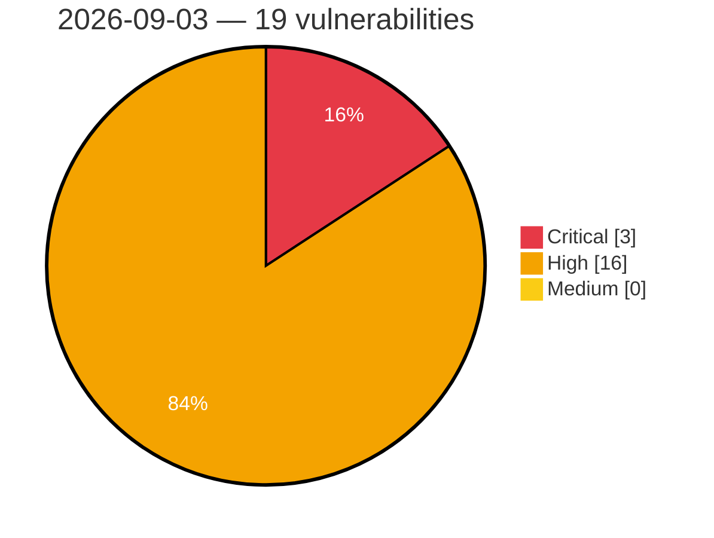

# Critical, High & Medium Severity Vulnerabilities — 2026-09-03

**Source status for this day:**

| Source | Critical | High | Medium | Total |
|--------|---------:|-----:|-------:|------:|
| cvefeed.io (High/Critical) | 3 | 16 | 0 | 19 |

**KEV (actively exploited):** 0  **Watchlist matches:** 16

## Critical (3)

| CVSS | Flags | Source | CVE / Title | Reported |
|------|-------|--------|-------------|----------|
| 9.8 | ⭐ | cvefeed.io (High/Critical) | [CVE-2026-85154 - WWBN AVideo Authentication Bypass via Non-Expiring video_id_hash](https://cvefeed.io/vuln/detail/CVE-2026-85154) | 1 hour, 6 minutes ago |
| 9.4 | ⭐ | cvefeed.io (High/Critical) | [CVE-2026-76174 - Multiple vulnerabilities in Ocsreports for OCS Inventory NG](https://cvefeed.io/vuln/detail/CVE-2026-76174) | 2 hours, 50 minutes ago |
| 9.2 | ⭐ | cvefeed.io (High/Critical) | [CVE-2026-76178 - Multiple vulnerabilities in Ocsreports for OCS Inventory NG](https://cvefeed.io/vuln/detail/CVE-2026-76178) | 2 hours, 8 minutes ago |

## High (16)

| CVSS | Flags | Source | CVE / Title | Reported |
|------|-------|--------|-------------|----------|
| 8.8 | ⭐ | cvefeed.io (High/Critical) | [CVE-2026-78064 - Joomla Extension - j2commerce.com - Anonymous cart-record tampering via inherited FOF `save` task in J2Store 1.0.0-3.3.21, 4.0.0-4.0.21, 4.1.0-4.1.6](https://cvefeed.io/vuln/detail/CVE-2026-78064) | 34 minutes ago |
| 8.8 | ⭐ | cvefeed.io (High/Critical) | [CVE-2026-85175 - SiYuan before v3.8.2 TLS Private Key Disclosure via getFile](https://cvefeed.io/vuln/detail/CVE-2026-85175) | 1 hour, 6 minutes ago |
| 8.8 | ⭐ | cvefeed.io (High/Critical) | [CVE-2026-85174 - SiYuan before v3.8.2 API Token Exposure via Log File](https://cvefeed.io/vuln/detail/CVE-2026-85174) | 1 hour, 6 minutes ago |
| 8.7 | — | cvefeed.io (High/Critical) | [CVE-2026-84851 - Uncontrolled recursion in the Ion reader in Amazon Ion-C before 1.1.6](https://cvefeed.io/vuln/detail/CVE-2026-84851) | 3 hours, 26 minutes ago |
| 8.7 | ⭐ | cvefeed.io (High/Critical) | [CVE-2026-77999 - Joomla Extension - j2commerce.com - Unauthenticated PayPal callback forgery leading to order confirmation fraud in J2Store 1.0.0-3.3.21, 4.0.0-4.0.21, 4.1.0-4.1.6](https://cvefeed.io/vuln/detail/CVE-2026-77999) | 30 minutes ago |
| 8.7 | — | cvefeed.io (High/Critical) | [CVE-2026-79679 - Use of Weak Credentials](https://cvefeed.io/vuln/detail/CVE-2026-79679) | 1 hour ago |
| 8.7 | ⭐ | cvefeed.io (High/Critical) | [CVE-2026-85169 - n8n before 1.123.73 Remote Code Execution via $fromAI Prototype Leak](https://cvefeed.io/vuln/detail/CVE-2026-85169) | 1 hour, 6 minutes ago |
| 8.7 | ⭐ | cvefeed.io (High/Critical) | [CVE-2026-85155 - WWBN AVideo SQL Injection via get.json.php APIName channels](https://cvefeed.io/vuln/detail/CVE-2026-85155) | 1 hour, 6 minutes ago |
| 8.6 | ⭐ | cvefeed.io (High/Critical) | [CVE-2026-76176 - Multiple vulnerabilities in Ocsreports for OCS Inventory NG](https://cvefeed.io/vuln/detail/CVE-2026-76176) | 2 hours, 41 minutes ago |
| 8.6 | ⭐ | cvefeed.io (High/Critical) | [CVE-2026-76175 - Multiple vulnerabilities in Ocsreports for OCS Inventory NG](https://cvefeed.io/vuln/detail/CVE-2026-76175) | 2 hours, 43 minutes ago |
| 8.6 | ⭐ | cvefeed.io (High/Critical) | [CVE-2026-84830 - OS command injection in privileged configuration handling](https://cvefeed.io/vuln/detail/CVE-2026-84830) | 3 hours, 42 minutes ago |
| 8.6 | ⭐ | cvefeed.io (High/Critical) | [CVE-2026-84832 - Unsafe deserialization in the REST interface](https://cvefeed.io/vuln/detail/CVE-2026-84832) | 3 hours, 43 minutes ago |
| 8.5 | ⭐ | cvefeed.io (High/Critical) | [CVE-2026-9854 - SYS600 Privilege Escalation Vulnerability](https://cvefeed.io/vuln/detail/CVE-2026-9854) | 48 minutes ago |
| 8.5 | ⭐ | cvefeed.io (High/Critical) | [CVE-2026-9853 - SYS600 Improper Access Control](https://cvefeed.io/vuln/detail/CVE-2026-9853) | 50 minutes ago |
| 8.2 | — | cvefeed.io (High/Critical) | [CVE-2021-38489 - UEFI Firmware HDD Password Plaintext Exposure](https://cvefeed.io/vuln/detail/CVE-2021-38489) | 1 hour, 7 minutes ago |
| 8.1 | ⭐ | cvefeed.io (High/Critical) | [CVE-2026-85160 - AVideo through c91b5975d CSRF and Path Traversal via stopLive.php](https://cvefeed.io/vuln/detail/CVE-2026-85160) | 1 hour, 6 minutes ago |
