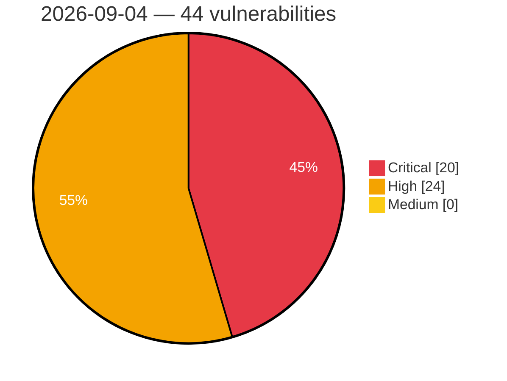

# Critical, High & Medium Severity Vulnerabilities — 2026-09-04

**Source status for this day:**

| Source | Critical | High | Medium | Total |
|--------|---------:|-----:|-------:|------:|
| cvefeed.io (High/Critical) | 20 | 24 | 0 | 44 |

**KEV (actively exploited):** 0  **Watchlist matches:** 27

## Critical (20)

| CVSS | Flags | Source | CVE / Title | Reported |
|------|-------|--------|-------------|----------|
| 10.0 | ⭐ | cvefeed.io (High/Critical) | [CVE-2026-75754 - ASUS Control Center Authentication Bypass, SSRF, and Hard-coded Credentials Vulnerability](https://cvefeed.io/vuln/detail/CVE-2026-75754) | 1 hour, 28 minutes ago |
| 9.8 | — | cvefeed.io (High/Critical) | [CVE-2026-85509 - FreeIPMI Stack-Based Buffer Overflow](https://cvefeed.io/vuln/detail/CVE-2026-85509) | 24 minutes ago |
| 9.8 | — | cvefeed.io (High/Critical) | [CVE-2026-85508 - FreeIPMI Dell IPMI-OEM Stack-Based Buffer Overflow](https://cvefeed.io/vuln/detail/CVE-2026-85508) | 25 minutes ago |
| 9.8 | — | cvefeed.io (High/Critical) | [CVE-2026-85507 - FreeIPMI Stack-Based Buffer Overflow](https://cvefeed.io/vuln/detail/CVE-2026-85507) | 26 minutes ago |
| 9.8 | — | cvefeed.io (High/Critical) | [CVE-2026-85506 - FreeIPMI Stack-Based Buffer Overflow](https://cvefeed.io/vuln/detail/CVE-2026-85506) | 28 minutes ago |
| 9.8 | — | cvefeed.io (High/Critical) | [CVE-2026-85504 - FreeIPMI Stack-Based Buffer Overflow](https://cvefeed.io/vuln/detail/CVE-2026-85504) | 31 minutes ago |
| 9.8 | — | cvefeed.io (High/Critical) | [CVE-2026-85148 - Lightstar｜SmartIT Desktop Manager - Use of Hard-coded Credentials](https://cvefeed.io/vuln/detail/CVE-2026-85148) | 1 hour, 28 minutes ago |
| 9.8 | ⭐ | cvefeed.io (High/Critical) | [CVE-2026-85146 - Lightstar｜SmartIT Desktop Manager - Use of Hard-coded Credentials](https://cvefeed.io/vuln/detail/CVE-2026-85146) | 1 hour, 28 minutes ago |
| 9.8 | — | cvefeed.io (High/Critical) | [CVE-2026-70403 - XING CPTrans-ME-X Use of Hard-coded Password](https://cvefeed.io/vuln/detail/CVE-2026-70403) | 1 hour, 28 minutes ago |
| 9.8 | — | cvefeed.io (High/Critical) | [CVE-2026-69657 - XING CPTrans-ME-X Use of Default Password](https://cvefeed.io/vuln/detail/CVE-2026-69657) | 1 hour, 28 minutes ago |
| 9.8 | ⭐ | cvefeed.io (High/Critical) | [CVE-2026-62928 - XING CPTrans-ME-X OS Command Injection Vulnerability](https://cvefeed.io/vuln/detail/CVE-2026-62928) | 1 hour, 28 minutes ago |
| 9.8 | ⭐ | cvefeed.io (High/Critical) | [CVE-2026-15354 - ACPT (Premium) <= 2.0.66 - Unauthenticated Privilege Escalation via 'acpt_form_post_id' Parameter](https://cvefeed.io/vuln/detail/CVE-2026-15354) | 1 hour, 28 minutes ago |
| 9.8 | ⭐ | cvefeed.io (High/Critical) | [CVE-2026-11613 - Divi Ajax Filter <= 5.1.2 - Unauthenticated Local File Inclusion via 'custom_loop_template' Parameter](https://cvefeed.io/vuln/detail/CVE-2026-11613) | 3 hours, 28 minutes ago |
| 9.8 | ⭐ | cvefeed.io (High/Critical) | [CVE-2026-82923 - AI Website Builder (GitHub build) 1.0.0 - Unauthenticated RCE via Unprotected REST Routes](https://cvefeed.io/vuln/detail/CVE-2026-82923) | 2 hours, 28 minutes ago |
| 9.6 | ⭐ | cvefeed.io (High/Critical) | [CVE-2026-85085 - Canva Android App WebView Cross-Origin Resource Access Vulnerability](https://cvefeed.io/vuln/detail/CVE-2026-85085) | 1 hour, 28 minutes ago |
| 9.3 | ⭐ | cvefeed.io (High/Critical) | [CVE-2026-85602 - Grav Form Plugin before 9.1.20 reCAPTCHA v3 Authentication Bypass](https://cvefeed.io/vuln/detail/CVE-2026-85602) | 28 minutes ago |
| 9.3 | ⭐ | cvefeed.io (High/Critical) | [CVE-2026-85595 - Traefik before v2.11.55 Authentication Bypass via digestAuth](https://cvefeed.io/vuln/detail/CVE-2026-85595) | 28 minutes ago |
| 9.2 | — | cvefeed.io (High/Critical) | [CVE-2026-67402 - ConfigServer Security & Firewall Remote Command Execution Vulnerability](https://cvefeed.io/vuln/detail/CVE-2026-67402) | 4 hours, 28 minutes ago |
| 9.2 | ⭐ | cvefeed.io (High/Critical) | [CVE-2026-85614 - OpenPanel API before 2.3.0 Unauthenticated SSRF via site-checker](https://cvefeed.io/vuln/detail/CVE-2026-85614) | 28 minutes ago |
| 9.1 | ⭐ | cvefeed.io (High/Critical) | [CVE-2026-85184 - @fastify/middie vulnerable to path-scoped middleware bypass via absolute-form request target](https://cvefeed.io/vuln/detail/CVE-2026-85184) | 2 hours, 28 minutes ago |

## High (24)

| CVSS | Flags | Source | CVE / Title | Reported |
|------|-------|--------|-------------|----------|
| 8.8 | ⭐ | cvefeed.io (High/Critical) | [CVE-2026-85094 - Canva Android App WebView Cross-Origin Vulnerability](https://cvefeed.io/vuln/detail/CVE-2026-85094) | 1 hour, 28 minutes ago |
| 8.8 | — | cvefeed.io (High/Critical) | [CVE-2026-85617 - snipe-it before 8.6.3 Authorization Bypass via Bulk Delete](https://cvefeed.io/vuln/detail/CVE-2026-85617) | 28 minutes ago |
| 8.8 | ⭐ | cvefeed.io (High/Critical) | [CVE-2026-85610 - OpenPanel before 2.3.0 Remote Code Execution via chart formulas](https://cvefeed.io/vuln/detail/CVE-2026-85610) | 28 minutes ago |
| 8.8 | ⭐ | cvefeed.io (High/Critical) | [CVE-2026-85604 - Grav before 2.0.19 Remote Code Execution via sort filter](https://cvefeed.io/vuln/detail/CVE-2026-85604) | 28 minutes ago |
| 8.8 | ⭐ | cvefeed.io (High/Critical) | [CVE-2026-18198 - SQL Injection in TAC Information's GoldenHorn](https://cvefeed.io/vuln/detail/CVE-2026-18198) | 33 minutes ago |
| 8.8 | ⭐ | cvefeed.io (High/Critical) | [CVE-2026-85540 - Interinfo｜DreamMaker - SQL Injection](https://cvefeed.io/vuln/detail/CVE-2026-85540) | 2 hours, 28 minutes ago |
| 8.7 | ⭐ | cvefeed.io (High/Critical) | [CVE-2026-85147 - Lightstar｜SmartIT Desktop Manager - Use of Hard-coded Credentials](https://cvefeed.io/vuln/detail/CVE-2026-85147) | 1 hour, 28 minutes ago |
| 8.7 | — | cvefeed.io (High/Critical) | [CVE-2026-66840 - XING CPTrans-ME-X Exposure of Sensitive System Information](https://cvefeed.io/vuln/detail/CVE-2026-66840) | 1 hour, 28 minutes ago |
| 8.7 | ⭐ | cvefeed.io (High/Critical) | [CVE-2026-85612 - OpenPanel before 2.3.0 SSRF via favicon and og endpoints](https://cvefeed.io/vuln/detail/CVE-2026-85612) | 28 minutes ago |
| 8.7 | ⭐ | cvefeed.io (High/Critical) | [CVE-2026-85585 - SiYuan before v3.8.2 Unbounded Memory Consumption via ControlConcurrency](https://cvefeed.io/vuln/detail/CVE-2026-85585) | 28 minutes ago |
| 8.7 | — | cvefeed.io (High/Critical) | [CVE-2026-85584 - SiYuan before v3.8.2 Denial of Service via Auth Throttle](https://cvefeed.io/vuln/detail/CVE-2026-85584) | 28 minutes ago |
| 8.7 | ⭐ | cvefeed.io (High/Critical) | [CVE-2026-85581 - SiYuan before v3.8.2 Denial of Service via unauthenticated UI-process registration](https://cvefeed.io/vuln/detail/CVE-2026-85581) | 28 minutes ago |
| 8.7 | ⭐ | cvefeed.io (High/Critical) | [CVE-2026-79707 - Arbitrary File Read in Google Agent Development Kit (ADK)](https://cvefeed.io/vuln/detail/CVE-2026-79707) | 1 hour, 28 minutes ago |
| 8.6 | ⭐ | cvefeed.io (High/Critical) | [CVE-2026-85546 - MISP Sharing Group Quick-Edit Actions Allow CSRF via State-Changing GET Requests](https://cvefeed.io/vuln/detail/CVE-2026-85546) | 2 hours, 28 minutes ago |
| 8.5 | ⭐ | cvefeed.io (High/Critical) | [CVE-2026-67397 - Plesk Path Traversal Arbitrary Code Execution](https://cvefeed.io/vuln/detail/CVE-2026-67397) | 4 hours, 28 minutes ago |
| 8.5 | — | cvefeed.io (High/Critical) | [CVE-2026-85616 - Snipe-IT before 8.6.2 Authorization Bypass via Checkout-Acceptance](https://cvefeed.io/vuln/detail/CVE-2026-85616) | 28 minutes ago |
| 8.5 | ⭐ | cvefeed.io (High/Critical) | [CVE-2026-4644 - Improper Authorization in Google Cloud Integration Connectors Leads to Project Takeover](https://cvefeed.io/vuln/detail/CVE-2026-4644) | 1 hour, 28 minutes ago |
| 8.5 | — | cvefeed.io (High/Critical) | [CVE-2026-81302 - PALLET CONTROL Incorrect Default Permissions Vulnerability](https://cvefeed.io/vuln/detail/CVE-2026-81302) | 3 hours, 28 minutes ago |
| 8.4 | ⭐ | cvefeed.io (High/Critical) | [CVE-2026-85613 - OpenPanel Unauthenticated XSS via SVG Favicon Proxy](https://cvefeed.io/vuln/detail/CVE-2026-85613) | 28 minutes ago |
| 8.3 | ⭐ | cvefeed.io (High/Critical) | [CVE-2026-85538 - MISP Attribute Deletion Authorization Bypass Allows Users Without Modify Permissions to Delete Attributes](https://cvefeed.io/vuln/detail/CVE-2026-85538) | 3 hours, 28 minutes ago |
| 8.2 | — | cvefeed.io (High/Critical) | [CVE-2026-67398 - WHMCS 2Checkout Payment Gateway Missing Authorization Vulnerability](https://cvefeed.io/vuln/detail/CVE-2026-67398) | 4 hours, 28 minutes ago |
| 8.2 | — | cvefeed.io (High/Critical) | [CVE-2026-85597 - Traefik before v2.11.55 mTLS Bypass via TLS Option Conflict](https://cvefeed.io/vuln/detail/CVE-2026-85597) | 28 minutes ago |
| 8.2 | ⭐ | cvefeed.io (High/Critical) | [CVE-2026-85596 - Traefik v3.7 Authentication Bypass via TLS Option Conflict](https://cvefeed.io/vuln/detail/CVE-2026-85596) | 28 minutes ago |
| 8.1 | — | cvefeed.io (High/Critical) | [CVE-2026-84504 - fastify vulnerable to request body replacement via an async validation result collision](https://cvefeed.io/vuln/detail/CVE-2026-84504) | 2 hours, 28 minutes ago |
