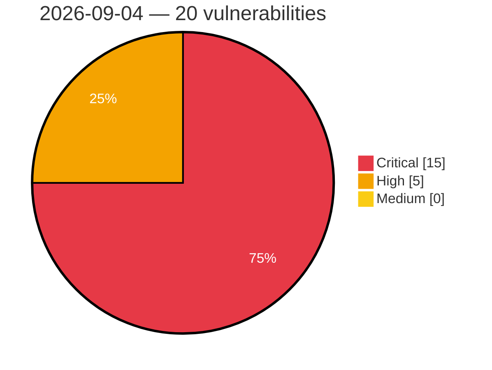

# Critical, High & Medium Severity Vulnerabilities — 2026-09-04

**Source status for this day:**

| Source | Critical | High | Medium | Total |
|--------|---------:|-----:|-------:|------:|
| cvefeed.io (High/Critical) | 15 | 5 | 0 | 20 |

**KEV (actively exploited):** 0  **Watchlist matches:** 9

## Critical (15)

| CVSS | Flags | Source | CVE / Title | Reported |
|------|-------|--------|-------------|----------|
| 10.0 | ⭐ | cvefeed.io (High/Critical) | [CVE-2026-75754 - ASUS Control Center Authentication Bypass, SSRF, and Hard-coded Credentials Vulnerability](https://cvefeed.io/vuln/detail/CVE-2026-75754) | 1 hour, 28 minutes ago |
| 9.8 | — | cvefeed.io (High/Critical) | [CVE-2026-85509 - FreeIPMI Stack-Based Buffer Overflow](https://cvefeed.io/vuln/detail/CVE-2026-85509) | 24 minutes ago |
| 9.8 | — | cvefeed.io (High/Critical) | [CVE-2026-85508 - FreeIPMI Dell IPMI-OEM Stack-Based Buffer Overflow](https://cvefeed.io/vuln/detail/CVE-2026-85508) | 25 minutes ago |
| 9.8 | — | cvefeed.io (High/Critical) | [CVE-2026-85507 - FreeIPMI Stack-Based Buffer Overflow](https://cvefeed.io/vuln/detail/CVE-2026-85507) | 26 minutes ago |
| 9.8 | — | cvefeed.io (High/Critical) | [CVE-2026-85506 - FreeIPMI Stack-Based Buffer Overflow](https://cvefeed.io/vuln/detail/CVE-2026-85506) | 28 minutes ago |
| 9.8 | — | cvefeed.io (High/Critical) | [CVE-2026-85504 - FreeIPMI Stack-Based Buffer Overflow](https://cvefeed.io/vuln/detail/CVE-2026-85504) | 31 minutes ago |
| 9.8 | — | cvefeed.io (High/Critical) | [CVE-2026-85148 - Lightstar｜SmartIT Desktop Manager - Use of Hard-coded Credentials](https://cvefeed.io/vuln/detail/CVE-2026-85148) | 1 hour, 28 minutes ago |
| 9.8 | ⭐ | cvefeed.io (High/Critical) | [CVE-2026-85146 - Lightstar｜SmartIT Desktop Manager - Use of Hard-coded Credentials](https://cvefeed.io/vuln/detail/CVE-2026-85146) | 1 hour, 28 minutes ago |
| 9.8 | — | cvefeed.io (High/Critical) | [CVE-2026-70403 - XING CPTrans-ME-X Use of Hard-coded Password](https://cvefeed.io/vuln/detail/CVE-2026-70403) | 1 hour, 28 minutes ago |
| 9.8 | — | cvefeed.io (High/Critical) | [CVE-2026-69657 - XING CPTrans-ME-X Use of Default Password](https://cvefeed.io/vuln/detail/CVE-2026-69657) | 1 hour, 28 minutes ago |
| 9.8 | ⭐ | cvefeed.io (High/Critical) | [CVE-2026-62928 - XING CPTrans-ME-X OS Command Injection Vulnerability](https://cvefeed.io/vuln/detail/CVE-2026-62928) | 1 hour, 28 minutes ago |
| 9.8 | ⭐ | cvefeed.io (High/Critical) | [CVE-2026-15354 - ACPT (Premium) <= 2.0.66 - Unauthenticated Privilege Escalation via 'acpt_form_post_id' Parameter](https://cvefeed.io/vuln/detail/CVE-2026-15354) | 1 hour, 28 minutes ago |
| 9.8 | ⭐ | cvefeed.io (High/Critical) | [CVE-2026-11613 - Divi Ajax Filter <= 5.1.2 - Unauthenticated Local File Inclusion via 'custom_loop_template' Parameter](https://cvefeed.io/vuln/detail/CVE-2026-11613) | 3 hours, 28 minutes ago |
| 9.6 | ⭐ | cvefeed.io (High/Critical) | [CVE-2026-85085 - Canva Android App WebView Cross-Origin Resource Access Vulnerability](https://cvefeed.io/vuln/detail/CVE-2026-85085) | 1 hour, 28 minutes ago |
| 9.2 | — | cvefeed.io (High/Critical) | [CVE-2026-67402 - ConfigServer Security & Firewall Remote Command Execution Vulnerability](https://cvefeed.io/vuln/detail/CVE-2026-67402) | 4 hours, 28 minutes ago |

## High (5)

| CVSS | Flags | Source | CVE / Title | Reported |
|------|-------|--------|-------------|----------|
| 8.8 | ⭐ | cvefeed.io (High/Critical) | [CVE-2026-85094 - Canva Android App WebView Cross-Origin Vulnerability](https://cvefeed.io/vuln/detail/CVE-2026-85094) | 1 hour, 28 minutes ago |
| 8.7 | ⭐ | cvefeed.io (High/Critical) | [CVE-2026-85147 - Lightstar｜SmartIT Desktop Manager - Use of Hard-coded Credentials](https://cvefeed.io/vuln/detail/CVE-2026-85147) | 1 hour, 28 minutes ago |
| 8.7 | — | cvefeed.io (High/Critical) | [CVE-2026-66840 - XING CPTrans-ME-X Exposure of Sensitive System Information](https://cvefeed.io/vuln/detail/CVE-2026-66840) | 1 hour, 28 minutes ago |
| 8.5 | ⭐ | cvefeed.io (High/Critical) | [CVE-2026-67397 - Plesk Path Traversal Arbitrary Code Execution](https://cvefeed.io/vuln/detail/CVE-2026-67397) | 4 hours, 28 minutes ago |
| 8.2 | — | cvefeed.io (High/Critical) | [CVE-2026-67398 - WHMCS 2Checkout Payment Gateway Missing Authorization Vulnerability](https://cvefeed.io/vuln/detail/CVE-2026-67398) | 4 hours, 28 minutes ago |
