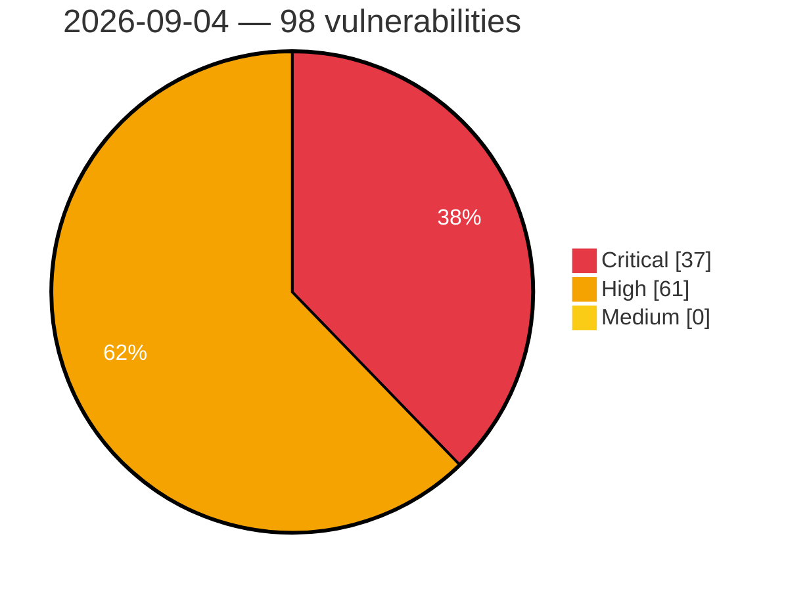

# Critical, High & Medium Severity Vulnerabilities — 2026-09-04

**Source status for this day:**

| Source | Critical | High | Medium | Total |
|--------|---------:|-----:|-------:|------:|
| cvefeed.io (High/Critical) | 37 | 61 | 0 | 98 |

**KEV (actively exploited):** 0  **Watchlist matches:** 65

## Critical (37)

| CVSS | Flags | Source | CVE / Title | Reported |
|------|-------|--------|-------------|----------|
| 10.0 | ⭐ | cvefeed.io (High/Critical) | [CVE-2026-75754 - ASUS Control Center Authentication Bypass, SSRF, and Hard-coded Credentials Vulnerability](https://cvefeed.io/vuln/detail/CVE-2026-75754) | 1 hour, 28 minutes ago |
| 9.8 | — | cvefeed.io (High/Critical) | [CVE-2026-85509 - FreeIPMI Stack-Based Buffer Overflow](https://cvefeed.io/vuln/detail/CVE-2026-85509) | 24 minutes ago |
| 9.8 | — | cvefeed.io (High/Critical) | [CVE-2026-85508 - FreeIPMI Dell IPMI-OEM Stack-Based Buffer Overflow](https://cvefeed.io/vuln/detail/CVE-2026-85508) | 25 minutes ago |
| 9.8 | — | cvefeed.io (High/Critical) | [CVE-2026-85507 - FreeIPMI Stack-Based Buffer Overflow](https://cvefeed.io/vuln/detail/CVE-2026-85507) | 26 minutes ago |
| 9.8 | — | cvefeed.io (High/Critical) | [CVE-2026-85506 - FreeIPMI Stack-Based Buffer Overflow](https://cvefeed.io/vuln/detail/CVE-2026-85506) | 28 minutes ago |
| 9.8 | — | cvefeed.io (High/Critical) | [CVE-2026-85504 - FreeIPMI Stack-Based Buffer Overflow](https://cvefeed.io/vuln/detail/CVE-2026-85504) | 31 minutes ago |
| 9.8 | — | cvefeed.io (High/Critical) | [CVE-2026-85148 - Lightstar｜SmartIT Desktop Manager - Use of Hard-coded Credentials](https://cvefeed.io/vuln/detail/CVE-2026-85148) | 1 hour, 28 minutes ago |
| 9.8 | ⭐ | cvefeed.io (High/Critical) | [CVE-2026-85146 - Lightstar｜SmartIT Desktop Manager - Use of Hard-coded Credentials](https://cvefeed.io/vuln/detail/CVE-2026-85146) | 1 hour, 28 minutes ago |
| 9.8 | — | cvefeed.io (High/Critical) | [CVE-2026-70403 - XING CPTrans-ME-X Use of Hard-coded Password](https://cvefeed.io/vuln/detail/CVE-2026-70403) | 1 hour, 28 minutes ago |
| 9.8 | — | cvefeed.io (High/Critical) | [CVE-2026-69657 - XING CPTrans-ME-X Use of Default Password](https://cvefeed.io/vuln/detail/CVE-2026-69657) | 1 hour, 28 minutes ago |
| 9.8 | ⭐ | cvefeed.io (High/Critical) | [CVE-2026-62928 - XING CPTrans-ME-X OS Command Injection Vulnerability](https://cvefeed.io/vuln/detail/CVE-2026-62928) | 1 hour, 28 minutes ago |
| 9.8 | ⭐ | cvefeed.io (High/Critical) | [CVE-2026-15354 - ACPT (Premium) <= 2.0.66 - Unauthenticated Privilege Escalation via 'acpt_form_post_id' Parameter](https://cvefeed.io/vuln/detail/CVE-2026-15354) | 1 hour, 28 minutes ago |
| 9.8 | ⭐ | cvefeed.io (High/Critical) | [CVE-2026-11613 - Divi Ajax Filter <= 5.1.2 - Unauthenticated Local File Inclusion via 'custom_loop_template' Parameter](https://cvefeed.io/vuln/detail/CVE-2026-11613) | 3 hours, 28 minutes ago |
| 9.8 | ⭐ | cvefeed.io (High/Critical) | [CVE-2026-82923 - AI Website Builder (GitHub build) 1.0.0 - Unauthenticated RCE via Unprotected REST Routes](https://cvefeed.io/vuln/detail/CVE-2026-82923) | 2 hours, 28 minutes ago |
| 9.8 | ⭐ | cvefeed.io (High/Critical) | [CVE-2026-44402 - Voltronic Power SNMP Web Pro 1.1 Unauthenticated RCE via upload.cgi](https://cvefeed.io/vuln/detail/CVE-2026-44402) | 28 minutes ago |
| 9.8 | ⭐ | cvefeed.io (High/Critical) | [CVE-2026-18658 - IBM Operational Decision Manager for Aug 2026 - Multiple CVEs addressed](https://cvefeed.io/vuln/detail/CVE-2026-18658) | 28 minutes ago |
| 9.8 | ⭐ | cvefeed.io (High/Critical) | [CVE-2026-85696 - SadTalker OS Command Injection via Audio Filename](https://cvefeed.io/vuln/detail/CVE-2026-85696) | 1 hour, 28 minutes ago |
| 9.8 | ⭐ | cvefeed.io (High/Critical) | [CVE-2026-85688 - TEN Framework 0.11.71 Unauthenticated File Read/Write via TMAN Designer](https://cvefeed.io/vuln/detail/CVE-2026-85688) | 1 hour, 28 minutes ago |
| 9.8 | — | cvefeed.io (High/Critical) | [CVE-2026-18745 - ILIAS PHP Object Injection via Shibboleth Logout](https://cvefeed.io/vuln/detail/CVE-2026-18745) | 1 hour, 19 minutes ago |
| 9.8 | ⭐ | cvefeed.io (High/Critical) | [CVE-2026-75430 - PowerJob Worker Remote Code Execution Vulnerability](https://cvefeed.io/vuln/detail/CVE-2026-75430) | 2 hours, 19 minutes ago |
| 9.8 | ⭐ | cvefeed.io (High/Critical) | [CVE-2026-31020 - DocsGPT Server-Side Template Injection](https://cvefeed.io/vuln/detail/CVE-2026-31020) | 2 hours, 19 minutes ago |
| 9.6 | ⭐ | cvefeed.io (High/Critical) | [CVE-2026-85085 - Canva Android App WebView Cross-Origin Resource Access Vulnerability](https://cvefeed.io/vuln/detail/CVE-2026-85085) | 1 hour, 28 minutes ago |
| 9.6 | ⭐ | cvefeed.io (High/Critical) | [CVE-2026-19274 - IBM Instana Observability is affected by multiple vulnerabilities within Instana Agent container image](https://cvefeed.io/vuln/detail/CVE-2026-19274) | 28 minutes ago |
| 9.6 | — | cvefeed.io (High/Critical) | [CVE-2026-75925 - IXON VPN Client CRLF Injection](https://cvefeed.io/vuln/detail/CVE-2026-75925) | 44 minutes ago |
| 9.4 | ⭐ | cvefeed.io (High/Critical) | [CVE-2026-85695 - FastChat Unauthenticated Worker Registration SSRF and Model Spoofing](https://cvefeed.io/vuln/detail/CVE-2026-85695) | 1 hour, 28 minutes ago |
| 9.3 | ⭐ | cvefeed.io (High/Critical) | [CVE-2026-85602 - Grav Form Plugin before 9.1.20 reCAPTCHA v3 Authentication Bypass](https://cvefeed.io/vuln/detail/CVE-2026-85602) | 28 minutes ago |
| 9.3 | ⭐ | cvefeed.io (High/Critical) | [CVE-2026-85595 - Traefik before v2.11.55 Authentication Bypass via digestAuth](https://cvefeed.io/vuln/detail/CVE-2026-85595) | 28 minutes ago |
| 9.2 | — | cvefeed.io (High/Critical) | [CVE-2026-67402 - ConfigServer Security & Firewall Remote Command Execution Vulnerability](https://cvefeed.io/vuln/detail/CVE-2026-67402) | 4 hours, 28 minutes ago |
| 9.2 | ⭐ | cvefeed.io (High/Critical) | [CVE-2026-85614 - OpenPanel API before 2.3.0 Unauthenticated SSRF via site-checker](https://cvefeed.io/vuln/detail/CVE-2026-85614) | 28 minutes ago |
| 9.2 | ⭐ | cvefeed.io (High/Critical) | [CVE-2026-85694 - LaVague 0.2.35 Remote Code Execution via eval extraction](https://cvefeed.io/vuln/detail/CVE-2026-85694) | 1 hour, 28 minutes ago |
| 9.2 | ⭐ | cvefeed.io (High/Critical) | [CVE-2026-9317 - Nango < 0.71.6 Missing Authentication RCE via runner tRPC server](https://cvefeed.io/vuln/detail/CVE-2026-9317) | 1 hour, 18 minutes ago |
| 9.1 | ⭐ | cvefeed.io (High/Critical) | [CVE-2026-85184 - @fastify/middie vulnerable to path-scoped middleware bypass via absolute-form request target](https://cvefeed.io/vuln/detail/CVE-2026-85184) | 2 hours, 28 minutes ago |
| 9.1 | ⭐ | cvefeed.io (High/Critical) | [CVE-2026-75431 - PowerJob Server JWT Authentication Bypass leading to Remote Code Execution](https://cvefeed.io/vuln/detail/CVE-2026-75431) | 28 minutes ago |
| 9.1 | ⭐ | cvefeed.io (High/Critical) | [CVE-2026-85684 - marker through 2.0.0 Path Traversal via upload filename](https://cvefeed.io/vuln/detail/CVE-2026-85684) | 1 hour, 28 minutes ago |
| 9.1 | ⭐ | cvefeed.io (High/Critical) | [CVE-2026-81939 - SonicWall Network Security Manager Path Traversal Vulnerability](https://cvefeed.io/vuln/detail/CVE-2026-81939) | 2 hours, 46 minutes ago |
| 9.1 | ⭐ | cvefeed.io (High/Critical) | [CVE-2026-78328 - SonicWall Network Security Manager Privilege Escalation Vulnerability](https://cvefeed.io/vuln/detail/CVE-2026-78328) | 2 hours, 46 minutes ago |
| 9.1 | ⭐ | cvefeed.io (High/Critical) | [CVE-2026-78327 - SonicWall Network Security Manager OS Command Injection](https://cvefeed.io/vuln/detail/CVE-2026-78327) | 2 hours, 46 minutes ago |

## High (61)

| CVSS | Flags | Source | CVE / Title | Reported |
|------|-------|--------|-------------|----------|
| 8.8 | ⭐ | cvefeed.io (High/Critical) | [CVE-2026-85094 - Canva Android App WebView Cross-Origin Vulnerability](https://cvefeed.io/vuln/detail/CVE-2026-85094) | 1 hour, 28 minutes ago |
| 8.8 | — | cvefeed.io (High/Critical) | [CVE-2026-85617 - snipe-it before 8.6.3 Authorization Bypass via Bulk Delete](https://cvefeed.io/vuln/detail/CVE-2026-85617) | 28 minutes ago |
| 8.8 | ⭐ | cvefeed.io (High/Critical) | [CVE-2026-85610 - OpenPanel before 2.3.0 Remote Code Execution via chart formulas](https://cvefeed.io/vuln/detail/CVE-2026-85610) | 28 minutes ago |
| 8.8 | ⭐ | cvefeed.io (High/Critical) | [CVE-2026-85604 - Grav before 2.0.19 Remote Code Execution via sort filter](https://cvefeed.io/vuln/detail/CVE-2026-85604) | 28 minutes ago |
| 8.8 | ⭐ | cvefeed.io (High/Critical) | [CVE-2026-18198 - SQL Injection in TAC Information's GoldenHorn](https://cvefeed.io/vuln/detail/CVE-2026-18198) | 33 minutes ago |
| 8.8 | ⭐ | cvefeed.io (High/Critical) | [CVE-2026-85540 - Interinfo｜DreamMaker - SQL Injection](https://cvefeed.io/vuln/detail/CVE-2026-85540) | 2 hours, 28 minutes ago |
| 8.8 | ⭐ | cvefeed.io (High/Critical) | [CVE-2026-18486 - IBM ContextForge MCP Gateway is affected by credential disclosure and privilege escalation via jq filter execution](https://cvefeed.io/vuln/detail/CVE-2026-18486) | 21 minutes ago |
| 8.8 | ⭐ | cvefeed.io (High/Critical) | [CVE-2026-19298 - Langflow is vulnerable to remote code execution due to authorization policy bypass in the authenticated flow-build endpoint](https://cvefeed.io/vuln/detail/CVE-2026-19298) | 28 minutes ago |
| 8.8 | ⭐ | cvefeed.io (High/Critical) | [CVE-2026-82538 - ILIAS Arbitrary SQL Injection via Repository Trash Table Sort Parameter](https://cvefeed.io/vuln/detail/CVE-2026-82538) | 1 hour, 18 minutes ago |
| 8.8 | ⭐ | cvefeed.io (High/Critical) | [CVE-2026-57163 - PJSIP: Stack overflow parsing a TLS peer certificate's SubjectAltName in GnuTLS backend](https://cvefeed.io/vuln/detail/CVE-2026-57163) | 1 hour, 18 minutes ago |
| 8.8 | ⭐ | cvefeed.io (High/Critical) | [CVE-2026-57162 - PJSIP: Stack overflow parsing SDP a=crypto attributes](https://cvefeed.io/vuln/detail/CVE-2026-57162) | 1 hour, 18 minutes ago |
| 8.8 | ⭐ | cvefeed.io (High/Critical) | [CVE-2026-57161 - PJSIP: Stack overflow handling Service-Route headers in a registration response](https://cvefeed.io/vuln/detail/CVE-2026-57161) | 1 hour, 19 minutes ago |
| 8.8 | — | cvefeed.io (High/Critical) | [CVE-2026-82712 - Tycon Systems TPDIN-Monitor-WEB3 Cross-Site Request Forgery](https://cvefeed.io/vuln/detail/CVE-2026-82712) | 46 minutes ago |
| 8.8 | — | cvefeed.io (High/Critical) | [CVE-2026-77393 - Inductive Automation Ignition Incorrect Default Permissions](https://cvefeed.io/vuln/detail/CVE-2026-77393) | 53 minutes ago |
| 8.7 | ⭐ | cvefeed.io (High/Critical) | [CVE-2026-85147 - Lightstar｜SmartIT Desktop Manager - Use of Hard-coded Credentials](https://cvefeed.io/vuln/detail/CVE-2026-85147) | 1 hour, 28 minutes ago |
| 8.7 | — | cvefeed.io (High/Critical) | [CVE-2026-66840 - XING CPTrans-ME-X Exposure of Sensitive System Information](https://cvefeed.io/vuln/detail/CVE-2026-66840) | 1 hour, 28 minutes ago |
| 8.7 | ⭐ | cvefeed.io (High/Critical) | [CVE-2026-85612 - OpenPanel before 2.3.0 SSRF via favicon and og endpoints](https://cvefeed.io/vuln/detail/CVE-2026-85612) | 28 minutes ago |
| 8.7 | ⭐ | cvefeed.io (High/Critical) | [CVE-2026-85585 - SiYuan before v3.8.2 Unbounded Memory Consumption via ControlConcurrency](https://cvefeed.io/vuln/detail/CVE-2026-85585) | 28 minutes ago |
| 8.7 | — | cvefeed.io (High/Critical) | [CVE-2026-85584 - SiYuan before v3.8.2 Denial of Service via Auth Throttle](https://cvefeed.io/vuln/detail/CVE-2026-85584) | 28 minutes ago |
| 8.7 | ⭐ | cvefeed.io (High/Critical) | [CVE-2026-85581 - SiYuan before v3.8.2 Denial of Service via unauthenticated UI-process registration](https://cvefeed.io/vuln/detail/CVE-2026-85581) | 28 minutes ago |
| 8.7 | ⭐ | cvefeed.io (High/Critical) | [CVE-2026-79707 - Arbitrary File Read in Google Agent Development Kit (ADK)](https://cvefeed.io/vuln/detail/CVE-2026-79707) | 1 hour, 28 minutes ago |
| 8.7 | ⭐ | cvefeed.io (High/Critical) | [CVE-2026-85699 - jina-ai reader server-side request forgery via redirect validation bypass](https://cvefeed.io/vuln/detail/CVE-2026-85699) | 1 hour, 28 minutes ago |
| 8.7 | — | cvefeed.io (High/Critical) | [CVE-2026-85691 - MegaParse 0.0.55 Server-Side Request Forgery via POST /v1/url](https://cvefeed.io/vuln/detail/CVE-2026-85691) | 1 hour, 28 minutes ago |
| 8.7 | — | cvefeed.io (High/Critical) | [CVE-2026-85687 - surya 0.22.1 Unauthenticated Arbitrary File Read via screenshot server](https://cvefeed.io/vuln/detail/CVE-2026-85687) | 1 hour, 28 minutes ago |
| 8.7 | ⭐ | cvefeed.io (High/Critical) | [CVE-2026-85686 - ms-swift 4.5.2 Unauthenticated SSRF via Multimodal Media URLs](https://cvefeed.io/vuln/detail/CVE-2026-85686) | 1 hour, 28 minutes ago |
| 8.7 | ⭐ | cvefeed.io (High/Critical) | [CVE-2026-85685 - AgentScope through 2.0.7.post1 Arbitrary Directory Copy via add_skill](https://cvefeed.io/vuln/detail/CVE-2026-85685) | 1 hour, 28 minutes ago |
| 8.7 | ⭐ | cvefeed.io (High/Critical) | [CVE-2026-85675 - OWL DocumentProcessingToolkit Server-Side Request Forgery via URL Fetching](https://cvefeed.io/vuln/detail/CVE-2026-85675) | 1 hour, 28 minutes ago |
| 8.7 | — | cvefeed.io (High/Critical) | [CVE-2026-85786 - Incomplete fix for CVE-2026-75936 memory-amplification denial of service in Amazon ion-java](https://cvefeed.io/vuln/detail/CVE-2026-85786) | 17 minutes ago |
| 8.7 | ⭐ | cvefeed.io (High/Critical) | [CVE-2026-85781 - Unverified access point ownership in Amazon EFS CSI Driver](https://cvefeed.io/vuln/detail/CVE-2026-85781) | 19 minutes ago |
| 8.6 | ⭐ | cvefeed.io (High/Critical) | [CVE-2026-85546 - MISP Sharing Group Quick-Edit Actions Allow CSRF via State-Changing GET Requests](https://cvefeed.io/vuln/detail/CVE-2026-85546) | 2 hours, 28 minutes ago |
| 8.6 | — | cvefeed.io (High/Critical) | [CVE-2026-19305 - Langflow is vulnerable to Server-Side Request Forgery due to missing or bypassable URL validation in multiple components](https://cvefeed.io/vuln/detail/CVE-2026-19305) | 28 minutes ago |
| 8.6 | ⭐ | cvefeed.io (High/Critical) | [CVE-2026-50553 - Note Mark: Path traversal via unsanitized book/note slug in migrate export (sibling of GHSA-g49p)](https://cvefeed.io/vuln/detail/CVE-2026-50553) | 1 hour, 19 minutes ago |
| 8.6 | — | cvefeed.io (High/Critical) | [CVE-2026-82684 - Tycon Systems TPDIN-Monitor-WEB3 Missing Authorization](https://cvefeed.io/vuln/detail/CVE-2026-82684) | 1 hour, 2 minutes ago |
| 8.5 | ⭐ | cvefeed.io (High/Critical) | [CVE-2026-67397 - Plesk Path Traversal Arbitrary Code Execution](https://cvefeed.io/vuln/detail/CVE-2026-67397) | 4 hours, 28 minutes ago |
| 8.5 | — | cvefeed.io (High/Critical) | [CVE-2026-85616 - Snipe-IT before 8.6.2 Authorization Bypass via Checkout-Acceptance](https://cvefeed.io/vuln/detail/CVE-2026-85616) | 28 minutes ago |
| 8.5 | ⭐ | cvefeed.io (High/Critical) | [CVE-2026-4644 - Improper Authorization in Google Cloud Integration Connectors Leads to Project Takeover](https://cvefeed.io/vuln/detail/CVE-2026-4644) | 1 hour, 28 minutes ago |
| 8.5 | — | cvefeed.io (High/Critical) | [CVE-2026-81302 - PALLET CONTROL Incorrect Default Permissions Vulnerability](https://cvefeed.io/vuln/detail/CVE-2026-81302) | 3 hours, 28 minutes ago |
| 8.5 | ⭐ | cvefeed.io (High/Critical) | [CVE-2026-85690 - Plandex 2.2.1 Path Traversal via ApplyFiles](https://cvefeed.io/vuln/detail/CVE-2026-85690) | 1 hour, 28 minutes ago |
| 8.5 | ⭐ | cvefeed.io (High/Critical) | [CVE-2026-85674 - aider 0.86.2 Remote Code Execution via .aider.conf.yml](https://cvefeed.io/vuln/detail/CVE-2026-85674) | 1 hour, 28 minutes ago |
| 8.5 | — | cvefeed.io (High/Critical) | [CVE-2026-80119 - PassMark PerformanceTest, BurnInTest, and OSForensics Physical Memory Disclosure via DirectIo64.sys IOCTL](https://cvefeed.io/vuln/detail/CVE-2026-80119) | 19 minutes ago |
| 8.5 | ⭐ | cvefeed.io (High/Critical) | [CVE-2026-80116 - PassMark PerformanceTest, BurnInTest, and OSForensics Privilege Escalation via DirectIo64.sys IOCTL](https://cvefeed.io/vuln/detail/CVE-2026-80116) | 19 minutes ago |
| 8.5 | ⭐ | cvefeed.io (High/Critical) | [CVE-2026-80114 - PassMark PerformanceTest, BurnInTest, and OSForensics Hard-coded Credentials Authentication Bypass via DirectIo64.sys](https://cvefeed.io/vuln/detail/CVE-2026-80114) | 19 minutes ago |
| 8.5 | ⭐ | cvefeed.io (High/Critical) | [CVE-2026-80112 - PassMark PerformanceTest, BurnInTest, and OSForensics Improper Access Control via DirectIo64.sys](https://cvefeed.io/vuln/detail/CVE-2026-80112) | 19 minutes ago |
| 8.5 | ⭐ | cvefeed.io (High/Critical) | [CVE-2026-85656 - OS command injection in Amazon log4j-cve-2021-44228-hotpatch](https://cvefeed.io/vuln/detail/CVE-2026-85656) | 1 hour, 18 minutes ago |
| 8.4 | ⭐ | cvefeed.io (High/Critical) | [CVE-2026-85613 - OpenPanel Unauthenticated XSS via SVG Favicon Proxy](https://cvefeed.io/vuln/detail/CVE-2026-85613) | 28 minutes ago |
| 8.4 | — | cvefeed.io (High/Critical) | [CVE-2026-80118 - PassMark PerformanceTest, BurnInTest, and OSForensics Kernel Null Pointer Dereference via DirectIo64.sys IOCTL](https://cvefeed.io/vuln/detail/CVE-2026-80118) | 19 minutes ago |
| 8.4 | ⭐ | cvefeed.io (High/Critical) | [CVE-2026-57159 - PJSIP: SDP parser out-of-bounds write in remote payload-type map maintenance](https://cvefeed.io/vuln/detail/CVE-2026-57159) | 1 hour, 19 minutes ago |
| 8.3 | ⭐ | cvefeed.io (High/Critical) | [CVE-2026-85538 - MISP Attribute Deletion Authorization Bypass Allows Users Without Modify Permissions to Delete Attributes](https://cvefeed.io/vuln/detail/CVE-2026-85538) | 3 hours, 28 minutes ago |
| 8.3 | ⭐ | cvefeed.io (High/Critical) | [CVE-2026-57164 - PJSIP: Heap overflow in the HTTP client](https://cvefeed.io/vuln/detail/CVE-2026-57164) | 1 hour, 18 minutes ago |
| 8.2 | — | cvefeed.io (High/Critical) | [CVE-2026-67398 - WHMCS 2Checkout Payment Gateway Missing Authorization Vulnerability](https://cvefeed.io/vuln/detail/CVE-2026-67398) | 4 hours, 28 minutes ago |
| 8.2 | — | cvefeed.io (High/Critical) | [CVE-2026-85597 - Traefik before v2.11.55 mTLS Bypass via TLS Option Conflict](https://cvefeed.io/vuln/detail/CVE-2026-85597) | 28 minutes ago |
| 8.2 | ⭐ | cvefeed.io (High/Critical) | [CVE-2026-85596 - Traefik v3.7 Authentication Bypass via TLS Option Conflict](https://cvefeed.io/vuln/detail/CVE-2026-85596) | 28 minutes ago |
| 8.2 | — | cvefeed.io (High/Critical) | [CVE-2026-85730 - smol-toml: Denial of Service via malformed TOML documents](https://cvefeed.io/vuln/detail/CVE-2026-85730) | 27 minutes ago |
| 8.2 | — | cvefeed.io (High/Critical) | [CVE-2026-77822 - IBM ContextForge MCP Gateway is affected by server-side request forgery (DNS rebinding) via the A2A agent invocation endpoint](https://cvefeed.io/vuln/detail/CVE-2026-77822) | 28 minutes ago |
| 8.2 | ⭐ | cvefeed.io (High/Critical) | [CVE-2026-53761 - Frappe CRM: Authentication Bypass via Logged Invitation Keys in crm/api](https://cvefeed.io/vuln/detail/CVE-2026-53761) | 1 hour, 19 minutes ago |
| 8.1 | — | cvefeed.io (High/Critical) | [CVE-2026-84504 - fastify vulnerable to request body replacement via an async validation result collision](https://cvefeed.io/vuln/detail/CVE-2026-84504) | 2 hours, 28 minutes ago |
| 8.1 | — | cvefeed.io (High/Critical) | [CVE-2026-18175 - IBM i is Affected By Improper Authorization and Authentication Vulnerabilities in DDM / DRDA [, ]](https://cvefeed.io/vuln/detail/CVE-2026-18175) | 19 minutes ago |
| 8.1 | — | cvefeed.io (High/Critical) | [CVE-2026-18221 - IBM i is Affected By Improper Authorization and Authentication Vulnerabilities in DDM / DRDA [, ]](https://cvefeed.io/vuln/detail/CVE-2026-18221) | 20 minutes ago |
| 8.1 | — | cvefeed.io (High/Critical) | [CVE-2026-19303 - Langflow is vulnerable to arbitrary file write and arbitrary file deletion due to unvalidated paths in file-processing components](https://cvefeed.io/vuln/detail/CVE-2026-19303) | 28 minutes ago |
| 8.1 | ⭐ | cvefeed.io (High/Critical) | [CVE-2026-61699 - nebula-mesh: Certificate revocation is never enforced at the mesh](https://cvefeed.io/vuln/detail/CVE-2026-61699) | 1 hour, 46 minutes ago |
| 8.0 | ⭐ | cvefeed.io (High/Critical) | [CVE-2026-53932 - wnx/laravel-backup-restore: Improper Neutralization of Special Elements used in an OS Command ('OS Command Injection') and Improper Neutralization of Special Elements used in a Command ('Command Injection')](https://cvefeed.io/vuln/detail/CVE-2026-53932) | 1 hour, 46 minutes ago |
