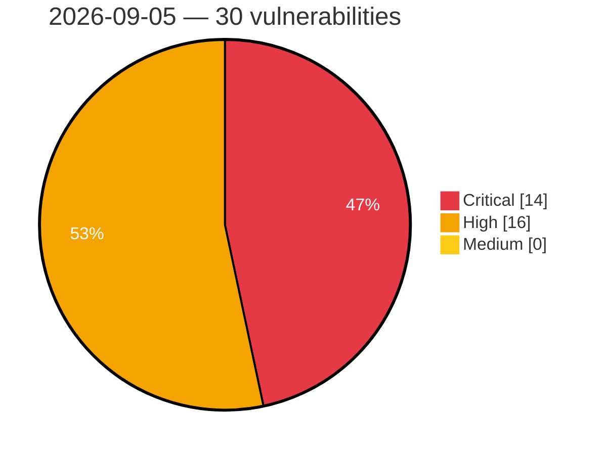

# Critical, High & Medium Severity Vulnerabilities — 2026-09-05

**Source status for this day:**

| Source | Critical | High | Medium | Total |
|--------|---------:|-----:|-------:|------:|
| cvefeed.io (High/Critical) | 14 | 16 | 0 | 30 |

**KEV (actively exploited):** 0  **Watchlist matches:** 25

## Critical (14)

| CVSS | Flags | Source | CVE / Title | Reported |
|------|-------|--------|-------------|----------|
| 9.8 | ⭐ | cvefeed.io (High/Critical) | [CVE-2026-83627 - Hummingbird – Speed Optimization, Caching, Minify, Compress & CDN <= 3.21.0 - Unauthenticated Remote Code Execution via Cookie Name in Page Cache Debug Log](https://cvefeed.io/vuln/detail/CVE-2026-83627) | 2 hours, 8 minutes ago |
| 9.8 | ⭐ | cvefeed.io (High/Critical) | [CVE-2026-13447 - MStore API <= 4.20.0 - Unauthenticated Authentication Bypass via 'id_token' Parameter JWT Forgery](https://cvefeed.io/vuln/detail/CVE-2026-13447) | 2 hours, 8 minutes ago |
| 9.8 | ⭐ | cvefeed.io (High/Critical) | [CVE-2026-86124 - AutoAgent Unauthenticated Remote Code Execution via the Sandbox TCP Command Server](https://cvefeed.io/vuln/detail/CVE-2026-86124) | 30 minutes ago |
| 9.8 | ⭐ | cvefeed.io (High/Critical) | [CVE-2026-86121 - Cua computer-server before 0.3.42 Unauthenticated RCE via Desktop Control](https://cvefeed.io/vuln/detail/CVE-2026-86121) | 30 minutes ago |
| 9.8 | — | cvefeed.io (High/Critical) | [CVE-2024-11080 - Post Grid and Gutenberg Blocks – ComboBlocks 2.2.85 - 2.3.32 - Unauthenticated Hook Injection](https://cvefeed.io/vuln/detail/CVE-2024-11080) | 1 hour, 12 minutes ago |
| 9.8 | ⭐ | cvefeed.io (High/Critical) | [CVE-2026-86184 - Lara Dashboard before 1.3.0 Missing Authentication in screenshot-login Route](https://cvefeed.io/vuln/detail/CVE-2026-86184) | 1 hour, 4 minutes ago |
| 9.8 | ⭐ | cvefeed.io (High/Critical) | [CVE-2026-10196 - Mail Mint <= 1.31.0 - Unauthenticated PHP Object Injection in Arbitrary Form Fields](https://cvefeed.io/vuln/detail/CVE-2026-10196) | 1 hour, 4 minutes ago |
| 9.8 | ⭐ | cvefeed.io (High/Critical) | [CVE-2026-86189 - WWBN AVideo Unauthenticated Path Traversal via notify.ffmpeg.json.php](https://cvefeed.io/vuln/detail/CVE-2026-86189) | 1 hour, 12 minutes ago |
| 9.4 | — | cvefeed.io (High/Critical) | [CVE-2026-52777 - YesWiki: Authenticated PHP Object Injection in BazarImportAction via unserialize](https://cvefeed.io/vuln/detail/CVE-2026-52777) | 3 hours, 50 minutes ago |
| 9.4 | ⭐ | cvefeed.io (High/Critical) | [CVE-2026-86123 - SQL Chat Unauthenticated Database-Connection Proxy in the /api/connection Endpoints](https://cvefeed.io/vuln/detail/CVE-2026-86123) | 30 minutes ago |
| 9.2 | ⭐ | cvefeed.io (High/Critical) | [CVE-2026-86119 - Webstudio through 0.296.0 SSRF via /cgi proxy routes](https://cvefeed.io/vuln/detail/CVE-2026-86119) | 30 minutes ago |
| 9.2 | ⭐ | cvefeed.io (High/Critical) | [CVE-2026-86117 - Coolify through 4.3.17 OAuth Account Takeover via Unverified Email Matching](https://cvefeed.io/vuln/detail/CVE-2026-86117) | 30 minutes ago |
| 9.1 | — | cvefeed.io (High/Critical) | [CVE-2026-52766 - YesWiki: Unauthenticated arbitrary page deletion via `{{erasespamedcomments}}` action](https://cvefeed.io/vuln/detail/CVE-2026-52766) | 3 hours, 50 minutes ago |
| 9.1 | ⭐ | cvefeed.io (High/Critical) | [CVE-2026-86190 - WWBN AVideo Broken Access Control via videoViewsInfo hash Parameter](https://cvefeed.io/vuln/detail/CVE-2026-86190) | 1 hour, 12 minutes ago |

## High (16)

| CVSS | Flags | Source | CVE / Title | Reported |
|------|-------|--------|-------------|----------|
| 8.8 | ⭐ | cvefeed.io (High/Critical) | [CVE-2026-52775 - YesWiki Authenticated SQL Injection in ReactionManager](https://cvefeed.io/vuln/detail/CVE-2026-52775) | 3 hours, 50 minutes ago |
| 8.8 | ⭐ | cvefeed.io (High/Critical) | [CVE-2026-19887 - Welcart e-Commerce <= 2.12.1 - Unauthenticated Arbitrary File Deletion via PHP Object Injection via 'reserve' Checkout Parameter and 'option' EDY Callback](https://cvefeed.io/vuln/detail/CVE-2026-19887) | 1 hour, 8 minutes ago |
| 8.8 | ⭐ | cvefeed.io (High/Critical) | [CVE-2026-81543 - Abandoned Cart Pro for WooCommerce <= 10.7.1 - Missing Authorization to Authenticated (Subscriber+) Privilege Escalation](https://cvefeed.io/vuln/detail/CVE-2026-81543) | 2 hours, 12 minutes ago |
| 8.8 | ⭐ | cvefeed.io (High/Critical) | [CVE-2025-9049 - Nokri – Job Board WordPress Theme <= 1.6.4 - Missing Authorization to Authenticated (Subscriber +) Privilege Escalation via Account Takeover](https://cvefeed.io/vuln/detail/CVE-2025-9049) | 1 hour, 4 minutes ago |
| 8.8 | ⭐ | cvefeed.io (High/Critical) | [CVE-2026-86177 - Pterodactyl Panel before 1.14.1 Privilege Escalation via Schedule Tasks](https://cvefeed.io/vuln/detail/CVE-2026-86177) | 2 hours, 4 minutes ago |
| 8.8 | ⭐ | cvefeed.io (High/Critical) | [CVE-2026-86169 - Axolotl through 0.18.0 Remote Code Execution via Multipack Patching](https://cvefeed.io/vuln/detail/CVE-2026-86169) | 2 hours, 4 minutes ago |
| 8.7 | ⭐ | cvefeed.io (High/Critical) | [CVE-2026-86196 - Grav API Plugin before 1.0.20 Authentication Bypass via Host Header](https://cvefeed.io/vuln/detail/CVE-2026-86196) | 1 hour, 12 minutes ago |
| 8.7 | ⭐ | cvefeed.io (High/Critical) | [CVE-2026-86195 - grav-plugin-api 1.0.0 through 1.0.19 Privilege Escalation via Dot-Keyed Super Flag](https://cvefeed.io/vuln/detail/CVE-2026-86195) | 1 hour, 12 minutes ago |
| 8.7 | ⭐ | cvefeed.io (High/Critical) | [CVE-2026-86193 - Grav API Plugin Authentication Bypass via Group-Inherited Super](https://cvefeed.io/vuln/detail/CVE-2026-86193) | 1 hour, 12 minutes ago |
| 8.7 | ⭐ | cvefeed.io (High/Critical) | [CVE-2026-86173 - MindsDB through 26.1.0 Unauthenticated SSRF via Web Crawler](https://cvefeed.io/vuln/detail/CVE-2026-86173) | 2 hours, 4 minutes ago |
| 8.6 | ⭐ | cvefeed.io (High/Critical) | [CVE-2026-86185 - Bilibili Desktop through 1.18.0 Remote Code Execution via TLS Verification Bypass](https://cvefeed.io/vuln/detail/CVE-2026-86185) | 1 hour, 4 minutes ago |
| 8.3 | ⭐ | cvefeed.io (High/Critical) | [CVE-2026-52771 - YesWiki: Second-Order SQL Injection in Page Delete API via Unescaped Page Tag (`ApiController::deletePage`)](https://cvefeed.io/vuln/detail/CVE-2026-52771) | 3 hours, 50 minutes ago |
| 8.3 | ⭐ | cvefeed.io (High/Critical) | [CVE-2026-52769 - YesWiki: Unauthenticated Server-Side Request Forgery via ActivityPub `Signature.keyId`](https://cvefeed.io/vuln/detail/CVE-2026-52769) | 3 hours, 50 minutes ago |
| 8.2 | — | cvefeed.io (High/Critical) | [CVE-2026-52767 - YesWiki: Unauthenticated ActivityPub Signature-Verification Bypass via `!openssl_verify(...)` accepting `int(-1)`](https://cvefeed.io/vuln/detail/CVE-2026-52767) | 3 hours, 50 minutes ago |
| 8.2 | ⭐ | cvefeed.io (High/Critical) | [CVE-2026-86145 - PCRE2 Out-of-Bounds Write Vulnerability](https://cvefeed.io/vuln/detail/CVE-2026-86145) | 2 hours, 8 minutes ago |
| 8.0 | — | cvefeed.io (High/Critical) | [CVE-2026-86140 - libxml2 Stack-Based Buffer Overflow](https://cvefeed.io/vuln/detail/CVE-2026-86140) | 3 hours, 8 minutes ago |
