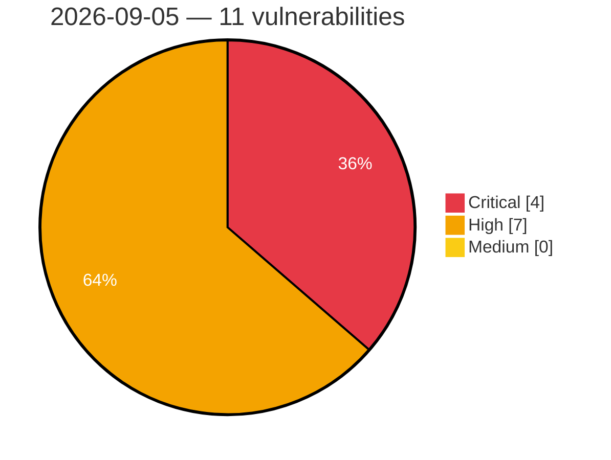

# Critical, High & Medium Severity Vulnerabilities — 2026-09-05

**Source status for this day:**

| Source | Critical | High | Medium | Total |
|--------|---------:|-----:|-------:|------:|
| cvefeed.io (High/Critical) | 4 | 7 | 0 | 11 |

**KEV (actively exploited):** 0  **Watchlist matches:** 7

## Critical (4)

| CVSS | Flags | Source | CVE / Title | Reported |
|------|-------|--------|-------------|----------|
| 9.8 | ⭐ | cvefeed.io (High/Critical) | [CVE-2026-83627 - Hummingbird – Speed Optimization, Caching, Minify, Compress & CDN <= 3.21.0 - Unauthenticated Remote Code Execution via Cookie Name in Page Cache Debug Log](https://cvefeed.io/vuln/detail/CVE-2026-83627) | 2 hours, 8 minutes ago |
| 9.8 | ⭐ | cvefeed.io (High/Critical) | [CVE-2026-13447 - MStore API <= 4.20.0 - Unauthenticated Authentication Bypass via 'id_token' Parameter JWT Forgery](https://cvefeed.io/vuln/detail/CVE-2026-13447) | 2 hours, 8 minutes ago |
| 9.4 | — | cvefeed.io (High/Critical) | [CVE-2026-52777 - YesWiki: Authenticated PHP Object Injection in BazarImportAction via unserialize](https://cvefeed.io/vuln/detail/CVE-2026-52777) | 3 hours, 50 minutes ago |
| 9.1 | — | cvefeed.io (High/Critical) | [CVE-2026-52766 - YesWiki: Unauthenticated arbitrary page deletion via `{{erasespamedcomments}}` action](https://cvefeed.io/vuln/detail/CVE-2026-52766) | 3 hours, 50 minutes ago |

## High (7)

| CVSS | Flags | Source | CVE / Title | Reported |
|------|-------|--------|-------------|----------|
| 8.8 | ⭐ | cvefeed.io (High/Critical) | [CVE-2026-52775 - YesWiki Authenticated SQL Injection in ReactionManager](https://cvefeed.io/vuln/detail/CVE-2026-52775) | 3 hours, 50 minutes ago |
| 8.8 | ⭐ | cvefeed.io (High/Critical) | [CVE-2026-19887 - Welcart e-Commerce <= 2.12.1 - Unauthenticated Arbitrary File Deletion via PHP Object Injection via 'reserve' Checkout Parameter and 'option' EDY Callback](https://cvefeed.io/vuln/detail/CVE-2026-19887) | 1 hour, 8 minutes ago |
| 8.3 | ⭐ | cvefeed.io (High/Critical) | [CVE-2026-52771 - YesWiki: Second-Order SQL Injection in Page Delete API via Unescaped Page Tag (`ApiController::deletePage`)](https://cvefeed.io/vuln/detail/CVE-2026-52771) | 3 hours, 50 minutes ago |
| 8.3 | ⭐ | cvefeed.io (High/Critical) | [CVE-2026-52769 - YesWiki: Unauthenticated Server-Side Request Forgery via ActivityPub `Signature.keyId`](https://cvefeed.io/vuln/detail/CVE-2026-52769) | 3 hours, 50 minutes ago |
| 8.2 | — | cvefeed.io (High/Critical) | [CVE-2026-52767 - YesWiki: Unauthenticated ActivityPub Signature-Verification Bypass via `!openssl_verify(...)` accepting `int(-1)`](https://cvefeed.io/vuln/detail/CVE-2026-52767) | 3 hours, 50 minutes ago |
| 8.2 | ⭐ | cvefeed.io (High/Critical) | [CVE-2026-86145 - PCRE2 Out-of-Bounds Write Vulnerability](https://cvefeed.io/vuln/detail/CVE-2026-86145) | 2 hours, 8 minutes ago |
| 8.0 | — | cvefeed.io (High/Critical) | [CVE-2026-86140 - libxml2 Stack-Based Buffer Overflow](https://cvefeed.io/vuln/detail/CVE-2026-86140) | 3 hours, 8 minutes ago |
