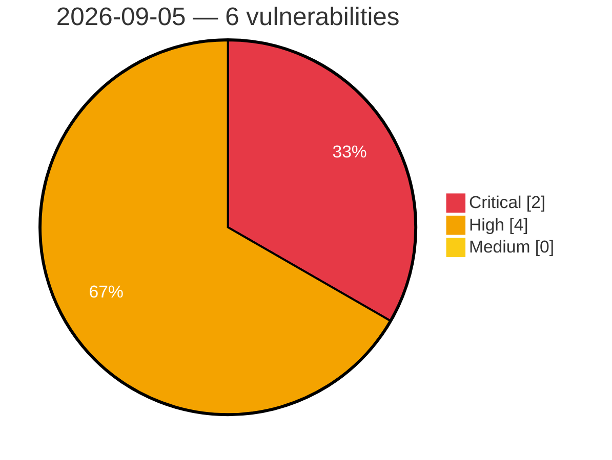

# Critical, High & Medium Severity Vulnerabilities — 2026-09-05

**Source status for this day:**

| Source | Critical | High | Medium | Total |
|--------|---------:|-----:|-------:|------:|
| cvefeed.io (High/Critical) | 2 | 4 | 0 | 6 |

**KEV (actively exploited):** 0  **Watchlist matches:** 3

## Critical (2)

| CVSS | Flags | Source | CVE / Title | Reported |
|------|-------|--------|-------------|----------|
| 9.4 | — | cvefeed.io (High/Critical) | [CVE-2026-52777 - YesWiki: Authenticated PHP Object Injection in BazarImportAction via unserialize](https://cvefeed.io/vuln/detail/CVE-2026-52777) | 3 hours, 50 minutes ago |
| 9.1 | — | cvefeed.io (High/Critical) | [CVE-2026-52766 - YesWiki: Unauthenticated arbitrary page deletion via `{{erasespamedcomments}}` action](https://cvefeed.io/vuln/detail/CVE-2026-52766) | 3 hours, 50 minutes ago |

## High (4)

| CVSS | Flags | Source | CVE / Title | Reported |
|------|-------|--------|-------------|----------|
| 8.8 | ⭐ | cvefeed.io (High/Critical) | [CVE-2026-52775 - YesWiki Authenticated SQL Injection in ReactionManager](https://cvefeed.io/vuln/detail/CVE-2026-52775) | 3 hours, 50 minutes ago |
| 8.3 | ⭐ | cvefeed.io (High/Critical) | [CVE-2026-52771 - YesWiki: Second-Order SQL Injection in Page Delete API via Unescaped Page Tag (`ApiController::deletePage`)](https://cvefeed.io/vuln/detail/CVE-2026-52771) | 3 hours, 50 minutes ago |
| 8.3 | ⭐ | cvefeed.io (High/Critical) | [CVE-2026-52769 - YesWiki: Unauthenticated Server-Side Request Forgery via ActivityPub `Signature.keyId`](https://cvefeed.io/vuln/detail/CVE-2026-52769) | 3 hours, 50 minutes ago |
| 8.2 | — | cvefeed.io (High/Critical) | [CVE-2026-52767 - YesWiki: Unauthenticated ActivityPub Signature-Verification Bypass via `!openssl_verify(...)` accepting `int(-1)`](https://cvefeed.io/vuln/detail/CVE-2026-52767) | 3 hours, 50 minutes ago |
