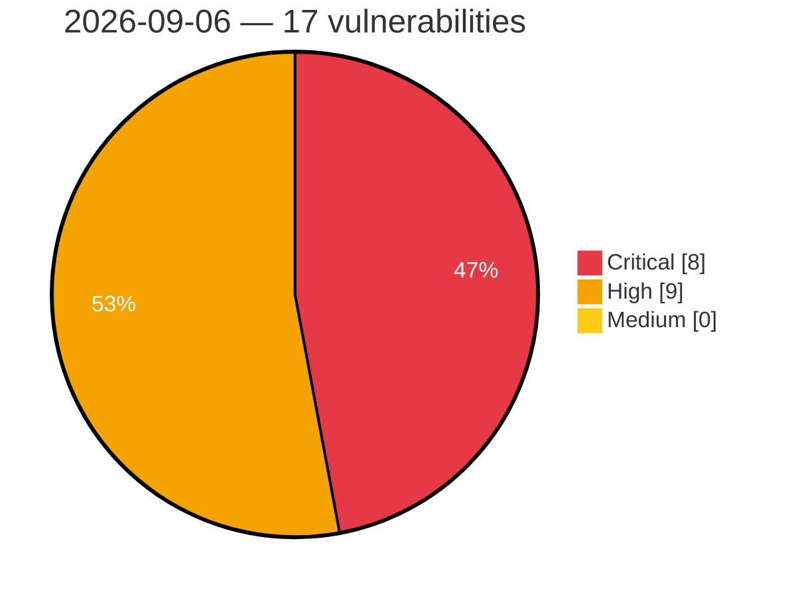

# Critical, High & Medium Severity Vulnerabilities — 2026-09-06

**Source status for this day:**

| Source | Critical | High | Medium | Total |
|--------|---------:|-----:|-------:|------:|
| cvefeed.io (High/Critical) | 8 | 9 | 0 | 17 |

**KEV (actively exploited):** 0  **Watchlist matches:** 10

## Critical (8)

| CVSS | Flags | Source | CVE / Title | Reported |
|------|-------|--------|-------------|----------|
| 10.0 | ⭐ | cvefeed.io (High/Critical) | [CVE-2026-86218 - pre-authentication remote code execution](https://cvefeed.io/vuln/detail/CVE-2026-86218) | 2 hours, 14 minutes ago |
| 10.0 | ⭐ | cvefeed.io (High/Critical) | [CVE-2026-86152 - Tenda CP3 Kylin AutoAddWifi.cpp ThreadProc os command injection](https://cvefeed.io/vuln/detail/CVE-2026-86152) | 3 hours, 14 minutes ago |
| 9.9 | ⭐ | cvefeed.io (High/Critical) | [CVE-2026-86167 - Tenda HG10 Boa formgponConf os command injection](https://cvefeed.io/vuln/detail/CVE-2026-86167) | 14 minutes ago |
| 9.8 | ⭐ | cvefeed.io (High/Critical) | [CVE-2026-75816 - Frontend Admin by DynamiApps <= 3.29.12 - Unauthenticated Account Takeover via '_acf_objects' Object Identifier](https://cvefeed.io/vuln/detail/CVE-2026-75816) | 2 hours, 14 minutes ago |
| 9.8 | — | cvefeed.io (High/Critical) | [CVE-2026-16310 - MemberDash <= 1.8.5 - Unauthenticated Account Takeover via Insecure Direct Object Reference via 'id' Parameter](https://cvefeed.io/vuln/detail/CVE-2026-16310) | 2 hours, 14 minutes ago |
| 9.4 | — | cvefeed.io (High/Critical) | [CVE-2026-86153 - Tenda CP3 Redirect.cpp SetRedirectEnable privileges management](https://cvefeed.io/vuln/detail/CVE-2026-86153) | 3 hours, 14 minutes ago |
| 9.4 | ⭐ | cvefeed.io (High/Critical) | [CVE-2026-86151 - Tenda CP3 Network Configuration Management system.c sub_2F77E8 os command injection](https://cvefeed.io/vuln/detail/CVE-2026-86151) | 5 hours, 14 minutes ago |
| 9.0 | ⭐ | cvefeed.io (High/Critical) | [CVE-2026-86259 - OpenMAIC before 1.0.1 SSRF via Environment-Gated URL Validation](https://cvefeed.io/vuln/detail/CVE-2026-86259) | 10 minutes ago |

## High (9)

| CVSS | Flags | Source | CVE / Title | Reported |
|------|-------|--------|-------------|----------|
| 10.0 | — | cvefeed.io (High/Critical) | [CVE-2026-86165 - Tenda HG10 formURL buffer overflow](https://cvefeed.io/vuln/detail/CVE-2026-86165) | 1 hour, 12 minutes ago |
| 9.0 | — | cvefeed.io (High/Critical) | [CVE-2026-86166 - Tenda HG10 Boa Web Server formWanRedirect buffer overflow](https://cvefeed.io/vuln/detail/CVE-2026-86166) | 1 hour, 12 minutes ago |
| 8.8 | — | cvefeed.io (High/Critical) | [CVE-2026-18480 - SureCart < 4.6.3 - Subscriber+ Administrator Account Takeover](https://cvefeed.io/vuln/detail/CVE-2026-18480) | 5 hours, 32 minutes ago |
| 8.7 | — | cvefeed.io (High/Critical) | [CVE-2026-86250 - h3 before 2.0.1-rc.18 Denial of Service via Unbounded Chunked Cookie](https://cvefeed.io/vuln/detail/CVE-2026-86250) | 31 minutes ago |
| 8.7 | — | cvefeed.io (High/Critical) | [CVE-2022-51009 - PocketMine-MP before 4.7.2 Denial of Service via Skin Geometry](https://cvefeed.io/vuln/detail/CVE-2022-51009) | 31 minutes ago |
| 8.2 | ⭐ | cvefeed.io (High/Critical) | [CVE-2026-86258 - nbviewer through 1.0.1 Path Traversal via LocalFileHandler](https://cvefeed.io/vuln/detail/CVE-2026-86258) | 10 minutes ago |
| 8.2 | ⭐ | cvefeed.io (High/Critical) | [CVE-2026-86253 - h3 before 1.15.6 Path Traversal via Percent-Encoded Dot Segments](https://cvefeed.io/vuln/detail/CVE-2026-86253) | 31 minutes ago |
| 8.2 | ⭐ | cvefeed.io (High/Critical) | [CVE-2026-86251 - h3 before 1.15.9 Path Traversal via Double Decoding](https://cvefeed.io/vuln/detail/CVE-2026-86251) | 31 minutes ago |
| 8.1 | ⭐ | cvefeed.io (High/Critical) | [CVE-2026-86242 - Unauthenticated RCE via Custom Plugin HTTP Path on Dynamically Linked Builds](https://cvefeed.io/vuln/detail/CVE-2026-86242) | 31 minutes ago |
