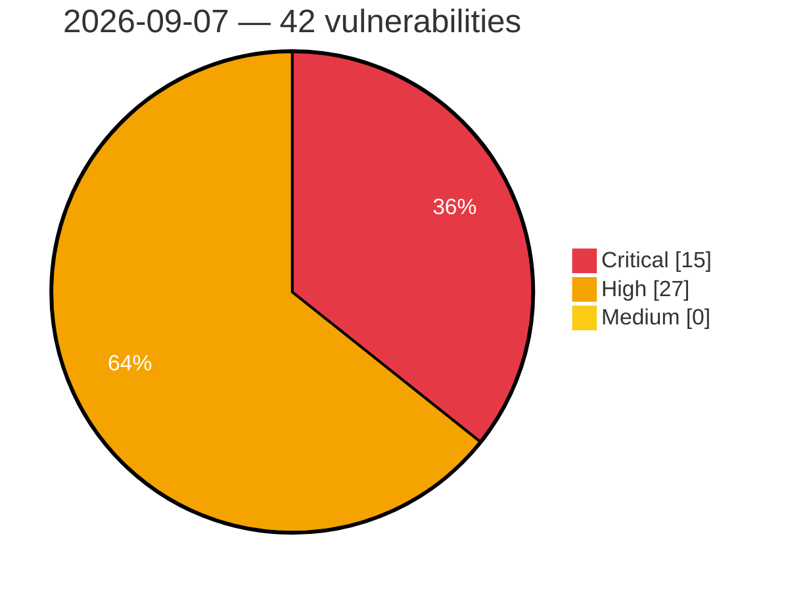

# Critical, High & Medium Severity Vulnerabilities — 2026-09-07

**Source status for this day:**

| Source | Critical | High | Medium | Total |
|--------|---------:|-----:|-------:|------:|
| cvefeed.io (High/Critical) | 15 | 27 | 0 | 42 |

**KEV (actively exploited):** 0  **Watchlist matches:** 28

## Critical (15)

| CVSS | Flags | Source | CVE / Title | Reported |
|------|-------|--------|-------------|----------|
| 10.0 | — | cvefeed.io (High/Critical) | [CVE-2026-86296 - D-Link DIR-822A udhcpcd serverpacket.c strcpy stack-based overflow](https://cvefeed.io/vuln/detail/CVE-2026-86296) | 3 hours, 33 minutes ago |
| 10.0 | ⭐ | cvefeed.io (High/Critical) | [CVE-2026-75650 - Adobe Commerce \| Improper Neutralization of Special Elements Used in a Template Engine (CWE-1336)](https://cvefeed.io/vuln/detail/CVE-2026-75650) | 29 minutes ago |
| 9.9 | ⭐ | cvefeed.io (High/Critical) | [CVE-2026-79698 - Advantech WISE-6610-NB Node-RED nodered_lib_apply command injection](https://cvefeed.io/vuln/detail/CVE-2026-79698) | 1 hour, 33 minutes ago |
| 9.9 | ⭐ | cvefeed.io (High/Critical) | [CVE-2026-79697 - Advantech WISE-6610-NB Basic Station Certificate-Deletion basicstation_apply command injection](https://cvefeed.io/vuln/detail/CVE-2026-79697) | 1 hour, 33 minutes ago |
| 9.9 | ⭐ | cvefeed.io (High/Critical) | [CVE-2026-86299 - Linksys RE7000 PingTest json.cgi platform_event_pingTest os command injection](https://cvefeed.io/vuln/detail/CVE-2026-86299) | 2 hours, 33 minutes ago |
| 9.8 | ⭐ | cvefeed.io (High/Critical) | [CVE-2026-7861 - Code Injection in Next4Biz's CSM (Customer Service Management)](https://cvefeed.io/vuln/detail/CVE-2026-7861) | 31 minutes ago |
| 9.8 | ⭐ | cvefeed.io (High/Critical) | [CVE-2026-18922 - 389-ds-base: 389-ds-base: sasl plain authentication allows privilege escalation to directory manager via stale identity in cyrus sasl auxiliary property](https://cvefeed.io/vuln/detail/CVE-2026-18922) | 36 minutes ago |
| 9.8 | — | cvefeed.io (High/Critical) | [CVE-2026-76578 - Ipa: freeipa: freeipa: unauthenticated ldap client can obtain administrator credentials via the self-managed-token aci](https://cvefeed.io/vuln/detail/CVE-2026-76578) | 1 hour, 30 minutes ago |
| 9.8 | — | cvefeed.io (High/Critical) | [CVE-2026-86480 - JetBrains Hub Improper Authorization Vulnerability](https://cvefeed.io/vuln/detail/CVE-2026-86480) | 2 hours, 20 minutes ago |
| 9.8 | — | cvefeed.io (High/Critical) | [CVE-2026-86478 - JetBrains YouTrack Improper Authentication Vulnerability](https://cvefeed.io/vuln/detail/CVE-2026-86478) | 2 hours, 20 minutes ago |
| 9.4 | ⭐ | cvefeed.io (High/Critical) | [CVE-2026-6223 - OTP Bypass in Bahçelievler Muncipality's BiHayat App](https://cvefeed.io/vuln/detail/CVE-2026-6223) | 1 hour, 30 minutes ago |
| 9.4 | — | cvefeed.io (High/Critical) | [CVE-2026-61410 - Dell Secure Connect Gateway Missing Authorization Vulnerability](https://cvefeed.io/vuln/detail/CVE-2026-61410) | 1 hour, 30 minutes ago |
| 9.3 | ⭐ | cvefeed.io (High/Critical) | [CVE-2026-16876 - NEC UNIVERGE IX-R/IX-V Authentication Bypass Vulnerability](https://cvefeed.io/vuln/detail/CVE-2026-16876) | 2 hours, 14 minutes ago |
| 9.3 | ⭐ | cvefeed.io (High/Critical) | [CVE-2026-80238 - Dell Secure Connect Gateway Privilege Escalation Vulnerability](https://cvefeed.io/vuln/detail/CVE-2026-80238) | 1 hour, 30 minutes ago |
| 9.2 | ⭐ | cvefeed.io (High/Critical) | [CVE-2026-86426 - LibreNMS before 26.8.0 Authentication Bypass via API Token Type Confusion](https://cvefeed.io/vuln/detail/CVE-2026-86426) | 1 hour, 30 minutes ago |

## High (27)

| CVSS | Flags | Source | CVE / Title | Reported |
|------|-------|--------|-------------|----------|
| 8.8 | ⭐ | cvefeed.io (High/Critical) | [CVE-2026-86427 - LibreNMS before 26.8.0 Argument Injection via graph_title](https://cvefeed.io/vuln/detail/CVE-2026-86427) | 1 hour, 30 minutes ago |
| 8.8 | ⭐ | cvefeed.io (High/Critical) | [CVE-2026-86404 - Artemis-server: artemis-jms-client: artemis-core-client: undertow-core: wildfly-messaging-activemq-subsystem: artemis messaging handlers in red hat eap permit deserialization by default](https://cvefeed.io/vuln/detail/CVE-2026-86404) | 2 hours, 33 minutes ago |
| 8.8 | ⭐ | cvefeed.io (High/Critical) | [CVE-2026-86482 - JetBrains YouTrack Privilege Escalation via Group Membership Modification](https://cvefeed.io/vuln/detail/CVE-2026-86482) | 2 hours, 20 minutes ago |
| 8.7 | — | cvefeed.io (High/Critical) | [CVE-2026-84732 - OpenVPN ACK Packet ID Integer Overflow Denial of Service](https://cvefeed.io/vuln/detail/CVE-2026-84732) | 33 minutes ago |
| 8.7 | ⭐ | cvefeed.io (High/Critical) | [CVE-2026-14297 - The Continuous Glucose Monitoring Service's Record Access Control Point (RACP) write handler `memcpy`s the entire attacker-supplied ATT write value into a fixed 20-byte BSS buffer.](https://cvefeed.io/vuln/detail/CVE-2026-14297) | 43 minutes ago |
| 8.7 | ⭐ | cvefeed.io (High/Critical) | [CVE-2026-86452 - MISP Unauthenticated Mail Endpoints Allow Unbounded Storage Consumption and Request Flooding](https://cvefeed.io/vuln/detail/CVE-2026-86452) | 33 minutes ago |
| 8.7 | ⭐ | cvefeed.io (High/Critical) | [CVE-2026-86435 - commonmark 1.5.0 before 2.8.4 Denial of Service via Footnote](https://cvefeed.io/vuln/detail/CVE-2026-86435) | 1 hour, 30 minutes ago |
| 8.7 | ⭐ | cvefeed.io (High/Critical) | [CVE-2026-86434 - commonmark 2.0.0 through 2.8.3 Denial of Service via Slug Collision](https://cvefeed.io/vuln/detail/CVE-2026-86434) | 1 hour, 30 minutes ago |
| 8.7 | ⭐ | cvefeed.io (High/Critical) | [CVE-2026-86433 - commonmark 1.5.0 before 2.8.4 Denial of Service via Attributes](https://cvefeed.io/vuln/detail/CVE-2026-86433) | 1 hour, 30 minutes ago |
| 8.7 | — | cvefeed.io (High/Critical) | [CVE-2026-86430 - league/commonmark before 2.9.1 Denial of Service via parsing](https://cvefeed.io/vuln/detail/CVE-2026-86430) | 1 hour, 30 minutes ago |
| 8.7 | — | cvefeed.io (High/Critical) | [CVE-2026-86429 - commonmark before 2.9.1 Denial of Service via SmartPunct and Attributes](https://cvefeed.io/vuln/detail/CVE-2026-86429) | 1 hour, 30 minutes ago |
| 8.7 | ⭐ | cvefeed.io (High/Critical) | [CVE-2026-86428 - commonmark 1.5.0 before 2.10.0 Denial of Service via Attributes](https://cvefeed.io/vuln/detail/CVE-2026-86428) | 1 hour, 30 minutes ago |
| 8.7 | — | cvefeed.io (High/Critical) | [CVE-2022-51017 - PocketMine-MP before 3.26.5 and 4.0.5 Denial of Service via Skin Data](https://cvefeed.io/vuln/detail/CVE-2022-51017) | 1 hour, 33 minutes ago |
| 8.6 | ⭐ | cvefeed.io (High/Critical) | [CVE-2026-86438 - Lara Dashboard before 1.3.2 Missing Authorization in Marketplace Module Install Action](https://cvefeed.io/vuln/detail/CVE-2026-86438) | 33 minutes ago |
| 8.6 | ⭐ | cvefeed.io (High/Critical) | [CVE-2026-86437 - Lara Dashboard before 1.3.2 Incorrect Authorization in Core-Upgrade Archive Upload](https://cvefeed.io/vuln/detail/CVE-2026-86437) | 33 minutes ago |
| 8.5 | — | cvefeed.io (High/Critical) | [CVE-2026-84226 - OpenVPN Windows Binary Planting Vulnerability](https://cvefeed.io/vuln/detail/CVE-2026-84226) | 33 minutes ago |
| 8.5 | — | cvefeed.io (High/Critical) | [CVE-2026-86492 - JetBrains YouTrack Cross-Tenant GitHub App Token Disclosure](https://cvefeed.io/vuln/detail/CVE-2026-86492) | 2 hours, 20 minutes ago |
| 8.4 | ⭐ | cvefeed.io (High/Critical) | [CVE-2026-19843 - 389-ds-base: 389-ds-base: command injection via unescaped ldap dn in cockpit 389 console ldap editor](https://cvefeed.io/vuln/detail/CVE-2026-19843) | 35 minutes ago |
| 8.4 | ⭐ | cvefeed.io (High/Critical) | [CVE-2026-86502 - JetBrains IntelliJ IDEA IJent gRPC Server Remote Code Execution](https://cvefeed.io/vuln/detail/CVE-2026-86502) | 2 hours, 20 minutes ago |
| 8.3 | ⭐ | cvefeed.io (High/Critical) | [CVE-2026-86295 - D-Link DIR-895L udhcpcd serverpacket.c sendACK command injection](https://cvefeed.io/vuln/detail/CVE-2026-86295) | 3 hours, 33 minutes ago |
| 8.2 | — | cvefeed.io (High/Critical) | [CVE-2026-79645 - Dell Secure Connect Gateway Missing Authentication for Critical Function Vulnerability](https://cvefeed.io/vuln/detail/CVE-2026-79645) | 45 minutes ago |
| 8.2 | — | cvefeed.io (High/Critical) | [CVE-2026-86297 - D-Link DIR-605 L2TP Control Message tunnel.c tunnel_set_params off-by-one](https://cvefeed.io/vuln/detail/CVE-2026-86297) | 3 hours, 33 minutes ago |
| 8.2 | ⭐ | cvefeed.io (High/Critical) | [CVE-2026-82586 - AshLua read operation aggregate bypasses the exposed-field allow-list, exposing private attributes](https://cvefeed.io/vuln/detail/CVE-2026-82586) | 16 minutes ago |
| 8.2 | ⭐ | cvefeed.io (High/Critical) | [CVE-2026-82753 - Unauthenticated authorize requests create unbounded, never-expiring CIMD client rows and cache entries in ash_authentication_oauth2_server](https://cvefeed.io/vuln/detail/CVE-2026-82753) | 27 minutes ago |
| 8.1 | — | cvefeed.io (High/Critical) | [CVE-2026-80132 - Dell Secure Connect Gateway Missing Authentication for Critical Function Vulnerability](https://cvefeed.io/vuln/detail/CVE-2026-80132) | 1 hour, 30 minutes ago |
| 8.1 | ⭐ | cvefeed.io (High/Critical) | [CVE-2026-79678 - Freeipa: idm: freeipa: idp-add eval() reachable before authorization check allows environment disclosure and denial of service](https://cvefeed.io/vuln/detail/CVE-2026-79678) | 1 hour, 30 minutes ago |
| 8.1 | ⭐ | cvefeed.io (High/Critical) | [CVE-2026-86479 - JetBrains YouTrack Insecure Direct Object Reference Vulnerability](https://cvefeed.io/vuln/detail/CVE-2026-86479) | 2 hours, 20 minutes ago |
