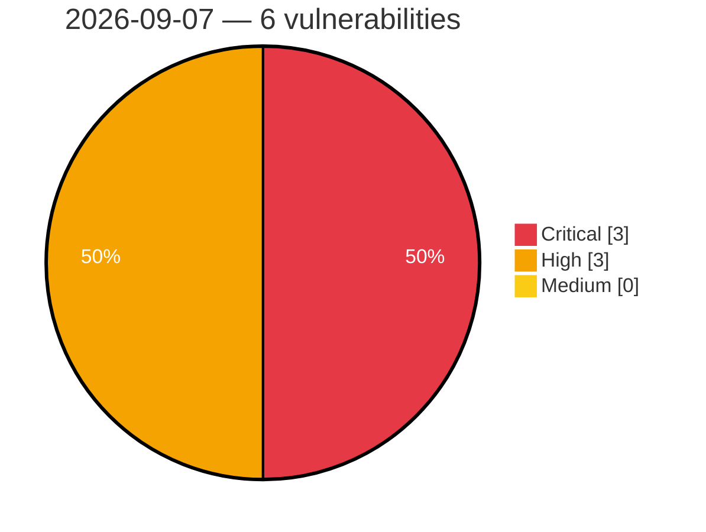

# Critical, High & Medium Severity Vulnerabilities — 2026-09-07

**Source status for this day:**

| Source | Critical | High | Medium | Total |
|--------|---------:|-----:|-------:|------:|
| cvefeed.io (High/Critical) | 3 | 3 | 0 | 6 |

**KEV (actively exploited):** 0  **Watchlist matches:** 4

## Critical (3)

| CVSS | Flags | Source | CVE / Title | Reported |
|------|-------|--------|-------------|----------|
| 9.9 | ⭐ | cvefeed.io (High/Critical) | [CVE-2026-79698 - Advantech WISE-6610-NB Node-RED nodered_lib_apply command injection](https://cvefeed.io/vuln/detail/CVE-2026-79698) | 1 hour, 33 minutes ago |
| 9.9 | ⭐ | cvefeed.io (High/Critical) | [CVE-2026-79697 - Advantech WISE-6610-NB Basic Station Certificate-Deletion basicstation_apply command injection](https://cvefeed.io/vuln/detail/CVE-2026-79697) | 1 hour, 33 minutes ago |
| 9.3 | ⭐ | cvefeed.io (High/Critical) | [CVE-2026-16876 - NEC UNIVERGE IX-R/IX-V Authentication Bypass Vulnerability](https://cvefeed.io/vuln/detail/CVE-2026-16876) | 2 hours, 14 minutes ago |

## High (3)

| CVSS | Flags | Source | CVE / Title | Reported |
|------|-------|--------|-------------|----------|
| 8.7 | — | cvefeed.io (High/Critical) | [CVE-2026-84732 - OpenVPN ACK Packet ID Integer Overflow Denial of Service](https://cvefeed.io/vuln/detail/CVE-2026-84732) | 33 minutes ago |
| 8.7 | ⭐ | cvefeed.io (High/Critical) | [CVE-2026-14297 - The Continuous Glucose Monitoring Service's Record Access Control Point (RACP) write handler `memcpy`s the entire attacker-supplied ATT write value into a fixed 20-byte BSS buffer.](https://cvefeed.io/vuln/detail/CVE-2026-14297) | 43 minutes ago |
| 8.5 | — | cvefeed.io (High/Critical) | [CVE-2026-84226 - OpenVPN Windows Binary Planting Vulnerability](https://cvefeed.io/vuln/detail/CVE-2026-84226) | 33 minutes ago |
