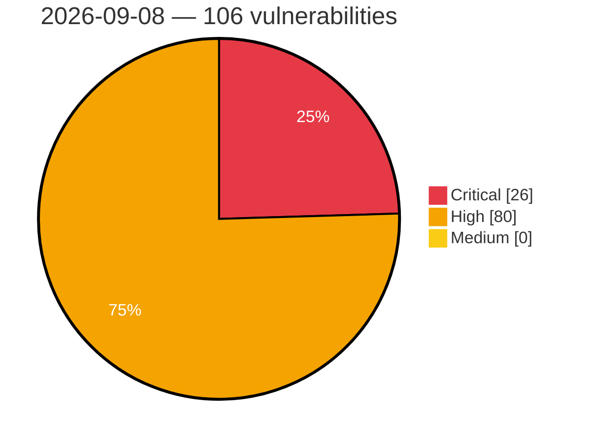

# Critical, High & Medium Severity Vulnerabilities — 2026-09-08

**Source status for this day:**

| Source | Critical | High | Medium | Total |
|--------|---------:|-----:|-------:|------:|
| cvefeed.io (High/Critical) | 26 | 80 | 0 | 106 |

**KEV (actively exploited):** 0  **Watchlist matches:** 55

## Critical (26)

| CVSS | Flags | Source | CVE / Title | Reported |
|------|-------|--------|-------------|----------|
| 10.0 | — | cvefeed.io (High/Critical) | [CVE-2026-44756 - Memory Corruption vulnerability in SAP Extended Passport (EPP) Processing](https://cvefeed.io/vuln/detail/CVE-2026-44756) | 3 hours, 33 minutes ago |
| 10.0 | ⭐ | cvefeed.io (High/Critical) | [CVE-2026-82004 - Adobe Campaign Classic (ACC) \| Improper Neutralization of Special Elements used in an OS Command ('OS Command Injection') (CWE-78)](https://cvefeed.io/vuln/detail/CVE-2026-82004) | 8 minutes ago |
| 10.0 | — | cvefeed.io (High/Critical) | [CVE-2026-49883 - PermissionsManager Sensitive Information Disclosure](https://cvefeed.io/vuln/detail/CVE-2026-49883) | 44 minutes ago |
| 10.0 | ⭐ | cvefeed.io (High/Critical) | [CVE-2026-28659 - MicroXR Blobstore Path Traversal Vulnerability](https://cvefeed.io/vuln/detail/CVE-2026-28659) | 44 minutes ago |
| 9.9 | — | cvefeed.io (High/Critical) | [CVE-2026-86510 - D-Link DIR-822A L2TP Control Message tunnel_set_params out-of-bounds write](https://cvefeed.io/vuln/detail/CVE-2026-86510) | 2 hours, 33 minutes ago |
| 9.9 | ⭐ | cvefeed.io (High/Critical) | [CVE-2026-78234 - Hawtio-operator: hawtio-operator: service-ca signing oracle allows arbitrary-cn certificate issuance to namespace edit users](https://cvefeed.io/vuln/detail/CVE-2026-78234) | 43 minutes ago |
| 9.9 | — | cvefeed.io (High/Critical) | [CVE-2026-83941 - Entra ID Elevation of Privilege Vulnerability](https://cvefeed.io/vuln/detail/CVE-2026-83941) | 40 minutes ago |
| 9.9 | ⭐ | cvefeed.io (High/Critical) | [CVE-2026-86464 - Eclipse aeriOS Identity Manager Insecure Default Configuration and Credential Vulnerability](https://cvefeed.io/vuln/detail/CVE-2026-86464) | 43 minutes ago |
| 9.9 | — | cvefeed.io (High/Critical) | [CVE-2026-84869 - ScreenConnect Client: Guest-to-Host File Execution via File-Transfer Actions](https://cvefeed.io/vuln/detail/CVE-2026-84869) | 43 minutes ago |
| 9.9 | — | cvefeed.io (High/Critical) | [CVE-2026-48273 - ColdFusion \| Improper Neutralization of Directives in Dynamically Evaluated Code ('Eval Injection') (CWE-95)](https://cvefeed.io/vuln/detail/CVE-2026-48273) | 44 minutes ago |
| 9.9 | — | cvefeed.io (High/Critical) | [CVE-2026-19232 - Adobe Experience Manager \| Incorrect Authorization (CWE-863)](https://cvefeed.io/vuln/detail/CVE-2026-19232) | 44 minutes ago |
| 9.8 | — | cvefeed.io (High/Critical) | [CVE-2026-58240 - Missing Authentication check in SAP NetWeaver (Message Server)](https://cvefeed.io/vuln/detail/CVE-2026-58240) | 3 hours, 33 minutes ago |
| 9.8 | ⭐ | cvefeed.io (High/Critical) | [CVE-2026-71374 - Deserialization of Untrusted Data Vulnerability in Cosminexus Component Container](https://cvefeed.io/vuln/detail/CVE-2026-71374) | 39 minutes ago |
| 9.8 | — | cvefeed.io (High/Critical) | [CVE-2026-71377 - Command Argument Injection Vulnerability in Cosminexus Component Container](https://cvefeed.io/vuln/detail/CVE-2026-71377) | 41 minutes ago |
| 9.8 | ⭐ | cvefeed.io (High/Critical) | [CVE-2026-71376 - OS Command Injection Vulnerability in Cosminexus Component Container](https://cvefeed.io/vuln/detail/CVE-2026-71376) | 54 minutes ago |
| 9.8 | ⭐ | cvefeed.io (High/Critical) | [CVE-2026-68839 - Windows USB Mass Storage Class Driver Remote Code Execution Vulnerability](https://cvefeed.io/vuln/detail/CVE-2026-68839) | 20 minutes ago |
| 9.6 | — | cvefeed.io (High/Critical) | [CVE-2026-86509 - D-Link DIR-895L udhcpcd serverpacket.c sendACK stack-based overflow](https://cvefeed.io/vuln/detail/CVE-2026-86509) | 3 hours, 33 minutes ago |
| 9.6 | — | cvefeed.io (High/Critical) | [CVE-2026-65669 - Microsoft SQL Server Elevation of Privilege Vulnerability](https://cvefeed.io/vuln/detail/CVE-2026-65669) | 21 minutes ago |
| 9.6 | — | cvefeed.io (High/Critical) | [CVE-2026-81376 - Visual Studio Code Security Feature Bypass Vulnerability](https://cvefeed.io/vuln/detail/CVE-2026-81376) | 40 minutes ago |
| 9.4 | ⭐ | cvefeed.io (High/Critical) | [CVE-2026-76969 - Credential disclosure in multitenant applications using SAP Cloud Application Programming Model (CAP)](https://cvefeed.io/vuln/detail/CVE-2026-76969) | 3 hours, 33 minutes ago |
| 9.3 | ⭐ | cvefeed.io (High/Critical) | [CVE-2026-77089 - Command Center API Authentication Bypass](https://cvefeed.io/vuln/detail/CVE-2026-77089) | 47 minutes ago |
| 9.3 | — | cvefeed.io (High/Critical) | [CVE-2026-62647 - Reyrolle 7SR5 Insufficiently Random Values Vulnerability](https://cvefeed.io/vuln/detail/CVE-2026-62647) | 3 hours, 41 minutes ago |
| 9.2 | — | cvefeed.io (High/Critical) | [CVE-2026-67367 - SIMOVE Fleetmanager and SIPLANT Directory Traversal Vulnerability](https://cvefeed.io/vuln/detail/CVE-2026-67367) | 3 hours, 41 minutes ago |
| 9.2 | ⭐ | cvefeed.io (High/Critical) | [CVE-2026-84197 - Eclipse Ditto JavaScript Client Improper Certificate Validation Vulnerability](https://cvefeed.io/vuln/detail/CVE-2026-84197) | 43 minutes ago |
| 9.1 | ⭐ | cvefeed.io (High/Critical) | [CVE-2026-75746 - ColdFusion \| Improper Neutralization of Special Elements used in an SQL Command ('SQL Injection') (CWE-89)](https://cvefeed.io/vuln/detail/CVE-2026-75746) | 43 minutes ago |
| 9.0 | ⭐ | cvefeed.io (High/Critical) | [CVE-2026-66768 - Improper Access Control in SAP NetWeaver (SAP GUI for Java)](https://cvefeed.io/vuln/detail/CVE-2026-66768) | 3 hours, 33 minutes ago |

## High (80)

| CVSS | Flags | Source | CVE / Title | Reported |
|------|-------|--------|-------------|----------|
| 8.8 | ⭐ | cvefeed.io (High/Critical) | [CVE-2026-86712 - SiYuan before 3.8.2 Remote Code Execution via Clipboard](https://cvefeed.io/vuln/detail/CVE-2026-86712) | 43 minutes ago |
| 8.8 | ⭐ | cvefeed.io (High/Critical) | [CVE-2026-16502 - Live Composer <= 2.1.18 - Authenticated (Contributor+) PHP Object Injection via Shortcode](https://cvefeed.io/vuln/detail/CVE-2026-16502) | 43 minutes ago |
| 8.8 | ⭐ | cvefeed.io (High/Critical) | [CVE-2026-77098 - Private Metrics Server SQL Injection](https://cvefeed.io/vuln/detail/CVE-2026-77098) | 47 minutes ago |
| 8.8 | — | cvefeed.io (High/Critical) | [CVE-2026-77097 - Private Metrics Server Denial of Service](https://cvefeed.io/vuln/detail/CVE-2026-77097) | 47 minutes ago |
| 8.8 | ⭐ | cvefeed.io (High/Critical) | [CVE-2026-62650 - Reyrolle 7SR5 Privilege Escalation Vulnerability](https://cvefeed.io/vuln/detail/CVE-2026-62650) | 3 hours, 41 minutes ago |
| 8.8 | — | cvefeed.io (High/Critical) | [CVE-2026-66819 - Microsoft SQL Server Elevation of Privilege Vulnerability](https://cvefeed.io/vuln/detail/CVE-2026-66819) | 16 minutes ago |
| 8.8 | ⭐ | cvefeed.io (High/Critical) | [CVE-2026-65772 - Microsoft Dynamics 365 On-Premises Remote Code Execution Vulnerability](https://cvefeed.io/vuln/detail/CVE-2026-65772) | 17 minutes ago |
| 8.8 | ⭐ | cvefeed.io (High/Critical) | [CVE-2026-69266 - Windows DHCP Server Remote Code Execution Vulnerability](https://cvefeed.io/vuln/detail/CVE-2026-69266) | 20 minutes ago |
| 8.8 | ⭐ | cvefeed.io (High/Critical) | [CVE-2026-68828 - Remote Desktop Client Remote Code Execution Vulnerability](https://cvefeed.io/vuln/detail/CVE-2026-68828) | 20 minutes ago |
| 8.8 | ⭐ | cvefeed.io (High/Critical) | [CVE-2026-68775 - Microsoft SQL Server Remote Code Execution Vulnerability](https://cvefeed.io/vuln/detail/CVE-2026-68775) | 20 minutes ago |
| 8.8 | ⭐ | cvefeed.io (High/Critical) | [CVE-2026-67642 - Microsoft SQL Server Remote Code Execution Vulnerability](https://cvefeed.io/vuln/detail/CVE-2026-67642) | 20 minutes ago |
| 8.8 | ⭐ | cvefeed.io (High/Critical) | [CVE-2026-67639 - Microsoft SQL Server Remote Code Execution Vulnerability](https://cvefeed.io/vuln/detail/CVE-2026-67639) | 20 minutes ago |
| 8.8 | ⭐ | cvefeed.io (High/Critical) | [CVE-2026-67638 - Microsoft SQL Server Remote Code Execution Vulnerability](https://cvefeed.io/vuln/detail/CVE-2026-67638) | 20 minutes ago |
| 8.8 | ⭐ | cvefeed.io (High/Critical) | [CVE-2026-67388 - Microsoft SQL Server Remote Code Execution Vulnerability](https://cvefeed.io/vuln/detail/CVE-2026-67388) | 20 minutes ago |
| 8.8 | ⭐ | cvefeed.io (High/Critical) | [CVE-2026-67385 - Microsoft SQL Server Remote Code Execution Vulnerability](https://cvefeed.io/vuln/detail/CVE-2026-67385) | 20 minutes ago |
| 8.8 | — | cvefeed.io (High/Critical) | [CVE-2026-67381 - Microsoft SQL Server Elevation of Privilege Vulnerability](https://cvefeed.io/vuln/detail/CVE-2026-67381) | 20 minutes ago |
| 8.8 | ⭐ | cvefeed.io (High/Critical) | [CVE-2026-67380 - Microsoft SQL Server Remote Code Execution Vulnerability](https://cvefeed.io/vuln/detail/CVE-2026-67380) | 20 minutes ago |
| 8.8 | — | cvefeed.io (High/Critical) | [CVE-2026-66820 - SQL Server Elevation of Privilege Vulnerability](https://cvefeed.io/vuln/detail/CVE-2026-66820) | 20 minutes ago |
| 8.8 | — | cvefeed.io (High/Critical) | [CVE-2026-66818 - Microsoft SQL Server Elevation of Privilege Vulnerability](https://cvefeed.io/vuln/detail/CVE-2026-66818) | 20 minutes ago |
| 8.8 | — | cvefeed.io (High/Critical) | [CVE-2026-66814 - Microsoft SQL Server Elevation of Privilege Vulnerability](https://cvefeed.io/vuln/detail/CVE-2026-66814) | 21 minutes ago |
| 8.8 | ⭐ | cvefeed.io (High/Critical) | [CVE-2026-68786 - Microsoft SQL Server Remote Code Execution Vulnerability](https://cvefeed.io/vuln/detail/CVE-2026-68786) | 21 minutes ago |
| 8.8 | ⭐ | cvefeed.io (High/Critical) | [CVE-2026-85877 - Windows Print Spooler Remote Code Execution Vulnerability](https://cvefeed.io/vuln/detail/CVE-2026-85877) | 39 minutes ago |
| 8.8 | ⭐ | cvefeed.io (High/Critical) | [CVE-2026-83998 - Remote Desktop Client Remote Code Execution Vulnerability](https://cvefeed.io/vuln/detail/CVE-2026-83998) | 39 minutes ago |
| 8.8 | — | cvefeed.io (High/Critical) | [CVE-2026-83996 - Windows Error Reporting Elevation of Privilege Vulnerability](https://cvefeed.io/vuln/detail/CVE-2026-83996) | 39 minutes ago |
| 8.8 | ⭐ | cvefeed.io (High/Critical) | [CVE-2026-83992 - Windows Imaging Component Remote Code Execution Vulnerability](https://cvefeed.io/vuln/detail/CVE-2026-83992) | 39 minutes ago |
| 8.8 | ⭐ | cvefeed.io (High/Critical) | [CVE-2026-81955 - Windows Graphics Component Remote Code Execution Vulnerability](https://cvefeed.io/vuln/detail/CVE-2026-81955) | 40 minutes ago |
| 8.8 | ⭐ | cvefeed.io (High/Critical) | [CVE-2026-81952 - Microsoft Word Remote Code Execution Vulnerability](https://cvefeed.io/vuln/detail/CVE-2026-81952) | 40 minutes ago |
| 8.8 | ⭐ | cvefeed.io (High/Critical) | [CVE-2026-81385 - Microsoft Office Publisher Remote Code Execution Vulnerability](https://cvefeed.io/vuln/detail/CVE-2026-81385) | 40 minutes ago |
| 8.8 | ⭐ | cvefeed.io (High/Critical) | [CVE-2026-81352 - Web Media Extensions Remote Code Execution Vulnerability](https://cvefeed.io/vuln/detail/CVE-2026-81352) | 40 minutes ago |
| 8.8 | — | cvefeed.io (High/Critical) | [CVE-2026-80096 - Windows Remote Desktop Services Elevation of Privilege Vulnerability](https://cvefeed.io/vuln/detail/CVE-2026-80096) | 40 minutes ago |
| 8.8 | ⭐ | cvefeed.io (High/Critical) | [CVE-2026-80085 - Microsoft Office Word Remote Code Execution Vulnerability](https://cvefeed.io/vuln/detail/CVE-2026-80085) | 40 minutes ago |
| 8.8 | ⭐ | cvefeed.io (High/Critical) | [CVE-2026-81996 - Acrobat Reader \| Incorrect Authorization (CWE-863)](https://cvefeed.io/vuln/detail/CVE-2026-81996) | 31 minutes ago |
| 8.8 | — | cvefeed.io (High/Critical) | [CVE-2026-82537 - Roo-Code 3.54.0 Auto-Approve Bypass via Shell Parser Word-Boundary Mismatch](https://cvefeed.io/vuln/detail/CVE-2026-82537) | 1 hour, 42 minutes ago |
| 8.8 | — | cvefeed.io (High/Critical) | [CVE-2026-82536 - Roo-Code 3.54.0 Auto-Approve Bypass via Shell Command Pipe Operator](https://cvefeed.io/vuln/detail/CVE-2026-82536) | 1 hour, 42 minutes ago |
| 8.7 | — | cvefeed.io (High/Critical) | [CVE-2026-12611 - Jetty HTTP/2 Denial of Service Vulnerability](https://cvefeed.io/vuln/detail/CVE-2026-12611) | 31 minutes ago |
| 8.7 | ⭐ | cvefeed.io (High/Critical) | [CVE-2026-80219 - Hawtio-operator: hawtio-operator: oauthclient created with grantmethod auto and no secret enables oauth token theft](https://cvefeed.io/vuln/detail/CVE-2026-80219) | 43 minutes ago |
| 8.7 | ⭐ | cvefeed.io (High/Critical) | [CVE-2026-77105 - CommServe Privilege Escalation](https://cvefeed.io/vuln/detail/CVE-2026-77105) | 47 minutes ago |
| 8.7 | ⭐ | cvefeed.io (High/Critical) | [CVE-2026-77103 - CommServe Information Disclosure](https://cvefeed.io/vuln/detail/CVE-2026-77103) | 47 minutes ago |
| 8.7 | — | cvefeed.io (High/Critical) | [CVE-2026-77102 - CommServe Denial of Service](https://cvefeed.io/vuln/detail/CVE-2026-77102) | 47 minutes ago |
| 8.7 | — | cvefeed.io (High/Critical) | [CVE-2026-77101 - CommServe Stack-based Buffer Overflow](https://cvefeed.io/vuln/detail/CVE-2026-77101) | 47 minutes ago |
| 8.7 | ⭐ | cvefeed.io (High/Critical) | [CVE-2026-62649 - Reyrolle 7SR5 Denial of Service Vulnerability](https://cvefeed.io/vuln/detail/CVE-2026-62649) | 3 hours, 41 minutes ago |
| 8.7 | — | cvefeed.io (High/Critical) | [CVE-2026-62648 - Reyrolle 7SR5 Out-of-Bounds Write Denial-of-Service Vulnerability](https://cvefeed.io/vuln/detail/CVE-2026-62648) | 3 hours, 41 minutes ago |
| 8.7 | ⭐ | cvefeed.io (High/Critical) | [CVE-2026-84942 - Stored Cross-Site Scripting via Vega Expression Function Bypass in OpenSearch Dashboards](https://cvefeed.io/vuln/detail/CVE-2026-84942) | 43 minutes ago |
| 8.7 | ⭐ | cvefeed.io (High/Critical) | [CVE-2026-77111 - Adobe Commerce \| Incorrect Authorization (CWE-863)](https://cvefeed.io/vuln/detail/CVE-2026-77111) | 1 hour, 42 minutes ago |
| 8.6 | — | cvefeed.io (High/Critical) | [CVE-2026-80097 - Microsoft Authenticator Elevation of Privilege Vulnerability](https://cvefeed.io/vuln/detail/CVE-2026-80097) | 40 minutes ago |
| 8.6 | — | cvefeed.io (High/Critical) | [CVE-2026-76199 - Photoshop Desktop \| Uncontrolled Search Path Element (CWE-427)](https://cvefeed.io/vuln/detail/CVE-2026-76199) | 43 minutes ago |
| 8.6 | — | cvefeed.io (High/Critical) | [CVE-2026-76190 - ColdFusion \| Improper Neutralization of Directives in Dynamically Evaluated Code ('Eval Injection') (CWE-95)](https://cvefeed.io/vuln/detail/CVE-2026-76190) | 43 minutes ago |
| 8.6 | — | cvefeed.io (High/Critical) | [CVE-2026-75991 - Illustrator \| Improper Input Validation (CWE-20)](https://cvefeed.io/vuln/detail/CVE-2026-75991) | 43 minutes ago |
| 8.6 | — | cvefeed.io (High/Critical) | [CVE-2026-75990 - Illustrator \| Incorrect Authorization (CWE-863)](https://cvefeed.io/vuln/detail/CVE-2026-75990) | 43 minutes ago |
| 8.6 | — | cvefeed.io (High/Critical) | [CVE-2026-79721 - MLflow Arbitrary Code Execution](https://cvefeed.io/vuln/detail/CVE-2026-79721) | 1 hour, 42 minutes ago |
| 8.6 | ⭐ | cvefeed.io (High/Critical) | [CVE-2026-77774 - Adobe Commerce \| Incorrect Authorization (CWE-863)](https://cvefeed.io/vuln/detail/CVE-2026-77774) | 1 hour, 42 minutes ago |
| 8.5 | ⭐ | cvefeed.io (High/Critical) | [CVE-2026-76958 - XML External Entity (XXE) Vulnerability in SAP Integration Suite](https://cvefeed.io/vuln/detail/CVE-2026-76958) | 3 hours, 33 minutes ago |
| 8.5 | — | cvefeed.io (High/Critical) | [CVE-2026-74860 - Libxml2: double-free/uaf in libxml2 python bindings](https://cvefeed.io/vuln/detail/CVE-2026-74860) | 43 minutes ago |
| 8.5 | ⭐ | cvefeed.io (High/Critical) | [CVE-2026-77091 - DataCube Security Feature Bypass](https://cvefeed.io/vuln/detail/CVE-2026-77091) | 47 minutes ago |
| 8.5 | ⭐ | cvefeed.io (High/Critical) | [CVE-2026-85384 - Authenticated Stack-Based Buffer Overflow in RE210 AC750 Configuration Import](https://cvefeed.io/vuln/detail/CVE-2026-85384) | 17 minutes ago |
| 8.5 | ⭐ | cvefeed.io (High/Critical) | [CVE-2026-75993 - ColdFusion \| Cross-site Scripting (Reflected XSS) (CWE-79)](https://cvefeed.io/vuln/detail/CVE-2026-75993) | 43 minutes ago |
| 8.4 | — | cvefeed.io (High/Critical) | [CVE-2026-81822 - AVEVA Pipeline Integrity Monitor Use of a Broken or Risky Cryptographic Algorithm](https://cvefeed.io/vuln/detail/CVE-2026-81822) | 40 minutes ago |
| 8.4 | — | cvefeed.io (High/Critical) | [CVE-2026-81821 - AVEVA Pipeline Integrity Monitor Use of hard-coded cryptographic key](https://cvefeed.io/vuln/detail/CVE-2026-81821) | 40 minutes ago |
| 8.4 | — | cvefeed.io (High/Critical) | [CVE-2026-75999 - ColdFusion \| Improper Input Validation (CWE-20)](https://cvefeed.io/vuln/detail/CVE-2026-75999) | 43 minutes ago |
| 8.3 | ⭐ | cvefeed.io (High/Critical) | [CVE-2026-77104 - CommServe Path Traversal](https://cvefeed.io/vuln/detail/CVE-2026-77104) | 47 minutes ago |
| 8.3 | — | cvefeed.io (High/Critical) | [CVE-2026-19203 - Jetty HTTP Request Smuggling Vulnerability](https://cvefeed.io/vuln/detail/CVE-2026-19203) | 51 minutes ago |
| 8.2 | ⭐ | cvefeed.io (High/Critical) | [CVE-2026-77968 - Hawtio-operator: hawtio-operator: cluster-wide secrets read/write granted to operator serviceaccount](https://cvefeed.io/vuln/detail/CVE-2026-77968) | 43 minutes ago |
| 8.2 | — | cvefeed.io (High/Critical) | [CVE-2026-83939 - Windows Secure Kernel Mode Elevation of Privilege Vulnerability](https://cvefeed.io/vuln/detail/CVE-2026-83939) | 40 minutes ago |
| 8.2 | — | cvefeed.io (High/Critical) | [CVE-2026-81379 - Visual Studio Code Security Feature Bypass Vulnerability](https://cvefeed.io/vuln/detail/CVE-2026-81379) | 40 minutes ago |
| 8.2 | — | cvefeed.io (High/Critical) | [CVE-2026-81378 - Visual Studio Code Security Feature Bypass Vulnerability](https://cvefeed.io/vuln/detail/CVE-2026-81378) | 40 minutes ago |
| 8.2 | ⭐ | cvefeed.io (High/Critical) | [CVE-2026-81357 - Visual Studio Code Security Feature Bypass Vulnerability](https://cvefeed.io/vuln/detail/CVE-2026-81357) | 40 minutes ago |
| 8.2 | — | cvefeed.io (High/Critical) | [CVE-2026-81356 - Visual Studio Code Security Feature Bypass Vulnerability](https://cvefeed.io/vuln/detail/CVE-2026-81356) | 40 minutes ago |
| 8.2 | — | cvefeed.io (High/Critical) | [CVE-2026-81354 - Windows Hello Elevation of Privilege Vulnerability](https://cvefeed.io/vuln/detail/CVE-2026-81354) | 40 minutes ago |
| 8.2 | — | cvefeed.io (High/Critical) | [CVE-2026-81994 - Acrobat Reader \| Improperly Controlled Modification of Object Prototype Attributes ('Prototype Pollution') (CWE-1321)](https://cvefeed.io/vuln/detail/CVE-2026-81994) | 31 minutes ago |
| 8.1 | ⭐ | cvefeed.io (High/Critical) | [CVE-2026-75021 - fastify-cli vulnerable to remote code execution via ignored explicit Inspector bind address](https://cvefeed.io/vuln/detail/CVE-2026-75021) | 9 minutes ago |
| 8.1 | ⭐ | cvefeed.io (High/Critical) | [CVE-2026-47297 - Microsoft SQL Server Remote Code Execution Vulnerability](https://cvefeed.io/vuln/detail/CVE-2026-47297) | 18 minutes ago |
| 8.1 | ⭐ | cvefeed.io (High/Critical) | [CVE-2026-83997 - Windows Message Queuing Remote Code Execution Vulnerability](https://cvefeed.io/vuln/detail/CVE-2026-83997) | 39 minutes ago |
| 8.1 | ⭐ | cvefeed.io (High/Critical) | [CVE-2026-78626 - Improper Input Sanitization in Okta Access Gateway Protected Rules](https://cvefeed.io/vuln/detail/CVE-2026-78626) | 43 minutes ago |
| 8.0 | — | cvefeed.io (High/Critical) | [CVE-2026-68894 - Windows Error Reporting Elevation of Privilege Vulnerability](https://cvefeed.io/vuln/detail/CVE-2026-68894) | 20 minutes ago |
| 8.0 | — | cvefeed.io (High/Critical) | [CVE-2026-68876 - Windows Program Compatibility Assistant Service Elevation of Privilege Vulnerability](https://cvefeed.io/vuln/detail/CVE-2026-68876) | 20 minutes ago |
| 8.0 | — | cvefeed.io (High/Critical) | [CVE-2026-68880 - Windows Win32k Elevation of Privilege Vulnerability](https://cvefeed.io/vuln/detail/CVE-2026-68880) | 20 minutes ago |
| 8.0 | — | cvefeed.io (High/Critical) | [CVE-2026-68838 - Windows NTFS Elevation of Privilege Vulnerability](https://cvefeed.io/vuln/detail/CVE-2026-68838) | 20 minutes ago |
| 8.0 | — | cvefeed.io (High/Critical) | [CVE-2026-68834 - Windows NTFS Elevation of Privilege Vulnerability](https://cvefeed.io/vuln/detail/CVE-2026-68834) | 20 minutes ago |
| 8.0 | — | cvefeed.io (High/Critical) | [CVE-2026-68827 - Windows GDI+ Elevation of Privilege Vulnerability](https://cvefeed.io/vuln/detail/CVE-2026-68827) | 20 minutes ago |
| 8.0 | ⭐ | cvefeed.io (High/Critical) | [CVE-2026-83948 - Microsoft Azure CLI Remote Code Execution Vulnerability](https://cvefeed.io/vuln/detail/CVE-2026-83948) | 40 minutes ago |
