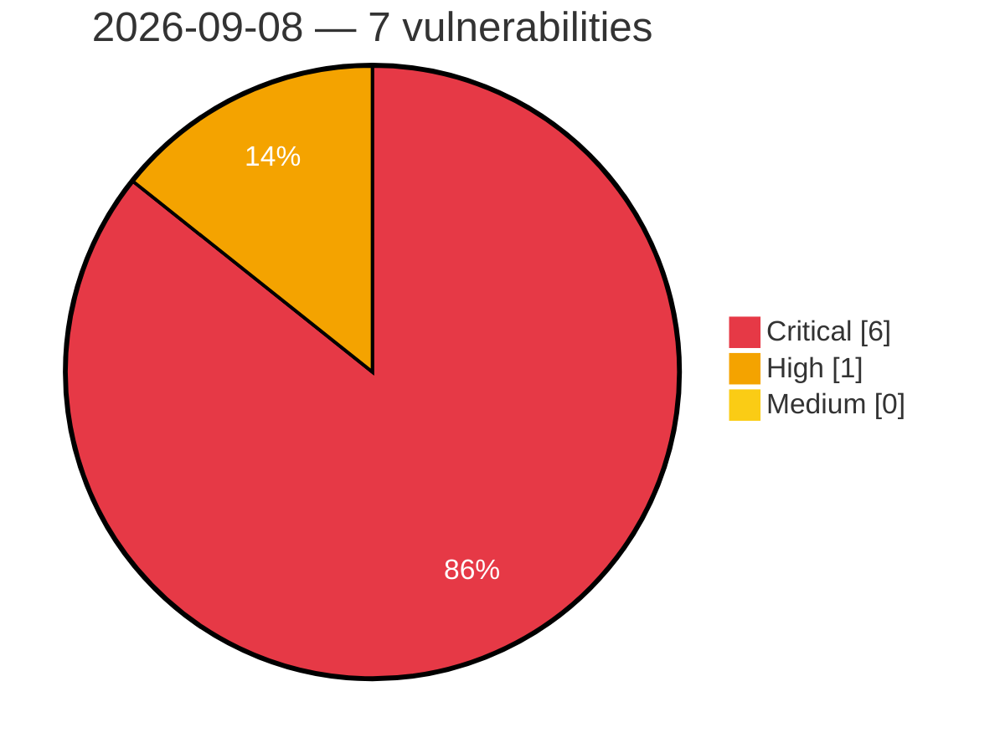

# Critical, High & Medium Severity Vulnerabilities — 2026-09-08

**Source status for this day:**

| Source | Critical | High | Medium | Total |
|--------|---------:|-----:|-------:|------:|
| cvefeed.io (High/Critical) | 6 | 1 | 0 | 7 |

**KEV (actively exploited):** 0  **Watchlist matches:** 3

## Critical (6)

| CVSS | Flags | Source | CVE / Title | Reported |
|------|-------|--------|-------------|----------|
| 10.0 | — | cvefeed.io (High/Critical) | [CVE-2026-44756 - Memory Corruption vulnerability in SAP Extended Passport (EPP) Processing](https://cvefeed.io/vuln/detail/CVE-2026-44756) | 3 hours, 33 minutes ago |
| 9.9 | — | cvefeed.io (High/Critical) | [CVE-2026-86510 - D-Link DIR-822A L2TP Control Message tunnel_set_params out-of-bounds write](https://cvefeed.io/vuln/detail/CVE-2026-86510) | 2 hours, 33 minutes ago |
| 9.8 | — | cvefeed.io (High/Critical) | [CVE-2026-58240 - Missing Authentication check in SAP NetWeaver (Message Server)](https://cvefeed.io/vuln/detail/CVE-2026-58240) | 3 hours, 33 minutes ago |
| 9.6 | — | cvefeed.io (High/Critical) | [CVE-2026-86509 - D-Link DIR-895L udhcpcd serverpacket.c sendACK stack-based overflow](https://cvefeed.io/vuln/detail/CVE-2026-86509) | 3 hours, 33 minutes ago |
| 9.4 | ⭐ | cvefeed.io (High/Critical) | [CVE-2026-76969 - Credential disclosure in multitenant applications using SAP Cloud Application Programming Model (CAP)](https://cvefeed.io/vuln/detail/CVE-2026-76969) | 3 hours, 33 minutes ago |
| 9.0 | ⭐ | cvefeed.io (High/Critical) | [CVE-2026-66768 - Improper Access Control in SAP NetWeaver (SAP GUI for Java)](https://cvefeed.io/vuln/detail/CVE-2026-66768) | 3 hours, 33 minutes ago |

## High (1)

| CVSS | Flags | Source | CVE / Title | Reported |
|------|-------|--------|-------------|----------|
| 8.5 | ⭐ | cvefeed.io (High/Critical) | [CVE-2026-76958 - XML External Entity (XXE) Vulnerability in SAP Integration Suite](https://cvefeed.io/vuln/detail/CVE-2026-76958) | 3 hours, 33 minutes ago |
