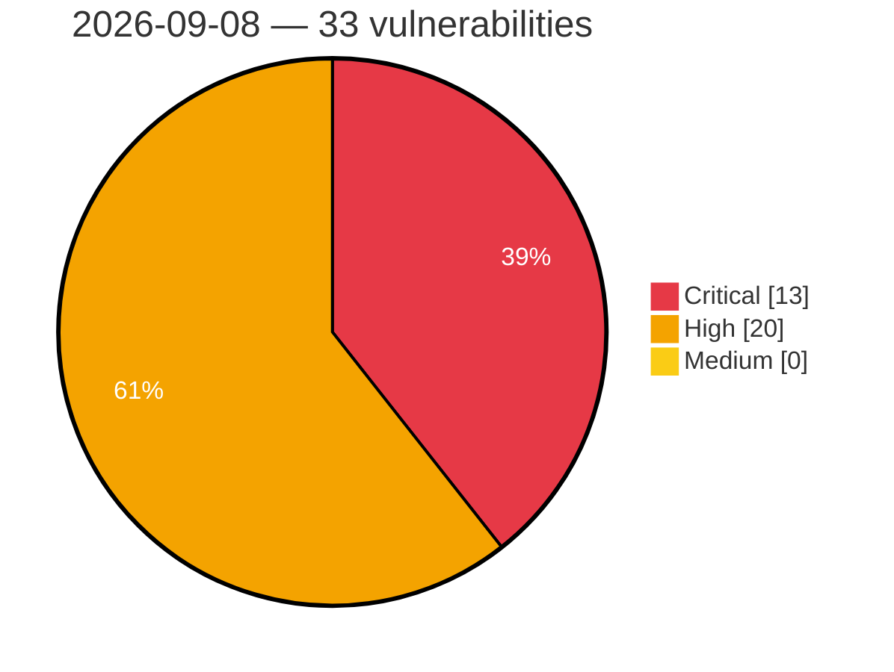

# Critical, High & Medium Severity Vulnerabilities — 2026-09-08

**Source status for this day:**

| Source | Critical | High | Medium | Total |
|--------|---------:|-----:|-------:|------:|
| cvefeed.io (High/Critical) | 13 | 20 | 0 | 33 |

**KEV (actively exploited):** 0  **Watchlist matches:** 19

## Critical (13)

| CVSS | Flags | Source | CVE / Title | Reported |
|------|-------|--------|-------------|----------|
| 10.0 | — | cvefeed.io (High/Critical) | [CVE-2026-44756 - Memory Corruption vulnerability in SAP Extended Passport (EPP) Processing](https://cvefeed.io/vuln/detail/CVE-2026-44756) | 3 hours, 33 minutes ago |
| 9.9 | — | cvefeed.io (High/Critical) | [CVE-2026-86510 - D-Link DIR-822A L2TP Control Message tunnel_set_params out-of-bounds write](https://cvefeed.io/vuln/detail/CVE-2026-86510) | 2 hours, 33 minutes ago |
| 9.9 | ⭐ | cvefeed.io (High/Critical) | [CVE-2026-78234 - Hawtio-operator: hawtio-operator: service-ca signing oracle allows arbitrary-cn certificate issuance to namespace edit users](https://cvefeed.io/vuln/detail/CVE-2026-78234) | 43 minutes ago |
| 9.8 | — | cvefeed.io (High/Critical) | [CVE-2026-58240 - Missing Authentication check in SAP NetWeaver (Message Server)](https://cvefeed.io/vuln/detail/CVE-2026-58240) | 3 hours, 33 minutes ago |
| 9.8 | ⭐ | cvefeed.io (High/Critical) | [CVE-2026-71374 - Deserialization of Untrusted Data Vulnerability in Cosminexus Component Container](https://cvefeed.io/vuln/detail/CVE-2026-71374) | 39 minutes ago |
| 9.8 | — | cvefeed.io (High/Critical) | [CVE-2026-71377 - Command Argument Injection Vulnerability in Cosminexus Component Container](https://cvefeed.io/vuln/detail/CVE-2026-71377) | 41 minutes ago |
| 9.8 | ⭐ | cvefeed.io (High/Critical) | [CVE-2026-71376 - OS Command Injection Vulnerability in Cosminexus Component Container](https://cvefeed.io/vuln/detail/CVE-2026-71376) | 54 minutes ago |
| 9.6 | — | cvefeed.io (High/Critical) | [CVE-2026-86509 - D-Link DIR-895L udhcpcd serverpacket.c sendACK stack-based overflow](https://cvefeed.io/vuln/detail/CVE-2026-86509) | 3 hours, 33 minutes ago |
| 9.4 | ⭐ | cvefeed.io (High/Critical) | [CVE-2026-76969 - Credential disclosure in multitenant applications using SAP Cloud Application Programming Model (CAP)](https://cvefeed.io/vuln/detail/CVE-2026-76969) | 3 hours, 33 minutes ago |
| 9.3 | ⭐ | cvefeed.io (High/Critical) | [CVE-2026-77089 - Command Center API Authentication Bypass](https://cvefeed.io/vuln/detail/CVE-2026-77089) | 47 minutes ago |
| 9.3 | — | cvefeed.io (High/Critical) | [CVE-2026-62647 - Reyrolle 7SR5 Insufficiently Random Values Vulnerability](https://cvefeed.io/vuln/detail/CVE-2026-62647) | 3 hours, 41 minutes ago |
| 9.2 | — | cvefeed.io (High/Critical) | [CVE-2026-67367 - SIMOVE Fleetmanager and SIPLANT Directory Traversal Vulnerability](https://cvefeed.io/vuln/detail/CVE-2026-67367) | 3 hours, 41 minutes ago |
| 9.0 | ⭐ | cvefeed.io (High/Critical) | [CVE-2026-66768 - Improper Access Control in SAP NetWeaver (SAP GUI for Java)](https://cvefeed.io/vuln/detail/CVE-2026-66768) | 3 hours, 33 minutes ago |

## High (20)

| CVSS | Flags | Source | CVE / Title | Reported |
|------|-------|--------|-------------|----------|
| 8.8 | ⭐ | cvefeed.io (High/Critical) | [CVE-2026-86712 - SiYuan before 3.8.2 Remote Code Execution via Clipboard](https://cvefeed.io/vuln/detail/CVE-2026-86712) | 43 minutes ago |
| 8.8 | ⭐ | cvefeed.io (High/Critical) | [CVE-2026-16502 - Live Composer <= 2.1.18 - Authenticated (Contributor+) PHP Object Injection via Shortcode](https://cvefeed.io/vuln/detail/CVE-2026-16502) | 43 minutes ago |
| 8.8 | ⭐ | cvefeed.io (High/Critical) | [CVE-2026-77098 - Private Metrics Server SQL Injection](https://cvefeed.io/vuln/detail/CVE-2026-77098) | 47 minutes ago |
| 8.8 | — | cvefeed.io (High/Critical) | [CVE-2026-77097 - Private Metrics Server Denial of Service](https://cvefeed.io/vuln/detail/CVE-2026-77097) | 47 minutes ago |
| 8.8 | ⭐ | cvefeed.io (High/Critical) | [CVE-2026-62650 - Reyrolle 7SR5 Privilege Escalation Vulnerability](https://cvefeed.io/vuln/detail/CVE-2026-62650) | 3 hours, 41 minutes ago |
| 8.7 | — | cvefeed.io (High/Critical) | [CVE-2026-12611 - Jetty HTTP/2 Denial of Service Vulnerability](https://cvefeed.io/vuln/detail/CVE-2026-12611) | 31 minutes ago |
| 8.7 | ⭐ | cvefeed.io (High/Critical) | [CVE-2026-80219 - Hawtio-operator: hawtio-operator: oauthclient created with grantmethod auto and no secret enables oauth token theft](https://cvefeed.io/vuln/detail/CVE-2026-80219) | 43 minutes ago |
| 8.7 | ⭐ | cvefeed.io (High/Critical) | [CVE-2026-77105 - CommServe Privilege Escalation](https://cvefeed.io/vuln/detail/CVE-2026-77105) | 47 minutes ago |
| 8.7 | ⭐ | cvefeed.io (High/Critical) | [CVE-2026-77103 - CommServe Information Disclosure](https://cvefeed.io/vuln/detail/CVE-2026-77103) | 47 minutes ago |
| 8.7 | — | cvefeed.io (High/Critical) | [CVE-2026-77102 - CommServe Denial of Service](https://cvefeed.io/vuln/detail/CVE-2026-77102) | 47 minutes ago |
| 8.7 | — | cvefeed.io (High/Critical) | [CVE-2026-77101 - CommServe Stack-based Buffer Overflow](https://cvefeed.io/vuln/detail/CVE-2026-77101) | 47 minutes ago |
| 8.7 | ⭐ | cvefeed.io (High/Critical) | [CVE-2026-62649 - Reyrolle 7SR5 Denial of Service Vulnerability](https://cvefeed.io/vuln/detail/CVE-2026-62649) | 3 hours, 41 minutes ago |
| 8.7 | — | cvefeed.io (High/Critical) | [CVE-2026-62648 - Reyrolle 7SR5 Out-of-Bounds Write Denial-of-Service Vulnerability](https://cvefeed.io/vuln/detail/CVE-2026-62648) | 3 hours, 41 minutes ago |
| 8.5 | ⭐ | cvefeed.io (High/Critical) | [CVE-2026-76958 - XML External Entity (XXE) Vulnerability in SAP Integration Suite](https://cvefeed.io/vuln/detail/CVE-2026-76958) | 3 hours, 33 minutes ago |
| 8.5 | — | cvefeed.io (High/Critical) | [CVE-2026-74860 - Libxml2: double-free/uaf in libxml2 python bindings](https://cvefeed.io/vuln/detail/CVE-2026-74860) | 43 minutes ago |
| 8.5 | ⭐ | cvefeed.io (High/Critical) | [CVE-2026-77091 - DataCube Security Feature Bypass](https://cvefeed.io/vuln/detail/CVE-2026-77091) | 47 minutes ago |
| 8.3 | ⭐ | cvefeed.io (High/Critical) | [CVE-2026-77104 - CommServe Path Traversal](https://cvefeed.io/vuln/detail/CVE-2026-77104) | 47 minutes ago |
| 8.3 | — | cvefeed.io (High/Critical) | [CVE-2026-19203 - Jetty HTTP Request Smuggling Vulnerability](https://cvefeed.io/vuln/detail/CVE-2026-19203) | 51 minutes ago |
| 8.2 | ⭐ | cvefeed.io (High/Critical) | [CVE-2026-77968 - Hawtio-operator: hawtio-operator: cluster-wide secrets read/write granted to operator serviceaccount](https://cvefeed.io/vuln/detail/CVE-2026-77968) | 43 minutes ago |
| 8.1 | ⭐ | cvefeed.io (High/Critical) | [CVE-2026-75021 - fastify-cli vulnerable to remote code execution via ignored explicit Inspector bind address](https://cvefeed.io/vuln/detail/CVE-2026-75021) | 9 minutes ago |
