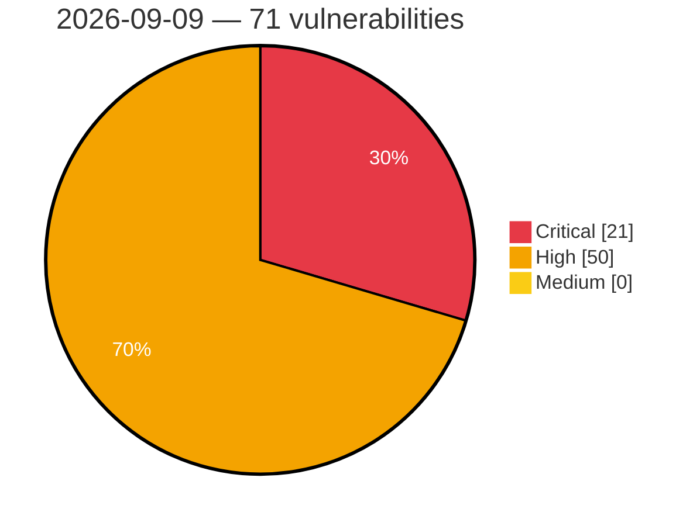

# Critical, High & Medium Severity Vulnerabilities — 2026-09-09

**Source status for this day:**

| Source | Critical | High | Medium | Total |
|--------|---------:|-----:|-------:|------:|
| cvefeed.io (High/Critical) | 21 | 50 | 0 | 71 |

**KEV (actively exploited):** 0  **Watchlist matches:** 52

## Critical (21)

| CVSS | Flags | Source | CVE / Title | Reported |
|------|-------|--------|-------------|----------|
| 10.0 | ⭐ | cvefeed.io (High/Critical) | [CVE-2026-79696 - Remote Code Execution in Google ADK for Python via Incomplete Standard Library Denylist](https://cvefeed.io/vuln/detail/CVE-2026-79696) | 1 hour, 14 minutes ago |
| 10.0 | — | cvefeed.io (High/Critical) | [CVE-2026-87827 - KGUARD DVR unauthenticated remote command execution vulnerability](https://cvefeed.io/vuln/detail/CVE-2026-87827) | 1 hour, 51 minutes ago |
| 10.0 | ⭐ | cvefeed.io (High/Critical) | [CVE-2026-85978 - Unauthenticated Remote Code Execution in Akana API Platform](https://cvefeed.io/vuln/detail/CVE-2026-85978) | 1 hour, 51 minutes ago |
| 9.9 | ⭐ | cvefeed.io (High/Critical) | [CVE-2026-67401 - cPanel EmailTrack SQL Injection Remote Code Execution](https://cvefeed.io/vuln/detail/CVE-2026-67401) | 1 hour, 32 minutes ago |
| 9.8 | — | cvefeed.io (High/Critical) | [CVE-2026-80172 - Dell Secure Connect Gateway Insufficient Verification of Data Authenticity Vulnerability](https://cvefeed.io/vuln/detail/CVE-2026-80172) | 51 minutes ago |
| 9.8 | ⭐ | cvefeed.io (High/Critical) | [CVE-2026-87929 - MaxSite CMS through 109.6 Authentication Bypass via Hardcoded Encryption Key](https://cvefeed.io/vuln/detail/CVE-2026-87929) | 31 minutes ago |
| 9.8 | ⭐ | cvefeed.io (High/Critical) | [CVE-2026-79689 - Dell Secure Connect Gateway OS Command Injection Vulnerability](https://cvefeed.io/vuln/detail/CVE-2026-79689) | 5 hours, 14 minutes ago |
| 9.8 | ⭐ | cvefeed.io (High/Critical) | [CVE-2026-79941 - Dell Secure Connect Gateway Command Injection Vulnerability](https://cvefeed.io/vuln/detail/CVE-2026-79941) | 6 hours, 14 minutes ago |
| 9.6 | ⭐ | cvefeed.io (High/Critical) | [CVE-2026-54694 - NationalSecurityAgency/skills-service has Stored XSS via User Registration Enabling Admin Account Takeover](https://cvefeed.io/vuln/detail/CVE-2026-54694) | 14 minutes ago |
| 9.6 | ⭐ | cvefeed.io (High/Critical) | [CVE-2026-87911 - Read-only enforcement bypass enabling operating system command execution in the SQL validation component of Amazon awslabs postgres-mcp-server](https://cvefeed.io/vuln/detail/CVE-2026-87911) | 1 hour, 10 minutes ago |
| 9.3 | — | cvefeed.io (High/Critical) | [CVE-2026-21102 - DualDAR Use-After-Free Vulnerability](https://cvefeed.io/vuln/detail/CVE-2026-21102) | 5 hours, 14 minutes ago |
| 9.3 | ⭐ | cvefeed.io (High/Critical) | [CVE-2026-47156 - MantisBT: SOAP API Authentication Bypass with Privilege Escalation to Administrator](https://cvefeed.io/vuln/detail/CVE-2026-47156) | 31 minutes ago |
| 9.2 | — | cvefeed.io (High/Critical) | [CVE-2026-21096 - libimagecodec Heap-Based Buffer Overflow](https://cvefeed.io/vuln/detail/CVE-2026-21096) | 5 hours, 14 minutes ago |
| 9.2 | — | cvefeed.io (High/Critical) | [CVE-2026-21095 - libimagecodec Heap-Based Buffer Overflow](https://cvefeed.io/vuln/detail/CVE-2026-21095) | 5 hours, 14 minutes ago |
| 9.2 | — | cvefeed.io (High/Critical) | [CVE-2026-87930 - MaxSite CMS through 109.6 PHP Object Injection via ci_session](https://cvefeed.io/vuln/detail/CVE-2026-87930) | 31 minutes ago |
| 9.1 | — | cvefeed.io (High/Critical) | [CVE-2026-53939 - OpenIDC/cjose uses all-zero Content Encryption Key for AES-CBC-HMAC JWE encryption](https://cvefeed.io/vuln/detail/CVE-2026-53939) | 4 hours, 34 minutes ago |
| 9.1 | ⭐ | cvefeed.io (High/Critical) | [CVE-2026-16272 - Client IP Spoofing via Untrusted HTTP Headers in PayTR's PayTR Virtual Pos iFrame API (v9x) WHMCS Module](https://cvefeed.io/vuln/detail/CVE-2026-16272) | 1 hour, 14 minutes ago |
| 9.1 | ⭐ | cvefeed.io (High/Critical) | [CVE-2026-87806 - Parse Server 9.0.0 Authentication Bypass via LDAP Empty Password](https://cvefeed.io/vuln/detail/CVE-2026-87806) | 51 minutes ago |
| 9.1 | — | cvefeed.io (High/Critical) | [CVE-2026-22590 - Fast-DDS Discovery Server: Out-of-Bounds Read & Heap Memory Disclosure via DATA_FRAG  sampleSize / fragmentsInSubmessage](https://cvefeed.io/vuln/detail/CVE-2026-22590) | 1 hour, 32 minutes ago |
| 9.0 | ⭐ | cvefeed.io (High/Critical) | [CVE-2026-68484 - Sage AR Automation Improper Authorization Vulnerability](https://cvefeed.io/vuln/detail/CVE-2026-68484) | 1 hour, 32 minutes ago |
| 9.0 | ⭐ | cvefeed.io (High/Critical) | [CVE-2026-67403 - Sage AR Automation Improper Authorization Vulnerability](https://cvefeed.io/vuln/detail/CVE-2026-67403) | 1 hour, 32 minutes ago |

## High (50)

| CVSS | Flags | Source | CVE / Title | Reported |
|------|-------|--------|-------------|----------|
| 8.8 | ⭐ | cvefeed.io (High/Critical) | [CVE-2026-76801 - FireBox <= 3.1.10 - Authenticated (Author+) Remote Code Execution to Privilege Escalation](https://cvefeed.io/vuln/detail/CVE-2026-76801) | 1 hour, 34 minutes ago |
| 8.8 | — | cvefeed.io (High/Critical) | [CVE-2026-87795 - zstd-jni 1.2.0 through 1.5.7-13 Out-of-Bounds Read via ZstdDictCompress](https://cvefeed.io/vuln/detail/CVE-2026-87795) | 9 minutes ago |
| 8.8 | — | cvefeed.io (High/Critical) | [CVE-2026-87766 - Bubblewrap: bubblewrap: symlink traversal via /oldroot allows writing files outside sandbox during setup](https://cvefeed.io/vuln/detail/CVE-2026-87766) | 1 hour, 14 minutes ago |
| 8.8 | ⭐ | cvefeed.io (High/Critical) | [CVE-2026-80099 - Various Newfold Plugins Various Versions - Unauthenticated Authentication Bypass via Bearer Token Validation with Empty Secret](https://cvefeed.io/vuln/detail/CVE-2026-80099) | 1 hour, 14 minutes ago |
| 8.8 | ⭐ | cvefeed.io (High/Critical) | [CVE-2026-14359 - YITH WooCommerce Waitlist Premium <= 3.35.0 - Authenticated (Subscriber+) Privilege Escalation to Admin via wp_ajax_yith_wcwtl_add_user](https://cvefeed.io/vuln/detail/CVE-2026-14359) | 1 hour, 14 minutes ago |
| 8.8 | ⭐ | cvefeed.io (High/Critical) | [CVE-2026-21092 - ImsService Path Traversal Vulnerability](https://cvefeed.io/vuln/detail/CVE-2026-21092) | 5 hours, 14 minutes ago |
| 8.8 | ⭐ | cvefeed.io (High/Critical) | [CVE-2026-87817 - GitPython before 3.1.60 Remote Code Execution via Git Directory Impersonation](https://cvefeed.io/vuln/detail/CVE-2026-87817) | 51 minutes ago |
| 8.8 | ⭐ | cvefeed.io (High/Critical) | [CVE-2026-87927 - MaxSite CMS through 109.6 Local File Inclusion via ajax dispatcher](https://cvefeed.io/vuln/detail/CVE-2026-87927) | 31 minutes ago |
| 8.8 | ⭐ | cvefeed.io (High/Critical) | [CVE-2026-81640 - Softish C6 Ear Camera and EarVision Android Application Use of Hard-coded Credentials](https://cvefeed.io/vuln/detail/CVE-2026-81640) | 1 hour, 31 minutes ago |
| 8.8 | — | cvefeed.io (High/Critical) | [CVE-2026-87823 - zstd-jni 1.1.1 through 1.5.7-13 Out-of-Bounds Read via Direct ByteBuffer Frame-Size Methods](https://cvefeed.io/vuln/detail/CVE-2026-87823) | 2 hours, 31 minutes ago |
| 8.8 | ⭐ | cvefeed.io (High/Critical) | [CVE-2026-86775 - knowns before 0.30.0 Path Traversal via Document API](https://cvefeed.io/vuln/detail/CVE-2026-86775) | 3 hours, 31 minutes ago |
| 8.7 | ⭐ | cvefeed.io (High/Critical) | [CVE-2026-87819 - GitPython before 3.1.60 Denial of Service via ReDoS](https://cvefeed.io/vuln/detail/CVE-2026-87819) | 51 minutes ago |
| 8.7 | ⭐ | cvefeed.io (High/Critical) | [CVE-2026-87816 - PasswordPusher before 2.11.1 Race Condition View Limit Bypass](https://cvefeed.io/vuln/detail/CVE-2026-87816) | 51 minutes ago |
| 8.7 | ⭐ | cvefeed.io (High/Critical) | [CVE-2026-87815 - SiYuan before v3.8.2 Path Traversal via removeRiffDeck](https://cvefeed.io/vuln/detail/CVE-2026-87815) | 51 minutes ago |
| 8.7 | ⭐ | cvefeed.io (High/Critical) | [CVE-2026-87808 - SiYuan before v3.8.2 Read-Only Boundary Bypass via fullTextSearchBlock](https://cvefeed.io/vuln/detail/CVE-2026-87808) | 51 minutes ago |
| 8.7 | ⭐ | cvefeed.io (High/Critical) | [CVE-2026-87807 - siyuan before v3.8.2 SQL Injection via fullTextSearchBlock](https://cvefeed.io/vuln/detail/CVE-2026-87807) | 51 minutes ago |
| 8.7 | ⭐ | cvefeed.io (High/Critical) | [CVE-2026-77120 - OS Command Injection in Operating System Console](https://cvefeed.io/vuln/detail/CVE-2026-77120) | 31 minutes ago |
| 8.7 | — | cvefeed.io (High/Critical) | [CVE-2026-87824 - zstd-jni 1.3.3-1 through 1.5.7-13 Out-of-Bounds Read via Zstd.trainFromBufferDirect](https://cvefeed.io/vuln/detail/CVE-2026-87824) | 2 hours, 31 minutes ago |
| 8.7 | ⭐ | cvefeed.io (High/Critical) | [CVE-2026-87822 - t-digest 3.1 through 3.3 Denial of Service via NaN Centroid Means in MergingDigest.fromBytes](https://cvefeed.io/vuln/detail/CVE-2026-87822) | 2 hours, 31 minutes ago |
| 8.6 | — | cvefeed.io (High/Critical) | [CVE-2026-49310 - Event Notification Module Improper Authorization](https://cvefeed.io/vuln/detail/CVE-2026-49310) | 33 minutes ago |
| 8.6 | ⭐ | cvefeed.io (High/Critical) | [CVE-2026-87794 - bestzip 2.2.6 and 3.0.2 Argument Injection via the Native Zip Destination](https://cvefeed.io/vuln/detail/CVE-2026-87794) | 9 minutes ago |
| 8.6 | — | cvefeed.io (High/Critical) | [CVE-2026-21087 - Samsung libmdnie Out-of-Bounds Write Vulnerability](https://cvefeed.io/vuln/detail/CVE-2026-21087) | 5 hours, 14 minutes ago |
| 8.6 | ⭐ | cvefeed.io (High/Critical) | [CVE-2026-8044 - [Product/Vendor Name] Argument Injection Vulnerability](https://cvefeed.io/vuln/detail/CVE-2026-8044) | 31 minutes ago |
| 8.6 | ⭐ | cvefeed.io (High/Critical) | [CVE-2026-19233 - Server-Side Request Forgery in Web Server](https://cvefeed.io/vuln/detail/CVE-2026-19233) | 31 minutes ago |
| 8.6 | ⭐ | cvefeed.io (High/Critical) | [CVE-2026-26212 - Rara One Click Demo Import < 1.3.5 Arbitrary File Upload RCE](https://cvefeed.io/vuln/detail/CVE-2026-26212) | 2 hours, 31 minutes ago |
| 8.6 | ⭐ | cvefeed.io (High/Critical) | [CVE-2026-86770 - Snipe-IT before 8.7.0 Authentication Bypass via SAML Username Collation](https://cvefeed.io/vuln/detail/CVE-2026-86770) | 3 hours, 31 minutes ago |
| 8.6 | ⭐ | cvefeed.io (High/Critical) | [CVE-2026-86762 - Snipe-IT before 8.7.0 Authentication Bypass via API Middleware](https://cvefeed.io/vuln/detail/CVE-2026-86762) | 3 hours, 31 minutes ago |
| 8.6 | ⭐ | cvefeed.io (High/Critical) | [CVE-2026-79322 - Mageplaza Blog for Magento SQL Injection](https://cvefeed.io/vuln/detail/CVE-2026-79322) | 2 hours, 14 minutes ago |
| 8.5 | ⭐ | cvefeed.io (High/Critical) | [CVE-2026-87030 - Tanium addressed a path traversal vulnerability in Comply.](https://cvefeed.io/vuln/detail/CVE-2026-87030) | 1 hour, 34 minutes ago |
| 8.5 | ⭐ | cvefeed.io (High/Critical) | [CVE-2026-87023 - Tanium addressed a path traversal vulnerability in Comply.](https://cvefeed.io/vuln/detail/CVE-2026-87023) | 1 hour, 34 minutes ago |
| 8.5 | ⭐ | cvefeed.io (High/Critical) | [CVE-2026-12858 - Local privilege escalation vulnerability in ESET AV Remover](https://cvefeed.io/vuln/detail/CVE-2026-12858) | 1 hour, 14 minutes ago |
| 8.5 | ⭐ | cvefeed.io (High/Critical) | [CVE-2026-77974 - Softish C6 Ear Camera and EarVision Android Application Missing authentication for critical function](https://cvefeed.io/vuln/detail/CVE-2026-77974) | 1 hour, 31 minutes ago |
| 8.5 | ⭐ | cvefeed.io (High/Critical) | [CVE-2026-86754 - Snipe-IT before 8.7.0 Authorization Bypass via OAuth Clients](https://cvefeed.io/vuln/detail/CVE-2026-86754) | 3 hours, 31 minutes ago |
| 8.4 | ⭐ | cvefeed.io (High/Critical) | [CVE-2026-21101 - DualDAR Driver Improper Input Validation Privilege Escalation](https://cvefeed.io/vuln/detail/CVE-2026-21101) | 5 hours, 14 minutes ago |
| 8.4 | — | cvefeed.io (High/Critical) | [CVE-2026-21085 - Keymaster Trustlet Out-of-Bounds Write](https://cvefeed.io/vuln/detail/CVE-2026-21085) | 5 hours, 14 minutes ago |
| 8.4 | ⭐ | cvefeed.io (High/Critical) | [CVE-2026-87814 - SiYuan before v3.8.2 Stored XSS via Asset Preview](https://cvefeed.io/vuln/detail/CVE-2026-87814) | 51 minutes ago |
| 8.4 | ⭐ | cvefeed.io (High/Critical) | [CVE-2026-87813 - SiYuan before v3.8.2 Stored XSS via unescaped asset filenames](https://cvefeed.io/vuln/detail/CVE-2026-87813) | 51 minutes ago |
| 8.4 | ⭐ | cvefeed.io (High/Critical) | [CVE-2026-87811 - SiYuan before v3.8.2 Stored XSS via notebook template paths](https://cvefeed.io/vuln/detail/CVE-2026-87811) | 51 minutes ago |
| 8.4 | ⭐ | cvefeed.io (High/Critical) | [CVE-2026-82563 - Softish C6 Ear Camera and EarVision Android Application Authentication bypass by spoofing](https://cvefeed.io/vuln/detail/CVE-2026-82563) | 1 hour, 31 minutes ago |
| 8.3 | ⭐ | cvefeed.io (High/Critical) | [CVE-2026-87034 - Tanium addressed a SQL injection vulnerability in Comply.](https://cvefeed.io/vuln/detail/CVE-2026-87034) | 1 hour, 34 minutes ago |
| 8.3 | ⭐ | cvefeed.io (High/Critical) | [CVE-2026-86771 - Snipe-IT before 8.7.0 Server-Side Request Forgery via employee_num](https://cvefeed.io/vuln/detail/CVE-2026-86771) | 3 hours, 31 minutes ago |
| 8.2 | — | cvefeed.io (High/Critical) | [CVE-2026-6485 - UEFI BIOS embedded Shell can be used to bypass Secure Boot](https://cvefeed.io/vuln/detail/CVE-2026-6485) | 32 minutes ago |
| 8.2 | — | cvefeed.io (High/Critical) | [CVE-2026-12855 - H19WMIHandlerSmm: unvalidated memory boundary could result in arbitrary code execution.](https://cvefeed.io/vuln/detail/CVE-2026-12855) | 33 minutes ago |
| 8.2 | — | cvefeed.io (High/Critical) | [CVE-2026-53938 - OpenIDC/cjose has a heap buffer overflow in AES Key Wrap decryption (A128KW/A192KW/A256KW)](https://cvefeed.io/vuln/detail/CVE-2026-53938) | 4 hours, 34 minutes ago |
| 8.2 | — | cvefeed.io (High/Critical) | [CVE-2026-78491 - Dell Secure Connect Gateway Improper Certificate Validation Vulnerability](https://cvefeed.io/vuln/detail/CVE-2026-78491) | 1 hour, 14 minutes ago |
| 8.1 | ⭐ | cvefeed.io (High/Critical) | [CVE-2026-87075 - Tanium addressed an improper access controls vulnerability in Comply.](https://cvefeed.io/vuln/detail/CVE-2026-87075) | 1 hour, 34 minutes ago |
| 8.1 | ⭐ | cvefeed.io (High/Critical) | [CVE-2026-87036 - Tanium addressed an improper access controls vulnerability in Comply.](https://cvefeed.io/vuln/detail/CVE-2026-87036) | 1 hour, 34 minutes ago |
| 8.1 | ⭐ | cvefeed.io (High/Critical) | [CVE-2026-76009 - Next-Cart Store to WooCommerce Migration <= 3.9.8 - Unauthenticated Authentication Bypass via Default '__token__' Fallback in REST Migration Endpoint](https://cvefeed.io/vuln/detail/CVE-2026-76009) | 4 hours, 14 minutes ago |
| 8.1 | ⭐ | cvefeed.io (High/Critical) | [CVE-2026-87874 - Community.general: community.general: memcached cache plugin deserializes untrusted pickle data from memcached, enabling cache-poisoning remote code execution on the ansible controller](https://cvefeed.io/vuln/detail/CVE-2026-87874) | 31 minutes ago |
| 8.1 | ⭐ | cvefeed.io (High/Critical) | [CVE-2026-18147 - Freeipa: ipa: freeipa/idm: cross-site scripting vulnerability allows arbitrary code execution via crafted url](https://cvefeed.io/vuln/detail/CVE-2026-18147) | 31 minutes ago |
