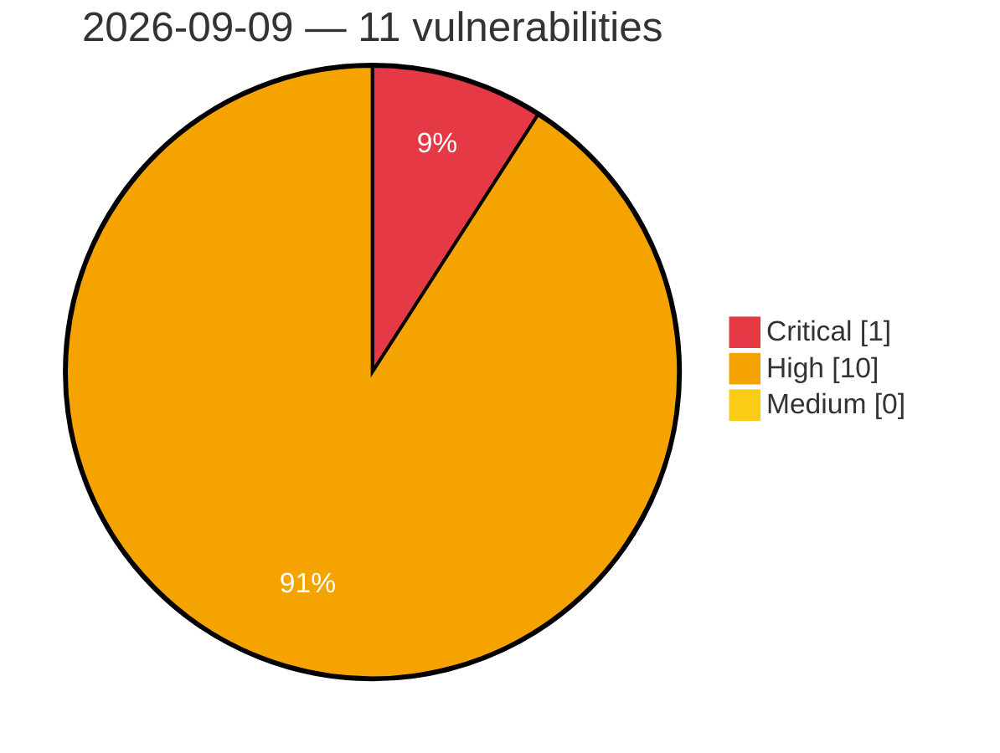

# Critical, High & Medium Severity Vulnerabilities — 2026-09-09

**Source status for this day:**

| Source | Critical | High | Medium | Total |
|--------|---------:|-----:|-------:|------:|
| cvefeed.io (High/Critical) | 1 | 10 | 0 | 11 |

**KEV (actively exploited):** 0  **Watchlist matches:** 6

## Critical (1)

| CVSS | Flags | Source | CVE / Title | Reported |
|------|-------|--------|-------------|----------|
| 9.1 | — | cvefeed.io (High/Critical) | [CVE-2026-53939 - OpenIDC/cjose uses all-zero Content Encryption Key for AES-CBC-HMAC JWE encryption](https://cvefeed.io/vuln/detail/CVE-2026-53939) | 4 hours, 34 minutes ago |

## High (10)

| CVSS | Flags | Source | CVE / Title | Reported |
|------|-------|--------|-------------|----------|
| 8.8 | ⭐ | cvefeed.io (High/Critical) | [CVE-2026-76801 - FireBox <= 3.1.10 - Authenticated (Author+) Remote Code Execution to Privilege Escalation](https://cvefeed.io/vuln/detail/CVE-2026-76801) | 1 hour, 34 minutes ago |
| 8.6 | — | cvefeed.io (High/Critical) | [CVE-2026-49310 - Event Notification Module Improper Authorization](https://cvefeed.io/vuln/detail/CVE-2026-49310) | 33 minutes ago |
| 8.5 | ⭐ | cvefeed.io (High/Critical) | [CVE-2026-87030 - Tanium addressed a path traversal vulnerability in Comply.](https://cvefeed.io/vuln/detail/CVE-2026-87030) | 1 hour, 34 minutes ago |
| 8.5 | ⭐ | cvefeed.io (High/Critical) | [CVE-2026-87023 - Tanium addressed a path traversal vulnerability in Comply.](https://cvefeed.io/vuln/detail/CVE-2026-87023) | 1 hour, 34 minutes ago |
| 8.3 | ⭐ | cvefeed.io (High/Critical) | [CVE-2026-87034 - Tanium addressed a SQL injection vulnerability in Comply.](https://cvefeed.io/vuln/detail/CVE-2026-87034) | 1 hour, 34 minutes ago |
| 8.2 | — | cvefeed.io (High/Critical) | [CVE-2026-6485 - UEFI BIOS embedded Shell can be used to bypass Secure Boot](https://cvefeed.io/vuln/detail/CVE-2026-6485) | 32 minutes ago |
| 8.2 | — | cvefeed.io (High/Critical) | [CVE-2026-12855 - H19WMIHandlerSmm: unvalidated memory boundary could result in arbitrary code execution.](https://cvefeed.io/vuln/detail/CVE-2026-12855) | 33 minutes ago |
| 8.2 | — | cvefeed.io (High/Critical) | [CVE-2026-53938 - OpenIDC/cjose has a heap buffer overflow in AES Key Wrap decryption (A128KW/A192KW/A256KW)](https://cvefeed.io/vuln/detail/CVE-2026-53938) | 4 hours, 34 minutes ago |
| 8.1 | ⭐ | cvefeed.io (High/Critical) | [CVE-2026-87075 - Tanium addressed an improper access controls vulnerability in Comply.](https://cvefeed.io/vuln/detail/CVE-2026-87075) | 1 hour, 34 minutes ago |
| 8.1 | ⭐ | cvefeed.io (High/Critical) | [CVE-2026-87036 - Tanium addressed an improper access controls vulnerability in Comply.](https://cvefeed.io/vuln/detail/CVE-2026-87036) | 1 hour, 34 minutes ago |
