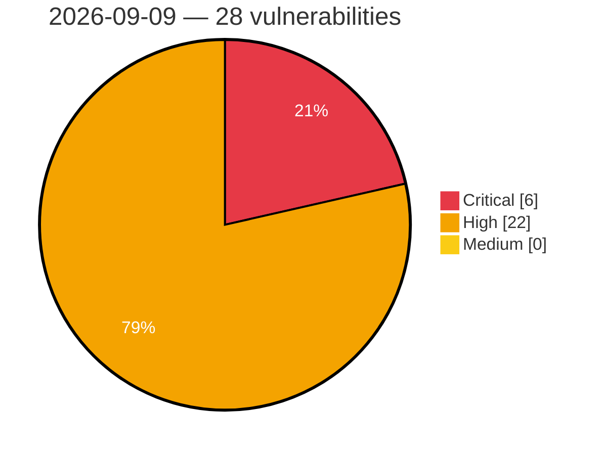

# Critical, High & Medium Severity Vulnerabilities — 2026-09-09

**Source status for this day:**

| Source | Critical | High | Medium | Total |
|--------|---------:|-----:|-------:|------:|
| cvefeed.io (High/Critical) | 6 | 22 | 0 | 28 |

**KEV (actively exploited):** 0  **Watchlist matches:** 15

## Critical (6)

| CVSS | Flags | Source | CVE / Title | Reported |
|------|-------|--------|-------------|----------|
| 10.0 | ⭐ | cvefeed.io (High/Critical) | [CVE-2026-79696 - Remote Code Execution in Google ADK for Python via Incomplete Standard Library Denylist](https://cvefeed.io/vuln/detail/CVE-2026-79696) | 1 hour, 14 minutes ago |
| 9.3 | — | cvefeed.io (High/Critical) | [CVE-2026-21102 - DualDAR Use-After-Free Vulnerability](https://cvefeed.io/vuln/detail/CVE-2026-21102) | 5 hours, 14 minutes ago |
| 9.2 | — | cvefeed.io (High/Critical) | [CVE-2026-21096 - libimagecodec Heap-Based Buffer Overflow](https://cvefeed.io/vuln/detail/CVE-2026-21096) | 5 hours, 14 minutes ago |
| 9.2 | — | cvefeed.io (High/Critical) | [CVE-2026-21095 - libimagecodec Heap-Based Buffer Overflow](https://cvefeed.io/vuln/detail/CVE-2026-21095) | 5 hours, 14 minutes ago |
| 9.1 | — | cvefeed.io (High/Critical) | [CVE-2026-53939 - OpenIDC/cjose uses all-zero Content Encryption Key for AES-CBC-HMAC JWE encryption](https://cvefeed.io/vuln/detail/CVE-2026-53939) | 4 hours, 34 minutes ago |
| 9.1 | ⭐ | cvefeed.io (High/Critical) | [CVE-2026-16272 - Client IP Spoofing via Untrusted HTTP Headers in PayTR's PayTR Virtual Pos iFrame API (v9x) WHMCS Module](https://cvefeed.io/vuln/detail/CVE-2026-16272) | 1 hour, 14 minutes ago |

## High (22)

| CVSS | Flags | Source | CVE / Title | Reported |
|------|-------|--------|-------------|----------|
| 8.8 | ⭐ | cvefeed.io (High/Critical) | [CVE-2026-76801 - FireBox <= 3.1.10 - Authenticated (Author+) Remote Code Execution to Privilege Escalation](https://cvefeed.io/vuln/detail/CVE-2026-76801) | 1 hour, 34 minutes ago |
| 8.8 | — | cvefeed.io (High/Critical) | [CVE-2026-87795 - zstd-jni 1.2.0 through 1.5.7-13 Out-of-Bounds Read via ZstdDictCompress](https://cvefeed.io/vuln/detail/CVE-2026-87795) | 9 minutes ago |
| 8.8 | — | cvefeed.io (High/Critical) | [CVE-2026-87766 - Bubblewrap: bubblewrap: symlink traversal via /oldroot allows writing files outside sandbox during setup](https://cvefeed.io/vuln/detail/CVE-2026-87766) | 1 hour, 14 minutes ago |
| 8.8 | ⭐ | cvefeed.io (High/Critical) | [CVE-2026-80099 - Various Newfold Plugins Various Versions - Unauthenticated Authentication Bypass via Bearer Token Validation with Empty Secret](https://cvefeed.io/vuln/detail/CVE-2026-80099) | 1 hour, 14 minutes ago |
| 8.8 | ⭐ | cvefeed.io (High/Critical) | [CVE-2026-14359 - YITH WooCommerce Waitlist Premium <= 3.35.0 - Authenticated (Subscriber+) Privilege Escalation to Admin via wp_ajax_yith_wcwtl_add_user](https://cvefeed.io/vuln/detail/CVE-2026-14359) | 1 hour, 14 minutes ago |
| 8.8 | ⭐ | cvefeed.io (High/Critical) | [CVE-2026-21092 - ImsService Path Traversal Vulnerability](https://cvefeed.io/vuln/detail/CVE-2026-21092) | 5 hours, 14 minutes ago |
| 8.6 | — | cvefeed.io (High/Critical) | [CVE-2026-49310 - Event Notification Module Improper Authorization](https://cvefeed.io/vuln/detail/CVE-2026-49310) | 33 minutes ago |
| 8.6 | ⭐ | cvefeed.io (High/Critical) | [CVE-2026-87794 - bestzip 2.2.6 and 3.0.2 Argument Injection via the Native Zip Destination](https://cvefeed.io/vuln/detail/CVE-2026-87794) | 9 minutes ago |
| 8.6 | — | cvefeed.io (High/Critical) | [CVE-2026-21087 - Samsung libmdnie Out-of-Bounds Write Vulnerability](https://cvefeed.io/vuln/detail/CVE-2026-21087) | 5 hours, 14 minutes ago |
| 8.5 | ⭐ | cvefeed.io (High/Critical) | [CVE-2026-87030 - Tanium addressed a path traversal vulnerability in Comply.](https://cvefeed.io/vuln/detail/CVE-2026-87030) | 1 hour, 34 minutes ago |
| 8.5 | ⭐ | cvefeed.io (High/Critical) | [CVE-2026-87023 - Tanium addressed a path traversal vulnerability in Comply.](https://cvefeed.io/vuln/detail/CVE-2026-87023) | 1 hour, 34 minutes ago |
| 8.5 | ⭐ | cvefeed.io (High/Critical) | [CVE-2026-12858 - Local privilege escalation vulnerability in ESET AV Remover](https://cvefeed.io/vuln/detail/CVE-2026-12858) | 1 hour, 14 minutes ago |
| 8.4 | ⭐ | cvefeed.io (High/Critical) | [CVE-2026-21101 - DualDAR Driver Improper Input Validation Privilege Escalation](https://cvefeed.io/vuln/detail/CVE-2026-21101) | 5 hours, 14 minutes ago |
| 8.4 | — | cvefeed.io (High/Critical) | [CVE-2026-21085 - Keymaster Trustlet Out-of-Bounds Write](https://cvefeed.io/vuln/detail/CVE-2026-21085) | 5 hours, 14 minutes ago |
| 8.3 | ⭐ | cvefeed.io (High/Critical) | [CVE-2026-87034 - Tanium addressed a SQL injection vulnerability in Comply.](https://cvefeed.io/vuln/detail/CVE-2026-87034) | 1 hour, 34 minutes ago |
| 8.2 | — | cvefeed.io (High/Critical) | [CVE-2026-6485 - UEFI BIOS embedded Shell can be used to bypass Secure Boot](https://cvefeed.io/vuln/detail/CVE-2026-6485) | 32 minutes ago |
| 8.2 | — | cvefeed.io (High/Critical) | [CVE-2026-12855 - H19WMIHandlerSmm: unvalidated memory boundary could result in arbitrary code execution.](https://cvefeed.io/vuln/detail/CVE-2026-12855) | 33 minutes ago |
| 8.2 | — | cvefeed.io (High/Critical) | [CVE-2026-53938 - OpenIDC/cjose has a heap buffer overflow in AES Key Wrap decryption (A128KW/A192KW/A256KW)](https://cvefeed.io/vuln/detail/CVE-2026-53938) | 4 hours, 34 minutes ago |
| 8.2 | — | cvefeed.io (High/Critical) | [CVE-2026-78491 - Dell Secure Connect Gateway Improper Certificate Validation Vulnerability](https://cvefeed.io/vuln/detail/CVE-2026-78491) | 1 hour, 14 minutes ago |
| 8.1 | ⭐ | cvefeed.io (High/Critical) | [CVE-2026-87075 - Tanium addressed an improper access controls vulnerability in Comply.](https://cvefeed.io/vuln/detail/CVE-2026-87075) | 1 hour, 34 minutes ago |
| 8.1 | ⭐ | cvefeed.io (High/Critical) | [CVE-2026-87036 - Tanium addressed an improper access controls vulnerability in Comply.](https://cvefeed.io/vuln/detail/CVE-2026-87036) | 1 hour, 34 minutes ago |
| 8.1 | ⭐ | cvefeed.io (High/Critical) | [CVE-2026-76009 - Next-Cart Store to WooCommerce Migration <= 3.9.8 - Unauthenticated Authentication Bypass via Default '__token__' Fallback in REST Migration Endpoint](https://cvefeed.io/vuln/detail/CVE-2026-76009) | 4 hours, 14 minutes ago |
