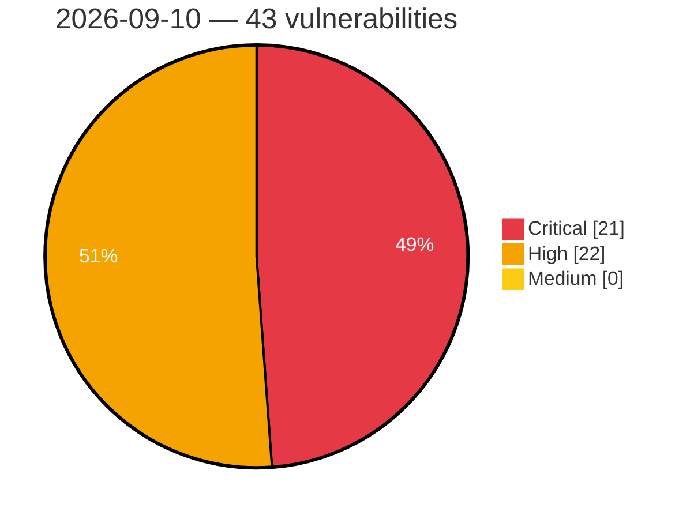

# Critical, High & Medium Severity Vulnerabilities — 2026-09-10

**Source status for this day:**

| Source | Critical | High | Medium | Total |
|--------|---------:|-----:|-------:|------:|
| cvefeed.io (High/Critical) | 21 | 22 | 0 | 43 |

**KEV (actively exploited):** 0  **Watchlist matches:** 30

## Critical (21)

| CVSS | Flags | Source | CVE / Title | Reported |
|------|-------|--------|-------------|----------|
| 9.9 | — | cvefeed.io (High/Critical) | [CVE-2026-19583 - Velociraptor Required Permissions bypass by using client monitoring queries](https://cvefeed.io/vuln/detail/CVE-2026-19583) | 1 hour, 35 minutes ago |
| 9.8 | ⭐ | cvefeed.io (High/Critical) | [CVE-2026-18351 - Drag and Drop File Upload for Elementor Forms <= 1.6.0 - Unauthenticated Arbitrary File Upload via 'type' Parameter](https://cvefeed.io/vuln/detail/CVE-2026-18351) | 2 hours, 35 minutes ago |
| 9.8 | ⭐ | cvefeed.io (High/Critical) | [CVE-2026-88278 - GV-LPCLPC2011/2211 - ONVIF WS-Security PasswordDigest Replay](https://cvefeed.io/vuln/detail/CVE-2026-88278) | 1 hour, 35 minutes ago |
| 9.8 | ⭐ | cvefeed.io (High/Critical) | [CVE-2026-7188 - SQLi in Armiya Information Technologies' Access Control System](https://cvefeed.io/vuln/detail/CVE-2026-7188) | 2 hours, 35 minutes ago |
| 9.8 | ⭐ | cvefeed.io (High/Critical) | [CVE-2026-9163 - SQLi in GIS Informatics' GisLab Laboratory Management System](https://cvefeed.io/vuln/detail/CVE-2026-9163) | 51 minutes ago |
| 9.8 | ⭐ | cvefeed.io (High/Critical) | [CVE-2026-88877 - Traefik v3.7.0 Authentication Bypass via from-to-www-redirect](https://cvefeed.io/vuln/detail/CVE-2026-88877) | 1 hour, 6 minutes ago |
| 9.6 | — | cvefeed.io (High/Critical) | [CVE-2026-87931 - Behavioral Technology Group Pavlok Behavioral Conditioning Wearable Apple Notification Center Service Event buffer overflow](https://cvefeed.io/vuln/detail/CVE-2026-87931) | 4 hours, 34 minutes ago |
| 9.5 | ⭐ | cvefeed.io (High/Critical) | [CVE-2026-44950 - fs_read_glyphs() heap buffer overflow via cumulative glyph data overflow in libXfont2](https://cvefeed.io/vuln/detail/CVE-2026-44950) | 1 hour, 35 minutes ago |
| 9.4 | — | cvefeed.io (High/Critical) | [CVE-2026-88285 - GV-LPC2011/LPC2211 - Unauthenticated PTZ Control Service](https://cvefeed.io/vuln/detail/CVE-2026-88285) | 1 hour, 35 minutes ago |
| 9.3 | ⭐ | cvefeed.io (High/Critical) | [CVE-2026-78082 - Joomla Extension - joomshaper.com - Unauthenticated SQL Injection in Property Search and Map Filtering in SP Property < 4.1.4](https://cvefeed.io/vuln/detail/CVE-2026-78082) | 35 minutes ago |
| 9.3 | ⭐ | cvefeed.io (High/Critical) | [CVE-2026-8323 - Open Redirect in Armiya Information Technologies' Access Control System](https://cvefeed.io/vuln/detail/CVE-2026-8323) | 1 hour, 35 minutes ago |
| 9.3 | ⭐ | cvefeed.io (High/Critical) | [CVE-2026-88869 - AVideo AD_Server Stored XSS via log.php label parameter](https://cvefeed.io/vuln/detail/CVE-2026-88869) | 1 hour, 6 minutes ago |
| 9.3 | ⭐ | cvefeed.io (High/Critical) | [CVE-2026-88868 - AVideo LiveLinks Stored XSS via title and description fields](https://cvefeed.io/vuln/detail/CVE-2026-88868) | 1 hour, 6 minutes ago |
| 9.3 | ⭐ | cvefeed.io (High/Critical) | [CVE-2026-88867 - WWBN AVideo Stored XSS via Category Name and Icon Class](https://cvefeed.io/vuln/detail/CVE-2026-88867) | 1 hour, 6 minutes ago |
| 9.3 | ⭐ | cvefeed.io (High/Critical) | [CVE-2026-88866 - WWBN AVideo LoginControl Stored XSS via User-Agent Header](https://cvefeed.io/vuln/detail/CVE-2026-88866) | 1 hour, 6 minutes ago |
| 9.2 | — | cvefeed.io (High/Critical) | [CVE-2026-59679 - fs_read_glyphs() heap OOB read/write via encoding array index mismatch in libXfont2](https://cvefeed.io/vuln/detail/CVE-2026-59679) | 1 hour, 35 minutes ago |
| 9.2 | — | cvefeed.io (High/Critical) | [CVE-2026-13745 - Arbitrary Code Execution in Gemini CLI via Symlinked Environment Variables](https://cvefeed.io/vuln/detail/CVE-2026-13745) | 1 hour, 35 minutes ago |
| 9.2 | ⭐ | cvefeed.io (High/Critical) | [CVE-2026-88887 - Renovate before 44.11.2 Credential Exfiltration via Link Header](https://cvefeed.io/vuln/detail/CVE-2026-88887) | 1 hour, 5 minutes ago |
| 9.2 | — | cvefeed.io (High/Critical) | [CVE-2026-88882 - Renovate before 44.11.2 Credential Exfiltration via Link Header](https://cvefeed.io/vuln/detail/CVE-2026-88882) | 1 hour, 6 minutes ago |
| 9.2 | ⭐ | cvefeed.io (High/Critical) | [CVE-2026-88881 - Renovate before 44.11.3 Credential Exfiltration via Link Header](https://cvefeed.io/vuln/detail/CVE-2026-88881) | 1 hour, 6 minutes ago |
| 9.2 | — | cvefeed.io (High/Critical) | [CVE-2026-88880 - Renovate before 44.11.3 Credential Exfiltration via Link Header](https://cvefeed.io/vuln/detail/CVE-2026-88880) | 1 hour, 6 minutes ago |

## High (22)

| CVSS | Flags | Source | CVE / Title | Reported |
|------|-------|--------|-------------|----------|
| 8.8 | ⭐ | cvefeed.io (High/Critical) | [CVE-2026-88277 - GV-LPCLPC2011/2211 - ONVIF Subscribe Address Command Injection](https://cvefeed.io/vuln/detail/CVE-2026-88277) | 1 hour, 35 minutes ago |
| 8.8 | — | cvefeed.io (High/Critical) | [CVE-2026-88271 - GV-LPC2011/LPC2211 - SSVR Guest Configuration Overwrite and Administrative Credential Takeover](https://cvefeed.io/vuln/detail/CVE-2026-88271) | 1 hour, 35 minutes ago |
| 8.8 | ⭐ | cvefeed.io (High/Critical) | [CVE-2026-64837 - ICEcoder through 8.1 OS Command Injection via lib/properties.php](https://cvefeed.io/vuln/detail/CVE-2026-64837) | 20 minutes ago |
| 8.8 | ⭐ | cvefeed.io (High/Critical) | [CVE-2026-64836 - ICEcoder through 8.1 Path Traversal via Ineffective File::check() Confinement](https://cvefeed.io/vuln/detail/CVE-2026-64836) | 20 minutes ago |
| 8.7 | — | cvefeed.io (High/Critical) | [CVE-2026-75584 - ION-DTN < 4.2.1-a.1 Denial of Service via canonicalizePayloadBlock() Assertion](https://cvefeed.io/vuln/detail/CVE-2026-75584) | 17 minutes ago |
| 8.7 | ⭐ | cvefeed.io (High/Critical) | [CVE-2026-64838 - ICEcoder through 8.1 Path Traversal via oldFileName Parameter](https://cvefeed.io/vuln/detail/CVE-2026-64838) | 20 minutes ago |
| 8.7 | ⭐ | cvefeed.io (High/Critical) | [CVE-2026-88893 - OpenPanel Unauthenticated Share Lookup Information Disclosure](https://cvefeed.io/vuln/detail/CVE-2026-88893) | 1 hour, 5 minutes ago |
| 8.7 | ⭐ | cvefeed.io (High/Critical) | [CVE-2026-88876 - AVideo PlayerSkins seo.php Missing Authorization Password-Protected VOD](https://cvefeed.io/vuln/detail/CVE-2026-88876) | 1 hour, 6 minutes ago |
| 8.7 | ⭐ | cvefeed.io (High/Critical) | [CVE-2026-88874 - AVideo through c3edcc274c389816d434acadac07ee78eaf330c1 Authentication Bypass](https://cvefeed.io/vuln/detail/CVE-2026-88874) | 1 hour, 6 minutes ago |
| 8.6 | ⭐ | cvefeed.io (High/Critical) | [CVE-2026-78302 - Joomla Extension - joomshaper.com - Unauthenticated Cross-Site Scripting (XSS) via Unescaped Output in Views and Admin Lists in SP Property < 4.1.4](https://cvefeed.io/vuln/detail/CVE-2026-78302) | 34 minutes ago |
| 8.6 | — | cvefeed.io (High/Critical) | [CVE-2026-85217 - Man-in-the-Middle (MITM) Vulnerability in Autodesk Fusion Desktop](https://cvefeed.io/vuln/detail/CVE-2026-85217) | 41 minutes ago |
| 8.6 | ⭐ | cvefeed.io (High/Critical) | [CVE-2026-88895 - CyberPanel before 3.0.5 Authentication Bypass via API](https://cvefeed.io/vuln/detail/CVE-2026-88895) | 1 hour, 5 minutes ago |
| 8.6 | — | cvefeed.io (High/Critical) | [CVE-2026-88865 - AVideo Missing Authorization via getRestream.json.php](https://cvefeed.io/vuln/detail/CVE-2026-88865) | 1 hour, 6 minutes ago |
| 8.5 | ⭐ | cvefeed.io (High/Critical) | [CVE-2026-84063 - BurgerEditor Unrestricted File Upload Vulnerability](https://cvefeed.io/vuln/detail/CVE-2026-84063) | 1 hour, 35 minutes ago |
| 8.5 | ⭐ | cvefeed.io (High/Critical) | [CVE-2026-88890 - OpenPanel SQL Injection via unvalidated profile filter column identifier](https://cvefeed.io/vuln/detail/CVE-2026-88890) | 1 hour, 5 minutes ago |
| 8.5 | ⭐ | cvefeed.io (High/Critical) | [CVE-2026-88889 - Renovate before 44.14.7 Command Injection via distributionType](https://cvefeed.io/vuln/detail/CVE-2026-88889) | 1 hour, 5 minutes ago |
| 8.5 | ⭐ | cvefeed.io (High/Critical) | [CVE-2026-88886 - Renovate before 44.14.7 Command Injection via gradle-wrapper](https://cvefeed.io/vuln/detail/CVE-2026-88886) | 1 hour, 5 minutes ago |
| 8.4 | ⭐ | cvefeed.io (High/Critical) | [CVE-2026-42805 - Bosch Sensortec BHI385 SensorAPI Stack-Based Buffer Overflow](https://cvefeed.io/vuln/detail/CVE-2026-42805) | 1 hour, 35 minutes ago |
| 8.3 | ⭐ | cvefeed.io (High/Critical) | [CVE-2026-88891 - OpenPanel Read-Only Access Level Enforcement Bypass via Mutations](https://cvefeed.io/vuln/detail/CVE-2026-88891) | 1 hour, 5 minutes ago |
| 8.3 | — | cvefeed.io (High/Critical) | [CVE-2026-88883 - Renovate before 44.14.4 TLS Private Key Log Sanitisation](https://cvefeed.io/vuln/detail/CVE-2026-88883) | 1 hour, 6 minutes ago |
| 8.0 | ⭐ | cvefeed.io (High/Critical) | [CVE-2026-14873 - Bulk Password Reset <= 1.3.3 - Authenticated (Subscriber+) Arbitrary Password Reset](https://cvefeed.io/vuln/detail/CVE-2026-14873) | 34 minutes ago |
| 8.0 | — | cvefeed.io (High/Critical) | [CVE-2026-42807 - BoschSensortec COINES_SDK Heap-Based Buffer Overflow](https://cvefeed.io/vuln/detail/CVE-2026-42807) | 1 hour, 35 minutes ago |
