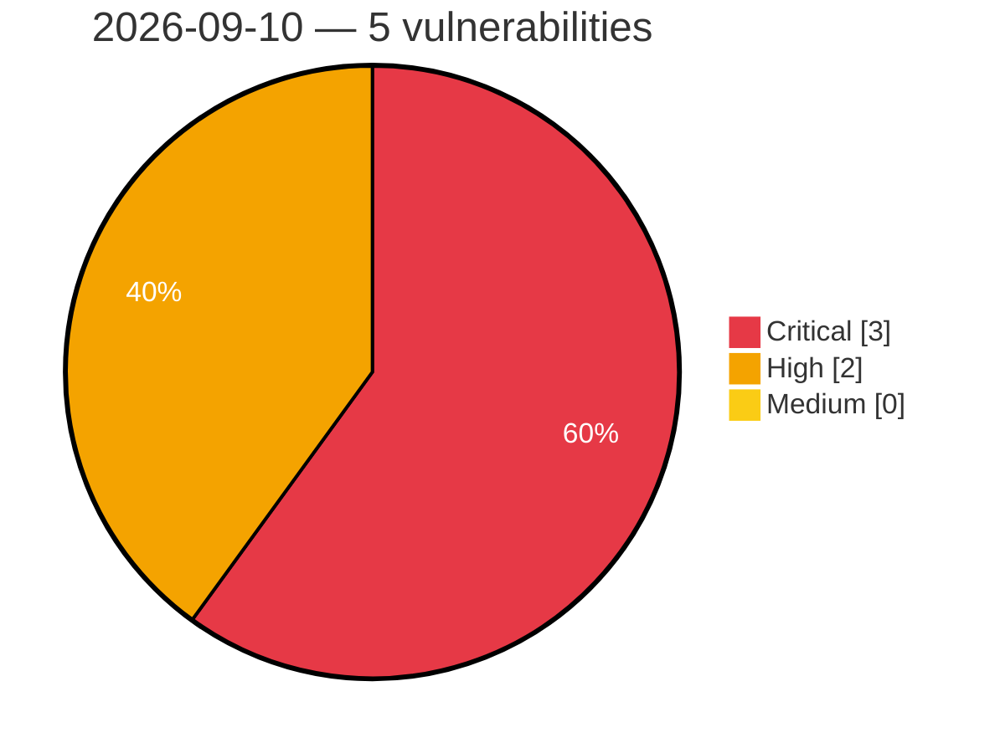

# Critical, High & Medium Severity Vulnerabilities — 2026-09-10

**Source status for this day:**

| Source | Critical | High | Medium | Total |
|--------|---------:|-----:|-------:|------:|
| cvefeed.io (High/Critical) | 3 | 2 | 0 | 5 |

**KEV (actively exploited):** 0  **Watchlist matches:** 3

## Critical (3)

| CVSS | Flags | Source | CVE / Title | Reported |
|------|-------|--------|-------------|----------|
| 9.9 | — | cvefeed.io (High/Critical) | [CVE-2026-19583 - Velociraptor Required Permissions bypass by using client monitoring queries](https://cvefeed.io/vuln/detail/CVE-2026-19583) | 1 hour, 35 minutes ago |
| 9.8 | ⭐ | cvefeed.io (High/Critical) | [CVE-2026-18351 - Drag and Drop File Upload for Elementor Forms <= 1.6.0 - Unauthenticated Arbitrary File Upload via 'type' Parameter](https://cvefeed.io/vuln/detail/CVE-2026-18351) | 2 hours, 35 minutes ago |
| 9.6 | — | cvefeed.io (High/Critical) | [CVE-2026-87931 - Behavioral Technology Group Pavlok Behavioral Conditioning Wearable Apple Notification Center Service Event buffer overflow](https://cvefeed.io/vuln/detail/CVE-2026-87931) | 4 hours, 34 minutes ago |

## High (2)

| CVSS | Flags | Source | CVE / Title | Reported |
|------|-------|--------|-------------|----------|
| 8.5 | ⭐ | cvefeed.io (High/Critical) | [CVE-2026-84063 - BurgerEditor Unrestricted File Upload Vulnerability](https://cvefeed.io/vuln/detail/CVE-2026-84063) | 1 hour, 35 minutes ago |
| 8.0 | ⭐ | cvefeed.io (High/Critical) | [CVE-2026-14873 - Bulk Password Reset <= 1.3.3 - Authenticated (Subscriber+) Arbitrary Password Reset](https://cvefeed.io/vuln/detail/CVE-2026-14873) | 34 minutes ago |
