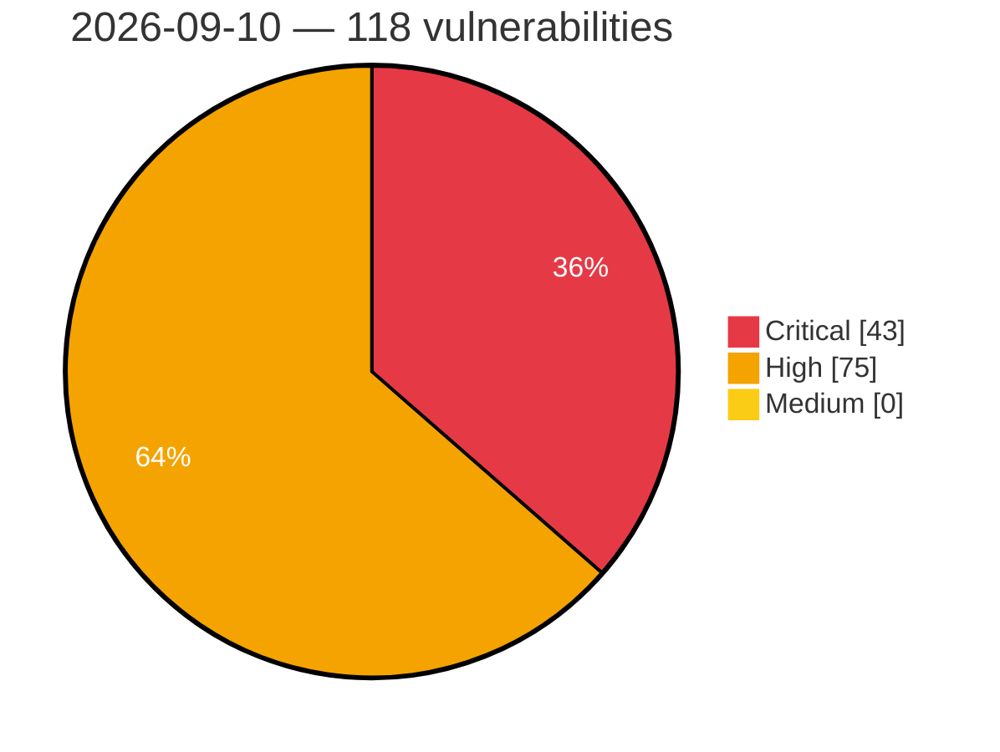

# Critical, High & Medium Severity Vulnerabilities — 2026-09-10

**Source status for this day:**

| Source | Critical | High | Medium | Total |
|--------|---------:|-----:|-------:|------:|
| cvefeed.io (High/Critical) | 43 | 75 | 0 | 118 |

**KEV (actively exploited):** 0  **Watchlist matches:** 81

## Critical (43)

| CVSS | Flags | Source | CVE / Title | Reported |
|------|-------|--------|-------------|----------|
| 9.9 | — | cvefeed.io (High/Critical) | [CVE-2026-19583 - Velociraptor Required Permissions bypass by using client monitoring queries](https://cvefeed.io/vuln/detail/CVE-2026-19583) | 1 hour, 35 minutes ago |
| 9.9 | ⭐ | cvefeed.io (High/Critical) | [CVE-2026-68488 - Plesk Time-of-Check Time-of-Use Privilege Escalation](https://cvefeed.io/vuln/detail/CVE-2026-68488) | 15 minutes ago |
| 9.9 | ⭐ | cvefeed.io (High/Critical) | [CVE-2026-68487 - Plesk Backup Manager Path Traversal Arbitrary File Write](https://cvefeed.io/vuln/detail/CVE-2026-68487) | 15 minutes ago |
| 9.9 | ⭐ | cvefeed.io (High/Critical) | [CVE-2026-89049 - Server-side request forgery in the Session Manager port forwarding functionality in AWS Systems Manager Agent](https://cvefeed.io/vuln/detail/CVE-2026-89049) | 1 hour, 25 minutes ago |
| 9.8 | ⭐ | cvefeed.io (High/Critical) | [CVE-2026-18351 - Drag and Drop File Upload for Elementor Forms <= 1.6.0 - Unauthenticated Arbitrary File Upload via 'type' Parameter](https://cvefeed.io/vuln/detail/CVE-2026-18351) | 2 hours, 35 minutes ago |
| 9.8 | ⭐ | cvefeed.io (High/Critical) | [CVE-2026-88278 - GV-LPCLPC2011/2211 - ONVIF WS-Security PasswordDigest Replay](https://cvefeed.io/vuln/detail/CVE-2026-88278) | 1 hour, 35 minutes ago |
| 9.8 | ⭐ | cvefeed.io (High/Critical) | [CVE-2026-7188 - SQLi in Armiya Information Technologies' Access Control System](https://cvefeed.io/vuln/detail/CVE-2026-7188) | 2 hours, 35 minutes ago |
| 9.8 | ⭐ | cvefeed.io (High/Critical) | [CVE-2026-9163 - SQLi in GIS Informatics' GisLab Laboratory Management System](https://cvefeed.io/vuln/detail/CVE-2026-9163) | 51 minutes ago |
| 9.8 | ⭐ | cvefeed.io (High/Critical) | [CVE-2026-88877 - Traefik v3.7.0 Authentication Bypass via from-to-www-redirect](https://cvefeed.io/vuln/detail/CVE-2026-88877) | 1 hour, 6 minutes ago |
| 9.8 | ⭐ | cvefeed.io (High/Critical) | [CVE-2026-88899 - knowns before 0.31.0 External Control of Agent Working Directory via x-opencode-directory Header](https://cvefeed.io/vuln/detail/CVE-2026-88899) | 1 hour, 13 minutes ago |
| 9.8 | ⭐ | cvefeed.io (High/Critical) | [CVE-2026-88018 - rclone serve s3: --auth-proxy without --auth-key authenticates nobody - full SigV4 signature bypass](https://cvefeed.io/vuln/detail/CVE-2026-88018) | 1 hour, 13 minutes ago |
| 9.8 | ⭐ | cvefeed.io (High/Critical) | [CVE-2026-81467 - Dell ThinOS OS Command Injection Vulnerability](https://cvefeed.io/vuln/detail/CVE-2026-81467) | 1 hour, 14 minutes ago |
| 9.8 | — | cvefeed.io (High/Critical) | [CVE-2026-81204 - Langflow is vulnerable to arbitrary code execution due to multiple incomplete code security controls and missing execution guards](https://cvefeed.io/vuln/detail/CVE-2026-81204) | 25 minutes ago |
| 9.8 | — | cvefeed.io (High/Critical) | [CVE-2026-79724 - Langflow is vulnerable to arbitrary code execution due to multiple incomplete code security controls and missing execution guards](https://cvefeed.io/vuln/detail/CVE-2026-79724) | 25 minutes ago |
| 9.6 | — | cvefeed.io (High/Critical) | [CVE-2026-87931 - Behavioral Technology Group Pavlok Behavioral Conditioning Wearable Apple Notification Center Service Event buffer overflow](https://cvefeed.io/vuln/detail/CVE-2026-87931) | 4 hours, 34 minutes ago |
| 9.6 | ⭐ | cvefeed.io (High/Critical) | [CVE-2026-81048 - Dell ThinOS Command Injection Vulnerability](https://cvefeed.io/vuln/detail/CVE-2026-81048) | 1 hour, 14 minutes ago |
| 9.6 | ⭐ | cvefeed.io (High/Critical) | [CVE-2026-82107 - DataStage on Cloud Pak for Data has several vulnerabilities due to open source software](https://cvefeed.io/vuln/detail/CVE-2026-82107) | 25 minutes ago |
| 9.6 | ⭐ | cvefeed.io (High/Critical) | [CVE-2026-82100 - DataStage on Cloud Pak for Data has several vulnerabilities due to open source software](https://cvefeed.io/vuln/detail/CVE-2026-82100) | 25 minutes ago |
| 9.5 | ⭐ | cvefeed.io (High/Critical) | [CVE-2026-44950 - fs_read_glyphs() heap buffer overflow via cumulative glyph data overflow in libXfont2](https://cvefeed.io/vuln/detail/CVE-2026-44950) | 1 hour, 35 minutes ago |
| 9.5 | ⭐ | cvefeed.io (High/Critical) | [CVE-2026-65639 - ConfigServer Security & Firewall OS Command Injection Vulnerability](https://cvefeed.io/vuln/detail/CVE-2026-65639) | 15 minutes ago |
| 9.5 | ⭐ | cvefeed.io (High/Critical) | [CVE-2026-88062 - OmniRoute ACP Custom-Agent Remote Code Execution (RCE)](https://cvefeed.io/vuln/detail/CVE-2026-88062) | 25 minutes ago |
| 9.4 | — | cvefeed.io (High/Critical) | [CVE-2026-88285 - GV-LPC2011/LPC2211 - Unauthenticated PTZ Control Service](https://cvefeed.io/vuln/detail/CVE-2026-88285) | 1 hour, 35 minutes ago |
| 9.4 | — | cvefeed.io (High/Critical) | [CVE-2026-81046 - Dell ThinOS Protection Mechanism Failure](https://cvefeed.io/vuln/detail/CVE-2026-81046) | 1 hour, 14 minutes ago |
| 9.3 | ⭐ | cvefeed.io (High/Critical) | [CVE-2026-78082 - Joomla Extension - joomshaper.com - Unauthenticated SQL Injection in Property Search and Map Filtering in SP Property < 4.1.4](https://cvefeed.io/vuln/detail/CVE-2026-78082) | 35 minutes ago |
| 9.3 | ⭐ | cvefeed.io (High/Critical) | [CVE-2026-8323 - Open Redirect in Armiya Information Technologies' Access Control System](https://cvefeed.io/vuln/detail/CVE-2026-8323) | 1 hour, 35 minutes ago |
| 9.3 | ⭐ | cvefeed.io (High/Critical) | [CVE-2026-88869 - AVideo AD_Server Stored XSS via log.php label parameter](https://cvefeed.io/vuln/detail/CVE-2026-88869) | 1 hour, 6 minutes ago |
| 9.3 | ⭐ | cvefeed.io (High/Critical) | [CVE-2026-88868 - AVideo LiveLinks Stored XSS via title and description fields](https://cvefeed.io/vuln/detail/CVE-2026-88868) | 1 hour, 6 minutes ago |
| 9.3 | ⭐ | cvefeed.io (High/Critical) | [CVE-2026-88867 - WWBN AVideo Stored XSS via Category Name and Icon Class](https://cvefeed.io/vuln/detail/CVE-2026-88867) | 1 hour, 6 minutes ago |
| 9.3 | ⭐ | cvefeed.io (High/Critical) | [CVE-2026-88866 - WWBN AVideo LoginControl Stored XSS via User-Agent Header](https://cvefeed.io/vuln/detail/CVE-2026-88866) | 1 hour, 6 minutes ago |
| 9.3 | ⭐ | cvefeed.io (High/Critical) | [CVE-2026-89042 - passport-saml-encrypted through 0.1.13 Authentication Bypass via Missing Signature Verification](https://cvefeed.io/vuln/detail/CVE-2026-89042) | 2 hours, 24 minutes ago |
| 9.2 | — | cvefeed.io (High/Critical) | [CVE-2026-59679 - fs_read_glyphs() heap OOB read/write via encoding array index mismatch in libXfont2](https://cvefeed.io/vuln/detail/CVE-2026-59679) | 1 hour, 35 minutes ago |
| 9.2 | — | cvefeed.io (High/Critical) | [CVE-2026-13745 - Arbitrary Code Execution in Gemini CLI via Symlinked Environment Variables](https://cvefeed.io/vuln/detail/CVE-2026-13745) | 1 hour, 35 minutes ago |
| 9.2 | ⭐ | cvefeed.io (High/Critical) | [CVE-2026-88887 - Renovate before 44.11.2 Credential Exfiltration via Link Header](https://cvefeed.io/vuln/detail/CVE-2026-88887) | 1 hour, 5 minutes ago |
| 9.2 | — | cvefeed.io (High/Critical) | [CVE-2026-88882 - Renovate before 44.11.2 Credential Exfiltration via Link Header](https://cvefeed.io/vuln/detail/CVE-2026-88882) | 1 hour, 6 minutes ago |
| 9.2 | ⭐ | cvefeed.io (High/Critical) | [CVE-2026-88881 - Renovate before 44.11.3 Credential Exfiltration via Link Header](https://cvefeed.io/vuln/detail/CVE-2026-88881) | 1 hour, 6 minutes ago |
| 9.2 | — | cvefeed.io (High/Critical) | [CVE-2026-88880 - Renovate before 44.11.3 Credential Exfiltration via Link Header](https://cvefeed.io/vuln/detail/CVE-2026-88880) | 1 hour, 6 minutes ago |
| 9.2 | ⭐ | cvefeed.io (High/Critical) | [CVE-2026-65638 - ConfigServer Security & Firewall Shell Command Injection Vulnerability](https://cvefeed.io/vuln/detail/CVE-2026-65638) | 15 minutes ago |
| 9.1 | ⭐ | cvefeed.io (High/Critical) | [CVE-2026-88044 - rclone: RC per-server auth-proxy bypass](https://cvefeed.io/vuln/detail/CVE-2026-88044) | 14 minutes ago |
| 9.1 | — | cvefeed.io (High/Critical) | [CVE-2026-85228 - Integer overflow in tensor buffer validation in Deep Java Library](https://cvefeed.io/vuln/detail/CVE-2026-85228) | 15 minutes ago |
| 9.1 | ⭐ | cvefeed.io (High/Critical) | [CVE-2026-81468 - Dell ThinOS OS Command Injection Vulnerability](https://cvefeed.io/vuln/detail/CVE-2026-81468) | 1 hour, 14 minutes ago |
| 9.1 | — | cvefeed.io (High/Critical) | [CVE-2026-89086 - jose OCaml Improper RSA Signature Validation](https://cvefeed.io/vuln/detail/CVE-2026-89086) | 25 minutes ago |
| 9.1 | ⭐ | cvefeed.io (High/Critical) | [CVE-2026-89043 - passport-saml-encrypted through 0.1.13 XML Signature Wrapping via Assertion Prepending](https://cvefeed.io/vuln/detail/CVE-2026-89043) | 2 hours, 24 minutes ago |
| 9.1 | ⭐ | cvefeed.io (High/Critical) | [CVE-2026-80424 - DataStage on Cloud Pak for Data has several vulnerabilities due to open source software](https://cvefeed.io/vuln/detail/CVE-2026-80424) | 25 minutes ago |

## High (75)

| CVSS | Flags | Source | CVE / Title | Reported |
|------|-------|--------|-------------|----------|
| 8.8 | ⭐ | cvefeed.io (High/Critical) | [CVE-2026-88277 - GV-LPCLPC2011/2211 - ONVIF Subscribe Address Command Injection](https://cvefeed.io/vuln/detail/CVE-2026-88277) | 1 hour, 35 minutes ago |
| 8.8 | — | cvefeed.io (High/Critical) | [CVE-2026-88271 - GV-LPC2011/LPC2211 - SSVR Guest Configuration Overwrite and Administrative Credential Takeover](https://cvefeed.io/vuln/detail/CVE-2026-88271) | 1 hour, 35 minutes ago |
| 8.8 | ⭐ | cvefeed.io (High/Critical) | [CVE-2026-64837 - ICEcoder through 8.1 OS Command Injection via lib/properties.php](https://cvefeed.io/vuln/detail/CVE-2026-64837) | 20 minutes ago |
| 8.8 | ⭐ | cvefeed.io (High/Critical) | [CVE-2026-64836 - ICEcoder through 8.1 Path Traversal via Ineffective File::check() Confinement](https://cvefeed.io/vuln/detail/CVE-2026-64836) | 20 minutes ago |
| 8.8 | ⭐ | cvefeed.io (High/Critical) | [CVE-2026-73693 - FileRun < 2026.3.0 OS Command Injection via PhotoProofSheet Handler](https://cvefeed.io/vuln/detail/CVE-2026-73693) | 15 minutes ago |
| 8.8 | ⭐ | cvefeed.io (High/Critical) | [CVE-2026-88959 - Anchor CMS through 0.12.7 Privilege Escalation via Missing Authorization on Admin User-Management Endpoints](https://cvefeed.io/vuln/detail/CVE-2026-88959) | 1 hour, 13 minutes ago |
| 8.8 | ⭐ | cvefeed.io (High/Critical) | [CVE-2026-88937 - knowns through 0.33.0 Path Traversal via Template Engine](https://cvefeed.io/vuln/detail/CVE-2026-88937) | 1 hour, 13 minutes ago |
| 8.8 | ⭐ | cvefeed.io (High/Critical) | [CVE-2026-88009 - Traefik: Rootless HTTP/1 request-target routes as "/" but is forwarded verbatim, bypassing path-scoped routing, middleware guards and access logging](https://cvefeed.io/vuln/detail/CVE-2026-88009) | 1 hour, 13 minutes ago |
| 8.8 | ⭐ | cvefeed.io (High/Critical) | [CVE-2026-79987 - Low-privilege RCE through element-search eager loading](https://cvefeed.io/vuln/detail/CVE-2026-79987) | 1 hour, 14 minutes ago |
| 8.8 | — | cvefeed.io (High/Critical) | [CVE-2026-89046 - zstd-jni 1.5.5-6 through 1.5.7-13 Out-of-Bounds Read via Negative Offset](https://cvefeed.io/vuln/detail/CVE-2026-89046) | 2 hours, 24 minutes ago |
| 8.8 | ⭐ | cvefeed.io (High/Critical) | [CVE-2026-84889 - A path traversal vulnerability in file handling components could allow an authenticated attacker to write files to arbitrary locations on the server filesystem](https://cvefeed.io/vuln/detail/CVE-2026-84889) | 25 minutes ago |
| 8.8 | ⭐ | cvefeed.io (High/Critical) | [CVE-2026-82099 - DataStage on Cloud Pak for Data has several vulnerabilities due to open source software](https://cvefeed.io/vuln/detail/CVE-2026-82099) | 25 minutes ago |
| 8.8 | ⭐ | cvefeed.io (High/Critical) | [CVE-2026-82098 - DataStage on Cloud Pak for Data has several vulnerabilities due to open source software](https://cvefeed.io/vuln/detail/CVE-2026-82098) | 25 minutes ago |
| 8.8 | ⭐ | cvefeed.io (High/Critical) | [CVE-2026-82097 - DataStage on Cloud Pak for Data has several vulnerabilities due to open source software](https://cvefeed.io/vuln/detail/CVE-2026-82097) | 25 minutes ago |
| 8.8 | ⭐ | cvefeed.io (High/Critical) | [CVE-2026-82095 - DataStage on Cloud Pak for Data has several vulnerabilities due to open source software](https://cvefeed.io/vuln/detail/CVE-2026-82095) | 25 minutes ago |
| 8.8 | ⭐ | cvefeed.io (High/Critical) | [CVE-2026-82092 - DataStage on Cloud Pak for Data has several vulnerabilities due to open source software](https://cvefeed.io/vuln/detail/CVE-2026-82092) | 25 minutes ago |
| 8.8 | — | cvefeed.io (High/Critical) | [CVE-2026-81941 - Langflow is vulnerable to arbitrary code execution due to multiple incomplete code security controls and missing execution guards](https://cvefeed.io/vuln/detail/CVE-2026-81941) | 25 minutes ago |
| 8.8 | — | cvefeed.io (High/Critical) | [CVE-2026-81940 - Langflow is vulnerable to arbitrary code execution due to multiple incomplete code security controls and missing execution guards](https://cvefeed.io/vuln/detail/CVE-2026-81940) | 25 minutes ago |
| 8.8 | ⭐ | cvefeed.io (High/Critical) | [CVE-2026-81554 - DataStage on Cloud Pak for Data has several vulnerabilities due to open source software](https://cvefeed.io/vuln/detail/CVE-2026-81554) | 25 minutes ago |
| 8.8 | ⭐ | cvefeed.io (High/Critical) | [CVE-2026-81551 - DataStage on Cloud Pak for Data has several vulnerabilities due to open source software](https://cvefeed.io/vuln/detail/CVE-2026-81551) | 25 minutes ago |
| 8.8 | ⭐ | cvefeed.io (High/Critical) | [CVE-2026-81550 - DataStage on Cloud Pak for Data has several vulnerabilities due to open source software](https://cvefeed.io/vuln/detail/CVE-2026-81550) | 25 minutes ago |
| 8.8 | — | cvefeed.io (High/Critical) | [CVE-2026-81211 - Langflow is vulnerable to arbitrary code execution due to multiple incomplete code security controls and missing execution guards](https://cvefeed.io/vuln/detail/CVE-2026-81211) | 25 minutes ago |
| 8.8 | — | cvefeed.io (High/Critical) | [CVE-2026-79742 - Langflow is vulnerable to arbitrary code execution due to multiple incomplete code security controls and missing execution guards](https://cvefeed.io/vuln/detail/CVE-2026-79742) | 25 minutes ago |
| 8.7 | — | cvefeed.io (High/Critical) | [CVE-2026-75584 - ION-DTN < 4.2.1-a.1 Denial of Service via canonicalizePayloadBlock() Assertion](https://cvefeed.io/vuln/detail/CVE-2026-75584) | 17 minutes ago |
| 8.7 | ⭐ | cvefeed.io (High/Critical) | [CVE-2026-64838 - ICEcoder through 8.1 Path Traversal via oldFileName Parameter](https://cvefeed.io/vuln/detail/CVE-2026-64838) | 20 minutes ago |
| 8.7 | ⭐ | cvefeed.io (High/Critical) | [CVE-2026-88893 - OpenPanel Unauthenticated Share Lookup Information Disclosure](https://cvefeed.io/vuln/detail/CVE-2026-88893) | 1 hour, 5 minutes ago |
| 8.7 | ⭐ | cvefeed.io (High/Critical) | [CVE-2026-88876 - AVideo PlayerSkins seo.php Missing Authorization Password-Protected VOD](https://cvefeed.io/vuln/detail/CVE-2026-88876) | 1 hour, 6 minutes ago |
| 8.7 | ⭐ | cvefeed.io (High/Critical) | [CVE-2026-88874 - AVideo through c3edcc274c389816d434acadac07ee78eaf330c1 Authentication Bypass](https://cvefeed.io/vuln/detail/CVE-2026-88874) | 1 hour, 6 minutes ago |
| 8.7 | — | cvefeed.io (High/Critical) | [CVE-2026-88939 - knowns through 0.33.0 Authorization Bypass via project.set Bootstrap Exemption](https://cvefeed.io/vuln/detail/CVE-2026-88939) | 1 hour, 13 minutes ago |
| 8.7 | ⭐ | cvefeed.io (High/Critical) | [CVE-2026-16174 - Netskope Endpoint DLP Driver Integer Overflow Leading to Kernel Pool Overflow](https://cvefeed.io/vuln/detail/CVE-2026-16174) | 1 hour, 26 minutes ago |
| 8.6 | ⭐ | cvefeed.io (High/Critical) | [CVE-2026-78302 - Joomla Extension - joomshaper.com - Unauthenticated Cross-Site Scripting (XSS) via Unescaped Output in Views and Admin Lists in SP Property < 4.1.4](https://cvefeed.io/vuln/detail/CVE-2026-78302) | 34 minutes ago |
| 8.6 | — | cvefeed.io (High/Critical) | [CVE-2026-85217 - Man-in-the-Middle (MITM) Vulnerability in Autodesk Fusion Desktop](https://cvefeed.io/vuln/detail/CVE-2026-85217) | 41 minutes ago |
| 8.6 | ⭐ | cvefeed.io (High/Critical) | [CVE-2026-88895 - CyberPanel before 3.0.5 Authentication Bypass via API](https://cvefeed.io/vuln/detail/CVE-2026-88895) | 1 hour, 5 minutes ago |
| 8.6 | — | cvefeed.io (High/Critical) | [CVE-2026-88865 - AVideo Missing Authorization via getRestream.json.php](https://cvefeed.io/vuln/detail/CVE-2026-88865) | 1 hour, 6 minutes ago |
| 8.6 | ⭐ | cvefeed.io (High/Critical) | [CVE-2026-88049 - Tesseract: Heap out-of-bounds write in LSTM::Forward via na_/gate-matrix dimension mismatch](https://cvefeed.io/vuln/detail/CVE-2026-88049) | 14 minutes ago |
| 8.6 | ⭐ | cvefeed.io (High/Critical) | [CVE-2026-88048 - Tesseract: Heap out-of-bounds write/read in FullyConnected::Forward via layer/weight-matrix dimension mismatch](https://cvefeed.io/vuln/detail/CVE-2026-88048) | 14 minutes ago |
| 8.6 | ⭐ | cvefeed.io (High/Critical) | [CVE-2026-88047 - Tesseract: ReadNormProtos stack buffer overflow](https://cvefeed.io/vuln/detail/CVE-2026-88047) | 14 minutes ago |
| 8.6 | — | cvefeed.io (High/Critical) | [CVE-2026-73699 - FileRun < 2026.3.0 PHP Object Injection via Perms::getPerms()](https://cvefeed.io/vuln/detail/CVE-2026-73699) | 15 minutes ago |
| 8.6 | ⭐ | cvefeed.io (High/Critical) | [CVE-2026-73698 - FileRun < 2026.3.0 Authenticated SQL Injection via Groups Add Action](https://cvefeed.io/vuln/detail/CVE-2026-73698) | 15 minutes ago |
| 8.6 | ⭐ | cvefeed.io (High/Critical) | [CVE-2026-73694 - FileRun < 2026.3.0 OS Command Injection via escapeshellcmd() No-Op Redefinition](https://cvefeed.io/vuln/detail/CVE-2026-73694) | 15 minutes ago |
| 8.6 | ⭐ | cvefeed.io (High/Critical) | [CVE-2026-88060 - Angular: SSR XSS via Unescaped <template> Content Across DocumentFragment Boundaries in Fallback Raw-Content Elements](https://cvefeed.io/vuln/detail/CVE-2026-88060) | 1 hour, 25 minutes ago |
| 8.6 | ⭐ | cvefeed.io (High/Critical) | [CVE-2026-88058 - Angular: SSR XSS via Unescaped Processing Instruction (<?...?>) Nodes in Fallback Raw-Content Elements](https://cvefeed.io/vuln/detail/CVE-2026-88058) | 1 hour, 25 minutes ago |
| 8.6 | ⭐ | cvefeed.io (High/Critical) | [CVE-2026-88056 - Angular: SSRF and Cross-Origin Credential Disclosure via URL Resolution Discrepancy in SSR](https://cvefeed.io/vuln/detail/CVE-2026-88056) | 1 hour, 25 minutes ago |
| 8.6 | ⭐ | cvefeed.io (High/Critical) | [CVE-2026-88053 - Tesseract: Heap out-of-bounds write in Classify::ReadIntTemplates via unvalidated counts in crafted .traineddata](https://cvefeed.io/vuln/detail/CVE-2026-88053) | 2 hours, 24 minutes ago |
| 8.6 | ⭐ | cvefeed.io (High/Critical) | [CVE-2026-88051 - Tesseract: Heap out-of-bounds write in GenericVector<T>::read due to independent reserved/size_used_ fields](https://cvefeed.io/vuln/detail/CVE-2026-88051) | 2 hours, 24 minutes ago |
| 8.6 | ⭐ | cvefeed.io (High/Critical) | [CVE-2026-81213 - Langflow is vulnerable to server-side request forgery due to missing egress validation on server-side URL fetches](https://cvefeed.io/vuln/detail/CVE-2026-81213) | 25 minutes ago |
| 8.5 | ⭐ | cvefeed.io (High/Critical) | [CVE-2026-84063 - BurgerEditor Unrestricted File Upload Vulnerability](https://cvefeed.io/vuln/detail/CVE-2026-84063) | 1 hour, 35 minutes ago |
| 8.5 | ⭐ | cvefeed.io (High/Critical) | [CVE-2026-88890 - OpenPanel SQL Injection via unvalidated profile filter column identifier](https://cvefeed.io/vuln/detail/CVE-2026-88890) | 1 hour, 5 minutes ago |
| 8.5 | ⭐ | cvefeed.io (High/Critical) | [CVE-2026-88889 - Renovate before 44.14.7 Command Injection via distributionType](https://cvefeed.io/vuln/detail/CVE-2026-88889) | 1 hour, 5 minutes ago |
| 8.5 | ⭐ | cvefeed.io (High/Critical) | [CVE-2026-88886 - Renovate before 44.14.7 Command Injection via gradle-wrapper](https://cvefeed.io/vuln/detail/CVE-2026-88886) | 1 hour, 5 minutes ago |
| 8.5 | ⭐ | cvefeed.io (High/Critical) | [CVE-2026-81540 - DataStage on Cloud Pak for Data has several vulnerabilities due to open source software](https://cvefeed.io/vuln/detail/CVE-2026-81540) | 25 minutes ago |
| 8.5 | ⭐ | cvefeed.io (High/Critical) | [CVE-2026-81207 - DataStage on Cloud Pak for Data has several vulnerabilities due to open source software](https://cvefeed.io/vuln/detail/CVE-2026-81207) | 25 minutes ago |
| 8.5 | ⭐ | cvefeed.io (High/Critical) | [CVE-2026-80436 - DataStage on Cloud Pak for Data has several vulnerabilities due to open source software](https://cvefeed.io/vuln/detail/CVE-2026-80436) | 25 minutes ago |
| 8.5 | ⭐ | cvefeed.io (High/Critical) | [CVE-2026-80378 - DataStage on Cloud Pak for Data has several vulnerabilities due to open source software](https://cvefeed.io/vuln/detail/CVE-2026-80378) | 25 minutes ago |
| 8.4 | ⭐ | cvefeed.io (High/Critical) | [CVE-2026-42805 - Bosch Sensortec BHI385 SensorAPI Stack-Based Buffer Overflow](https://cvefeed.io/vuln/detail/CVE-2026-42805) | 1 hour, 35 minutes ago |
| 8.4 | — | cvefeed.io (High/Critical) | [CVE-2026-4130 - Storage of Sensitive Information in Cleartext in NI SystemLink](https://cvefeed.io/vuln/detail/CVE-2026-4130) | 1 hour, 14 minutes ago |
| 8.4 | ⭐ | cvefeed.io (High/Critical) | [CVE-2026-88022 - Unauthorized document disclosure and deletion via query-operator injection in explicit equality filters in MongoDB integration for Laravel](https://cvefeed.io/vuln/detail/CVE-2026-88022) | 2 hours, 24 minutes ago |
| 8.3 | ⭐ | cvefeed.io (High/Critical) | [CVE-2026-88891 - OpenPanel Read-Only Access Level Enforcement Bypass via Mutations](https://cvefeed.io/vuln/detail/CVE-2026-88891) | 1 hour, 5 minutes ago |
| 8.3 | — | cvefeed.io (High/Critical) | [CVE-2026-88883 - Renovate before 44.14.4 TLS Private Key Log Sanitisation](https://cvefeed.io/vuln/detail/CVE-2026-88883) | 1 hour, 6 minutes ago |
| 8.3 | — | cvefeed.io (High/Critical) | [CVE-2026-88036 - GridFS data disclosure and deletion via query-operator injection in file IDs in the MongoDB C Driver](https://cvefeed.io/vuln/detail/CVE-2026-88036) | 1 hour, 25 minutes ago |
| 8.3 | — | cvefeed.io (High/Critical) | [CVE-2026-88034 - GridFS data disclosure and deletion via query-operator injection in file IDs in the MongoDB C++ Driver](https://cvefeed.io/vuln/detail/CVE-2026-88034) | 1 hour, 25 minutes ago |
| 8.3 | — | cvefeed.io (High/Critical) | [CVE-2026-88033 - GridFS data disclosure and deletion via query-operator injection in file IDs in the MongoDB Java Driver](https://cvefeed.io/vuln/detail/CVE-2026-88033) | 1 hour, 25 minutes ago |
| 8.3 | — | cvefeed.io (High/Critical) | [CVE-2026-87090 - Consul vulnerable to an authorization bypass in the catalog node-write path](https://cvefeed.io/vuln/detail/CVE-2026-87090) | 1 hour, 25 minutes ago |
| 8.3 | — | cvefeed.io (High/Critical) | [CVE-2026-88030 - GridFS data disclosure and deletion via query-operator injection in file IDs in the MongoDB Ruby Driver](https://cvefeed.io/vuln/detail/CVE-2026-88030) | 2 hours, 24 minutes ago |
| 8.3 | — | cvefeed.io (High/Critical) | [CVE-2026-88029 - GridFS data disclosure and deletion via query-operator injection in file IDs in the MongoDB Python Driver](https://cvefeed.io/vuln/detail/CVE-2026-88029) | 2 hours, 24 minutes ago |
| 8.3 | — | cvefeed.io (High/Critical) | [CVE-2026-88025 - GridFS data disclosure and deletion via query-operator injection in file IDs in the MongoDB C# Driver](https://cvefeed.io/vuln/detail/CVE-2026-88025) | 2 hours, 24 minutes ago |
| 8.3 | — | cvefeed.io (High/Critical) | [CVE-2026-88024 - GridFS data disclosure and deletion via query-operator injection in file IDs in the MongoDB Rust Driver](https://cvefeed.io/vuln/detail/CVE-2026-88024) | 2 hours, 24 minutes ago |
| 8.3 | — | cvefeed.io (High/Critical) | [CVE-2026-88023 - GridFS data disclosure and deletion via query-operator injection in file IDs in the MongoDB PHP Library](https://cvefeed.io/vuln/detail/CVE-2026-88023) | 2 hours, 24 minutes ago |
| 8.2 | ⭐ | cvefeed.io (High/Critical) | [CVE-2026-89054 - OpenNMS missing authorization on /api/v2 PATCH endpoints allows unauthenticated configuration changes](https://cvefeed.io/vuln/detail/CVE-2026-89054) | 25 minutes ago |
| 8.2 | ⭐ | cvefeed.io (High/Critical) | [CVE-2026-88032 - Application denial of service via cancellation race in reactive client-side encryption in MongoDB Java Driver](https://cvefeed.io/vuln/detail/CVE-2026-88032) | 1 hour, 25 minutes ago |
| 8.1 | — | cvefeed.io (High/Critical) | [CVE-2026-88031 - GridFS data deletion via query-operator injection in file IDs in the MongoDB Go Driver](https://cvefeed.io/vuln/detail/CVE-2026-88031) | 2 hours, 24 minutes ago |
| 8.1 | — | cvefeed.io (High/Critical) | [CVE-2026-87958 - IBM® Db2® is vulnerable to a denial of service where a specific functionality on a Db2 server can be disabled by a privileged user under certain conditions](https://cvefeed.io/vuln/detail/CVE-2026-87958) | 25 minutes ago |
| 8.1 | ⭐ | cvefeed.io (High/Critical) | [CVE-2026-81268 - Langflow is vulnerable to authentication bypass and insufficient session expiration](https://cvefeed.io/vuln/detail/CVE-2026-81268) | 25 minutes ago |
| 8.0 | ⭐ | cvefeed.io (High/Critical) | [CVE-2026-14873 - Bulk Password Reset <= 1.3.3 - Authenticated (Subscriber+) Arbitrary Password Reset](https://cvefeed.io/vuln/detail/CVE-2026-14873) | 34 minutes ago |
| 8.0 | — | cvefeed.io (High/Critical) | [CVE-2026-42807 - BoschSensortec COINES_SDK Heap-Based Buffer Overflow](https://cvefeed.io/vuln/detail/CVE-2026-42807) | 1 hour, 35 minutes ago |
