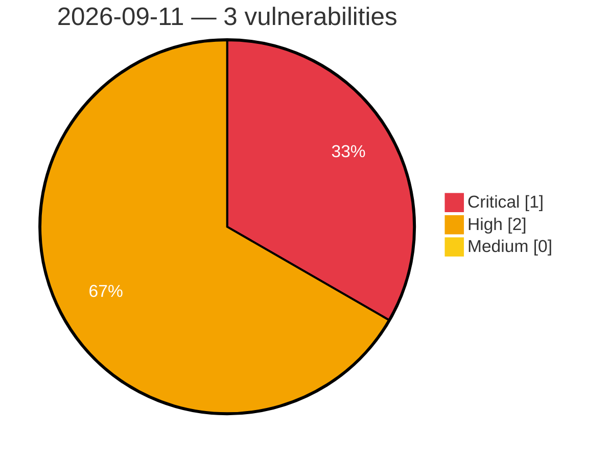

# Critical, High & Medium Severity Vulnerabilities — 2026-09-11

**Source status for this day:**

| Source | Critical | High | Medium | Total |
|--------|---------:|-----:|-------:|------:|
| cvefeed.io (High/Critical) | 1 | 2 | 0 | 3 |

**KEV (actively exploited):** 0  **Watchlist matches:** 2

## Critical (1)

| CVSS | Flags | Source | CVE / Title | Reported |
|------|-------|--------|-------------|----------|
| 9.8 | ⭐ | cvefeed.io (High/Critical) | [CVE-2026-8778 - MIPL Grouped Checkout Fields for WooCommerce <= 1.2.2 - Unauthenticated Arbitrary File Upload](https://cvefeed.io/vuln/detail/CVE-2026-8778) | 24 minutes ago |

## High (2)

| CVSS | Flags | Source | CVE / Title | Reported |
|------|-------|--------|-------------|----------|
| 8.7 | ⭐ | cvefeed.io (High/Critical) | [CVE-2026-88260 - Brainzcompany Zenius EMS Authentication Bypass and Remote Code Inclusion](https://cvefeed.io/vuln/detail/CVE-2026-88260) | 1 hour, 26 minutes ago |
| 8.1 | — | cvefeed.io (High/Critical) | [CVE-2026-19991 - UsersWP <= 1.2.70 - Authenticated (Subscriber+) Arbitrary File Deletion](https://cvefeed.io/vuln/detail/CVE-2026-19991) | 25 minutes ago |
