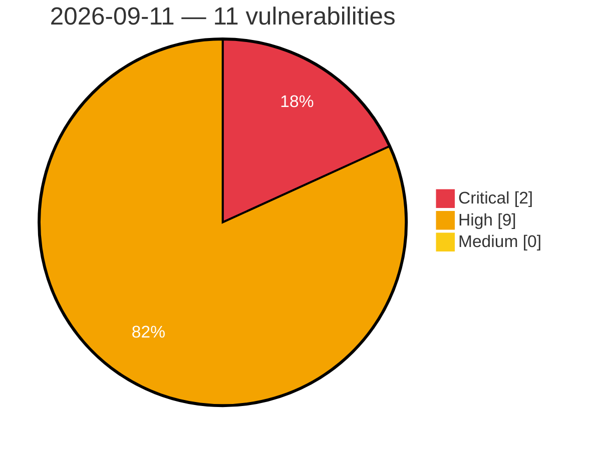

# Critical, High & Medium Severity Vulnerabilities — 2026-09-11

**Source status for this day:**

| Source | Critical | High | Medium | Total |
|--------|---------:|-----:|-------:|------:|
| cvefeed.io (High/Critical) | 2 | 9 | 0 | 11 |

**KEV (actively exploited):** 0  **Watchlist matches:** 5

## Critical (2)

| CVSS | Flags | Source | CVE / Title | Reported |
|------|-------|--------|-------------|----------|
| 9.8 | ⭐ | cvefeed.io (High/Critical) | [CVE-2026-8778 - MIPL Grouped Checkout Fields for WooCommerce <= 1.2.2 - Unauthenticated Arbitrary File Upload](https://cvefeed.io/vuln/detail/CVE-2026-8778) | 24 minutes ago |
| 9.2 | — | cvefeed.io (High/Critical) | [CVE-2026-47839 - Federated OIDC Users Can Bypass externalGroupsWhitelist to Gain uaa.admin](https://cvefeed.io/vuln/detail/CVE-2026-47839) | 26 minutes ago |

## High (9)

| CVSS | Flags | Source | CVE / Title | Reported |
|------|-------|--------|-------------|----------|
| 8.8 | — | cvefeed.io (High/Critical) | [CVE-2026-89178 - Howyar｜WeenyGenius - Origin Validation Error](https://cvefeed.io/vuln/detail/CVE-2026-89178) | 2 hours, 26 minutes ago |
| 8.8 | — | cvefeed.io (High/Critical) | [CVE-2026-89177 - Howyar｜WeenyGenius - Use of Insecure Protocol](https://cvefeed.io/vuln/detail/CVE-2026-89177) | 2 hours, 26 minutes ago |
| 8.8 | — | cvefeed.io (High/Critical) | [CVE-2026-89176 - Howyar｜WeenyGenius - Missing Authentication](https://cvefeed.io/vuln/detail/CVE-2026-89176) | 2 hours, 26 minutes ago |
| 8.8 | ⭐ | cvefeed.io (High/Critical) | [CVE-2026-73784 - HPE IceWall products, Remote Bypass of Security Restrictions](https://cvefeed.io/vuln/detail/CVE-2026-73784) | 3 hours, 26 minutes ago |
| 8.7 | ⭐ | cvefeed.io (High/Critical) | [CVE-2026-88260 - Brainzcompany Zenius EMS Authentication Bypass and Remote Code Inclusion](https://cvefeed.io/vuln/detail/CVE-2026-88260) | 1 hour, 26 minutes ago |
| 8.7 | ⭐ | cvefeed.io (High/Critical) | [CVE-2026-19486 - SSRF in Gemini Enterprise Agent Platform App Builder](https://cvefeed.io/vuln/detail/CVE-2026-19486) | 1 hour, 25 minutes ago |
| 8.7 | ⭐ | cvefeed.io (High/Critical) | [CVE-2026-89174 - Kingdom Communication Associated｜Smart Video Intercom System - Missing Burte-force Protection](https://cvefeed.io/vuln/detail/CVE-2026-89174) | 2 hours, 26 minutes ago |
| 8.3 | — | cvefeed.io (High/Critical) | [CVE-2026-80469 - CVE-2026-80469](https://cvefeed.io/vuln/detail/CVE-2026-80469) | 1 hour, 25 minutes ago |
| 8.1 | — | cvefeed.io (High/Critical) | [CVE-2026-19991 - UsersWP <= 1.2.70 - Authenticated (Subscriber+) Arbitrary File Deletion](https://cvefeed.io/vuln/detail/CVE-2026-19991) | 25 minutes ago |
