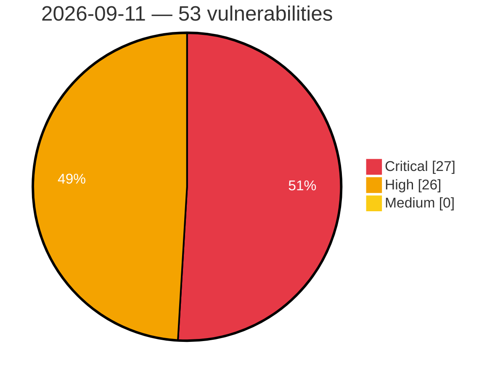

# Critical, High & Medium Severity Vulnerabilities — 2026-09-11

**Source status for this day:**

| Source | Critical | High | Medium | Total |
|--------|---------:|-----:|-------:|------:|
| cvefeed.io (High/Critical) | 27 | 26 | 0 | 53 |

**KEV (actively exploited):** 0  **Watchlist matches:** 29

## Critical (27)

| CVSS | Flags | Source | CVE / Title | Reported |
|------|-------|--------|-------------|----------|
| 10.0 | ⭐ | cvefeed.io (High/Critical) | [CVE-2026-80462 - Privilege Escalation in Progress Chef Automate](https://cvefeed.io/vuln/detail/CVE-2026-80462) | 1 hour, 2 minutes ago |
| 10.0 | ⭐ | cvefeed.io (High/Critical) | [CVE-2026-14560 - Teddy Bear Customize Addon <= 1.0.5 - Unauthenticated Arbitrary File Upload](https://cvefeed.io/vuln/detail/CVE-2026-14560) | 7 hours, 3 minutes ago |
| 10.0 | — | cvefeed.io (High/Critical) | [CVE-2026-87988 - Mistral Vibe Arbitrary File Access Vulnerability](https://cvefeed.io/vuln/detail/CVE-2026-87988) | 1 hour, 36 minutes ago |
| 10.0 | — | cvefeed.io (High/Critical) | [CVE-2026-87987 - Mistral Vibe Arbitrary Code Execution Vulnerability](https://cvefeed.io/vuln/detail/CVE-2026-87987) | 1 hour, 36 minutes ago |
| 10.0 | — | cvefeed.io (High/Critical) | [CVE-2026-87986 - Mistral Vibe Arbitrary Code Execution Vulnerability](https://cvefeed.io/vuln/detail/CVE-2026-87986) | 1 hour, 36 minutes ago |
| 10.0 | — | cvefeed.io (High/Critical) | [CVE-2026-87985 - Mistral Vibe Arbitrary Code Execution Vulnerability](https://cvefeed.io/vuln/detail/CVE-2026-87985) | 1 hour, 36 minutes ago |
| 9.8 | ⭐ | cvefeed.io (High/Critical) | [CVE-2026-8778 - MIPL Grouped Checkout Fields for WooCommerce <= 1.2.2 - Unauthenticated Arbitrary File Upload](https://cvefeed.io/vuln/detail/CVE-2026-8778) | 24 minutes ago |
| 9.8 | ⭐ | cvefeed.io (High/Critical) | [CVE-2026-84390 - Fortinet FortiMonitorOnSight Information Exposure Vulnerability](https://cvefeed.io/vuln/detail/CVE-2026-84390) | 1 hour, 2 minutes ago |
| 9.8 | — | cvefeed.io (High/Critical) | [CVE-2026-89259 - Hugo before v0.165.0 Insufficient Permission Restriction via TailwindCSS](https://cvefeed.io/vuln/detail/CVE-2026-89259) | 2 hours, 3 minutes ago |
| 9.8 | — | cvefeed.io (High/Critical) | [CVE-2026-14563 - Advanced Customized Prompts <= 1.0.1 - Unauthenticated Account Takeover](https://cvefeed.io/vuln/detail/CVE-2026-14563) | 7 hours, 3 minutes ago |
| 9.8 | ⭐ | cvefeed.io (High/Critical) | [CVE-2026-72710 - SPIP < 4.4.18 Remote Code Execution via editer_objet.php Job Queue Injection](https://cvefeed.io/vuln/detail/CVE-2026-72710) | 13 minutes ago |
| 9.8 | — | cvefeed.io (High/Critical) | [CVE-2026-72709 - SPIP < 4.4.18 Missing Authorization via ecrire/action/ editer_auteur](https://cvefeed.io/vuln/detail/CVE-2026-72709) | 14 minutes ago |
| 9.8 | ⭐ | cvefeed.io (High/Critical) | [CVE-2026-89010 - WAVLINK WN535M1/WN535M3 Unauthenticated OS Command Injection via sync_server](https://cvefeed.io/vuln/detail/CVE-2026-89010) | 1 hour, 36 minutes ago |
| 9.4 | ⭐ | cvefeed.io (High/Critical) | [CVE-2026-38056 - ST Engineering iDirect iQ-Series Terminals Missing Authorization](https://cvefeed.io/vuln/detail/CVE-2026-38056) | 1 hour, 36 minutes ago |
| 9.3 | ⭐ | cvefeed.io (High/Critical) | [CVE-2026-89258 - Hugo before v0.165.0 Symlink Confinement Bypass via resources.Get](https://cvefeed.io/vuln/detail/CVE-2026-89258) | 2 hours, 3 minutes ago |
| 9.3 | ⭐ | cvefeed.io (High/Critical) | [CVE-2026-89256 - AVideo Bookmark Plugin Stored XSS via Chapter Names](https://cvefeed.io/vuln/detail/CVE-2026-89256) | 2 hours, 3 minutes ago |
| 9.3 | ⭐ | cvefeed.io (High/Critical) | [CVE-2026-89255 - AVideo LoginControl Stored XSS via PGP Public Key](https://cvefeed.io/vuln/detail/CVE-2026-89255) | 2 hours, 3 minutes ago |
| 9.3 | ⭐ | cvefeed.io (High/Critical) | [CVE-2026-89254 - AVideo CustomizeUser Stored XSS via field_name Parameter](https://cvefeed.io/vuln/detail/CVE-2026-89254) | 2 hours, 3 minutes ago |
| 9.3 | ⭐ | cvefeed.io (High/Critical) | [CVE-2026-89253 - AVideo Stored XSS via donationLink in watch page button](https://cvefeed.io/vuln/detail/CVE-2026-89253) | 2 hours, 3 minutes ago |
| 9.3 | ⭐ | cvefeed.io (High/Critical) | [CVE-2026-89249 - AVideo YPTWallet Stored XSS via CryptoWallet Configuration](https://cvefeed.io/vuln/detail/CVE-2026-89249) | 2 hours, 3 minutes ago |
| 9.3 | — | cvefeed.io (High/Critical) | [CVE-2026-87984 - Mistral Vibe Arbitrary File Write Vulnerability](https://cvefeed.io/vuln/detail/CVE-2026-87984) | 1 hour, 36 minutes ago |
| 9.2 | — | cvefeed.io (High/Critical) | [CVE-2026-47839 - Federated OIDC Users Can Bypass externalGroupsWhitelist to Gain uaa.admin](https://cvefeed.io/vuln/detail/CVE-2026-47839) | 26 minutes ago |
| 9.2 | ⭐ | cvefeed.io (High/Critical) | [CVE-2026-89212 - XML External Entity in Akana API Platform](https://cvefeed.io/vuln/detail/CVE-2026-89212) | 56 minutes ago |
| 9.2 | ⭐ | cvefeed.io (High/Critical) | [CVE-2026-89243 - WWBN AVideo Stored XSS via UserGroups setGroup_name](https://cvefeed.io/vuln/detail/CVE-2026-89243) | 2 hours, 3 minutes ago |
| 9.2 | — | cvefeed.io (High/Critical) | [CVE-2026-3869 - Schneider Electric Modicon PLC Incorrect Implementation of Authentication Algorithm Vulnerability](https://cvefeed.io/vuln/detail/CVE-2026-3869) | 36 minutes ago |
| 9.2 | — | cvefeed.io (High/Critical) | [CVE-2026-87983 - Mistral Vibe Arbitrary File Read Vulnerability](https://cvefeed.io/vuln/detail/CVE-2026-87983) | 1 hour, 36 minutes ago |
| 9.1 | — | cvefeed.io (High/Critical) | [CVE-2026-89009 - WAVLINK WN535M1/WN535M3 Unauthenticated Arbitrary File Write via sync_server](https://cvefeed.io/vuln/detail/CVE-2026-89009) | 1 hour, 36 minutes ago |

## High (26)

| CVSS | Flags | Source | CVE / Title | Reported |
|------|-------|--------|-------------|----------|
| 8.8 | — | cvefeed.io (High/Critical) | [CVE-2026-89178 - Howyar｜WeenyGenius - Origin Validation Error](https://cvefeed.io/vuln/detail/CVE-2026-89178) | 2 hours, 26 minutes ago |
| 8.8 | — | cvefeed.io (High/Critical) | [CVE-2026-89177 - Howyar｜WeenyGenius - Use of Insecure Protocol](https://cvefeed.io/vuln/detail/CVE-2026-89177) | 2 hours, 26 minutes ago |
| 8.8 | — | cvefeed.io (High/Critical) | [CVE-2026-89176 - Howyar｜WeenyGenius - Missing Authentication](https://cvefeed.io/vuln/detail/CVE-2026-89176) | 2 hours, 26 minutes ago |
| 8.8 | ⭐ | cvefeed.io (High/Critical) | [CVE-2026-73784 - HPE IceWall products, Remote Bypass of Security Restrictions](https://cvefeed.io/vuln/detail/CVE-2026-73784) | 3 hours, 26 minutes ago |
| 8.8 | ⭐ | cvefeed.io (High/Critical) | [CVE-2026-85677 - Gutenverse News < 3.3.3 - Unauthenticated Stored XSS via Comment Content](https://cvefeed.io/vuln/detail/CVE-2026-85677) | 7 hours, 3 minutes ago |
| 8.8 | ⭐ | cvefeed.io (High/Critical) | [CVE-2026-78224 - NextGen Healthcare Mirth Connect Improper Restriction of XML External Entity Reference](https://cvefeed.io/vuln/detail/CVE-2026-78224) | 1 hour, 36 minutes ago |
| 8.7 | ⭐ | cvefeed.io (High/Critical) | [CVE-2026-88260 - Brainzcompany Zenius EMS Authentication Bypass and Remote Code Inclusion](https://cvefeed.io/vuln/detail/CVE-2026-88260) | 1 hour, 26 minutes ago |
| 8.7 | ⭐ | cvefeed.io (High/Critical) | [CVE-2026-19486 - SSRF in Gemini Enterprise Agent Platform App Builder](https://cvefeed.io/vuln/detail/CVE-2026-19486) | 1 hour, 25 minutes ago |
| 8.7 | ⭐ | cvefeed.io (High/Critical) | [CVE-2026-89174 - Kingdom Communication Associated｜Smart Video Intercom System - Missing Burte-force Protection](https://cvefeed.io/vuln/detail/CVE-2026-89174) | 2 hours, 26 minutes ago |
| 8.7 | — | cvefeed.io (High/Critical) | [CVE-2026-89250 - WWBN AVideo Unauthenticated File Read via getRecordedFile.php](https://cvefeed.io/vuln/detail/CVE-2026-89250) | 2 hours, 3 minutes ago |
| 8.7 | — | cvefeed.io (High/Critical) | [CVE-2026-89147 - Net-SNMP through 5.9.5.2 Denial of Service via Blocking Unauthenticated SMUX Read](https://cvefeed.io/vuln/detail/CVE-2026-89147) | 3 hours, 3 minutes ago |
| 8.7 | — | cvefeed.io (High/Critical) | [CVE-2026-89146 - libp2p-rendezvous through 0.17.1 Denial of Service via Unbounded Registration TTL in Discovery Responses](https://cvefeed.io/vuln/detail/CVE-2026-89146) | 3 hours, 3 minutes ago |
| 8.7 | ⭐ | cvefeed.io (High/Critical) | [CVE-2026-72708 - SPIP < 4.4.18 Unauthenticated SQL Injection via sitemap annee Parameter](https://cvefeed.io/vuln/detail/CVE-2026-72708) | 16 minutes ago |
| 8.7 | — | cvefeed.io (High/Critical) | [CVE-2026-89262 - MoguBlog through 6.2 Arbitrary Comment Deletion via Request-Body Ownership Check](https://cvefeed.io/vuln/detail/CVE-2026-89262) | 35 minutes ago |
| 8.7 | ⭐ | cvefeed.io (High/Critical) | [CVE-2026-89260 - MoguBlog through 6.2 XML External Entity Injection in the Unauthenticated WeChat Callback Endpoint](https://cvefeed.io/vuln/detail/CVE-2026-89260) | 35 minutes ago |
| 8.7 | — | cvefeed.io (High/Critical) | [CVE-2026-89013 - Dolibarr 23.0.4 < 24.0.1 Authorization Bypass via hashp Parameter in document.php](https://cvefeed.io/vuln/detail/CVE-2026-89013) | 35 minutes ago |
| 8.7 | ⭐ | cvefeed.io (High/Critical) | [CVE-2026-82578 - NextGen Healthcare Mirth Connect Improper Restriction of XML External Entity Reference](https://cvefeed.io/vuln/detail/CVE-2026-82578) | 1 hour, 36 minutes ago |
| 8.6 | ⭐ | cvefeed.io (High/Critical) | [CVE-2026-85979 - Puppet Enterprise Command Injection Vulnerability](https://cvefeed.io/vuln/detail/CVE-2026-85979) | 1 hour, 36 minutes ago |
| 8.6 | — | cvefeed.io (High/Critical) | [CVE-2026-38058 - ST Engineering iDirect iQ-Series Terminals Exposure of Sensitive System Information to an Unauthorized Control Sphere](https://cvefeed.io/vuln/detail/CVE-2026-38058) | 1 hour, 36 minutes ago |
| 8.5 | ⭐ | cvefeed.io (High/Critical) | [CVE-2026-70341 - Microsoft Edge (Chromium-based) Remote Code Execution Vulnerability](https://cvefeed.io/vuln/detail/CVE-2026-70341) | 35 minutes ago |
| 8.4 | ⭐ | cvefeed.io (High/Critical) | [CVE-2026-89066 - OS command injection in the task synthesis component in projen](https://cvefeed.io/vuln/detail/CVE-2026-89066) | 35 minutes ago |
| 8.4 | ⭐ | cvefeed.io (High/Critical) | [CVE-2026-7863 - OS Command Injection in TUBITAK BILGEM's Pardus Software](https://cvefeed.io/vuln/detail/CVE-2026-7863) | 35 minutes ago |
| 8.3 | — | cvefeed.io (High/Critical) | [CVE-2026-80469 - CVE-2026-80469](https://cvefeed.io/vuln/detail/CVE-2026-80469) | 1 hour, 25 minutes ago |
| 8.3 | ⭐ | cvefeed.io (High/Critical) | [CVE-2026-82583 - NextGen Healthcare Mirth Connect SQL Injection](https://cvefeed.io/vuln/detail/CVE-2026-82583) | 1 hour, 36 minutes ago |
| 8.1 | — | cvefeed.io (High/Critical) | [CVE-2026-19991 - UsersWP <= 1.2.70 - Authenticated (Subscriber+) Arbitrary File Deletion](https://cvefeed.io/vuln/detail/CVE-2026-19991) | 25 minutes ago |
| 8.1 | — | cvefeed.io (High/Critical) | [CVE-2026-87020 - Orthanc DICOM Server Integer Overflow or Wraparound](https://cvefeed.io/vuln/detail/CVE-2026-87020) | 1 hour, 36 minutes ago |
