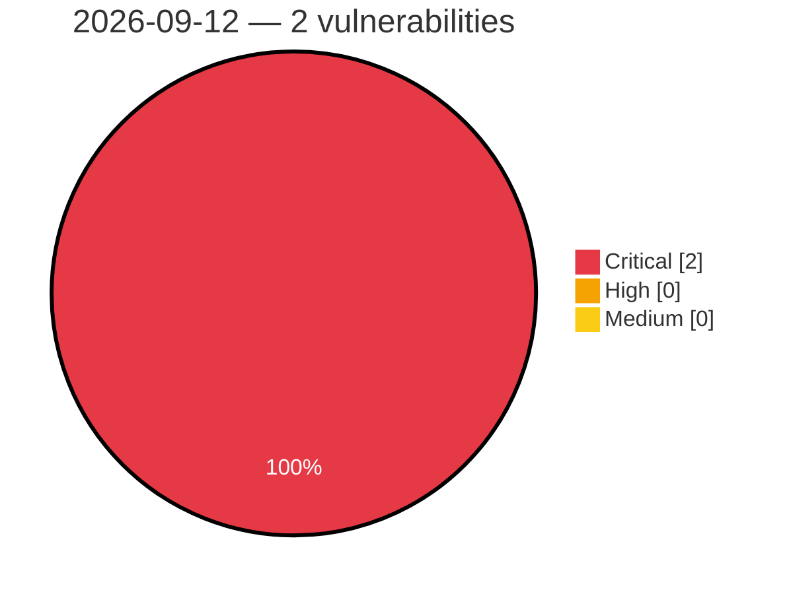

# Critical, High & Medium Severity Vulnerabilities — 2026-09-12

**Source status for this day:**

| Source | Critical | High | Medium | Total |
|--------|---------:|-----:|-------:|------:|
| cvefeed.io (High/Critical) | 2 | 0 | 0 | 2 |

**KEV (actively exploited):** 1  **Watchlist matches:** 2

## Critical (2)

| CVSS | Flags | Source | CVE / Title | Reported |
|------|-------|--------|-------------|----------|
| 10.0 | 🔥 KEV ⭐ | cvefeed.io (High/Critical) | [CVE-2026-85706 - GitLab Community Edition and Enterprise Edition Path Traversal Vulnerability - [Actively Exploited]](https://cvefeed.io/vuln/detail/CVE-2026-85706) | 1 hour, 28 minutes ago |
| 9.9 | ⭐ | cvefeed.io (High/Critical) | [CVE-2026-87719 - Deserialization of Untrusted Data in GitLab](https://cvefeed.io/vuln/detail/CVE-2026-87719) | 1 hour, 28 minutes ago |
