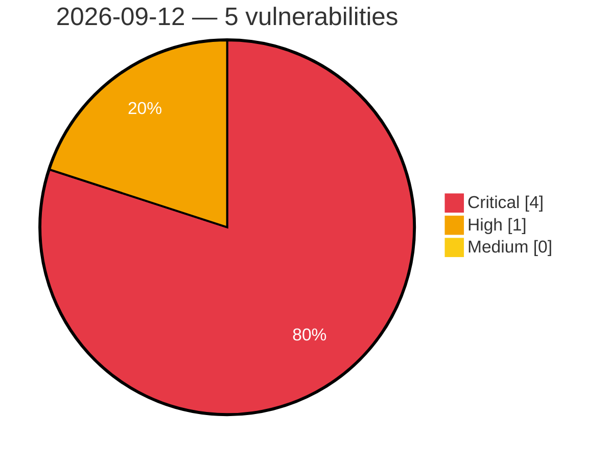

# Critical, High & Medium Severity Vulnerabilities — 2026-09-12

**Source status for this day:**

| Source | Critical | High | Medium | Total |
|--------|---------:|-----:|-------:|------:|
| cvefeed.io (High/Critical) | 4 | 1 | 0 | 5 |

**KEV (actively exploited):** 1  **Watchlist matches:** 5

## Critical (4)

| CVSS | Flags | Source | CVE / Title | Reported |
|------|-------|--------|-------------|----------|
| 10.0 | 🔥 KEV ⭐ | cvefeed.io (High/Critical) | [CVE-2026-85706 - GitLab Community Edition and Enterprise Edition Path Traversal Vulnerability - [Actively Exploited]](https://cvefeed.io/vuln/detail/CVE-2026-85706) | 1 hour, 28 minutes ago |
| 9.9 | ⭐ | cvefeed.io (High/Critical) | [CVE-2026-87719 - Deserialization of Untrusted Data in GitLab](https://cvefeed.io/vuln/detail/CVE-2026-87719) | 1 hour, 28 minutes ago |
| 9.8 | ⭐ | cvefeed.io (High/Critical) | [CVE-2026-78159 - The Events Calendar <= 6.17.3 - Unauthenticated Code Injection to Remote Code Execution via Widget 'classes' Map Callable Invocation](https://cvefeed.io/vuln/detail/CVE-2026-78159) | 2 hours, 27 minutes ago |
| 9.8 | ⭐ | cvefeed.io (High/Critical) | [CVE-2026-78006 - The Events Calendar <= 6.17.4 - Unauthenticated PHP Object Injection to Remote Code Execution](https://cvefeed.io/vuln/detail/CVE-2026-78006) | 2 hours, 27 minutes ago |

## High (1)

| CVSS | Flags | Source | CVE / Title | Reported |
|------|-------|--------|-------------|----------|
| 8.8 | ⭐ | cvefeed.io (High/Critical) | [CVE-2026-78175 - Tutor LMS <= 4.0.7 - Authenticated (Subscriber+) PHP Object Injection to Remote Code Execution](https://cvefeed.io/vuln/detail/CVE-2026-78175) | 2 hours, 27 minutes ago |
