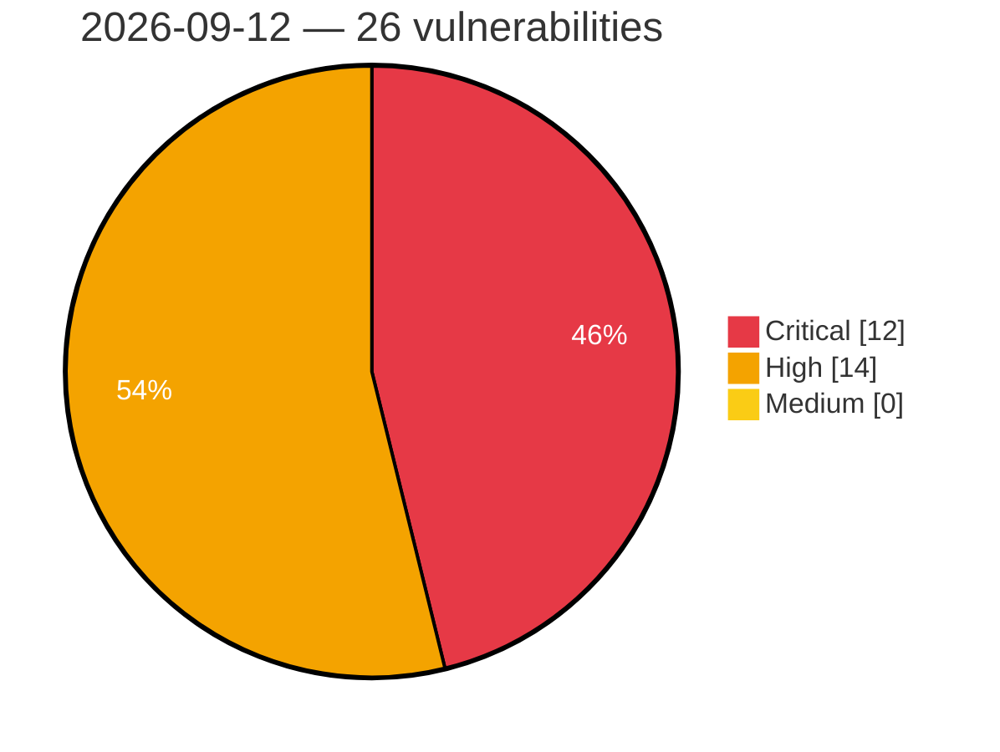

# Critical, High & Medium Severity Vulnerabilities — 2026-09-12

**Source status for this day:**

| Source | Critical | High | Medium | Total |
|--------|---------:|-----:|-------:|------:|
| cvefeed.io (High/Critical) | 12 | 14 | 0 | 26 |

**KEV (actively exploited):** 1  **Watchlist matches:** 20

## Critical (12)

| CVSS | Flags | Source | CVE / Title | Reported |
|------|-------|--------|-------------|----------|
| 10.0 | 🔥 KEV ⭐ | cvefeed.io (High/Critical) | [CVE-2026-85706 - GitLab Community Edition and Enterprise Edition Path Traversal Vulnerability - [Actively Exploited]](https://cvefeed.io/vuln/detail/CVE-2026-85706) | 1 hour, 28 minutes ago |
| 9.9 | ⭐ | cvefeed.io (High/Critical) | [CVE-2026-87719 - Deserialization of Untrusted Data in GitLab](https://cvefeed.io/vuln/detail/CVE-2026-87719) | 1 hour, 28 minutes ago |
| 9.9 | — | cvefeed.io (High/Critical) | [CVE-2026-82845 - Masteriyo LMS < 3.4.1 - Subscriber+ PHP Object Injection](https://cvefeed.io/vuln/detail/CVE-2026-82845) | 12 hours, 19 minutes ago |
| 9.8 | ⭐ | cvefeed.io (High/Critical) | [CVE-2026-78159 - The Events Calendar <= 6.17.3 - Unauthenticated Code Injection to Remote Code Execution via Widget 'classes' Map Callable Invocation](https://cvefeed.io/vuln/detail/CVE-2026-78159) | 2 hours, 27 minutes ago |
| 9.8 | ⭐ | cvefeed.io (High/Critical) | [CVE-2026-78006 - The Events Calendar <= 6.17.4 - Unauthenticated PHP Object Injection to Remote Code Execution](https://cvefeed.io/vuln/detail/CVE-2026-78006) | 2 hours, 27 minutes ago |
| 9.8 | — | cvefeed.io (High/Critical) | [CVE-2026-90558 - sngrep through 1.8.4 Stack Buffer Overflow via SIP Headers](https://cvefeed.io/vuln/detail/CVE-2026-90558) | 18 minutes ago |
| 9.8 | ⭐ | cvefeed.io (High/Critical) | [CVE-2026-85681 - WP Component <= 2.2.4 - Unauthenticated Privilege Escalation via Arbitrary Blog Option Update](https://cvefeed.io/vuln/detail/CVE-2026-85681) | 12 hours, 19 minutes ago |
| 9.8 | ⭐ | cvefeed.io (High/Critical) | [CVE-2026-84171 - WP Images Upload on Piclect <= 1.0 - Unauthenticated Arbitrary File Upload](https://cvefeed.io/vuln/detail/CVE-2026-84171) | 12 hours, 19 minutes ago |
| 9.8 | ⭐ | cvefeed.io (High/Critical) | [CVE-2026-81402 - DS Ad Rotator <= 0.8 - Unauthenticated Arbitrary File Upload](https://cvefeed.io/vuln/detail/CVE-2026-81402) | 12 hours, 19 minutes ago |
| 9.8 | ⭐ | cvefeed.io (High/Critical) | [CVE-2026-75800 - Frontegg SAML SSO <= 1.0.1 - Unauthenticated Account Takeover via Unverified SAMLResponse](https://cvefeed.io/vuln/detail/CVE-2026-75800) | 12 hours, 19 minutes ago |
| 9.6 | ⭐ | cvefeed.io (High/Critical) | [CVE-2026-77006 - WebTotem Backups <= 1.0.1 - Subscriber+ Arbitrary File Deletion via Path Traversal](https://cvefeed.io/vuln/detail/CVE-2026-77006) | 12 hours, 19 minutes ago |
| 9.6 | ⭐ | cvefeed.io (High/Critical) | [CVE-2026-77005 - Code Monkeys Proposals <= 1.0.1 - Subscriber+ Arbitrary File Deletion via Path Traversal](https://cvefeed.io/vuln/detail/CVE-2026-77005) | 12 hours, 19 minutes ago |

## High (14)

| CVSS | Flags | Source | CVE / Title | Reported |
|------|-------|--------|-------------|----------|
| 8.8 | ⭐ | cvefeed.io (High/Critical) | [CVE-2026-78175 - Tutor LMS <= 4.0.7 - Authenticated (Subscriber+) PHP Object Injection to Remote Code Execution](https://cvefeed.io/vuln/detail/CVE-2026-78175) | 2 hours, 27 minutes ago |
| 8.8 | — | cvefeed.io (High/Critical) | [CVE-2026-90537 - WWBN AVideo Scheduler sendEmail Missing Authorization via Token](https://cvefeed.io/vuln/detail/CVE-2026-90537) | 37 minutes ago |
| 8.8 | ⭐ | cvefeed.io (High/Critical) | [CVE-2026-15451 - MemberPress Corporate Accounts <= 1.5.39 - Authenticated (Subscriber+) Privilege Escalation via Mass Assignment in Sub-Account Creation](https://cvefeed.io/vuln/detail/CVE-2026-15451) | 1 hour, 36 minutes ago |
| 8.8 | — | cvefeed.io (High/Critical) | [CVE-2026-90560 - zstd-jni 1.2.0 through 1.5.7-13 Out-of-Bounds Read via ZstdDictDecompress](https://cvefeed.io/vuln/detail/CVE-2026-90560) | 18 minutes ago |
| 8.8 | ⭐ | cvefeed.io (High/Critical) | [CVE-2026-87759 - Add User Autocomplete < 1.2 - Subscriber+ Privilege Escalation](https://cvefeed.io/vuln/detail/CVE-2026-87759) | 12 hours, 19 minutes ago |
| 8.8 | ⭐ | cvefeed.io (High/Critical) | [CVE-2026-81742 - BE REST Endpoints <= 1.0.0 - Unauthenticated Stored XSS and Widget Manipulation](https://cvefeed.io/vuln/detail/CVE-2026-81742) | 12 hours, 19 minutes ago |
| 8.7 | — | cvefeed.io (High/Critical) | [CVE-2026-90559 - snappy-java through 1.1.10.8 Out-of-Bounds Write via uncompress](https://cvefeed.io/vuln/detail/CVE-2026-90559) | 18 minutes ago |
| 8.6 | ⭐ | cvefeed.io (High/Critical) | [CVE-2026-84047 - Album Cover Finder <= 0.7.0 - Unauthenticated SQLi via and_action](https://cvefeed.io/vuln/detail/CVE-2026-84047) | 12 hours, 19 minutes ago |
| 8.6 | ⭐ | cvefeed.io (High/Critical) | [CVE-2026-80494 - Yogeta WP Cloud <= 1.0 - Unauthenticated Arbitrary File Download](https://cvefeed.io/vuln/detail/CVE-2026-80494) | 12 hours, 19 minutes ago |
| 8.6 | ⭐ | cvefeed.io (High/Critical) | [CVE-2026-80491 - SAMO Forms <= 1.0.0 - Unauthenticated SQLi](https://cvefeed.io/vuln/detail/CVE-2026-80491) | 12 hours, 19 minutes ago |
| 8.5 | ⭐ | cvefeed.io (High/Critical) | [CVE-2026-90553 - vLLM before 0.28.0 Remote Code Execution via LlavaOnevision2 processor](https://cvefeed.io/vuln/detail/CVE-2026-90553) | 36 minutes ago |
| 8.5 | — | cvefeed.io (High/Critical) | [CVE-2026-90556 - Freeciv before 3.2.6 Heap Buffer Overflow via worklist_load](https://cvefeed.io/vuln/detail/CVE-2026-90556) | 18 minutes ago |
| 8.1 | ⭐ | cvefeed.io (High/Critical) | [CVE-2026-84099 - IDB Ecommerce (wpStoreCart 5) <= 5.0.7 - Unauthenticated PHP Object Injection via bundled wpsc-membership-pro paypal.php](https://cvefeed.io/vuln/detail/CVE-2026-84099) | 12 hours, 19 minutes ago |
| 8.0 | ⭐ | cvefeed.io (High/Critical) | [CVE-2026-87888 - YayPricing < 3.5.7 - Subscriber+ Stored XSS via save_page_data REST Route](https://cvefeed.io/vuln/detail/CVE-2026-87888) | 12 hours, 18 minutes ago |
