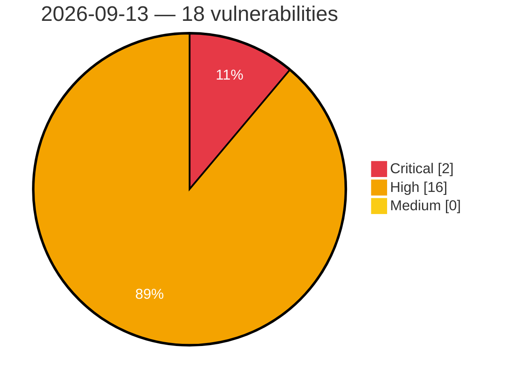

# Critical, High & Medium Severity Vulnerabilities — 2026-09-13

**Source status for this day:**

| Source | Critical | High | Medium | Total |
|--------|---------:|-----:|-------:|------:|
| cvefeed.io (High/Critical) | 2 | 16 | 0 | 18 |

**KEV (actively exploited):** 0  **Watchlist matches:** 10

## Critical (2)

| CVSS | Flags | Source | CVE / Title | Reported |
|------|-------|--------|-------------|----------|
| 9.3 | ⭐ | cvefeed.io (High/Critical) | [CVE-2026-90561 - Strapi 4.x through 4.26.2 and 5.x before 5.48.1 Stored XSS via WYSIWYG](https://cvefeed.io/vuln/detail/CVE-2026-90561) | 3 hours, 31 minutes ago |
| 9.2 | ⭐ | cvefeed.io (High/Critical) | [CVE-2026-90562 - LangBot before 4.10.11 Authentication Bypass via Weak Recovery Key](https://cvefeed.io/vuln/detail/CVE-2026-90562) | 3 hours, 31 minutes ago |

## High (16)

| CVSS | Flags | Source | CVE / Title | Reported |
|------|-------|--------|-------------|----------|
| 8.8 | ⭐ | cvefeed.io (High/Critical) | [CVE-2026-90493 - Tonec Internet Download Manager Kernel Driver idmwfp.sys access control](https://cvefeed.io/vuln/detail/CVE-2026-90493) | 1 hour, 15 minutes ago |
| 8.8 | ⭐ | cvefeed.io (High/Critical) | [CVE-2026-90777 - ESPnet before 202609 Remote Code Execution via Unsafe Deserialization](https://cvefeed.io/vuln/detail/CVE-2026-90777) | 2 hours, 30 minutes ago |
| 8.8 | ⭐ | cvefeed.io (High/Critical) | [CVE-2026-90770 - Spug through 3.4.0 Remote Code Execution via ping_check](https://cvefeed.io/vuln/detail/CVE-2026-90770) | 3 hours, 31 minutes ago |
| 8.7 | — | cvefeed.io (High/Critical) | [CVE-2026-90668 - UnrealIRCd HTTP Header Denial of Service](https://cvefeed.io/vuln/detail/CVE-2026-90668) | 2 hours, 14 minutes ago |
| 8.7 | — | cvefeed.io (High/Critical) | [CVE-2026-90780 - SIPp through 3.7.7 Buffer Overflow via Oversized SIP Header Content](https://cvefeed.io/vuln/detail/CVE-2026-90780) | 2 hours, 30 minutes ago |
| 8.7 | — | cvefeed.io (High/Critical) | [CVE-2026-90779 - SIPp through 3.7.7 Stack Buffer Overflow via createAuthHeader Algorithm Parameter](https://cvefeed.io/vuln/detail/CVE-2026-90779) | 2 hours, 30 minutes ago |
| 8.7 | — | cvefeed.io (High/Critical) | [CVE-2026-90778 - SIPp through 3.7.7 Buffer Overflow via SIP To Header Tag](https://cvefeed.io/vuln/detail/CVE-2026-90778) | 2 hours, 30 minutes ago |
| 8.7 | — | cvefeed.io (High/Critical) | [CVE-2026-90776 - Nodemailer 9.1.0 through 10.0.4 Denial of Service via Quadratic Address Parsing](https://cvefeed.io/vuln/detail/CVE-2026-90776) | 2 hours, 30 minutes ago |
| 8.7 | ⭐ | cvefeed.io (High/Critical) | [CVE-2026-90774 - rustypaste before 0.18.1 Path Traversal via filename header](https://cvefeed.io/vuln/detail/CVE-2026-90774) | 3 hours, 31 minutes ago |
| 8.6 | ⭐ | cvefeed.io (High/Critical) | [CVE-2026-90768 - CAPEv2 through commit 471ee4b REST API Task Endpoints Missing Ownership Check](https://cvefeed.io/vuln/detail/CVE-2026-90768) | 3 hours, 31 minutes ago |
| 8.5 | — | cvefeed.io (High/Critical) | [CVE-2026-90783 - MKVToolNix through 101.0 Heap Buffer Overflow via avilib ODML Superindex Integer Wraparound](https://cvefeed.io/vuln/detail/CVE-2026-90783) | 1 hour, 31 minutes ago |
| 8.3 | ⭐ | cvefeed.io (High/Critical) | [CVE-2026-90772 - Amundsen Frontend through 4.3.0 Stored XSS via Description](https://cvefeed.io/vuln/detail/CVE-2026-90772) | 3 hours, 31 minutes ago |
| 8.3 | ⭐ | cvefeed.io (High/Critical) | [CVE-2026-90769 - Open Notebook before 1.11.0 Server-Side Request Forgery via link-source](https://cvefeed.io/vuln/detail/CVE-2026-90769) | 3 hours, 31 minutes ago |
| 8.3 | — | cvefeed.io (High/Critical) | [CVE-2026-90510 - dromara orion-visor HostKeyServiceImpl.java HostKeyServiceImpl.encryptKey hard-coded key](https://cvefeed.io/vuln/detail/CVE-2026-90510) | 3 hours, 31 minutes ago |
| 8.1 | ⭐ | cvefeed.io (High/Critical) | [CVE-2026-90651 - Socket Firewall TLS Certificate Verification Bypass](https://cvefeed.io/vuln/detail/CVE-2026-90651) | 26 minutes ago |
| 8.1 | — | cvefeed.io (High/Critical) | [CVE-2026-37008 - CrewAI Sandbox Bypass via Python Runtime Manipulation](https://cvefeed.io/vuln/detail/CVE-2026-37008) | 20 hours, 54 minutes ago |
