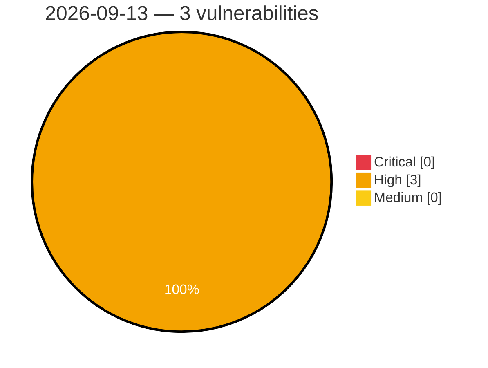

# Critical, High & Medium Severity Vulnerabilities — 2026-09-13

**Source status for this day:**

| Source | Critical | High | Medium | Total |
|--------|---------:|-----:|-------:|------:|
| cvefeed.io (High/Critical) | 0 | 3 | 0 | 3 |

**KEV (actively exploited):** 0  **Watchlist matches:** 2

## High (3)

| CVSS | Flags | Source | CVE / Title | Reported |
|------|-------|--------|-------------|----------|
| 8.8 | ⭐ | cvefeed.io (High/Critical) | [CVE-2026-90493 - Tonec Internet Download Manager Kernel Driver idmwfp.sys access control](https://cvefeed.io/vuln/detail/CVE-2026-90493) | 1 hour, 15 minutes ago |
| 8.7 | — | cvefeed.io (High/Critical) | [CVE-2026-90668 - UnrealIRCd HTTP Header Denial of Service](https://cvefeed.io/vuln/detail/CVE-2026-90668) | 2 hours, 14 minutes ago |
| 8.1 | ⭐ | cvefeed.io (High/Critical) | [CVE-2026-90651 - Socket Firewall TLS Certificate Verification Bypass](https://cvefeed.io/vuln/detail/CVE-2026-90651) | 26 minutes ago |
