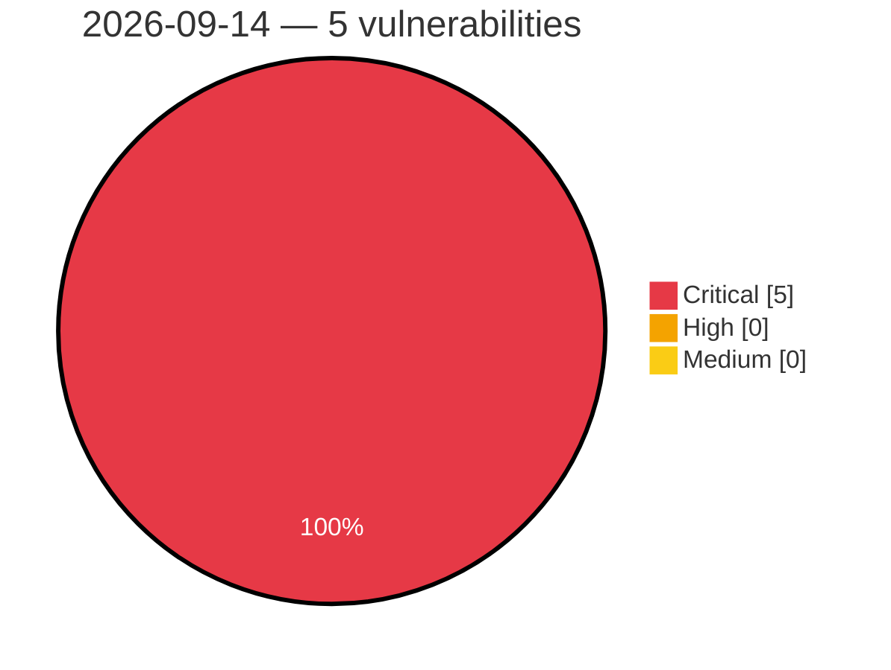

# Critical, High & Medium Severity Vulnerabilities — 2026-09-14

**Source status for this day:**

| Source | Critical | High | Medium | Total |
|--------|---------:|-----:|-------:|------:|
| cvefeed.io (High/Critical) | 5 | 0 | 0 | 5 |

**KEV (actively exploited):** 0  **Watchlist matches:** 0

## Critical (5)

| CVSS | Flags | Source | CVE / Title | Reported |
|------|-------|--------|-------------|----------|
| 9.9 | — | cvefeed.io (High/Critical) | [CVE-2026-90680 - D-Link DIR-823G HNAP1 SetStaticRouteSettings strcpy stack-based overflow](https://cvefeed.io/vuln/detail/CVE-2026-90680) | 58 minutes ago |
| 9.9 | — | cvefeed.io (High/Critical) | [CVE-2026-90608 - Totolink A3002MU boa formPortFw buffer overflow](https://cvefeed.io/vuln/detail/CVE-2026-90608) | 3 hours, 58 minutes ago |
| 9.9 | — | cvefeed.io (High/Critical) | [CVE-2026-90607 - Totolink A3002MU boa formNewSchedule buffer overflow](https://cvefeed.io/vuln/detail/CVE-2026-90607) | 3 hours, 58 minutes ago |
| 9.9 | — | cvefeed.io (High/Critical) | [CVE-2026-90606 - Totolink A3002MU boa formIpv6Setup buffer overflow](https://cvefeed.io/vuln/detail/CVE-2026-90606) | 4 hours, 58 minutes ago |
| 9.9 | — | cvefeed.io (High/Critical) | [CVE-2026-90605 - Totolink A3002MU boa formFilter buffer overflow](https://cvefeed.io/vuln/detail/CVE-2026-90605) | 4 hours, 58 minutes ago |
