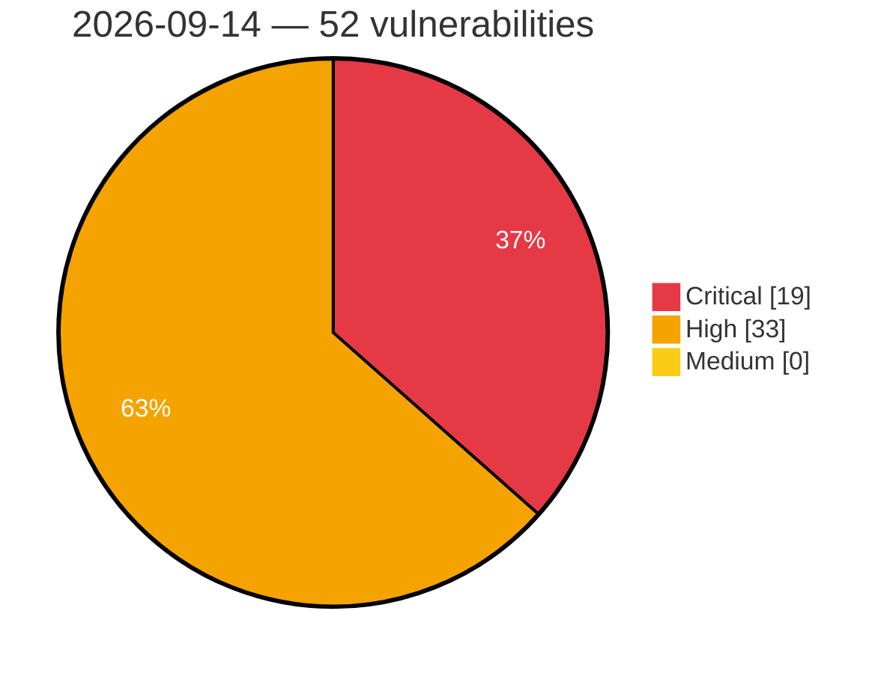

# Critical, High & Medium Severity Vulnerabilities — 2026-09-14

**Source status for this day:**

| Source | Critical | High | Medium | Total |
|--------|---------:|-----:|-------:|------:|
| cvefeed.io (High/Critical) | 19 | 33 | 0 | 52 |

**KEV (actively exploited):** 0  **Watchlist matches:** 32

## Critical (19)

| CVSS | Flags | Source | CVE / Title | Reported |
|------|-------|--------|-------------|----------|
| 10.0 | ⭐ | cvefeed.io (High/Critical) | [CVE-2026-82434 - Apache Storm Nimbus, Apache Storm Client: Disclosure of the Topology ZooKeeper Credential to Read-Only Users and to Logs](https://cvefeed.io/vuln/detail/CVE-2026-82434) | 44 minutes ago |
| 9.9 | — | cvefeed.io (High/Critical) | [CVE-2026-90680 - D-Link DIR-823G HNAP1 SetStaticRouteSettings strcpy stack-based overflow](https://cvefeed.io/vuln/detail/CVE-2026-90680) | 58 minutes ago |
| 9.9 | — | cvefeed.io (High/Critical) | [CVE-2026-90608 - Totolink A3002MU boa formPortFw buffer overflow](https://cvefeed.io/vuln/detail/CVE-2026-90608) | 3 hours, 58 minutes ago |
| 9.9 | — | cvefeed.io (High/Critical) | [CVE-2026-90607 - Totolink A3002MU boa formNewSchedule buffer overflow](https://cvefeed.io/vuln/detail/CVE-2026-90607) | 3 hours, 58 minutes ago |
| 9.9 | — | cvefeed.io (High/Critical) | [CVE-2026-90606 - Totolink A3002MU boa formIpv6Setup buffer overflow](https://cvefeed.io/vuln/detail/CVE-2026-90606) | 4 hours, 58 minutes ago |
| 9.9 | — | cvefeed.io (High/Critical) | [CVE-2026-90605 - Totolink A3002MU boa formFilter buffer overflow](https://cvefeed.io/vuln/detail/CVE-2026-90605) | 4 hours, 58 minutes ago |
| 9.9 | — | cvefeed.io (High/Critical) | [CVE-2026-90693 - D-Link DIR-878 WAN Settings SetWan3Settings stack-based overflow](https://cvefeed.io/vuln/detail/CVE-2026-90693) | 38 minutes ago |
| 9.9 | — | cvefeed.io (High/Critical) | [CVE-2026-90692 - D-Link DIR-878 Dynamic DNS IPv6 Settings SetDynamicDNSIPv6Settings stack-based overflow](https://cvefeed.io/vuln/detail/CVE-2026-90692) | 1 hour, 37 minutes ago |
| 9.9 | — | cvefeed.io (High/Critical) | [CVE-2026-90937 - froxlor before 2.2.5 nginx/Apache Configuration Injection via subdomain redirect URL](https://cvefeed.io/vuln/detail/CVE-2026-90937) | 1 hour, 35 minutes ago |
| 9.9 | ⭐ | cvefeed.io (High/Critical) | [CVE-2026-90699 - D-Link DWR-M920 formPinManageSetup sub_41E60C os command injection](https://cvefeed.io/vuln/detail/CVE-2026-90699) | 5 hours, 37 minutes ago |
| 9.8 | — | cvefeed.io (High/Critical) | [CVE-2026-82787 - CPSL-08P1EN Missing Authentication for Critical Function](https://cvefeed.io/vuln/detail/CVE-2026-82787) | 1 hour, 37 minutes ago |
| 9.8 | ⭐ | cvefeed.io (High/Critical) | [CVE-2026-90919 - LightLLM through 1.2.0 Unauthenticated Remote Code Execution via Config Server Pickle Deserialization](https://cvefeed.io/vuln/detail/CVE-2026-90919) | 2 hours, 36 minutes ago |
| 9.8 | ⭐ | cvefeed.io (High/Critical) | [CVE-2026-90898 - Bifrost unauthenticated remote code execution via MCP stdio client registration](https://cvefeed.io/vuln/detail/CVE-2026-90898) | 3 hours, 37 minutes ago |
| 9.5 | ⭐ | cvefeed.io (High/Critical) | [CVE-2026-21391 - Improper Claim Validation in PingAM OIDC Provider](https://cvefeed.io/vuln/detail/CVE-2026-21391) | 2 hours, 37 minutes ago |
| 9.4 | ⭐ | cvefeed.io (High/Critical) | [CVE-2026-85192 - Joomla Extension - regularlabs.com - Authenticated, privileged remote code execution in Conditional Content extension for Joomla < 8.0.0](https://cvefeed.io/vuln/detail/CVE-2026-85192) | 1 hour, 37 minutes ago |
| 9.3 | ⭐ | cvefeed.io (High/Critical) | [CVE-2026-90961 - MISP LdapAuth and LinOTPAuth Authentication Bypass via Empty or Non-String Credentials](https://cvefeed.io/vuln/detail/CVE-2026-90961) | 37 minutes ago |
| 9.2 | ⭐ | cvefeed.io (High/Critical) | [CVE-2026-12258 - Inadequate access control in the Hiperdino REST API](https://cvefeed.io/vuln/detail/CVE-2026-12258) | 1 hour, 37 minutes ago |
| 9.1 | ⭐ | cvefeed.io (High/Critical) | [CVE-2026-90703 - D-Link DWR-M921 formDiskCreateShare system os command injection](https://cvefeed.io/vuln/detail/CVE-2026-90703) | 4 hours, 37 minutes ago |
| 9.1 | ⭐ | cvefeed.io (High/Critical) | [CVE-2026-90702 - D-Link DWR-M921 formDiskFormat system os command injection](https://cvefeed.io/vuln/detail/CVE-2026-90702) | 4 hours, 37 minutes ago |

## High (33)

| CVSS | Flags | Source | CVE / Title | Reported |
|------|-------|--------|-------------|----------|
| 9.0 | — | cvefeed.io (High/Critical) | [CVE-2026-90689 - Tenda W20E formDelWebAuthWhiteUser stack-based overflow](https://cvefeed.io/vuln/detail/CVE-2026-90689) | 1 hour, 37 minutes ago |
| 8.8 | ⭐ | cvefeed.io (High/Critical) | [CVE-2026-82794 - SolarView Compact OS Command Injection Vulnerability](https://cvefeed.io/vuln/detail/CVE-2026-82794) | 1 hour, 37 minutes ago |
| 8.8 | ⭐ | cvefeed.io (High/Critical) | [CVE-2026-82791 - Contec CAN 2.0B Communication Wireless LAN / USB Converter Unit OS Command Injection](https://cvefeed.io/vuln/detail/CVE-2026-82791) | 1 hour, 37 minutes ago |
| 8.8 | — | cvefeed.io (High/Critical) | [CVE-2026-82789 - CONPROSYS HMI System Eval Injection Vulnerability](https://cvefeed.io/vuln/detail/CVE-2026-82789) | 1 hour, 37 minutes ago |
| 8.8 | ⭐ | cvefeed.io (High/Critical) | [CVE-2026-82780 - CONPROSYS TM Series Unrestricted File Upload Arbitrary Command Execution](https://cvefeed.io/vuln/detail/CVE-2026-82780) | 1 hour, 37 minutes ago |
| 8.8 | ⭐ | cvefeed.io (High/Critical) | [CVE-2026-82779 - CONPROSYS TM Series OS Command Injection Vulnerability](https://cvefeed.io/vuln/detail/CVE-2026-82779) | 1 hour, 37 minutes ago |
| 8.8 | ⭐ | cvefeed.io (High/Critical) | [CVE-2026-82777 - CONPROSYS PAC Series OS Command Injection Vulnerability](https://cvefeed.io/vuln/detail/CVE-2026-82777) | 1 hour, 37 minutes ago |
| 8.8 | ⭐ | cvefeed.io (High/Critical) | [CVE-2026-82774 - CONPROSYS M2M Series OS Command Injection](https://cvefeed.io/vuln/detail/CVE-2026-82774) | 1 hour, 37 minutes ago |
| 8.8 | — | cvefeed.io (High/Critical) | [CVE-2026-82772 - Contec EC1000 Buffer Overflow Vulnerability](https://cvefeed.io/vuln/detail/CVE-2026-82772) | 1 hour, 37 minutes ago |
| 8.8 | — | cvefeed.io (High/Critical) | [CVE-2026-82770 - Contec RP-WAH-SR Series Buffer Overflow Vulnerability](https://cvefeed.io/vuln/detail/CVE-2026-82770) | 1 hour, 37 minutes ago |
| 8.8 | ⭐ | cvefeed.io (High/Critical) | [CVE-2026-82766 - SGA1000 OS Command Injection](https://cvefeed.io/vuln/detail/CVE-2026-82766) | 1 hour, 37 minutes ago |
| 8.8 | ⭐ | cvefeed.io (High/Critical) | [CVE-2026-82762 - Contec FX Series OS Command Injection](https://cvefeed.io/vuln/detail/CVE-2026-82762) | 1 hour, 37 minutes ago |
| 8.8 | — | cvefeed.io (High/Critical) | [CVE-2023-50461 - TYPO3 Direct Mail Configuration Injection and Arbitrary Code Execution](https://cvefeed.io/vuln/detail/CVE-2023-50461) | 1 hour, 37 minutes ago |
| 8.8 | — | cvefeed.io (High/Critical) | [CVE-2023-46273 - Extreme Networks IQ Engine Bonjour Gateway Buffer Overflow](https://cvefeed.io/vuln/detail/CVE-2023-46273) | 2 hours, 37 minutes ago |
| 8.8 | ⭐ | cvefeed.io (High/Critical) | [CVE-2026-90938 - LangBot through 0.4.17 Unauthenticated Plugin Registration via WebSocket](https://cvefeed.io/vuln/detail/CVE-2026-90938) | 1 hour, 35 minutes ago |
| 8.7 | — | cvefeed.io (High/Critical) | [CVE-2026-90934 - EspoCRM before 10.0.4 Field-level Security Bypass via Attendees](https://cvefeed.io/vuln/detail/CVE-2026-90934) | 1 hour, 35 minutes ago |
| 8.7 | ⭐ | cvefeed.io (High/Critical) | [CVE-2026-89180 - Thinking Software Technology｜EFence - SQL Injection](https://cvefeed.io/vuln/detail/CVE-2026-89180) | 3 hours, 37 minutes ago |
| 8.6 | ⭐ | cvefeed.io (High/Critical) | [CVE-2026-82793 - Contec CAN 2.0B Converter Unit Unrestricted File Upload Vulnerability](https://cvefeed.io/vuln/detail/CVE-2026-82793) | 1 hour, 37 minutes ago |
| 8.6 | ⭐ | cvefeed.io (High/Critical) | [CVE-2026-82768 - SGA1000 Path Traversal Vulnerability](https://cvefeed.io/vuln/detail/CVE-2026-82768) | 1 hour, 37 minutes ago |
| 8.6 | ⭐ | cvefeed.io (High/Critical) | [CVE-2026-82765 - Contec Series Path Traversal Vulnerability](https://cvefeed.io/vuln/detail/CVE-2026-82765) | 1 hour, 37 minutes ago |
| 8.6 | ⭐ | cvefeed.io (High/Critical) | [CVE-2026-15600 - SQL Injection in Alior Bank raty PrestaShop module](https://cvefeed.io/vuln/detail/CVE-2026-15600) | 45 minutes ago |
| 8.6 | ⭐ | cvefeed.io (High/Critical) | [CVE-2026-7848 - SQL Injection in Alior Bank raty PrestaShop module](https://cvefeed.io/vuln/detail/CVE-2026-7848) | 45 minutes ago |
| 8.6 | ⭐ | cvefeed.io (High/Critical) | [CVE-2026-90932 - LaraDashboard 0.9.2 through 1.2.2 Path Traversal RCE](https://cvefeed.io/vuln/detail/CVE-2026-90932) | 1 hour, 35 minutes ago |
| 8.6 | ⭐ | cvefeed.io (High/Critical) | [CVE-2026-78375 - Joomla Extension - joomshaper.com - Authenticated Privileged SQL Injection in the Content Plugin of SP Page Builder (Free and Pro) 5.2.1 - 6.9.0](https://cvefeed.io/vuln/detail/CVE-2026-78375) | 3 hours, 37 minutes ago |
| 8.5 | ⭐ | cvefeed.io (High/Critical) | [CVE-2026-12518 - Local privilege escalation in the Logi Options+ updater service on Windows](https://cvefeed.io/vuln/detail/CVE-2026-12518) | 38 minutes ago |
| 8.5 | ⭐ | cvefeed.io (High/Critical) | [CVE-2026-20773 - Improper Authorization in PingFederate Administrative Expression Evaluation Endpoint](https://cvefeed.io/vuln/detail/CVE-2026-20773) | 3 hours, 37 minutes ago |
| 8.4 | — | cvefeed.io (High/Critical) | [CVE-2026-68955 - Rakuten Kobo Desktop Application DLL Hijacking Vulnerability](https://cvefeed.io/vuln/detail/CVE-2026-68955) | 1 hour, 37 minutes ago |
| 8.4 | — | cvefeed.io (High/Critical) | [CVE-2024-58383 - Froxlor before 2.2.0 Insecure File Permissions mysql.conf](https://cvefeed.io/vuln/detail/CVE-2024-58383) | 1 hour, 37 minutes ago |
| 8.4 | ⭐ | cvefeed.io (High/Critical) | [CVE-2026-90895 - MISP Interactive CLI Shell: Authorization Bypass, Credential Exposure, and Terminal Injection](https://cvefeed.io/vuln/detail/CVE-2026-90895) | 4 hours, 37 minutes ago |
| 8.3 | ⭐ | cvefeed.io (High/Critical) | [CVE-2026-90691 - 0x4m4 HexStrike AI API Files Endpoint hexstrike_server.py FileOperationsManager path traversal](https://cvefeed.io/vuln/detail/CVE-2026-90691) | 1 hour, 37 minutes ago |
| 8.3 | — | cvefeed.io (High/Critical) | [CVE-2026-90707 - Open5GS Old AMF Discovery Fallback nnrf-handler.c amf_nnrf_try_old_amf_discovery_fallback use after free](https://cvefeed.io/vuln/detail/CVE-2026-90707) | 3 hours, 37 minutes ago |
| 8.2 | — | cvefeed.io (High/Critical) | [CVE-2026-82786 - Remote I/O Coupler Unit Insufficiently Protected Credentials Vulnerability](https://cvefeed.io/vuln/detail/CVE-2026-82786) | 1 hour, 37 minutes ago |
| 8.1 | ⭐ | cvefeed.io (High/Critical) | [CVE-2026-90929 - File Browser 2.5.0 Directory Deletion via Upload Failure Cleanup](https://cvefeed.io/vuln/detail/CVE-2026-90929) | 1 hour, 35 minutes ago |
