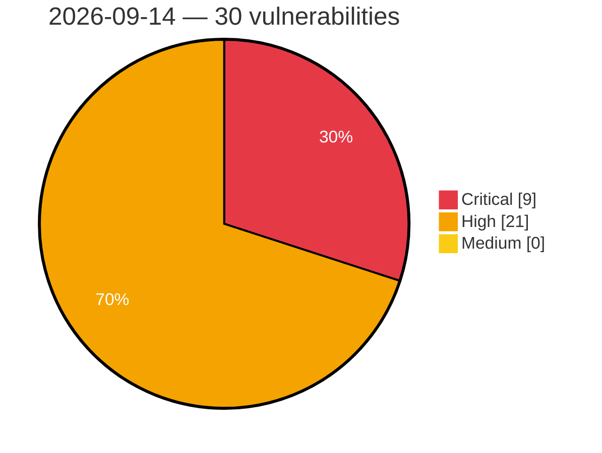

# Critical, High & Medium Severity Vulnerabilities — 2026-09-14

**Source status for this day:**

| Source | Critical | High | Medium | Total |
|--------|---------:|-----:|-------:|------:|
| cvefeed.io (High/Critical) | 9 | 21 | 0 | 30 |

**KEV (actively exploited):** 0  **Watchlist matches:** 14

## Critical (9)

| CVSS | Flags | Source | CVE / Title | Reported |
|------|-------|--------|-------------|----------|
| 9.9 | — | cvefeed.io (High/Critical) | [CVE-2026-90680 - D-Link DIR-823G HNAP1 SetStaticRouteSettings strcpy stack-based overflow](https://cvefeed.io/vuln/detail/CVE-2026-90680) | 58 minutes ago |
| 9.9 | — | cvefeed.io (High/Critical) | [CVE-2026-90608 - Totolink A3002MU boa formPortFw buffer overflow](https://cvefeed.io/vuln/detail/CVE-2026-90608) | 3 hours, 58 minutes ago |
| 9.9 | — | cvefeed.io (High/Critical) | [CVE-2026-90607 - Totolink A3002MU boa formNewSchedule buffer overflow](https://cvefeed.io/vuln/detail/CVE-2026-90607) | 3 hours, 58 minutes ago |
| 9.9 | — | cvefeed.io (High/Critical) | [CVE-2026-90606 - Totolink A3002MU boa formIpv6Setup buffer overflow](https://cvefeed.io/vuln/detail/CVE-2026-90606) | 4 hours, 58 minutes ago |
| 9.9 | — | cvefeed.io (High/Critical) | [CVE-2026-90605 - Totolink A3002MU boa formFilter buffer overflow](https://cvefeed.io/vuln/detail/CVE-2026-90605) | 4 hours, 58 minutes ago |
| 9.9 | — | cvefeed.io (High/Critical) | [CVE-2026-90693 - D-Link DIR-878 WAN Settings SetWan3Settings stack-based overflow](https://cvefeed.io/vuln/detail/CVE-2026-90693) | 38 minutes ago |
| 9.9 | — | cvefeed.io (High/Critical) | [CVE-2026-90692 - D-Link DIR-878 Dynamic DNS IPv6 Settings SetDynamicDNSIPv6Settings stack-based overflow](https://cvefeed.io/vuln/detail/CVE-2026-90692) | 1 hour, 37 minutes ago |
| 9.8 | — | cvefeed.io (High/Critical) | [CVE-2026-82787 - CPSL-08P1EN Missing Authentication for Critical Function](https://cvefeed.io/vuln/detail/CVE-2026-82787) | 1 hour, 37 minutes ago |
| 9.4 | ⭐ | cvefeed.io (High/Critical) | [CVE-2026-85192 - Joomla Extension - regularlabs.com - Authenticated, privileged remote code execution in Conditional Content extension for Joomla < 8.0.0](https://cvefeed.io/vuln/detail/CVE-2026-85192) | 1 hour, 37 minutes ago |

## High (21)

| CVSS | Flags | Source | CVE / Title | Reported |
|------|-------|--------|-------------|----------|
| 9.0 | — | cvefeed.io (High/Critical) | [CVE-2026-90689 - Tenda W20E formDelWebAuthWhiteUser stack-based overflow](https://cvefeed.io/vuln/detail/CVE-2026-90689) | 1 hour, 37 minutes ago |
| 8.8 | ⭐ | cvefeed.io (High/Critical) | [CVE-2026-82794 - SolarView Compact OS Command Injection Vulnerability](https://cvefeed.io/vuln/detail/CVE-2026-82794) | 1 hour, 37 minutes ago |
| 8.8 | ⭐ | cvefeed.io (High/Critical) | [CVE-2026-82791 - Contec CAN 2.0B Communication Wireless LAN / USB Converter Unit OS Command Injection](https://cvefeed.io/vuln/detail/CVE-2026-82791) | 1 hour, 37 minutes ago |
| 8.8 | — | cvefeed.io (High/Critical) | [CVE-2026-82789 - CONPROSYS HMI System Eval Injection Vulnerability](https://cvefeed.io/vuln/detail/CVE-2026-82789) | 1 hour, 37 minutes ago |
| 8.8 | ⭐ | cvefeed.io (High/Critical) | [CVE-2026-82780 - CONPROSYS TM Series Unrestricted File Upload Arbitrary Command Execution](https://cvefeed.io/vuln/detail/CVE-2026-82780) | 1 hour, 37 minutes ago |
| 8.8 | ⭐ | cvefeed.io (High/Critical) | [CVE-2026-82779 - CONPROSYS TM Series OS Command Injection Vulnerability](https://cvefeed.io/vuln/detail/CVE-2026-82779) | 1 hour, 37 minutes ago |
| 8.8 | ⭐ | cvefeed.io (High/Critical) | [CVE-2026-82777 - CONPROSYS PAC Series OS Command Injection Vulnerability](https://cvefeed.io/vuln/detail/CVE-2026-82777) | 1 hour, 37 minutes ago |
| 8.8 | ⭐ | cvefeed.io (High/Critical) | [CVE-2026-82774 - CONPROSYS M2M Series OS Command Injection](https://cvefeed.io/vuln/detail/CVE-2026-82774) | 1 hour, 37 minutes ago |
| 8.8 | — | cvefeed.io (High/Critical) | [CVE-2026-82772 - Contec EC1000 Buffer Overflow Vulnerability](https://cvefeed.io/vuln/detail/CVE-2026-82772) | 1 hour, 37 minutes ago |
| 8.8 | — | cvefeed.io (High/Critical) | [CVE-2026-82770 - Contec RP-WAH-SR Series Buffer Overflow Vulnerability](https://cvefeed.io/vuln/detail/CVE-2026-82770) | 1 hour, 37 minutes ago |
| 8.8 | ⭐ | cvefeed.io (High/Critical) | [CVE-2026-82766 - SGA1000 OS Command Injection](https://cvefeed.io/vuln/detail/CVE-2026-82766) | 1 hour, 37 minutes ago |
| 8.8 | ⭐ | cvefeed.io (High/Critical) | [CVE-2026-82762 - Contec FX Series OS Command Injection](https://cvefeed.io/vuln/detail/CVE-2026-82762) | 1 hour, 37 minutes ago |
| 8.8 | — | cvefeed.io (High/Critical) | [CVE-2023-50461 - TYPO3 Direct Mail Configuration Injection and Arbitrary Code Execution](https://cvefeed.io/vuln/detail/CVE-2023-50461) | 1 hour, 37 minutes ago |
| 8.8 | — | cvefeed.io (High/Critical) | [CVE-2023-46273 - Extreme Networks IQ Engine Bonjour Gateway Buffer Overflow](https://cvefeed.io/vuln/detail/CVE-2023-46273) | 2 hours, 37 minutes ago |
| 8.6 | ⭐ | cvefeed.io (High/Critical) | [CVE-2026-82793 - Contec CAN 2.0B Converter Unit Unrestricted File Upload Vulnerability](https://cvefeed.io/vuln/detail/CVE-2026-82793) | 1 hour, 37 minutes ago |
| 8.6 | ⭐ | cvefeed.io (High/Critical) | [CVE-2026-82768 - SGA1000 Path Traversal Vulnerability](https://cvefeed.io/vuln/detail/CVE-2026-82768) | 1 hour, 37 minutes ago |
| 8.6 | ⭐ | cvefeed.io (High/Critical) | [CVE-2026-82765 - Contec Series Path Traversal Vulnerability](https://cvefeed.io/vuln/detail/CVE-2026-82765) | 1 hour, 37 minutes ago |
| 8.5 | ⭐ | cvefeed.io (High/Critical) | [CVE-2026-12518 - Local privilege escalation in the Logi Options+ updater service on Windows](https://cvefeed.io/vuln/detail/CVE-2026-12518) | 38 minutes ago |
| 8.4 | — | cvefeed.io (High/Critical) | [CVE-2026-68955 - Rakuten Kobo Desktop Application DLL Hijacking Vulnerability](https://cvefeed.io/vuln/detail/CVE-2026-68955) | 1 hour, 37 minutes ago |
| 8.3 | ⭐ | cvefeed.io (High/Critical) | [CVE-2026-90691 - 0x4m4 HexStrike AI API Files Endpoint hexstrike_server.py FileOperationsManager path traversal](https://cvefeed.io/vuln/detail/CVE-2026-90691) | 1 hour, 37 minutes ago |
| 8.2 | — | cvefeed.io (High/Critical) | [CVE-2026-82786 - Remote I/O Coupler Unit Insufficiently Protected Credentials Vulnerability](https://cvefeed.io/vuln/detail/CVE-2026-82786) | 1 hour, 37 minutes ago |
