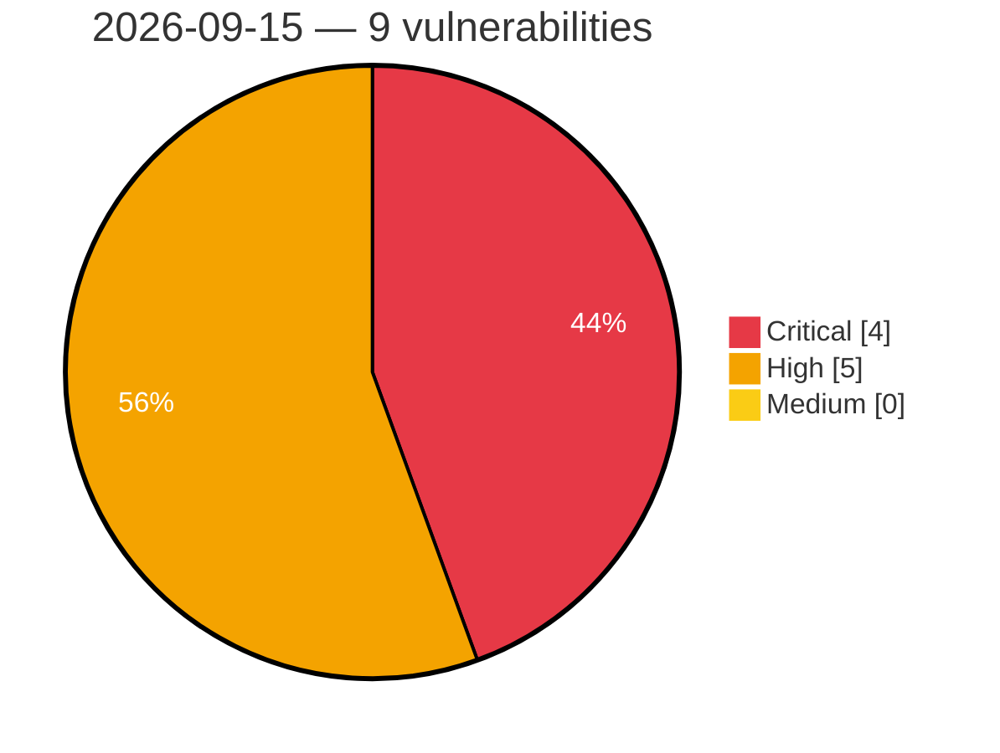

# Critical, High & Medium Severity Vulnerabilities — 2026-09-15

**Source status for this day:**

| Source | Critical | High | Medium | Total |
|--------|---------:|-----:|-------:|------:|
| cvefeed.io (High/Critical) | 4 | 5 | 0 | 9 |

**KEV (actively exploited):** 0  **Watchlist matches:** 6

## Critical (4)

| CVSS | Flags | Source | CVE / Title | Reported |
|------|-------|--------|-------------|----------|
| 9.9 | — | cvefeed.io (High/Critical) | [CVE-2026-91001 - D-Link DI-8400 DDNS Configuration ddns.asp ddns_asp stack-based overflow](https://cvefeed.io/vuln/detail/CVE-2026-91001) | 43 minutes ago |
| 9.1 | ⭐ | cvefeed.io (High/Critical) | [CVE-2026-90711 - proxy-addr vulnerable to IP spoofing via IPv4-mapped IPv6 trust subnet](https://cvefeed.io/vuln/detail/CVE-2026-90711) | 40 minutes ago |
| 9.1 | — | cvefeed.io (High/Critical) | [CVE-2026-91003 - D-Link DI-8300 CGI Service rzgl.asp rzgl_asp stack-based overflow](https://cvefeed.io/vuln/detail/CVE-2026-91003) | 43 minutes ago |
| 9.1 | ⭐ | cvefeed.io (High/Critical) | [CVE-2026-90847 - EFM ipTIME C200E System Setup iux_set.cgi os command injection](https://cvefeed.io/vuln/detail/CVE-2026-90847) | 5 hours, 43 minutes ago |

## High (5)

| CVSS | Flags | Source | CVE / Title | Reported |
|------|-------|--------|-------------|----------|
| 8.8 | ⭐ | cvefeed.io (High/Critical) | [CVE-2026-91771 - Weights & Biases wandb before 0.29.0 Path Traversal via File Download](https://cvefeed.io/vuln/detail/CVE-2026-91771) | 4 hours, 43 minutes ago |
| 8.7 | — | cvefeed.io (High/Critical) | [CVE-2026-91752 - GNU libextractor before 1.15 Stack Overflow via OLE2](https://cvefeed.io/vuln/detail/CVE-2026-91752) | 15 minutes ago |
| 8.7 | ⭐ | cvefeed.io (High/Critical) | [CVE-2026-88262 - bizwell xClick Insufficient Session Expiration Authentication Bypass](https://cvefeed.io/vuln/detail/CVE-2026-88262) | 3 hours, 43 minutes ago |
| 8.3 | ⭐ | cvefeed.io (High/Critical) | [CVE-2026-91751 - Flextype CMS through 1.0.0-alpha.3 Path Traversal via Entries REST API](https://cvefeed.io/vuln/detail/CVE-2026-91751) | 15 minutes ago |
| 8.3 | ⭐ | cvefeed.io (High/Critical) | [CVE-2026-90843 - SabyasachiRana WebMap New Nmap Scan functions_nmap.py nmap_newscan os command injection](https://cvefeed.io/vuln/detail/CVE-2026-90843) | 5 hours, 43 minutes ago |
