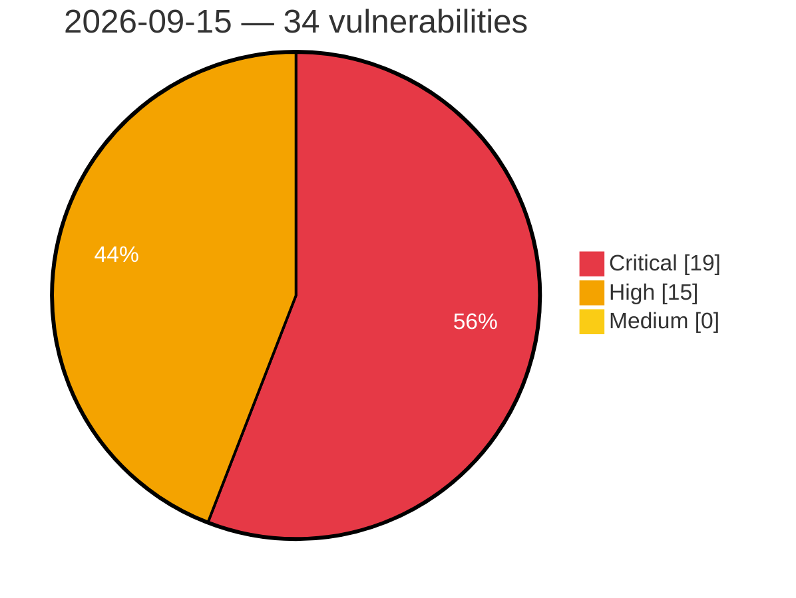

# Critical, High & Medium Severity Vulnerabilities — 2026-09-15

**Source status for this day:**

| Source | Critical | High | Medium | Total |
|--------|---------:|-----:|-------:|------:|
| cvefeed.io (High/Critical) | 19 | 15 | 0 | 34 |

**KEV (actively exploited):** 0  **Watchlist matches:** 26

## Critical (19)

| CVSS | Flags | Source | CVE / Title | Reported |
|------|-------|--------|-------------|----------|
| 9.9 | — | cvefeed.io (High/Critical) | [CVE-2026-91001 - D-Link DI-8400 DDNS Configuration ddns.asp ddns_asp stack-based overflow](https://cvefeed.io/vuln/detail/CVE-2026-91001) | 43 minutes ago |
| 9.9 | ⭐ | cvefeed.io (High/Critical) | [CVE-2026-91998 - Casdoor through 4.4.0 Cross-Organization User Administration via /api/mcp](https://cvefeed.io/vuln/detail/CVE-2026-91998) | 46 minutes ago |
| 9.9 | ⭐ | cvefeed.io (High/Critical) | [CVE-2026-57138 - PraisonAI codeMode sandbox escape via Function constructor](https://cvefeed.io/vuln/detail/CVE-2026-57138) | 1 hour, 5 minutes ago |
| 9.8 | ⭐ | cvefeed.io (High/Critical) | [CVE-2026-57148 - praisonai-platform 0.1.4 still boots on the hardcoded JWT secret dev-secret-change-me (default-open production guard)](https://cvefeed.io/vuln/detail/CVE-2026-57148) | 1 hour, 5 minutes ago |
| 9.8 | ⭐ | cvefeed.io (High/Critical) | [CVE-2026-57147 - praisonai-platform: default JWT signing secret 'dev-secret-change-me' enables token forgery](https://cvefeed.io/vuln/detail/CVE-2026-57147) | 1 hour, 5 minutes ago |
| 9.8 | ⭐ | cvefeed.io (High/Critical) | [CVE-2026-57141 - PraisonAI: Remote Code Execution via Sandbox Escape in `codeMode` Tool](https://cvefeed.io/vuln/detail/CVE-2026-57141) | 1 hour, 5 minutes ago |
| 9.8 | ⭐ | cvefeed.io (High/Critical) | [CVE-2026-57139 - PraisonAI MCPServer exposes unauthenticated HTTP tools/call](https://cvefeed.io/vuln/detail/CVE-2026-57139) | 1 hour, 5 minutes ago |
| 9.8 | ⭐ | cvefeed.io (High/Critical) | [CVE-2026-62379 - OpenAM: Unauthenticated Remote Code Execution via Class.forName in AuthXMLUtils.createCustomCallback](https://cvefeed.io/vuln/detail/CVE-2026-62379) | 2 hours, 5 minutes ago |
| 9.4 | ⭐ | cvefeed.io (High/Critical) | [CVE-2026-57140 - PraisonAI AgentOS exposes unauthenticated agent listing and invocation](https://cvefeed.io/vuln/detail/CVE-2026-57140) | 1 hour, 5 minutes ago |
| 9.3 | ⭐ | cvefeed.io (High/Critical) | [CVE-2026-89308 - Arbitrary command execution in TrxTimeATTENDANCE](https://cvefeed.io/vuln/detail/CVE-2026-89308) | 38 minutes ago |
| 9.3 | ⭐ | cvefeed.io (High/Critical) | [CVE-2026-91995 - pig before 4.1.0 Unverified Password Change via /register/password](https://cvefeed.io/vuln/detail/CVE-2026-91995) | 46 minutes ago |
| 9.3 | ⭐ | cvefeed.io (High/Critical) | [CVE-2026-46619 - OpenAM Authentication Bypass via MSISDN LDAP Injection](https://cvefeed.io/vuln/detail/CVE-2026-46619) | 2 hours, 5 minutes ago |
| 9.3 | — | cvefeed.io (High/Critical) | [CVE-2026-45052 - OpenAM Pre-auth User Profile Tampering via Anonymous SOAP Authn in Liberty IDPP/Discovery Endpoints](https://cvefeed.io/vuln/detail/CVE-2026-45052) | 2 hours, 5 minutes ago |
| 9.2 | ⭐ | cvefeed.io (High/Critical) | [CVE-2026-62263 - OpenAM: WebAuthn Java deserialization RCE via ObjectInputFilter depth>1 bypass](https://cvefeed.io/vuln/detail/CVE-2026-62263) | 2 hours, 5 minutes ago |
| 9.1 | ⭐ | cvefeed.io (High/Critical) | [CVE-2026-90711 - proxy-addr vulnerable to IP spoofing via IPv4-mapped IPv6 trust subnet](https://cvefeed.io/vuln/detail/CVE-2026-90711) | 40 minutes ago |
| 9.1 | — | cvefeed.io (High/Critical) | [CVE-2026-91003 - D-Link DI-8300 CGI Service rzgl.asp rzgl_asp stack-based overflow](https://cvefeed.io/vuln/detail/CVE-2026-91003) | 43 minutes ago |
| 9.1 | ⭐ | cvefeed.io (High/Critical) | [CVE-2026-90847 - EFM ipTIME C200E System Setup iux_set.cgi os command injection](https://cvefeed.io/vuln/detail/CVE-2026-90847) | 5 hours, 43 minutes ago |
| 9.1 | ⭐ | cvefeed.io (High/Critical) | [CVE-2026-52824 - Kimai: Default APP_SECRET in Docker Image Enables Cookie Forgery and Account Takeover](https://cvefeed.io/vuln/detail/CVE-2026-52824) | 1 hour, 5 minutes ago |
| 9.1 | ⭐ | cvefeed.io (High/Critical) | [CVE-2026-48717 - OpenAM OAuth Authorization Bypass via PKCE Challenge](https://cvefeed.io/vuln/detail/CVE-2026-48717) | 2 hours, 5 minutes ago |

## High (15)

| CVSS | Flags | Source | CVE / Title | Reported |
|------|-------|--------|-------------|----------|
| 8.8 | ⭐ | cvefeed.io (High/Critical) | [CVE-2026-91771 - Weights & Biases wandb before 0.29.0 Path Traversal via File Download](https://cvefeed.io/vuln/detail/CVE-2026-91771) | 4 hours, 43 minutes ago |
| 8.8 | — | cvefeed.io (High/Critical) | [CVE-2026-91925 - Polyaxon through 2.16.4 Server-Side Template Injection via Unsandboxed Jinja2 Engine](https://cvefeed.io/vuln/detail/CVE-2026-91925) | 1 hour, 5 minutes ago |
| 8.8 | ⭐ | cvefeed.io (High/Critical) | [CVE-2026-57137 - PraisonAI AgentLoop onToolCall approval runs after tool execution](https://cvefeed.io/vuln/detail/CVE-2026-57137) | 1 hour, 5 minutes ago |
| 8.8 | — | cvefeed.io (High/Critical) | [CVE-2026-57136 - PraisonAI SandboxExecutor allowedCommands bypass via shell chaining](https://cvefeed.io/vuln/detail/CVE-2026-57136) | 1 hour, 5 minutes ago |
| 8.8 | — | cvefeed.io (High/Critical) | [CVE-2026-57133 - PraisonAI utility shell safe-command wrapper allowlist bypass via shell chaining](https://cvefeed.io/vuln/detail/CVE-2026-57133) | 1 hour, 5 minutes ago |
| 8.7 | — | cvefeed.io (High/Critical) | [CVE-2026-91752 - GNU libextractor before 1.15 Stack Overflow via OLE2](https://cvefeed.io/vuln/detail/CVE-2026-91752) | 15 minutes ago |
| 8.7 | ⭐ | cvefeed.io (High/Critical) | [CVE-2026-88262 - bizwell xClick Insufficient Session Expiration Authentication Bypass](https://cvefeed.io/vuln/detail/CVE-2026-88262) | 3 hours, 43 minutes ago |
| 8.7 | ⭐ | cvefeed.io (High/Critical) | [CVE-2026-91996 - lamp-cloud through 5.10.0 Missing Authentication for JVM Properties Endpoint](https://cvefeed.io/vuln/detail/CVE-2026-91996) | 46 minutes ago |
| 8.5 | ⭐ | cvefeed.io (High/Critical) | [CVE-2026-91924 - pgweb through 0.17.0 Missing Authorization on Direct Connect Endpoint](https://cvefeed.io/vuln/detail/CVE-2026-91924) | 1 hour, 5 minutes ago |
| 8.3 | ⭐ | cvefeed.io (High/Critical) | [CVE-2026-91751 - Flextype CMS through 1.0.0-alpha.3 Path Traversal via Entries REST API](https://cvefeed.io/vuln/detail/CVE-2026-91751) | 15 minutes ago |
| 8.3 | ⭐ | cvefeed.io (High/Critical) | [CVE-2026-90843 - SabyasachiRana WebMap New Nmap Scan functions_nmap.py nmap_newscan os command injection](https://cvefeed.io/vuln/detail/CVE-2026-90843) | 5 hours, 43 minutes ago |
| 8.3 | ⭐ | cvefeed.io (High/Critical) | [CVE-2026-91923 - KubeSphere through 4.1.3 SSRF via git credential verification endpoint](https://cvefeed.io/vuln/detail/CVE-2026-91923) | 1 hour, 5 minutes ago |
| 8.3 | ⭐ | cvefeed.io (High/Critical) | [CVE-2026-57112 - PraisonAI ToolsMCPServer legacy SSE transport accepts attacker Host/Origin and exposes registered tools](https://cvefeed.io/vuln/detail/CVE-2026-57112) | 1 hour, 5 minutes ago |
| 8.3 | — | cvefeed.io (High/Critical) | [CVE-2026-1758 - Session Fixation](https://cvefeed.io/vuln/detail/CVE-2026-1758) | 1 hour, 5 minutes ago |
| 8.2 | ⭐ | cvefeed.io (High/Critical) | [CVE-2026-57134 - PraisonAI MCPSecurity Basic/OAuth authentication policies accept invalid credentials without validation](https://cvefeed.io/vuln/detail/CVE-2026-57134) | 1 hour, 5 minutes ago |
