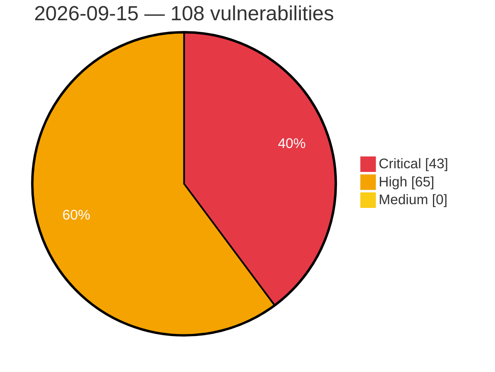

# Critical, High & Medium Severity Vulnerabilities — 2026-09-15

**Source status for this day:**

| Source | Critical | High | Medium | Total |
|--------|---------:|-----:|-------:|------:|
| cvefeed.io (High/Critical) | 43 | 65 | 0 | 108 |

**KEV (actively exploited):** 0  **Watchlist matches:** 64

## Critical (43)

| CVSS | Flags | Source | CVE / Title | Reported |
|------|-------|--------|-------------|----------|
| 9.9 | — | cvefeed.io (High/Critical) | [CVE-2026-91001 - D-Link DI-8400 DDNS Configuration ddns.asp ddns_asp stack-based overflow](https://cvefeed.io/vuln/detail/CVE-2026-91001) | 43 minutes ago |
| 9.9 | ⭐ | cvefeed.io (High/Critical) | [CVE-2026-91998 - Casdoor through 4.4.0 Cross-Organization User Administration via /api/mcp](https://cvefeed.io/vuln/detail/CVE-2026-91998) | 46 minutes ago |
| 9.9 | ⭐ | cvefeed.io (High/Critical) | [CVE-2026-57138 - PraisonAI codeMode sandbox escape via Function constructor](https://cvefeed.io/vuln/detail/CVE-2026-57138) | 1 hour, 5 minutes ago |
| 9.9 | ⭐ | cvefeed.io (High/Critical) | [CVE-2026-61667 - DIRAC: RCE in FileCatalog DatasetManager via SQL injection + eval](https://cvefeed.io/vuln/detail/CVE-2026-61667) | 1 hour, 2 minutes ago |
| 9.9 | ⭐ | cvefeed.io (High/Critical) | [CVE-2026-45579 - DIRAC: RCE in RequestManager due to eval on untrusted input](https://cvefeed.io/vuln/detail/CVE-2026-45579) | 1 hour, 2 minutes ago |
| 9.8 | ⭐ | cvefeed.io (High/Critical) | [CVE-2026-57148 - praisonai-platform 0.1.4 still boots on the hardcoded JWT secret dev-secret-change-me (default-open production guard)](https://cvefeed.io/vuln/detail/CVE-2026-57148) | 1 hour, 5 minutes ago |
| 9.8 | ⭐ | cvefeed.io (High/Critical) | [CVE-2026-57147 - praisonai-platform: default JWT signing secret 'dev-secret-change-me' enables token forgery](https://cvefeed.io/vuln/detail/CVE-2026-57147) | 1 hour, 5 minutes ago |
| 9.8 | ⭐ | cvefeed.io (High/Critical) | [CVE-2026-57141 - PraisonAI: Remote Code Execution via Sandbox Escape in `codeMode` Tool](https://cvefeed.io/vuln/detail/CVE-2026-57141) | 1 hour, 5 minutes ago |
| 9.8 | ⭐ | cvefeed.io (High/Critical) | [CVE-2026-57139 - PraisonAI MCPServer exposes unauthenticated HTTP tools/call](https://cvefeed.io/vuln/detail/CVE-2026-57139) | 1 hour, 5 minutes ago |
| 9.8 | ⭐ | cvefeed.io (High/Critical) | [CVE-2026-62379 - OpenAM: Unauthenticated Remote Code Execution via Class.forName in AuthXMLUtils.createCustomCallback](https://cvefeed.io/vuln/detail/CVE-2026-62379) | 2 hours, 5 minutes ago |
| 9.8 | — | cvefeed.io (High/Critical) | [CVE-2026-63695 - Dell SmartFabric OS10 Session Fixation Vulnerability](https://cvefeed.io/vuln/detail/CVE-2026-63695) | 59 minutes ago |
| 9.8 | — | cvefeed.io (High/Critical) | [CVE-2026-39919 - Ghostscript < 10.08.0 Heap Buffer Overflow via JPEG 2000 Output Adapter](https://cvefeed.io/vuln/detail/CVE-2026-39919) | 59 minutes ago |
| 9.8 | ⭐ | cvefeed.io (High/Critical) | [CVE-2026-12351 - IBM MQ is vulnerable to unauthenticated remote code execution via JNDI injection](https://cvefeed.io/vuln/detail/CVE-2026-12351) | 1 hour, 2 minutes ago |
| 9.8 | ⭐ | cvefeed.io (High/Critical) | [CVE-2026-73807 - mySCADA myPRO Manager Missing Authorization](https://cvefeed.io/vuln/detail/CVE-2026-73807) | 45 minutes ago |
| 9.8 | ⭐ | cvefeed.io (High/Critical) | [CVE-2026-61560 - @zereight/mcp-gitlab's unauthenticated arbitrary file read via `upload_markdown` enables PAT exfiltration and full account takeover](https://cvefeed.io/vuln/detail/CVE-2026-61560) | 45 minutes ago |
| 9.8 | — | cvefeed.io (High/Critical) | [CVE-2026-91939 - Cotonti 1.0.0 Comments Plugin PHP Object Injection via ci Parameter](https://cvefeed.io/vuln/detail/CVE-2026-91939) | 1 hour, 45 minutes ago |
| 9.6 | ⭐ | cvefeed.io (High/Critical) | [CVE-2026-73437 - On affected platforms running Arista EOS with Dynamic Host Configuration Protocol (DHCP) relay configured, an unauthenticated attacker with network access could send a crafted DHCP reply packet from an IP address that is not configured as a helper/destinat](https://cvefeed.io/vuln/detail/CVE-2026-73437) | 45 minutes ago |
| 9.6 | — | cvefeed.io (High/Critical) | [CVE-2026-66890 - Use of Hard-coded Credentials in Digital Watchdog VMAX DVR and NVR Product Lineups](https://cvefeed.io/vuln/detail/CVE-2026-66890) | 1 hour, 45 minutes ago |
| 9.6 | — | cvefeed.io (High/Critical) | [CVE-2026-66887 - Missing Authorization in Digital Watchdog VMAX DVR and NVR Product Lineups](https://cvefeed.io/vuln/detail/CVE-2026-66887) | 1 hour, 45 minutes ago |
| 9.6 | — | cvefeed.io (High/Critical) | [CVE-2026-91749 - Google Chrome Workers Use-After-Free Vulnerability](https://cvefeed.io/vuln/detail/CVE-2026-91749) | 3 hours, 38 minutes ago |
| 9.5 | — | cvefeed.io (High/Critical) | [CVE-2026-78225 - Wärtsilä FOS-Onboard Use of Hard-coded Cryptographic Key](https://cvefeed.io/vuln/detail/CVE-2026-78225) | 45 minutes ago |
| 9.4 | ⭐ | cvefeed.io (High/Critical) | [CVE-2026-57140 - PraisonAI AgentOS exposes unauthenticated agent listing and invocation](https://cvefeed.io/vuln/detail/CVE-2026-57140) | 1 hour, 5 minutes ago |
| 9.4 | ⭐ | cvefeed.io (High/Critical) | [CVE-2026-77179 - Docker Sandboxes guest can write arbitrary macOS host files via a symlink in the virtio-fs stored-path fallback](https://cvefeed.io/vuln/detail/CVE-2026-77179) | 1 hour, 59 minutes ago |
| 9.4 | — | cvefeed.io (High/Critical) | [CVE-2026-68491 - Arbitrary File Overwrite via Symlink Vulnerability](https://cvefeed.io/vuln/detail/CVE-2026-68491) | 1 hour, 45 minutes ago |
| 9.3 | ⭐ | cvefeed.io (High/Critical) | [CVE-2026-89308 - Arbitrary command execution in TrxTimeATTENDANCE](https://cvefeed.io/vuln/detail/CVE-2026-89308) | 38 minutes ago |
| 9.3 | ⭐ | cvefeed.io (High/Critical) | [CVE-2026-91995 - pig before 4.1.0 Unverified Password Change via /register/password](https://cvefeed.io/vuln/detail/CVE-2026-91995) | 46 minutes ago |
| 9.3 | ⭐ | cvefeed.io (High/Critical) | [CVE-2026-46619 - OpenAM Authentication Bypass via MSISDN LDAP Injection](https://cvefeed.io/vuln/detail/CVE-2026-46619) | 2 hours, 5 minutes ago |
| 9.3 | — | cvefeed.io (High/Critical) | [CVE-2026-45052 - OpenAM Pre-auth User Profile Tampering via Anonymous SOAP Authn in Liberty IDPP/Discovery Endpoints](https://cvefeed.io/vuln/detail/CVE-2026-45052) | 2 hours, 5 minutes ago |
| 9.3 | — | cvefeed.io (High/Critical) | [CVE-2026-91949 - FreeRDP 3.0.0 through 3.30.0 Protocol Negotiation Bypass](https://cvefeed.io/vuln/detail/CVE-2026-91949) | 58 minutes ago |
| 9.3 | ⭐ | cvefeed.io (High/Critical) | [CVE-2026-53459 - Bambuddy's authentication fails open on database errors, allowing unauthenticated access to all endpoints](https://cvefeed.io/vuln/detail/CVE-2026-53459) | 1 hour, 2 minutes ago |
| 9.3 | — | cvefeed.io (High/Critical) | [CVE-2026-81855 - Wärtsilä FOS-Onboard Use of Hard-coded Cryptographic Key](https://cvefeed.io/vuln/detail/CVE-2026-81855) | 45 minutes ago |
| 9.2 | ⭐ | cvefeed.io (High/Critical) | [CVE-2026-62263 - OpenAM: WebAuthn Java deserialization RCE via ObjectInputFilter depth>1 bypass](https://cvefeed.io/vuln/detail/CVE-2026-62263) | 2 hours, 5 minutes ago |
| 9.2 | ⭐ | cvefeed.io (High/Critical) | [CVE-2026-46495 - OpenDJ Pre-Auth RCE via Java Deserialization in JMX RMI](https://cvefeed.io/vuln/detail/CVE-2026-46495) | 59 minutes ago |
| 9.1 | ⭐ | cvefeed.io (High/Critical) | [CVE-2026-90711 - proxy-addr vulnerable to IP spoofing via IPv4-mapped IPv6 trust subnet](https://cvefeed.io/vuln/detail/CVE-2026-90711) | 40 minutes ago |
| 9.1 | — | cvefeed.io (High/Critical) | [CVE-2026-91003 - D-Link DI-8300 CGI Service rzgl.asp rzgl_asp stack-based overflow](https://cvefeed.io/vuln/detail/CVE-2026-91003) | 43 minutes ago |
| 9.1 | ⭐ | cvefeed.io (High/Critical) | [CVE-2026-90847 - EFM ipTIME C200E System Setup iux_set.cgi os command injection](https://cvefeed.io/vuln/detail/CVE-2026-90847) | 5 hours, 43 minutes ago |
| 9.1 | ⭐ | cvefeed.io (High/Critical) | [CVE-2026-52824 - Kimai: Default APP_SECRET in Docker Image Enables Cookie Forgery and Account Takeover](https://cvefeed.io/vuln/detail/CVE-2026-52824) | 1 hour, 5 minutes ago |
| 9.1 | ⭐ | cvefeed.io (High/Critical) | [CVE-2026-48717 - OpenAM OAuth Authorization Bypass via PKCE Challenge](https://cvefeed.io/vuln/detail/CVE-2026-48717) | 2 hours, 5 minutes ago |
| 9.1 | — | cvefeed.io (High/Critical) | [CVE-2026-63696 - Dell SmartFabric OS10 Insecure Code Update Vulnerability](https://cvefeed.io/vuln/detail/CVE-2026-63696) | 59 minutes ago |
| 9.1 | ⭐ | cvefeed.io (High/Critical) | [CVE-2026-55158 - Conflibot: Command injection via crafted pull request branch names under pull_request_target](https://cvefeed.io/vuln/detail/CVE-2026-55158) | 59 minutes ago |
| 9.0 | ⭐ | cvefeed.io (High/Critical) | [CVE-2026-77866 - SSRF protection bypass in safeurl via IPv6 addresses and unresolvable hosts](https://cvefeed.io/vuln/detail/CVE-2026-77866) | 38 minutes ago |
| 9.0 | — | cvefeed.io (High/Critical) | [CVE-2026-77972 - safeurl validated address is not bound to the request, allowing DNS rebinding](https://cvefeed.io/vuln/detail/CVE-2026-77972) | 39 minutes ago |
| 9.0 | ⭐ | cvefeed.io (High/Critical) | [CVE-2026-61549 - Woodpecker: Privilege escalation via unrestricted serviceAccountName in the Kubernetes backend](https://cvefeed.io/vuln/detail/CVE-2026-61549) | 59 minutes ago |

## High (65)

| CVSS | Flags | Source | CVE / Title | Reported |
|------|-------|--------|-------------|----------|
| 8.8 | ⭐ | cvefeed.io (High/Critical) | [CVE-2026-91771 - Weights & Biases wandb before 0.29.0 Path Traversal via File Download](https://cvefeed.io/vuln/detail/CVE-2026-91771) | 4 hours, 43 minutes ago |
| 8.8 | — | cvefeed.io (High/Critical) | [CVE-2026-91925 - Polyaxon through 2.16.4 Server-Side Template Injection via Unsandboxed Jinja2 Engine](https://cvefeed.io/vuln/detail/CVE-2026-91925) | 1 hour, 5 minutes ago |
| 8.8 | ⭐ | cvefeed.io (High/Critical) | [CVE-2026-57137 - PraisonAI AgentLoop onToolCall approval runs after tool execution](https://cvefeed.io/vuln/detail/CVE-2026-57137) | 1 hour, 5 minutes ago |
| 8.8 | — | cvefeed.io (High/Critical) | [CVE-2026-57136 - PraisonAI SandboxExecutor allowedCommands bypass via shell chaining](https://cvefeed.io/vuln/detail/CVE-2026-57136) | 1 hour, 5 minutes ago |
| 8.8 | — | cvefeed.io (High/Critical) | [CVE-2026-57133 - PraisonAI utility shell safe-command wrapper allowlist bypass via shell chaining](https://cvefeed.io/vuln/detail/CVE-2026-57133) | 1 hour, 5 minutes ago |
| 8.8 | — | cvefeed.io (High/Critical) | [CVE-2026-91964 - FreeRDP 2.0.0 through 3.30.0 Heap Buffer Overflow via RoutingToken](https://cvefeed.io/vuln/detail/CVE-2026-91964) | 58 minutes ago |
| 8.8 | ⭐ | cvefeed.io (High/Critical) | [CVE-2026-91934 - Flowise before 3.1.4 Remote Code Execution via SQL Database Chain](https://cvefeed.io/vuln/detail/CVE-2026-91934) | 59 minutes ago |
| 8.8 | ⭐ | cvefeed.io (High/Critical) | [CVE-2026-16140 - OpenBMC IPMI Privilege Escalation via Retargeted RAKP 1](https://cvefeed.io/vuln/detail/CVE-2026-16140) | 2 hours ago |
| 8.8 | ⭐ | cvefeed.io (High/Critical) | [CVE-2026-44300 - OpenCost ServiceKey Endpoint Unauthorized Credential Overwrite/Injection](https://cvefeed.io/vuln/detail/CVE-2026-44300) | 1 hour, 2 minutes ago |
| 8.8 | ⭐ | cvefeed.io (High/Critical) | [CVE-2026-40058 - Vulnerability Affecting Office Macro Removal in CrowdStrike Falcon Sensor for Windows](https://cvefeed.io/vuln/detail/CVE-2026-40058) | 1 hour, 2 minutes ago |
| 8.8 | ⭐ | cvefeed.io (High/Critical) | [CVE-2026-12728 - IBM MQ Java messaging is vulnerable to remote code execution](https://cvefeed.io/vuln/detail/CVE-2026-12728) | 1 hour, 2 minutes ago |
| 8.8 | — | cvefeed.io (High/Critical) | [CVE-2026-85893 - Microsoft Edge (Chromium-based) Elevation of Privilege Vulnerability](https://cvefeed.io/vuln/detail/CVE-2026-85893) | 17 minutes ago |
| 8.8 | ⭐ | cvefeed.io (High/Critical) | [CVE-2026-69486 - Microsoft Edge (Chromium-based) Remote Code Execution Vulnerability](https://cvefeed.io/vuln/detail/CVE-2026-69486) | 22 minutes ago |
| 8.8 | — | cvefeed.io (High/Critical) | [CVE-2026-76862 - Netcore NR255-V 1.5.130703 OS Command Argument Injection in Nettools tcpdump Launch Paths](https://cvefeed.io/vuln/detail/CVE-2026-76862) | 45 minutes ago |
| 8.8 | — | cvefeed.io (High/Critical) | [CVE-2026-76861 - Netcore NR255-V 1.5.130703 Stack-Based Buffer Overflow in ntools_tcpdump_start_set.cgi](https://cvefeed.io/vuln/detail/CVE-2026-76861) | 45 minutes ago |
| 8.8 | — | cvefeed.io (High/Critical) | [CVE-2026-76860 - Netcore NR255-V 1.5.130703 Stack-Based Buffer Overflow in wake_up_set.cgi via MAC and ID Tokenization](https://cvefeed.io/vuln/detail/CVE-2026-76860) | 45 minutes ago |
| 8.8 | — | cvefeed.io (High/Critical) | [CVE-2026-76852 - Netcore NR268 1.7.121109 Forgeable Firmware Authenticity Check in mtd_write](https://cvefeed.io/vuln/detail/CVE-2026-76852) | 45 minutes ago |
| 8.8 | — | cvefeed.io (High/Critical) | [CVE-2026-68950 - Use of Hard-coded Credentials in Digital Watchdog VMAX DVR and NVR Product Lineups](https://cvefeed.io/vuln/detail/CVE-2026-68950) | 1 hour, 45 minutes ago |
| 8.8 | — | cvefeed.io (High/Critical) | [CVE-2026-68070 - Missing Authentication for Critical Function in Digital Watchdog VMAX DVR and NVR Product Lineups](https://cvefeed.io/vuln/detail/CVE-2026-68070) | 1 hour, 45 minutes ago |
| 8.7 | — | cvefeed.io (High/Critical) | [CVE-2026-91752 - GNU libextractor before 1.15 Stack Overflow via OLE2](https://cvefeed.io/vuln/detail/CVE-2026-91752) | 15 minutes ago |
| 8.7 | ⭐ | cvefeed.io (High/Critical) | [CVE-2026-88262 - bizwell xClick Insufficient Session Expiration Authentication Bypass](https://cvefeed.io/vuln/detail/CVE-2026-88262) | 3 hours, 43 minutes ago |
| 8.7 | ⭐ | cvefeed.io (High/Critical) | [CVE-2026-91996 - lamp-cloud through 5.10.0 Missing Authentication for JVM Properties Endpoint](https://cvefeed.io/vuln/detail/CVE-2026-91996) | 46 minutes ago |
| 8.7 | — | cvefeed.io (High/Critical) | [CVE-2026-87792 - Multiple authorization bypass in WordPress theme design-scuole-wordpress-theme](https://cvefeed.io/vuln/detail/CVE-2026-87792) | 56 minutes ago |
| 8.7 | — | cvefeed.io (High/Critical) | [CVE-2026-89025 - Hirschmann HiOS Switch Platform DoS via Malformed HTTP Request](https://cvefeed.io/vuln/detail/CVE-2026-89025) | 59 minutes ago |
| 8.7 | ⭐ | cvefeed.io (High/Critical) | [CVE-2026-87791 - Path traversal vulnerability in WordPress theme design-scuole-wordpress-theme](https://cvefeed.io/vuln/detail/CVE-2026-87791) | 1 hour, 6 minutes ago |
| 8.7 | ⭐ | cvefeed.io (High/Critical) | [CVE-2026-81568 - Joomla Extension - j2commerce.com - Arbitrary file read via `task=download` in J2Store 1.0.0-3.3.2, 4.0.0-4.0.22, 4.1.0-4.1.7](https://cvefeed.io/vuln/detail/CVE-2026-81568) | 28 minutes ago |
| 8.7 | ⭐ | cvefeed.io (High/Critical) | [CVE-2026-81567 - Joomla Extension - j2commerce.com - Unauthenticated blind SQL injection in the storefront product list in J2Store 1.0.0-3.3.2, 4.0.0-4.0.22, 4.1.0-4.1.7](https://cvefeed.io/vuln/detail/CVE-2026-81567) | 30 minutes ago |
| 8.7 | ⭐ | cvefeed.io (High/Critical) | [CVE-2026-82189 - Joomla Extension - j2commerce.com - Any order can be marked Failed by anyone in J2Store 1.0.0-3.3.2, 4.0.0-4.0.22, 4.1.0-4.1.7](https://cvefeed.io/vuln/detail/CVE-2026-82189) | 32 minutes ago |
| 8.7 | — | cvefeed.io (High/Critical) | [CVE-2026-54251 - netty-incubator-codec-ohttp: [OHttpServerCodec] Native Direct-Memory Leak on AEAD Decryption Failure Leads to Gateway Denial of Service](https://cvefeed.io/vuln/detail/CVE-2026-54251) | 1 hour, 2 minutes ago |
| 8.7 | — | cvefeed.io (High/Critical) | [CVE-2026-92000 - adm-zip 0.5.14 through 0.6.0 Denial of Service via Zero Declared Uncompressed Size](https://cvefeed.io/vuln/detail/CVE-2026-92000) | 1 hour, 45 minutes ago |
| 8.7 | ⭐ | cvefeed.io (High/Critical) | [CVE-2026-79994 - Docker Sandboxes UDS forwarder can reach arbitrary host Unix sockets through a symlink race](https://cvefeed.io/vuln/detail/CVE-2026-79994) | 1 hour, 45 minutes ago |
| 8.6 | — | cvefeed.io (High/Critical) | [CVE-2026-57586 - CodeRAG: Gradle Wrapper Execution During Dependency Discovery Enables Arbitrary Code Execution](https://cvefeed.io/vuln/detail/CVE-2026-57586) | 59 minutes ago |
| 8.6 | ⭐ | cvefeed.io (High/Critical) | [CVE-2026-81240 - Dell Wyse Management Suite Unrestricted File Upload Vulnerability](https://cvefeed.io/vuln/detail/CVE-2026-81240) | 1 hour ago |
| 8.6 | ⭐ | cvefeed.io (High/Critical) | [CVE-2026-81239 - Dell Wyse Management Suite Unrestricted File Upload Vulnerability](https://cvefeed.io/vuln/detail/CVE-2026-81239) | 1 hour ago |
| 8.6 | ⭐ | cvefeed.io (High/Critical) | [CVE-2026-81236 - Dell Wyse Management Suite Unrestricted File Upload Vulnerability](https://cvefeed.io/vuln/detail/CVE-2026-81236) | 1 hour ago |
| 8.6 | — | cvefeed.io (High/Critical) | [CVE-2026-76869 - Netcore NR255-V 1.5.130703 Stack-Based Buffer Overflow in reboot_timer_set.cgi](https://cvefeed.io/vuln/detail/CVE-2026-76869) | 45 minutes ago |
| 8.6 | — | cvefeed.io (High/Critical) | [CVE-2026-76866 - Netcore NR255-V 1.5.130703 OS Command Argument Injection via Unquoted DDNS Parameters](https://cvefeed.io/vuln/detail/CVE-2026-76866) | 45 minutes ago |
| 8.5 | ⭐ | cvefeed.io (High/Critical) | [CVE-2026-91924 - pgweb through 0.17.0 Missing Authorization on Direct Connect Endpoint](https://cvefeed.io/vuln/detail/CVE-2026-91924) | 1 hour, 5 minutes ago |
| 8.5 | ⭐ | cvefeed.io (High/Critical) | [CVE-2026-91932 - Flowise before 3.1.4 Remote Code Execution via cwd Parameter](https://cvefeed.io/vuln/detail/CVE-2026-91932) | 59 minutes ago |
| 8.5 | ⭐ | cvefeed.io (High/Critical) | [CVE-2026-91931 - Flowise before 3.1.4 Remote Code Execution via Custom MCP npx](https://cvefeed.io/vuln/detail/CVE-2026-91931) | 59 minutes ago |
| 8.5 | ⭐ | cvefeed.io (High/Critical) | [CVE-2026-88765 - Improper Neutralization of Special Elements used in a Command ('Command Injection') in GitLab](https://cvefeed.io/vuln/detail/CVE-2026-88765) | 1 hour ago |
| 8.4 | — | cvefeed.io (High/Critical) | [CVE-2026-57441 - MCPVault: PathFilter restricted-directory deny-list bypass via case and trailing dot/space equivalence](https://cvefeed.io/vuln/detail/CVE-2026-57441) | 1 hour, 2 minutes ago |
| 8.3 | ⭐ | cvefeed.io (High/Critical) | [CVE-2026-91751 - Flextype CMS through 1.0.0-alpha.3 Path Traversal via Entries REST API](https://cvefeed.io/vuln/detail/CVE-2026-91751) | 15 minutes ago |
| 8.3 | ⭐ | cvefeed.io (High/Critical) | [CVE-2026-90843 - SabyasachiRana WebMap New Nmap Scan functions_nmap.py nmap_newscan os command injection](https://cvefeed.io/vuln/detail/CVE-2026-90843) | 5 hours, 43 minutes ago |
| 8.3 | ⭐ | cvefeed.io (High/Critical) | [CVE-2026-91923 - KubeSphere through 4.1.3 SSRF via git credential verification endpoint](https://cvefeed.io/vuln/detail/CVE-2026-91923) | 1 hour, 5 minutes ago |
| 8.3 | ⭐ | cvefeed.io (High/Critical) | [CVE-2026-57112 - PraisonAI ToolsMCPServer legacy SSE transport accepts attacker Host/Origin and exposes registered tools](https://cvefeed.io/vuln/detail/CVE-2026-57112) | 1 hour, 5 minutes ago |
| 8.3 | — | cvefeed.io (High/Critical) | [CVE-2026-1758 - Session Fixation](https://cvefeed.io/vuln/detail/CVE-2026-1758) | 1 hour, 5 minutes ago |
| 8.3 | ⭐ | cvefeed.io (High/Critical) | [CVE-2026-91935 - Flowise before 3.1.4 SSRF and API Key Exfiltration via Chat Model Nodes](https://cvefeed.io/vuln/detail/CVE-2026-91935) | 59 minutes ago |
| 8.3 | ⭐ | cvefeed.io (High/Critical) | [CVE-2026-54549 - Meta Ads MCP: Server-Side Request Forgery (SSRF) in `upload_ad_image` via Unrestricted `image_url` Fetch](https://cvefeed.io/vuln/detail/CVE-2026-54549) | 1 hour, 2 minutes ago |
| 8.3 | — | cvefeed.io (High/Critical) | [CVE-2026-91748 - Google Chrome Extensions Race Condition Vulnerability](https://cvefeed.io/vuln/detail/CVE-2026-91748) | 3 hours, 38 minutes ago |
| 8.3 | — | cvefeed.io (High/Critical) | [CVE-2026-91743 - Google Chrome Core Race Condition Vulnerability](https://cvefeed.io/vuln/detail/CVE-2026-91743) | 3 hours, 38 minutes ago |
| 8.2 | ⭐ | cvefeed.io (High/Critical) | [CVE-2026-57134 - PraisonAI MCPSecurity Basic/OAuth authentication policies accept invalid credentials without validation](https://cvefeed.io/vuln/detail/CVE-2026-57134) | 1 hour, 5 minutes ago |
| 8.2 | ⭐ | cvefeed.io (High/Critical) | [CVE-2026-54167 - Pipelines-as-Code GitHub App token request can be redirected via untrusted Enterprise Host header](https://cvefeed.io/vuln/detail/CVE-2026-54167) | 59 minutes ago |
| 8.1 | ⭐ | cvefeed.io (High/Critical) | [CVE-2026-91988 - atomic-agents-stack before 1.1.0 Remote Code Execution via HTTP MCP](https://cvefeed.io/vuln/detail/CVE-2026-91988) | 58 minutes ago |
| 8.1 | ⭐ | cvefeed.io (High/Critical) | [CVE-2026-54076 - ArcadeDB: Read-only users can mutate database schema (incomplete fix of CVE-2026-44221)](https://cvefeed.io/vuln/detail/CVE-2026-54076) | 1 hour ago |
| 8.1 | ⭐ | cvefeed.io (High/Critical) | [CVE-2026-16141 - OpenBMC IPMI Authentication Bypass via Default userKey and Stale Challenge Value](https://cvefeed.io/vuln/detail/CVE-2026-16141) | 2 hours ago |
| 8.1 | ⭐ | cvefeed.io (High/Critical) | [CVE-2026-61668 - DIRAC: Pilot code downloaded over unverified HTTPS connection](https://cvefeed.io/vuln/detail/CVE-2026-61668) | 1 hour, 2 minutes ago |
| 8.1 | — | cvefeed.io (High/Critical) | [CVE-2026-12666 - IBM MQ Java messaging is vulnerable to XML external entity injection](https://cvefeed.io/vuln/detail/CVE-2026-12666) | 1 hour, 2 minutes ago |
| 8.1 | ⭐ | cvefeed.io (High/Critical) | [CVE-2026-12355 - IBM MQ Resource Adapter IVT servlet is vulnerable to unauthenticated remote code execution](https://cvefeed.io/vuln/detail/CVE-2026-12355) | 1 hour, 2 minutes ago |
| 8.1 | — | cvefeed.io (High/Critical) | [CVE-2026-83408 - Vulnerability in the Oracle GraalVM for JDK, Oracl](https://cvefeed.io/vuln/detail/CVE-2026-83408) | 44 minutes ago |
| 8.1 | — | cvefeed.io (High/Critical) | [CVE-2026-83357 - Vulnerability in the Oracle GraalVM for JDK, Oracl](https://cvefeed.io/vuln/detail/CVE-2026-83357) | 45 minutes ago |
| 8.1 | — | cvefeed.io (High/Critical) | [CVE-2026-76856 - Netcore NR255-V 1.5.130703 Cross-Site Request Forgery in WAN/LAN Configuration Endpoints](https://cvefeed.io/vuln/detail/CVE-2026-76856) | 45 minutes ago |
| 8.1 | — | cvefeed.io (High/Critical) | [CVE-2026-76853 - Netcore NR268 1.7.121109 Security Check Bypass in parame_put_file.cgi](https://cvefeed.io/vuln/detail/CVE-2026-76853) | 45 minutes ago |
| 8.0 | — | cvefeed.io (High/Critical) | [CVE-2026-81235 - Dell Wyse Management Suite Missing Cryptographic Step Vulnerability](https://cvefeed.io/vuln/detail/CVE-2026-81235) | 1 hour ago |
| 8.0 | ⭐ | cvefeed.io (High/Critical) | [CVE-2026-55225 - Strimzi: Cross-namespace privilege escalation via `Kafka.spec.entityOperator`](https://cvefeed.io/vuln/detail/CVE-2026-55225) | 1 hour, 2 minutes ago |
