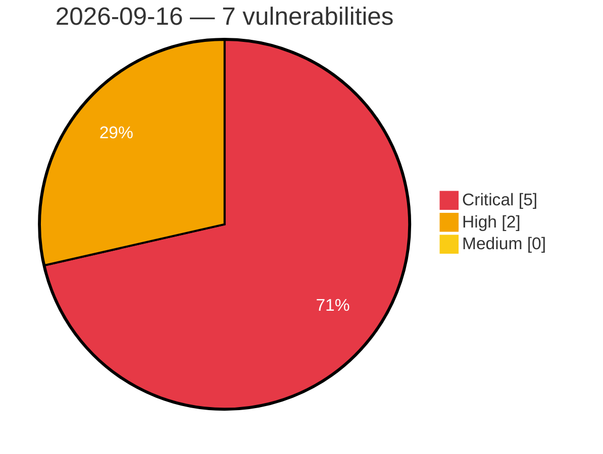

# Critical, High & Medium Severity Vulnerabilities — 2026-09-16

**Source status for this day:**

| Source | Critical | High | Medium | Total |
|--------|---------:|-----:|-------:|------:|
| cvefeed.io (High/Critical) | 5 | 2 | 0 | 7 |

**KEV (actively exploited):** 0  **Watchlist matches:** 5

## Critical (5)

| CVSS | Flags | Source | CVE / Title | Reported |
|------|-------|--------|-------------|----------|
| 9.8 | — | cvefeed.io (High/Critical) | [CVE-2026-14349 - TrueBooker <= 1.2.3 - Missing Authorization to Unauthenticated Arbitrary User Email Modification via 'admin_addcustomer' AJAX Action](https://cvefeed.io/vuln/detail/CVE-2026-14349) | 26 minutes ago |
| 9.8 | ⭐ | cvefeed.io (High/Critical) | [CVE-2026-12793 - JetFormBuilder <= 3.6.2 - Unauthenticated Privilege Escalation via '_jet_engine_booking_form_id' Parameter](https://cvefeed.io/vuln/detail/CVE-2026-12793) | 26 minutes ago |
| 9.5 | ⭐ | cvefeed.io (High/Critical) | [CVE-2026-15640 - Authentication Bypass via SAML Response Manipulation](https://cvefeed.io/vuln/detail/CVE-2026-15640) | 38 minutes ago |
| 9.3 | ⭐ | cvefeed.io (High/Critical) | [CVE-2026-15639 - Reflected Cross-Site Scripting](https://cvefeed.io/vuln/detail/CVE-2026-15639) | 38 minutes ago |
| 9.1 | — | cvefeed.io (High/Critical) | [CVE-2026-15638 - Cryptographic Padding Oracle](https://cvefeed.io/vuln/detail/CVE-2026-15638) | 38 minutes ago |

## High (2)

| CVSS | Flags | Source | CVE / Title | Reported |
|------|-------|--------|-------------|----------|
| 8.8 | ⭐ | cvefeed.io (High/Critical) | [CVE-2026-78088 - Contest Gallery <= 32.0.1 - Unauthenticated Arbitrary File Upload  via 'baseUrlForFacebook' Parameter](https://cvefeed.io/vuln/detail/CVE-2026-78088) | 26 minutes ago |
| 8.0 | ⭐ | cvefeed.io (High/Critical) | [CVE-2026-86108 - Security Advisory 0181](https://cvefeed.io/vuln/detail/CVE-2026-86108) | 1 hour, 27 minutes ago |
