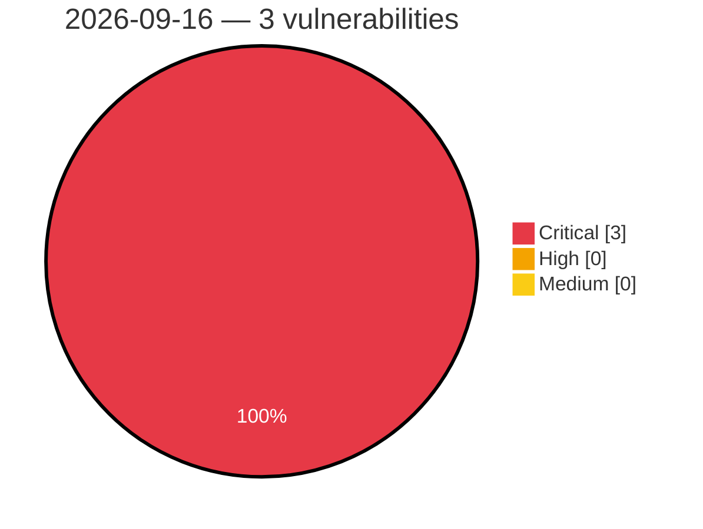

# Critical, High & Medium Severity Vulnerabilities — 2026-09-16

**Source status for this day:**

| Source | Critical | High | Medium | Total |
|--------|---------:|-----:|-------:|------:|
| cvefeed.io (High/Critical) | 3 | 0 | 0 | 3 |

**KEV (actively exploited):** 0  **Watchlist matches:** 2

## Critical (3)

| CVSS | Flags | Source | CVE / Title | Reported |
|------|-------|--------|-------------|----------|
| 9.5 | ⭐ | cvefeed.io (High/Critical) | [CVE-2026-15640 - Authentication Bypass via SAML Response Manipulation](https://cvefeed.io/vuln/detail/CVE-2026-15640) | 38 minutes ago |
| 9.3 | ⭐ | cvefeed.io (High/Critical) | [CVE-2026-15639 - Reflected Cross-Site Scripting](https://cvefeed.io/vuln/detail/CVE-2026-15639) | 38 minutes ago |
| 9.1 | — | cvefeed.io (High/Critical) | [CVE-2026-15638 - Cryptographic Padding Oracle](https://cvefeed.io/vuln/detail/CVE-2026-15638) | 38 minutes ago |
